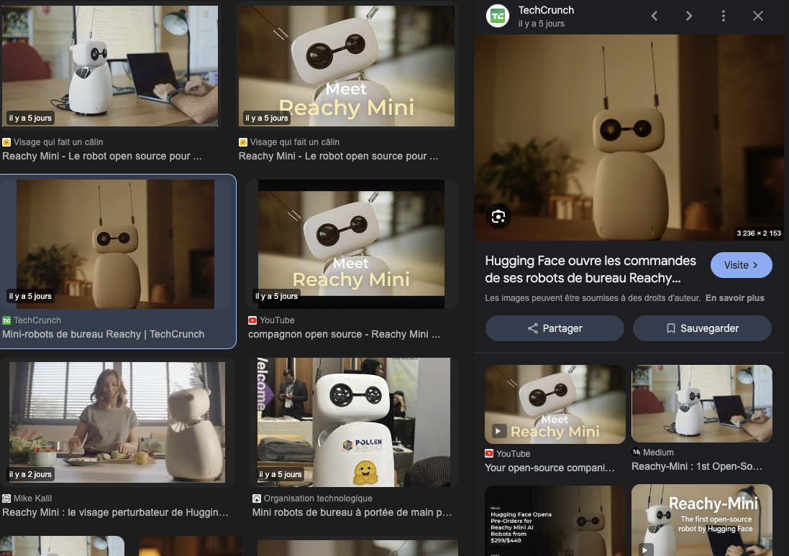

# BBIA Reachy Mini Wireless – Simulation Python



[](./LICENCE)
[](https://www.python.org/)
[](./tests/README.md)
[](https://codecov.io/gh/arkalia-luna-system/bbia-sim)

---

## Table des matières
- [Présentation](#présentation)
- [Capture d'écran](#capture-décran)
- [Structure du projet](#structure-du-projet)
- [Installation rapide](#installation-rapide)
- [Quickstart](#quickstart)
- [Exemples d’utilisation](#exemples-dutilisation)
- [Audio & Voix (macOS)](#audio--voix-sur-macos)
- [Tests](#lancer-les-tests)
- [Dépannage](#dépannage)
- [Documentation](#documentation)
- [Roadmap](#roadmap)
- [Contribuer](#contribuer)
- [Licence](#licence)

---

## Présentation
Projet BBIA pour Reachy Mini Wireless : IA émotionnelle, simulation 100% Python, stable, testée, documentée.

## Capture d'écran


## Structure du projet
- `src/bbia_sim/` : modules principaux (réveil, audio, voix, émotions, vision)
- `tests/` : tests automatisés pour chaque module
- `docs/` : documentation complète et guides

## Installation rapide
```bash
git clone https://github.com/arkalia-luna-system/bbia-sim.git
cd bbia-sim
python3 -m venv venv
source venv/bin/activate
pip install -r requirements.txt
```

## Quickstart
```bash
# Synthèse vocale (voix Amélie fr_CA)
python src/bbia_sim/bbia_voice.py

# Enregistrement et lecture audio
python src/bbia_sim/bbia_audio.py
```

## Exemples d’utilisation
```python
from src.bbia_sim.bbia_voice import dire_texte, reconnaitre_parole
dire_texte("Bonjour, je suis BBIA.")
texte = reconnaitre_parole(duree=3)
print(texte)
```

## Audio & Voix sur macOS
- **Voix utilisée** : Amélie (français Canada, ID macOS : com.apple.voice.compact.fr-CA.Amelie)
- **Installer la voix** : Préférences Système > Accessibilité > Parole > Voix du système > Personnaliser…
- **Dépendances** : pyttsx3, speechrecognition, pyaudio, sounddevice, numpy
- **Installer portaudio** :
```bash
brew install portaudio
pip install pyaudio
```
- [Guide installation/dépannage audio/voix](#dépannage)

## Lancer les tests
```bash
python -m unittest discover tests
```

## Dépannage
- **Erreur "No module named 'pyaudio'"** :
  - Installe portaudio (`brew install portaudio`)
  - Puis `pip install pyaudio`
- **Aucune voix Amélie trouvée** :
  - Va dans Préférences Système > Accessibilité > Parole > Voix du système > Personnaliser…
  - Coche “Amélie (français — Canada)” et télécharge-la
  - Relance le script

## Documentation
- [Documentation complète](docs/README.md)
- [Tests automatisés](tests/README.md)
- [Guides d’utilisation avancée](docs/guides/)

## Roadmap
- [ ] Simulation visuelle avancée
- [ ] Intégration ROS
- [ ] Contrôle temps réel via Web
- [ ] IA émotionnelle enrichie
- [ ] Documentation vidéo

## Contribuer
Les contributions sont les bienvenues ! Consultez [CONTRIBUTING.md](CONTRIBUTING.md) et ouvrez une issue ou une pull request.

Contact : [arkalia.luna.system@gmail.com](mailto:arkalia.luna.system@gmail.com)

## Licence
MIT

---

## 🛠️ Conseils pratiques pour fiabiliser et améliorer BBIA

- Lance les tests régulièrement (`python3 -m unittest discover tests`)
- Sauvegarde ton code avec git et des backups
- Documente chaque nouveauté ou bug
- Ajoute un arrêt d’urgence logiciel/matériel
- Prépare la calibration et la configuration
- Loggue toutes les erreurs et actions critiques
- Range bien tes fichiers et nettoie régulièrement
- Prépare un plan de test pour le vrai robot
- Note et partage tes découvertes
- Demande de l’aide à la communauté si besoin

---
