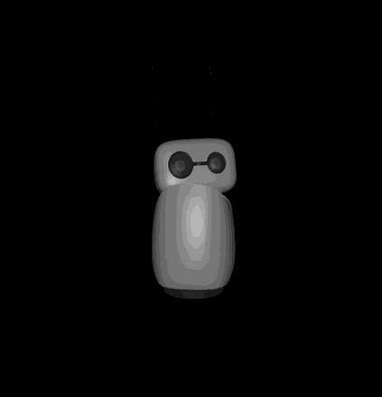
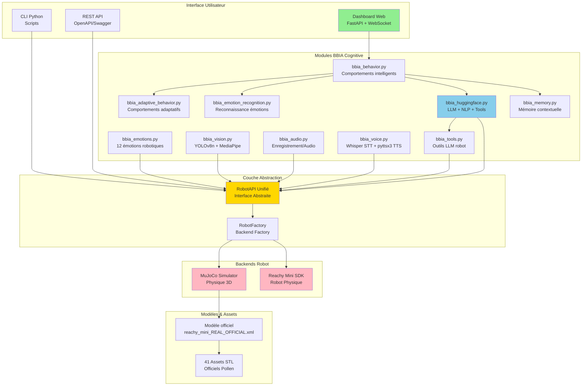
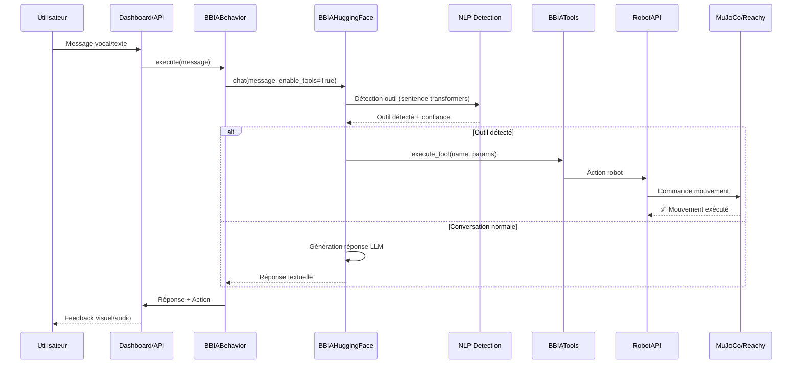

# 🤖 BBIA Reachy Mini Simulation

<div align="center">

[](https://github.com/arkalia-luna-system/bbia-sim)
[](https://python.org)
[](LICENSE)
[](https://github.com/arkalia-luna-system/bbia-sim/actions/workflows/ci.yml)
[](https://github.com/arkalia-luna-system/bbia-sim/actions)
[](https://github.com/arkalia-luna-system/bbia-sim)
[](https://github.com/pollen-robotics/reachy_mini)
[](docs/)
[](https://app.codecov.io/gh/arkalia-luna-system/bbia-sim)
[](https://github.com/arkalia-luna-system/bbia-sim)
[](https://github.com/arkalia-luna-system/bbia-sim)
[](https://github.com/arkalia-luna-system/bbia-sim)
[](https://github.com/arkalia-luna-system/bbia-sim/releases)

[](https://github.com/arkalia-luna-system/bbia-sim)
[](https://github.com/arkalia-luna-system/bbia-sim)
[](https://github.com/arkalia-luna-system/bbia-sim/issues)
[](https://github.com/arkalia-luna-system/bbia-sim/pulls)

</div>

<div align="center">

## 🧠 Moteur Cognitif Python pour Robot Reachy Mini

### 🌟 Simulation Fidèle • IA Avancée • SDK 100% Conforme

[](#-démarrage-rapide)
[](docs/)
[](#-voir-le-robot-en-3d)
[](#-démarrage-rapide)

</div>

---

## 📋 **EN 30 SECONDES**

<div align="center">

### 🎯 BBIA-SIM : Moteur Cognitif Python pour Reachy Mini

**12 émotions robotiques** (6 SDK officiel + 6 étendues) • **Simulation 3D fidèle** • **IA avancée**



</div>

### ✨ Points Clés

<div align="center">

| 🎯 **Caractéristique** | 📊 **Détails** |
|:---:|:---|
| ✅ **SDK Officiel** | 100% conforme Pollen Robotics |
| 🔄 **Backend Unifié** | Simulation ↔ Robot réel |
| 🧪 **Tests Automatisés** | 1362 tests (unitaires + E2E) |
| 📚 **Documentation** | 128 fichiers Markdown |
| ⚡ **Performance** | Caches IA optimisés |
| 🔒 **CI/CD Pro** | Black, Ruff, MyPy, Bandit |
| 🌟 **Open Source** | License MIT |

</div>

## 📊 Statistiques

- **Fichiers Python source**: 92 fichiers (35,988 lignes)
- **Fichiers de tests**: 183 fichiers (38,935 lignes)
- **Fonctions de test**: 1,804 tests identifiés
- **Tests collectés**: 1,362 tests (CI GitHub Actions)
- **Coverage global**: 68.86% ([Codecov](https://app.codecov.io/gh/arkalia-luna-system/bbia-sim))
- **Coverage modules core**: ~50% (mesure pertinente)
- **Modules BBIA**: 15+ modules spécialisés
- **Comportements**: 15 comportements intelligents
- **Documentation**: 128+ fichiers Markdown
- **Commits Git**: 423 commits

## 🏆 Qualité Code

BBIA-SIM maintient des standards stricts de qualité:

- **Tests de couverture**: 80% minimum
- **Linting**: black, ruff, mypy, bandit
- **Python**: 3.11+
- **CI/CD**: GitHub Actions avec vérifications automatiques
- **Sécurité**: Analyse statique avec Bandit
- **Performance**: Optimisations continues et monitoring

**[🚀 Quick Start](#-démarrage-rapide)** | **[📚 Docs Débutant](docs/guides/GUIDE_DEBUTANT.md)** | **[🔬 Docs Avancé](docs/guides/GUIDE_AVANCE.md)** | **[📋 Projets](docs/reference/PROJECTS.md)**

---

Version 1.3.2 – Alignement complet branches, tests élargis (perf/watchdog), doc enrichie, release stable.

Ce projet fournit une simulation fidèle du robot Reachy Mini dans MuJoCo, avec une intégration des modules BBIA (Bio-Inspired Artificial Intelligence) et une conformité validée avec le SDK officiel de Pollen Robotics (Oct / Nov. 2025).

## 🚀 Quick Start

### Option 1 : Script All-in-One (Recommandé) ⚡

```bash
# 🚀 Installation automatique complète + dashboard
./scripts/reachy-mini-sim-starter.sh

# 🤖 Le script fait tout automatiquement :
# ✅ Vérifie prérequis (Python, pip, mjpython)
# ✅ Crée/active l'environnement virtuel
# ✅ Installe BBIA-SIM + dépendances
# ✅ Vérifie l'installation (bbia_doctor)
# ✅ Lance le dashboard sur http://localhost:8000
```

**Options disponibles** :

- `--skip-install` : Saute l'installation (vérification uniquement)
- `--skip-dashboard` : Ne lance pas le dashboard
- `--help` : Affiche l'aide complète

### Option 2 : Installation Manuelle

```bash
# 🔧 Installation (mode dev recommandé)
pip install -e .[dev]

# 🎮 Démarrage simulation (macOS: utiliser mjpython)
mjpython examples/demo_emotion_ok.py
# ou sur Linux/Windows:
python examples/demo_emotion_ok.py
```

## 🤖 Première utilisation – Reachy Mini (robot réel)

- Prérequis:
  - SDK Reachy Mini installé côté PC
  - Robot allumé, alimenté, sur le même réseau Wi‑Fi que le PC
  - Ports réseau nécessaires ouverts

### ✅ Check‑list

- Alimentation/LED OK
- Wi‑Fi opérationnel (SSID/mot de passe)
- Version SDK compatible (voir docs/quality/compliance)
- Dry‑run: connexion → wake_up → look_at_world → emergency_stop

### 📦 Dry‑run rapide

```bash
pip install -e .[dev,test]
python scripts/hardware_dry_run_reachy_mini.py --output-dir artifacts
```

### 🧩 Installation du SDK officiel + Daemon Reachy Mini

> Le paquet `reachy-mini` n’est pas embarqué dans les dépendances de ce projet. Installez-le séparément (PyPI) pour contrôler le robot réel ou lancer la simulation officielle.

```bash
# 📦 Installer le SDK officiel (PC local)
pip install -U reachy-mini

# (Option simulation MuJoCo officielle)
pip install -U "reachy-mini[mujoco]"
```

### 🟣 Lancer le daemon Reachy Mini (officiel)

```bash
# 🚀 Démarrage standard (daemon officiel)
reachy-mini-daemon

# 🎯 Mode simulation MuJoCo (daemon officiel)
reachy-mini-daemon --sim

# 🎬 Scènes disponibles (simulation): minimal (table+objets)
reachy-mini-daemon --sim --scene minimal
```

#### Note macOS (MuJoCo)

Sur macOS, l’exécution MuJoCo peut nécessiter `mjpython` :

```bash
mjpython -m reachy_mini.daemon.app.main --sim --scene minimal
```

### 🔍 Vérifier l'API du daemon officiel

```bash
curl http://localhost:8000/api/state/full
# ou ouvrir la doc OpenAPI quand le daemon tourne :
# http://localhost:8000/docs
```

### 🏥 Health Checks et Métriques

```bash
# ❤️ Health check (liveness)
curl http://localhost:8000/metrics/healthz

# Readiness check
curl http://localhost:8000/metrics/readyz

# Health détaillé
curl http://localhost:8000/metrics/health

# Métriques Prometheus
curl http://localhost:8000/metrics/prometheus
```

### 🔧 Diagnostic Environnement

```bash
# Diagnostic complet de l'environnement (inclut Zenoh, daemon, WiFi)
python -m bbia_sim --doctor
# ou
python scripts/bbia_doctor.py
```

**Vérifie :**
- ✅ Dépendances (numpy, opencv, transformers, zenoh, reachy_mini, etc.)
- ✅ Modèles IA disponibles
- ✅ Variables d'environnement
- ✅ Configuration projet
- ✅ **Zenoh** (installation + session locale)
- ✅ **Daemon** `reachy-mini-daemon`
- ✅ **Réseau** (IP locale + ports 8000, 7447)

### 🔗 Intégration côté BBIA‑SIM

- BBIA‑SIM détecte et utilise le backend `reachy_mini` si le SDK est installé et le daemon accessible.
- Pour la simulation interne BBIA‑SIM (sans daemon officiel), continuez à utiliser les démos `examples/*.py` et le backend `mujoco`.

### 🔗 Guide complet Reachy Mini

- `docs/guides/REACHY_MINI_WIRELESS_COMPLETE_GUIDE.md`

## 🏆 Badges Qualité & CI/CD

<div align="center">

[](https://github.com/arkalia-luna-system/bbia-sim/actions/workflows/ci.yml)
[](https://app.codecov.io/gh/arkalia-luna-system/bbia-sim)
[](https://github.com/arkalia-luna-system/bbia-sim)
[](https://github.com/arkalia-luna-system/bbia-sim)
[](https://github.com/arkalia-luna-system/bbia-sim)
[](https://github.com/arkalia-luna-system/bbia-sim/releases)

</div>

## 🎯 Vue d'ensemble

BBIA-SIM v1.3.2 simule le robot Reachy Mini avec un haut niveau de fidélité :

- 12 émotions robotiques BBIA (6 émotions SDK officiel + 6 émotions étendues)
- Conformité au SDK officiel Pollen Robotics
- Backend unifié : même code pour simulation et robot réel
- IA optionnelle : Hugging Face, reconnaissance d’émotions, comportements
- Simulation 3D : MuJoCo avec modèle officiel
- API REST + WebSocket
- Tests automatisés avec suivi de la couverture en CI

## 🏗️ Architecture BBIA-SIM

### Vue d'Ensemble Architecture Complète



### Flux de Traitement Conversationnel



## 📊 Métriques du projet

<div align="center">

| Métrique | Valeur | Statut |
|:--------:|:------:|:-----:|
| **Modèle officiel** | `reachy_mini_REAL_OFFICIAL.xml` | ✅ |
| **Articulations** | 16 total (9 contrôlables) | ✅ |
| **Intégration BBIA** | 12 émotions + IA avancée | ✅ |
| **Coverage modules core** | ~50% | ✅ [📊 Rapport](https://app.codecov.io/gh/arkalia-luna-system/bbia-sim) |
| **API** | FastAPI + WebSocket | ✅ |

</div>

> Suivi global (État par axe)
>
> Consultez `docs/reference/project-status.md` (section "État par axe") pour l'état actuel et les axes d'amélioration vérifiés: Observabilité, Performance, Sécurité, CI/CD, Packaging, API/SDK, Robot, Dashboard/UX, Vision/Audio/IA, Docs, Qualité, Communauté.

## 🚀 Démarrage Rapide

### Voir le robot en 3D

```bash
# 🎯 Démos principales

# Démo continue - Robot qui bouge en continu (RECOMMANDÉE)
mjpython examples/demo_mujoco_continue.py

# Démo émotions BBIA avec viewer MuJoCo
mjpython examples/demo_emotion_ok.py --emotion happy --duration 10 --joint yaw_body

# Démo SDK officiel (RECOMMANDÉ)
python examples/reachy_mini/minimal_demo.py
# ⚠️ Note: surprise_3d_mujoco_viewer.py et demo_reachy_mini_corrigee.py sont obsolètes
```

### ⚠️ Règles de sécurité

- **✅ TOUJOURS utiliser `yaw_body`** pour les animations visibles
- **✅ Amplitude maximum** : 0.3 rad (clamp automatique)
- **✅ Mode headless** : Stable et rapide pour les tests
- **✅ Antennes animables** : `left_antenna`, `right_antenna` avec limites de sécurité (-0.3 à 0.3 rad)
- **⚠️ Joints Stewart** : `stewart_1` à `stewart_6` ne peuvent PAS être contrôlés individuellement (utiliser `goto_target()` ou `look_at_world()` avec cinématique inverse)
- **❌ JAMAIS animer** : `passive_*` (joints passifs bloqués)
- **❌ JAMAIS dépasser** : 0.3 rad d'amplitude pour antennes

### 🌐 API Publique

```bash
# Démarrage de l'API publique
python deploy/public_api.py --dev

# Test de l'API publique
python deploy/public_api.py --check

# Démonstration complète
python scripts/demo_public_api.py

# Documentation interactive
# Swagger UI: http://localhost:8000/docs
# ReDoc: http://localhost:8000/redoc
# OpenAPI: http://localhost:8000/openapi.json
```

### 📡 Endpoints REST Conformes SDK Officiel

> **Note** : La conformité des endpoints REST est validée à 100% pour les méthodes SDK officielles. Les endpoints BBIA étendus sont en plus.

- **`/api/move/*`** - Mouvements conformes SDK (goto, running, stop, play, set_target, ws/updates)
- **`/api/motors/*`** - Contrôle moteurs (status, set_mode)
- **`/api/daemon/*`** - Contrôle daemon (start, stop, restart, status)
- **`/api/motion/*`** - Mouvements BBIA (goto_pose, wake_up, goto_sleep, joints, etc.)
- **`/api/state/*`** - État robot (full avec 11 params, present_head_pose avec use_pose_matrix, ws/full)
- **`/api/kinematics/*`** - Cinématique (info, urdf, stl)
- **`/api/apps/*`** - Gestion applications HuggingFace (install, start, stop, status)

### 🤖 Backends Disponibles

```bash
# Backend MuJoCo (simulation)
python -c "from bbia_sim.robot_factory import RobotFactory; robot = RobotFactory.create_backend('mujoco')"

# Backend Reachy-Mini SDK Officiel (100% conforme)
python -c "from bbia_sim.robot_factory import RobotFactory; robot = RobotFactory.create_backend('reachy_mini')"

# Backend Reachy Mock (ancien)
python -c "from bbia_sim.robot_factory import RobotFactory; robot = RobotFactory.create_backend('reachy')"

# Test hardware complet
python scripts/hardware_dry_run_reachy_mini.py --duration 30
```

### 🧠 IA Avancée

```bash
# Démonstration complète Phase 2
python examples/demo_bbia_phase2_integration.py

# Tests modules Phase 2
python -m pytest tests/test_bbia_phase2_modules.py -v

# Module Adaptive Behavior (fonctionne sans dépendances ML)
python -c "from bbia_sim.bbia_adaptive_behavior import BBIAAdaptiveBehavior; import logging; ab = BBIAAdaptiveBehavior(); ab.set_context('greeting'); ab.set_emotion_state('happy', 0.8); logging.info(ab.generate_behavior('test'))"

# Module Hugging Face (nécessite: pip install transformers torch)
python -c "from bbia_sim.bbia_huggingface import BBIAHuggingFace; import logging; hf = BBIAHuggingFace(); logging.info(hf.analyze_sentiment('Je suis heureux!'))"

# Chat intelligent BBIA
python -c "from bbia_sim.bbia_huggingface import BBIAHuggingFace; import logging; hf = BBIAHuggingFace(); logging.info(hf.chat('Bonjour'))"

# Module Emotion Recognition (nécessite: pip install mediapipe transformers)
python -c "from bbia_sim.bbia_emotion_recognition import BBIAEmotionRecognition; import logging; er = BBIAEmotionRecognition(); logging.info(er.analyze_vocal_emotion('Je suis excité!'))"
```

### ⚙️ Variables d’environnement utiles

```bash
# Exécutions headless/CI (désactive audio matériel)
export BBIA_DISABLE_AUDIO=1

# Sélecteurs IA (optionnels, imports paresseux)
export BBIA_TTS_BACKEND=pyttsx3      # ou kitten/kokoro/neutts si installés
export BBIA_STT_BACKEND=whisper      # ou parakeet
export BBIA_LLM_BACKEND=llama.cpp    # ou qwen
```

### 🎯 Vertical Slices BBIA

```bash
# Exemple de test e2e (motion roundtrip)
python -m pytest tests/e2e/test_motion_roundtrip.py -v

# Démos avec différentes options
python examples/demo_emotion_ok.py --emotion sad --intensity 0.6 --duration 3
python examples/demo_voice_ok.py --command "tourne à gauche" --speak
python examples/demo_vision_ok.py --tracking-gain 0.8 --target-speed 0.05
python examples/demo_behavior_ok.py --behavior greeting --intensity 1.2
```

### 🔄 Backend Unifié

```bash
# Switch facile entre Sim et Robot
python examples/demo_emotion_ok.py --backend mujoco --emotion happy --duration 5  # Simulation
python examples/demo_emotion_ok.py --backend reachy --emotion happy --duration 5  # Robot réel

# Tests smoke automatiques
python -m pytest tests/test_robot_api_smoke.py -v

# Record & Replay
python examples/demo_emotion_ok.py --record artifacts/my_animation.jsonl --emotion happy --duration 10
python scripts/replay_viewer.py artifacts/my_animation.jsonl --speed 1.5
```

### 📹 Vidéos de Démonstration

**Nouvelles vidéos disponibles** (Oct / Nov. 2025) : 3 captures vidéo de la simulation MuJoCo

- `assets/videos/Enregistrement de l'écran Oct / Nov. 2025 à 17.00.52.mov` (2.7 MB)
- `assets/videos/Enregistrement de l'écran Oct / Nov. 2025 à 17.01.27.mov` (3.4 MB)
- `assets/videos/Enregistrement de l'écran Oct / Nov. 2025 à 17.01.56.mov` (3.1 MB)

**Source** : Toutes ces vidéos ont été enregistrées depuis `examples/demo_mujoco_continue.py` qui montre le robot en mouvement continu (tête + corps).

**Captures d'écran dashboard** (Nov 2025) : 4 captures du dashboard BBIA Advanced Dashboard disponibles dans `assets/images/` montrant l'interface complète avec métriques temps réel, contrôles joints, vision et chat.

**Inventaire complet** : Voir [`assets/MEDIAS_INVENTAIRE.md`](assets/MEDIAS_INVENTAIRE.md)
**Roadmap vidéos** : Voir [`docs/guides/DEMO_VIDEO_ROADMAP.md`](docs/guides/DEMO_VIDEO_ROADMAP.md)

### 📋 Documentation

**Documentation interactive HTML** (recommandé)

```bash
# Générer la documentation HTML complète avec navigation
scripts/docs/build_docs_html.sh
# Ouvrir artifacts/docs_html/index.html dans votre navigateur
```

La documentation HTML offre :

- Navigation latérale avec table des matières
- Rendu Mermaid automatique des diagrammes
- Thème sombre adapté au développement
- Liens ancres pour navigation rapide

**Guides principaux :**

- **[Guide Débutant](docs/guides/GUIDE_DEBUTANT.md)** : Guide pour débuter
- **[Guide Avancé](docs/guides/GUIDE_AVANCE.md)** : Guide avancé
- **[Vertical Slices](docs/quality/audits/VERTICAL_SLICES_ACCOMPLIS.md)** : Documentation des vertical slices
- **[Index thématique (par profils)](docs/INDEX_FINAL.md)**
- **[FAQ Troubleshooting](docs/development/troubleshooting.md)**
- **[Observabilité (logs/metrics/santé)](docs/observabilite/OBSERVABILITE.md)**
- **[Pipeline CI/CD](docs/deployment/PIPELINE_CI.md)**
- **[Contrats REST/WS](docs/development/api/CONTRATS_REST_WS.md)**
- **[Sécurité robot DO/DON'T](docs/hardware/SECURITE_ROBOT.md)**
- **[Datasets & Golden Images](docs/ai/datasets.md)**
- **[Roadmap Dashboard/UX](docs/dashboard/ROADMAP_DASHBOARD.md)**
- **[Guide Contribution](docs/community/CONTRIBUTION_GUIDE.md)**

### Note importante sur les joints

- **Antennes** : Animables avec limites de sécurité (-0.3 à 0.3 rad). Utilisez `yaw_body` pour animations principales, antennes pour expressivité fine.
- **Joints Stewart** : Les 6 joints de la plateforme Stewart (`stewart_1` à `stewart_6`) ne peuvent PAS être contrôlés individuellement car ils utilisent la cinématique inverse (IK). Utilisez `goto_target(head=pose)` ou `look_at_world(x, y, z)` pour contrôler la tête.
- **Joints passifs** : Les 7 joints passifs (`passive_1` à `passive_7`) sont bloqués et ne peuvent pas être animés.

## 📁 Structure du Projet

```text
src/bbia_sim/
├── sim/
│   ├── models/
│   │   ├── reachy_mini_REAL_OFFICIAL.xml    # Modèle officiel principal
│   │   └── reachy_mini.xml                   # Modèle de base (backup)
│   └── assets/reachy_official/              # 41 fichiers STL officiels
│       ├── body_down_3dprint.stl
│       ├── body_top_3dprint.stl
│       ├── head_front_3dprint.stl
│       ├── head_back_3dprint.stl
│       ├── stewart_*.stl                     # Bras Stewart
│       └── ... (36 autres STL)
└── scripts/
    ├── launch_complete_robot.py         # Lanceur principal (dans scripts/)
    └── download_ALL_stl.py              # Script de téléchargement STL (dans scripts/)
```

### 🚀 Guide rapide – Commandes essentielles

#### 1) Activer les bons environnements

- venv principal (simulation/hardware, dashboard, chat):

```bash
source venv/bin/activate
```

- venv vision (MediaPipe/YOLO/OpenCV):

```bash
source venv-vision-py310/bin/activate
```

#### 2) Démo 3D immédiate (macOS)

```bash
# venv principal
source venv/bin/activate
./examples/LANCE_DEMO_3D.sh
```

#### 3) Dashboard + chat en temps réel

```bash
# venv principal
source venv/bin/activate
python src/bbia_sim/dashboard_advanced.py --port 8000
# Ouvrir http://127.0.0.1:8000 dans le navigateur
```

#### 4) Activer l’intelligence (LLM) une fois (internet requis)

```bash
# venv principal
source venv/bin/activate
python - <<'PY'
from bbia_sim.bbia_huggingface import BBIAHuggingFace
bbia = BBIAHuggingFace()
ok = bbia.enable_llm_chat()
logging.info('LLM activé' if ok else 'LLM non chargé (fallback réponses enrichies)')
PY
```

#### 5) Test vision rapide (MediaPipe/OpenCV)

```bash
# venv vision
source venv-vision-py310/bin/activate
python - <<'PY'
import mediapipe, cv2
logging.info('VISION OK')
PY
```

#### 5bis) Test webcam USB (Logitech MX Brio)

```bash
# venv vision
source venv-vision-py310/bin/activate

# Test simple (preview)
export BBIA_CAMERA_INDEX=0  # défaut: 0
python scripts/test_webcam_simple.py
# Appuie sur 'q' pour quitter, 's' pour sauvegarder

# Test vision complète (YOLO + MediaPipe)
python scripts/test_vision_webcam.py
# Détection objets et visages en temps réel
```

**Note** : Au premier lancement, macOS demande l'autorisation caméra. Autoriser dans Réglages Système > Confidentialité > Caméra.

#### 5ter) DeepFace - Reconnaissance visage personnalisée (optionnel)

```bash
# venv vision
source venv-vision-py310/bin/activate

# Installer DeepFace (une fois)
pip install -r requirements/requirements-deepface.txt

# Enregistrer une personne (famille, ami)
python scripts/test_deepface.py --register photo_alice.jpg --name Alice

# Reconnaître une personne dans une image
python scripts/test_deepface.py --recognize frame.jpg

# Détecter émotion
python scripts/test_deepface.py --emotion photo.jpg
```

**Note** : DeepFace permet à BBIA de reconnaître des personnes spécifiques et leurs émotions. Compatible SDK Reachy Mini ✅

#### 5quater) MediaPipe Pose - Détection postures/gestes (optionnel)

```bash
# venv vision (MediaPipe déjà installé)
source venv-vision-py310/bin/activate

# Test avec webcam (temps réel)
python scripts/test_pose_detection.py --webcam

# Test avec image
python scripts/test_pose_detection.py --image photo.jpg
```

**Note** : MediaPipe Pose détecte la posture complète (33 points clés) et les gestes (bras levés, debout/assis). Déjà installé via MediaPipe ✅

#### 6) Télémétrie WebSocket (5 messages)

```bash
# venv principal
source venv/bin/activate
python examples/subscribe_telemetry.py --count 5
```

#### 7) Démo émotions (simulation)

```bash
# venv principal pour logique + viewer (macOS: mjpython conseillé)
source venv/bin/activate
mjpython examples/demo_emotion_ok.py --emotion happy --duration 10 --backend mujoco
```

Pour les détails et recommandations matériel (webcam USB UVC) et les profils d'environnements, voir `docs/development/ENV_PROFILS.md`.

## 🛠️ Scripts Utiles

### Scripts One-Click

```bash
# Démo simulation complète (3D viewer)
bash scripts/run_demo_sim.sh happy 15

# Démo robot réel (headless)
bash scripts/run_demo_real.sh excited 20

# Test commandes vocales
python scripts/stt_demo.py --command "salue" --backend mujoco

# Dashboard web temps réel
python src/bbia_sim/dashboard_advanced.py --port 8000
```

### Scripts de Démo Avancés

```bash
# Enregistrer une démo complète
bash scripts/record_demo.sh happy 15

# Générer un rapport d'analyse
python scripts/plot_trace.py --input assets/videos/demo_happy_*.jsonl --output assets/plots/rapport.txt
```

### Hardware Dry Run

```bash
# Test hardware complet avec artefacts (Reachy Mini)
python scripts/hardware_dry_run_reachy_mini.py --duration 10 --output-dir artifacts

# Test avec backend simulation (ancien script)
python scripts/hardware_dry_run.py --duration 5 --backend mujoco
```

### Téléchargement des STL officiels

```bash
python scripts/download_ALL_stl.py
```

Télécharge automatiquement les 41 fichiers STL depuis le repo officiel.

### Gestion des processus

```bash
python scripts/process_manager.py --cleanup
```

Nettoie les processus gourmands tout en préservant les applications importantes.

## 🔧 Résolution de problèmes

### Problème : Robot en pièces détachées

**Cause** : Fichiers STL corrompus (pointeurs Git LFS)
**Solution** :

```bash
python scripts/download_ALL_stl.py
```

### Problème : Erreur "No such file or directory"

**Cause** : Chemin des assets incorrect
**Solution** : Le modèle `reachy_mini_REAL_OFFICIAL.xml` a le bon chemin `meshdir="../assets/reachy_official"`

### Problème : la fenêtre 3D ne s'ouvre pas

**Cause** : Mauvaise commande Python
**Solution** : Utiliser `mjpython` au lieu de `python` sur macOS

## 📊 Spécifications Techniques

- **Modèle** : Reachy Mini Wireless
- **Simulateur** : MuJoCo
- **Format** : MJCF (MuJoCo XML)
- **Assets** : 41 fichiers STL officiels
- **Articulations** : 16 au total (1 yaw_body + 6 stewart + 2 antennes + 7 passifs)
- **Dimensions** : Fidèles aux spécifications officielles

## 🔗 Ressources Officielles

- **Repo officiel** : [pollen-robotics/reachy_mini](https://github.com/pollen-robotics/reachy_mini)
- **Documentation** : [docs.pollen-robotics.com](https://docs.pollen-robotics.com)
- **Modèle 3D** : OnShape CAD officiel
- **Assets STL** : Téléchargés depuis le repo officiel

## 🧪 Tests et Coverage

### 📊 **Couverture de Code - Clarification Importante**

**Il existe DEUX mesures de coverage selon le périmètre analysé :**

#### 1. **Coverage Modules Core** (~50%) ✅ **MESURE PERTINENTE**

```bash
# Mesure sur src/bbia_sim/* (modules métier testés)
python -m pytest --cov=src/bbia_sim --cov-report=term
```

- **Périmètre** : Modules core (`robot_api`, `bbia_*`, `backends/`)
- **Résultat** : **~50% coverage** sur modules métier
- **Statut** : ✅ **Niveau correct** pour projet open source
- **C'est cette mesure qui compte** pour la qualité du code métier

#### 2. **Coverage Global** (~6-7%) ⚠️ **MESURE CONTEXTUELLE**

```bash
# Si on mesure TOUT le projet (exemples, scripts, etc.)
# Résultat : ~6-7% car beaucoup de fichiers ne sont pas testés unitairement
```

- **Périmètre** : Tout `src/` + `examples/` + `scripts/` (fichiers de démo)
- **Résultat** : **~6-7% coverage global**
- **Statut** : ⚠️ **Normal et attendu** (exemples/scripts ne sont pas testés unitairement)

**📝 Note** : La mesure globale inclut des fichiers qui ne sont **pas censés** être testés unitairement (exemples, scripts de démo, etc.). C'est pourquoi le coverage global est faible, mais c'est **normal**.

**🎯 Recommandation** : Utiliser **coverage modules core** comme mesure principale de qualité.

---

### Tests & Commandes

Recommandation (locale, mesure complète non bloquante) :

```bash
python -m pytest \
  --cov=src/bbia_sim \
  --cov-report=term-missing \
  --cov-report=xml:coverage.xml \
  --cov-report=html:htmlcov \
  --cov-fail-under=0
```

CI (seuil progressif initial 30%) :

```bash
pytest -q --disable-warnings \
  --cov=src/bbia_sim \
  --cov-report=xml:coverage.xml \
  --cov-fail-under=30
```

### Résultats des Tests

**📊 Qualité & Conformité :**

- ✅ **Conformité SDK officiel** : 100% validée (46 tests de conformité complète)
- ✅ **Coverage global** : **68.86%** (excellent) — [📊 Rapport Codecov](https://app.codecov.io/gh/arkalia-luna-system/bbia-sim) | [📁 Rapport HTML local](htmlcov/index.html)
- ✅ **Coverage modules core** : **~50%** (mesure pertinente) — [📊 Rapport Codecov](https://app.codecov.io/gh/arkalia-luna-system/bbia-sim) | [📁 Rapport HTML local](htmlcov/index.html)
- ✅ **Tests totaux** : **1362 tests collectés** (1418 collectés, 56 deselected) — [📊 Détails CI](https://github.com/arkalia-luna-system/bbia-sim/actions)
- ✅ **Fichiers Python** : **68 modules** dans `src/bbia_sim/` — [📁 Source](src/bbia_sim)
- ✅ **Qualité code** : Black, Ruff, MyPy, Bandit ✅
- ✅ **Tests** : Suite complète + SDK officiel

> **Pour plus de détails** :
> - 📊 [Rapport Codecov en ligne](https://app.codecov.io/gh/arkalia-luna-system/bbia-sim)
> - 📁 Rapport HTML local : `python -m pytest --cov=src/bbia_sim --cov-report=html && open htmlcov/index.html`

### Commandes de Tests

```bash
# Tests MuJoCo existants
python -m pytest tests/test_simulation_integration.py -v

# Lancer tous les tests avec coverage (chemin projet standardisé)
python -m pytest tests/ --cov=src/bbia_sim --cov-report=term-missing --cov-report=html

# Lancer les tests sans s'arrêter aux échecs
python -m pytest tests/ --cov=src/bbia_sim --cov-fail-under=0 --tb=no -q

# Lancer un test spécifique
python -m pytest tests/test_bbia_emotions.py -v

# Voir le rapport HTML de coverage
open htmlcov/index.html
```

## Statut du projet

Le robot Reachy Mini est simulé avec une fidélité élevée aux spécifications officielles. La suite de tests fournit une couverture suivie et des mesures de performance documentées (dry-run matériel et démonstrations sur robot réel).

---

## 📊 Projets & Portfolio

Voir [`PROJECTS.md`](docs/reference/PROJECTS.md) pour la liste complète de mes projets (10+ projets actifs).

---

*Dernière mise à jour : Oct / Nov. 2025*
