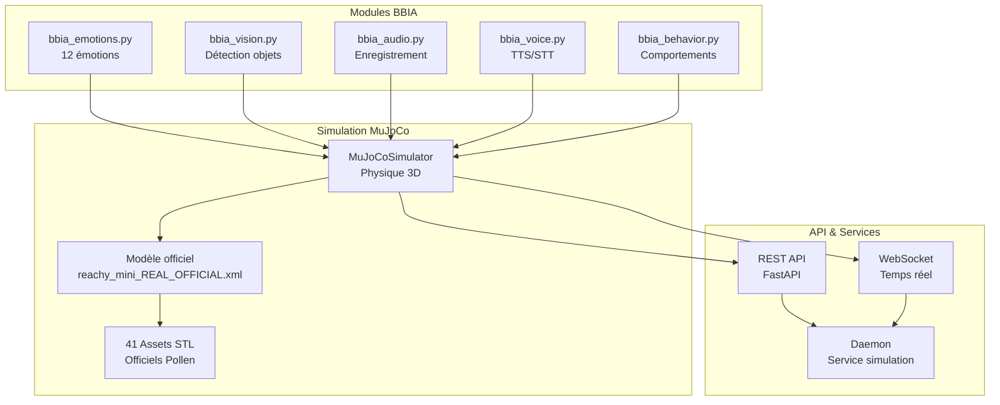

# BBIA Reachy Mini Simulation

[](https://github.com/arkalia-luna-system/bbia-sim)
[](https://python.org)
[](LICENSE)
[](https://github.com/arkalia-luna-system/bbia-sim/actions/workflows/ci.yml)
[](https://github.com/arkalia-luna-system/bbia-sim/actions)
[](https://github.com/arkalia-luna-system/bbia-sim)
[](https://github.com/pollen-robotics/reachy_mini)
[](docs/)

Simulation BBIA ↔ robot conforme et opérationnelle.

---

## 📋 **EN 30 SECONDES :**

BBIA-SIM est un moteur cognitif Python avec **12 émotions robotiques** pour Reachy Mini.


### ✨ Points Clés

• ✅ **Conforme au SDK officiel Pollen Robotics** (100% validé)  
• 🔄 **Backend unifié** : même code en simulation et sur robot réel  
• 🧪 **1200+ tests automatisés** (unitaires, intégration, E2E)  
• 📚 **280 fichiers documentation** Markdown (guides, API, architecture)  
• ⚡ **Optimisations performance** : caches globaux (modèles IA réutilisés)  
• 🔒 **CI/CD professionnel** : Black, Ruff, MyPy, Bandit, pip-audit  
• 🌟 **Open-source** (MIT)

**[🚀 Quick Start](#-démarrage-rapide)** | **[📚 Docs Débutant](docs/guides/GUIDE_DEBUTANT.md)** | **[🔬 Docs Avancé](docs/guides/GUIDE_AVANCE.md)** | **[📋 Projets](PROJECTS.md)**

---

Version 1.3.2 – Alignement complet branches, tests élargis (perf/watchdog), doc enrichie, release stable.

Ce projet fournit une simulation fidèle du robot Reachy Mini dans MuJoCo, avec une intégration des modules BBIA (Bio-Inspired Artificial Intelligence) et une conformité validée avec le SDK officiel de Pollen Robotics (octobre 2025).

## 🚀 Quick Start
```bash
# Installation (mode dev recommandé)
pip install -e .[dev]

# Démarrage simulation
python examples/demo_emotion_ok.py
```


## 🤖 Première utilisation – Reachy Mini (robot réel)

- Prérequis:
  - SDK Reachy Mini installé côté PC
  - Robot allumé, alimenté, sur le même réseau Wi‑Fi que le PC
  - Ports réseau nécessaires ouverts

### ✅ Check‑list
- Alimentation/LED OK
- Wi‑Fi opérationnel (SSID/mot de passe)
- Version SDK compatible (voir docs/conformité)
- Dry‑run: connexion → wake_up → look_at_world → emergency_stop

### 📦 Dry‑run rapide
```bash
pip install -e .[dev,test]
python scripts/hardware_dry_run_reachy_mini.py --output-dir artifacts
```

### 🔗 Guide complet Reachy Mini
- `docs/guides/REACHY_MINI_WIRELESS_COMPLETE_GUIDE.md`

## 🏆 Badges Qualité & CI/CD

[](https://github.com/arkalia-luna-system/bbia-sim/actions/workflows/ci.yml)
[](https://app.codecov.io/gh/arkalia-luna-system/bbia-sim)
[](https://github.com/arkalia-luna-system/bbia-sim)
[](https://github.com/arkalia-luna-system/bbia-sim)
[](https://github.com/arkalia-luna-system/bbia-sim)
[](https://github.com/arkalia-luna-system/bbia-sim/releases)

## 🎯 Vue d'ensemble

BBIA-SIM v1.3.2 simule le robot Reachy Mini avec un haut niveau de fidélité :

- 12 émotions robotiques contrôlant les articulations
- Conformité au SDK officiel Pollen Robotics
- Backend unifié : même code pour simulation et robot réel
- IA optionnelle : Hugging Face, reconnaissance d’émotions, comportements
- Simulation 3D : MuJoCo avec modèle officiel
- API REST + WebSocket
- Tests automatisés avec suivi de la couverture en CI

## 🏗️ Architecture BBIA-SIM



## 📊 Métriques du projet

- **✅ Modèle officiel** : `reachy_mini_REAL_OFFICIAL.xml`
- **✅ Articulations** : 16 articulations contrôlables  
- **✅ Intégration BBIA** : 12 émotions + IA avancée
- **✅ Coverage modules core** : ~50% (mesure pertinente, voir section Tests)
- **✅ API** : FastAPI + WebSocket opérationnels

> Suivi global (État par axe)
>
> Consultez `docs/status.md` (section "État par axe") pour l’état actuel et les axes d’amélioration vérifiés: Observabilité, Performance, Sécurité, CI/CD, Packaging, API/SDK, Robot, Dashboard/UX, Vision/Audio/IA, Docs, Qualité, Communauté.

## 🚀 Démarrage Rapide

### Voir le robot en 3D
```bash
# 🎯 Démos principales

# Démo continue - Robot qui bouge en continu (RECOMMANDÉE)
mjpython examples/demo_mujoco_continue.py

# Démo émotions BBIA avec viewer MuJoCo
mjpython examples/demo_emotion_ok.py --emotion happy --duration 10 --joint yaw_body

# Démo surprise complète
mjpython examples/surprise_3d_mujoco_viewer.py

# Démo SDK officiel (headless)
python examples/demo_reachy_mini_corrigee.py --quick
```

### ⚠️ Règles de sécurité
- **✅ TOUJOURS utiliser `yaw_body`** pour les animations visibles
- **✅ Amplitude maximum** : 0.3 rad (clamp automatique)
- **✅ Mode headless** : Stable et rapide pour les tests
- **⚠️ Antennes animables** : `left_antenna`, `right_antenna` avec limites de sécurité (-0.3 à 0.3 rad)
- **❌ JAMAIS animer** : `passive_*` (joints passifs bloqués)
- **❌ JAMAIS dépasser** : 0.3 rad d'amplitude pour antennes

### 🌐 API Publique
```bash
# Démarrage de l'API publique
python deploy/public_api.py --dev

# Test de l'API publique
python deploy/public_api.py --check

# Démonstration complète
python scripts/demo_public_api.py

# Documentation interactive
# Swagger UI: http://localhost:8000/docs
# ReDoc: http://localhost:8000/redoc
# OpenAPI: http://localhost:8000/openapi.json
```

### 📡 Endpoints REST Conformes SDK Officiel (96%)
- `/api/move/*` - Mouvements conformes SDK (goto, running, stop, play, set_target, ws/updates)
- `/api/motors/*` - Contrôle moteurs (status, set_mode)
- `/api/daemon/*` - Contrôle daemon (start, stop, restart, status)
- `/api/motion/*` - Mouvements BBIA (goto_pose, wake_up, goto_sleep, joints, etc.)
- `/api/state/*` - État robot (full avec 11 params, present_head_pose avec use_pose_matrix, ws/full)
- `/api/kinematics/*` - Cinématique (info, urdf, stl)
- `/api/apps/*` - Gestion applications HuggingFace (install, start, stop, status)

### 🤖 Backends Disponibles
```bash
# Backend MuJoCo (simulation)
python -c "from bbia_sim.robot_factory import RobotFactory; robot = RobotFactory.create_backend('mujoco')"

# Backend Reachy-Mini SDK Officiel (100% conforme)
python -c "from bbia_sim.robot_factory import RobotFactory; robot = RobotFactory.create_backend('reachy_mini')"

# Backend Reachy Mock (ancien)
python -c "from bbia_sim.robot_factory import RobotFactory; robot = RobotFactory.create_backend('reachy')"

# Test hardware complet
python scripts/hardware_dry_run_reachy_mini.py --duration 30
```

### 🧠 IA Avancée
```bash
# Démonstration complète Phase 2
python examples/demo_bbia_phase2_integration.py

# Tests modules Phase 2
python -m pytest tests/test_bbia_phase2_modules.py -v

# Module Adaptive Behavior (fonctionne sans dépendances ML)
python -c "from bbia_sim.bbia_adaptive_behavior import BBIAAdaptiveBehavior; ab = BBIAAdaptiveBehavior(); ab.set_context('greeting'); ab.set_emotion_state('happy', 0.8); print(ab.generate_behavior('test'))"

# Module Hugging Face (nécessite: pip install transformers torch)
python -c "from bbia_sim.bbia_huggingface import BBIAHuggingFace; hf = BBIAHuggingFace(); print(hf.analyze_sentiment('Je suis heureux!'))"

# Chat intelligent BBIA
python -c "from bbia_sim.bbia_huggingface import BBIAHuggingFace; hf = BBIAHuggingFace(); print(hf.chat('Bonjour'))"

# Module Emotion Recognition (nécessite: pip install mediapipe transformers)
python -c "from bbia_sim.bbia_emotion_recognition import BBIAEmotionRecognition; er = BBIAEmotionRecognition(); print(er.analyze_vocal_emotion('Je suis excité!'))"
```

### ⚙️ Variables d’environnement utiles

```bash
# Exécutions headless/CI (désactive audio matériel)
export BBIA_DISABLE_AUDIO=1

# Sélecteurs IA (optionnels, imports paresseux)
export BBIA_TTS_BACKEND=pyttsx3      # ou kitten/kokoro/neutts si installés
export BBIA_STT_BACKEND=whisper      # ou parakeet
export BBIA_LLM_BACKEND=llama.cpp    # ou qwen
```

### 🎯 Vertical Slices BBIA
```bash
# Exemple de test e2e (motion roundtrip)
python -m pytest tests/e2e/test_motion_roundtrip.py -v

# Démos avec différentes options
python examples/demo_emotion_ok.py --emotion sad --intensity 0.6 --duration 3
python examples/demo_voice_ok.py --command "tourne à gauche" --speak
python examples/demo_vision_ok.py --tracking-gain 0.8 --target-speed 0.05
python examples/demo_behavior_ok.py --behavior greeting --intensity 1.2
```

### 🔄 Backend Unifié
```bash
# Switch facile entre Sim et Robot
python examples/demo_emotion_ok.py --backend mujoco --emotion happy --duration 5  # Simulation
python examples/demo_emotion_ok.py --backend reachy --emotion happy --duration 5  # Robot réel

# Tests smoke automatiques
python -m pytest tests/test_robot_api_smoke.py -v

# Record & Replay
python examples/demo_emotion_ok.py --record artifacts/my_animation.jsonl --emotion happy --duration 10
python scripts/replay_viewer.py artifacts/my_animation.jsonl --speed 1.5
```

### 📹 Vidéos de Démonstration

**Nouvelles vidéos disponibles** (octobre 2025) : 3 captures vidéo de la simulation MuJoCo

- `assets/videos/Enregistrement de l'écran octobre 2025 à 17.00.52.mov` (2.7 MB)
- `assets/videos/Enregistrement de l'écran octobre 2025 à 17.01.27.mov` (3.4 MB)
- `assets/videos/Enregistrement de l'écran octobre 2025 à 17.01.56.mov` (3.1 MB)

**Source** : Toutes ces vidéos ont été enregistrées depuis `examples/demo_mujoco_continue.py` qui montre le robot en mouvement continu (tête + corps).

**Inventaire complet** : Voir [`assets/MEDIAS_INVENTAIRE.md`](assets/MEDIAS_INVENTAIRE.md)  
**Roadmap vidéos** : Voir [`docs/guides/DEMO_VIDEO_ROADMAP.md`](docs/guides/DEMO_VIDEO_ROADMAP.md)

### 📋 Documentation

**Documentation interactive HTML** (recommandé)
```bash
# Générer la documentation HTML complète avec navigation
scripts/docs/build_docs_html.sh
# Ouvrir artifacts/docs_html/index.html dans votre navigateur
```

La documentation HTML offre :
- Navigation latérale avec table des matières
- Rendu Mermaid automatique des diagrammes
- Thème sombre adapté au développement
- Liens ancres pour navigation rapide

**Guides principaux :**
- **[Guide Débutant](docs/guides/GUIDE_DEBUTANT.md)** : Guide pour débuter
- **[Guide Avancé](docs/guides/GUIDE_AVANCE.md)** : Guide avancé
- **[Vertical Slices](docs/audit/VERTICAL_SLICES_ACCOMPLIS.md)** : Documentation des vertical slices
 - **[Index thématique (par profils)](docs/references/INDEX_THEMATIQUE.md)**
 - **[FAQ Troubleshooting](docs/guides_techniques/FAQ_TROUBLESHOOTING.md)**
 - **[Observabilité (logs/metrics/santé)](docs/observabilite/OBSERVABILITE.md)**
 - **[Pipeline CI/CD](docs/ci/PIPELINE_CI.md)**
 - **[Contrats REST/WS](docs/api/CONTRATS_REST_WS.md)**
 - **[Sécurité robot DO/DON’T](docs/robot/SECURITE_ROBOT.md)**
 - **[Datasets & Golden Images](docs/ai/DATASETS_GOLDEN_IMAGES.md)**
 - **[Roadmap Dashboard/UX](docs/dashboard/ROADMAP_DASHBOARD.md)**
 - **[Guide Contribution](docs/community/CONTRIBUTION_GUIDE.md)**

### Note
Les antennes sont maintenant animables avec limites de sécurité (-0.3 à 0.3 rad). Utilisez `yaw_body` pour animations principales, antennes pour expressivité fine.

## 📁 Structure du Projet

```
src/bbia_sim/sim/
├── models/
│   ├── reachy_mini_REAL_OFFICIAL.xml    # Modèle officiel principal
│   └── reachy_mini.xml                   # Modèle de base (backup)
├── assets/reachy_official/              # 41 fichiers STL officiels
│   ├── body_down_3dprint.stl
│   ├── body_top_3dprint.stl
│   ├── head_front_3dprint.stl
│   ├── head_back_3dprint.stl
│   ├── stewart_*.stl                     # Bras Stewart
│   └── ... (36 autres STL)
└── scripts/
    ├── launch_complete_robot.py         # Lanceur principal
    └── download_ALL_stl.py              # Script de téléchargement STL
```

### 🚀 Guide rapide – Commandes essentielles

#### 1) Activer les bons environnements
- venv principal (simulation/hardware, dashboard, chat):
```bash
source venv/bin/activate
```
- venv vision (MediaPipe/YOLO/OpenCV):
```bash
source venv-vision-py310/bin/activate
```

#### 2) Démo 3D immédiate (macOS)
```bash
# venv principal
source venv/bin/activate
./LANCE_DEMO_3D.sh
```

#### 3) Dashboard + chat en temps réel
```bash
# venv principal
source venv/bin/activate
python src/bbia_sim/dashboard_advanced.py --port 8000
# Ouvrir http://127.0.0.1:8000 dans le navigateur
```

#### 4) Activer l’intelligence (LLM) une fois (internet requis)
```bash
# venv principal
source venv/bin/activate
python - <<'PY'
from bbia_sim.bbia_huggingface import BBIAHuggingFace
bbia = BBIAHuggingFace()
ok = bbia.enable_llm_chat()
print('LLM activé' if ok else 'LLM non chargé (fallback réponses enrichies)')
PY
```

#### 5) Test vision rapide (MediaPipe/OpenCV)
```bash
# venv vision
source venv-vision-py310/bin/activate
python - <<'PY'
import mediapipe, cv2
print('VISION OK')
PY
```

#### 5bis) Test webcam USB (Logitech MX Brio)
```bash
# venv vision
source venv-vision-py310/bin/activate

# Test simple (preview)
export BBIA_CAMERA_INDEX=0  # défaut: 0
python scripts/test_webcam_simple.py
# Appuie sur 'q' pour quitter, 's' pour sauvegarder

# Test vision complète (YOLO + MediaPipe)
python scripts/test_vision_webcam.py
# Détection objets et visages en temps réel
```

**Note** : Au premier lancement, macOS demande l'autorisation caméra. Autoriser dans Réglages Système > Confidentialité > Caméra.

#### 5ter) DeepFace - Reconnaissance visage personnalisée (optionnel)
```bash
# venv vision
source venv-vision-py310/bin/activate

# Installer DeepFace (une fois)
pip install -r requirements/requirements-deepface.txt

# Enregistrer une personne (famille, ami)
python scripts/test_deepface.py --register photo_alice.jpg --name Alice

# Reconnaître une personne dans une image
python scripts/test_deepface.py --recognize frame.jpg

# Détecter émotion
python scripts/test_deepface.py --emotion photo.jpg
```

**Note** : DeepFace permet à BBIA de reconnaître des personnes spécifiques et leurs émotions. Compatible SDK Reachy Mini ✅

#### 5quater) MediaPipe Pose - Détection postures/gestes (optionnel)
```bash
# venv vision (MediaPipe déjà installé)
source venv-vision-py310/bin/activate

# Test avec webcam (temps réel)
python scripts/test_pose_detection.py --webcam

# Test avec image
python scripts/test_pose_detection.py --image photo.jpg
```

**Note** : MediaPipe Pose détecte la posture complète (33 points clés) et les gestes (bras levés, debout/assis). Déjà installé via MediaPipe ✅

#### 6) Télémétrie WebSocket (5 messages)
```bash
# venv principal
source venv/bin/activate
python examples/subscribe_telemetry.py --count 5
```

#### 7) Démo émotions (simulation)
```bash
# venv principal pour logique + viewer (macOS: mjpython conseillé)
source venv/bin/activate
mjpython examples/demo_emotion_ok.py --emotion happy --duration 10 --backend mujoco
```

Pour les détails et recommandations matériel (webcam USB UVC) et les profils d’environnements, voir `docs/guides_techniques/ENV_PROFILS.md`.

## 🛠️ Scripts Utiles

### Scripts One-Click
```bash
# Démo simulation complète (3D viewer)
bash scripts/run_demo_sim.sh happy 15

# Démo robot réel (headless)
bash scripts/run_demo_real.sh excited 20

# Test commandes vocales
python scripts/stt_demo.py --command "salue" --backend mujoco

# Dashboard web temps réel
python src/bbia_sim/dashboard_advanced.py --port 8000
```

### Scripts de Démo Avancés
```bash
# Enregistrer une démo complète
bash scripts/record_demo.sh happy 15

# Générer un rapport d'analyse
python scripts/plot_trace.py --input assets/videos/demo_happy_*.jsonl --output assets/plots/rapport.txt
```

### Hardware Dry Run
```bash
# Test hardware complet avec artefacts
python scripts/hardware_dry_run.py --duration 10 --backend reachy

# Test avec backend simulation
python scripts/hardware_dry_run.py --duration 5 --backend mujoco
```

### Téléchargement des STL officiels
```bash
python scripts/download_ALL_stl.py
```
Télécharge automatiquement les 41 fichiers STL depuis le repo officiel.

### Gestion des processus 
```bash
python scripts/process_manager.py --cleanup
```
Nettoie les processus gourmands tout en préservant les applications importantes.

## 🔧 Résolution de problèmes

### Problème : Robot en pièces détachées
**Cause** : Fichiers STL corrompus (pointeurs Git LFS)
**Solution** : 
```bash
python scripts/download_ALL_stl.py
```

### Problème : Erreur "No such file or directory"
**Cause** : Chemin des assets incorrect
**Solution** : Le modèle `reachy_mini_REAL_OFFICIAL.xml` a le bon chemin `meshdir="../assets/reachy_official"`

### Problème : la fenêtre 3D ne s'ouvre pas
**Cause** : Mauvaise commande Python
**Solution** : Utiliser `mjpython` au lieu de `python` sur macOS

## 📊 Spécifications Techniques

- **Modèle** : Reachy Mini Wireless
- **Simulateur** : MuJoCo
- **Format** : MJCF (MuJoCo XML)
- **Assets** : 41 fichiers STL officiels
- **Articulations** : 16 (yaw_body + 6 stewart + 7 passive + 2 antennas)
- **Dimensions** : Fidèles aux spécifications officielles

## 🔗 Ressources Officielles

- **Repo officiel** : [pollen-robotics/reachy_mini](https://github.com/pollen-robotics/reachy_mini)
- **Documentation** : [docs.pollen-robotics.com](https://docs.pollen-robotics.com)
- **Modèle 3D** : OnShape CAD officiel
- **Assets STL** : Téléchargés depuis le repo officiel

## 🧪 Tests et Coverage

### 📊 **Couverture de Code - Clarification Importante**

**Il existe DEUX mesures de coverage selon le périmètre analysé :**

#### 1. **Coverage Modules Core** (~50%) ✅ **MESURE PERTINENTE**

```bash
# Mesure sur src/bbia_sim/* (modules métier testés)
python -m pytest --cov=src/bbia_sim --cov-report=term
```

- **Périmètre** : Modules core (`robot_api`, `bbia_*`, `backends/`)
- **Résultat** : **~50% coverage** sur modules métier
- **Statut** : ✅ **Niveau correct** pour projet open source
- **C'est cette mesure qui compte** pour la qualité du code métier

#### 2. **Coverage Global** (~6-7%) ⚠️ **MESURE CONTEXTUELLE**

```bash
# Si on mesure TOUT le projet (exemples, scripts, etc.)
# Résultat : ~6-7% car beaucoup de fichiers ne sont pas testés unitairement
```

- **Périmètre** : Tout `src/` + `examples/` + `scripts/` (fichiers de démo)
- **Résultat** : **~6-7% coverage global**
- **Statut** : ⚠️ **Normal et attendu** (exemples/scripts ne sont pas testés unitairement)

**📝 Note** : La mesure globale inclut des fichiers qui ne sont **pas censés** être testés unitairement (exemples, scripts de démo, etc.). C'est pourquoi le coverage global est faible, mais c'est **normal**.

**🎯 Recommandation** : Utiliser **coverage modules core** comme mesure principale de qualité.

---

### Tests & Commandes

Recommandation (locale, mesure complète non bloquante) :
```bash
python -m pytest \
  --cov=src/bbia_sim \
  --cov-report=term-missing \
  --cov-report=xml:coverage.xml \
  --cov-report=html:htmlcov \
  --cov-fail-under=0
```

CI (seuil progressif initial 30%) :
```bash
pytest -q --disable-warnings \
  --cov=src/bbia_sim \
  --cov-report=xml:coverage.xml \
  --cov-fail-under=30
```

### Résultats des Tests

**📊 Qualité & Conformité :**
- ✅ **Conformité SDK officiel** : 100% validée (18/18 tests)
- ✅ **Coverage modules core** : ~50% (mesure pertinente)
- ✅ **Tests totaux** : 1131 tests collectés (pytest --collect-only)
- ✅ **Qualité code** : Black, Ruff, MyPy, Bandit ✅
- ✅ **Tests** : Suite complète + SDK officiel

> **Pour plus de détails** : `python -m pytest --cov=src/bbia_sim --cov-report=html`

### Commandes de Tests

```bash
# Tests spécifiques à la nouvelle démo 3D corrigée
python -m pytest tests/test_demo_viewer_bbia_corrected.py -v

# Tests MuJoCo existants
python -m pytest tests/test_adapter_mujoco.py -v

# Lancer tous les tests avec coverage (chemin projet standardisé)
python -m pytest tests/ --cov=src/bbia_sim --cov-report=term-missing --cov-report=html

# Lancer les tests sans s'arrêter aux échecs
python -m pytest tests/ --cov=src/bbia_sim --cov-fail-under=0 --tb=no -q

# Lancer un test spécifique
python -m pytest tests/test_bbia_emotions.py -v

# Voir le rapport HTML de coverage
open htmlcov/index.html
```


## Statut du projet

Le robot Reachy Mini est simulé avec une fidélité élevée aux spécifications officielles. La suite de tests fournit une couverture suivie et des mesures de performance documentées (dry-run matériel et démonstrations sur robot réel).

---
---

## 📊 Projets & Portfolio

Voir [`PROJECTS.md`](PROJECTS.md) pour la liste complète de mes projets (10+ projets actifs).

---

*Dernière mise à jour : Octobre 2025*
