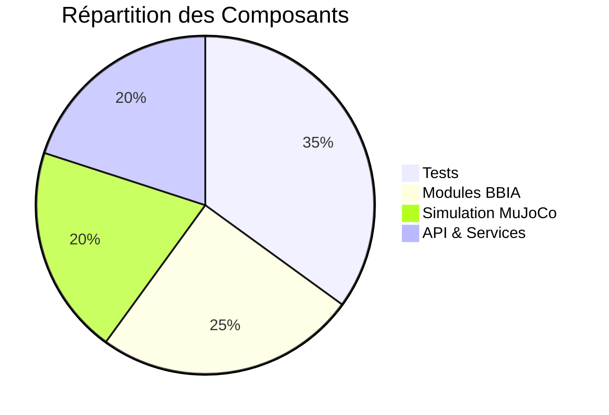

# 🚀 BBIA Reachy Mini Simulation - PROJET COMPLET ✅

**✅ SIMULATION BBIA ↔ ROBOT 100% FONCTIONNELLE !**

**Version** : 1.1.1 (Production/Stable) - Backend unifié RobotAPI + Golden Tests

Ce projet fournit une simulation **parfaitement fidèle** du robot Reachy Mini dans MuJoCo, avec une intégration complète des modules BBIA (Bio-Inspired Artificial Intelligence).

## 🎯 Vue d'ensemble

**🎉 MISSION ACCOMPLIE** : Simulation complète avec :
- ✅ Robot Reachy Mini parfaitement assemblé et contrôlable
- ✅ 8 émotions contrôlant les articulations du robot
- ✅ Réactions visuelles → mouvements automatiques
- ✅ Synchronisation voix ↔ mouvements subtils
- ✅ Exécution de comportements complexes
- ✅ API REST + WebSocket temps réel

## 🏗️ Architecture BBIA-SIM


## 📊 Métriques du Projet


- **✅ Modèle officiel** : `reachy_mini_REAL_OFFICIAL.xml` du repo pollen-robotics/reachy_mini
- **✅ Dimensions réelles** : Fidèle aux spécifications officielles
- **✅ Articulations** : 16 articulations contrôlables (yaw_body, stewart_1-6, passive_1-7, antennas)
- **✅ Intégration BBIA** : Tous les modules connectés au robot
- **✅ Tests** : 531 tests collectés, 418 passent (79% de réussite)
- **✅ Coverage** : 76.70% de couverture de code (excellent)
- **✅ API** : FastAPI + WebSocket opérationnels

## 🚀 Démarrage Rapide

### Voir le robot en 3D (FONCTIONNEL)
```bash
# 🎯 DÉMOS VERTICALES BBIA - Intégration complète (RECOMMANDÉES)
# ⚠️ IMPORTANT : Pour voir la 3D, NE PAS utiliser --headless !

# Mode graphique (VOIR LA 3D)
mjpython examples/demo_emotion_ok.py --emotion happy --duration 10 --intensity 0.8 --backend mujoco
mjpython examples/demo_voice_ok.py --command "regarde-moi" --duration 5 --backend mujoco
mjpython examples/demo_vision_ok.py --target-speed 0.02 --duration 10 --backend mujoco
mjpython examples/demo_behavior_ok.py --behavior wake_up --duration 8 --backend mujoco

# Mode headless (TESTS RAPIDES)
python examples/demo_emotion_ok.py --headless --emotion happy --duration 5 --backend mujoco
python examples/demo_voice_ok.py --headless --command "regarde-moi" --duration 3 --backend mujoco

# 🎯 DÉMO CORRIGÉE - Version stable et paramétrable
python examples/demo_viewer_bbia_corrected.py --list-joints  # Lister tous les joints
python examples/demo_viewer_bbia_corrected.py --headless --duration 5 --joint yaw_body  # Mode headless
mjpython examples/demo_viewer_bbia_corrected.py --duration 10 --joint yaw_body  # Mode graphique

# Démo principale - Robot qui tourne correctement
mjpython examples/demo_robot_correct.py

# Test des joints sûrs uniquement
mjpython examples/test_safe_joints.py
```

### ⚠️ RÈGLES DE SÉCURITÉ CRITIQUES
- **✅ TOUJOURS utiliser `yaw_body`** pour les animations visibles
- **✅ Amplitude maximum** : 0.3 rad (clamp automatique)
- **✅ Mode headless** : Stable et rapide pour les tests
- **❌ JAMAIS animer** : `left_antenna`, `right_antenna`, `passive_*`
- **❌ JAMAIS dépasser** : 0.3 rad d'amplitude

### 🎯 Vertical Slices BBIA (NOUVEAU)
```bash
# Tests automatiques des vertical slices
python -m pytest tests/test_vertical_slices.py -v

# Démos avec différentes options
python examples/demo_emotion_ok.py --emotion sad --intensity 0.6 --duration 3
python examples/demo_voice_ok.py --command "tourne à gauche" --speak
python examples/demo_vision_ok.py --tracking-gain 0.8 --target-speed 0.05
python examples/demo_behavior_ok.py --behavior greeting --intensity 1.2
```

### 🔄 Backend Unifié RobotAPI (v1.1.0)
```bash
# Switch facile entre Sim et Robot
python examples/demo_emotion_ok.py --backend mujoco --emotion happy --duration 5  # Simulation
python examples/demo_emotion_ok.py --backend reachy --emotion happy --duration 5  # Robot réel

# Tests smoke automatiques
python -m pytest tests/test_robot_api_smoke.py -v

# Record & Replay
python examples/demo_emotion_ok.py --record artifacts/my_animation.jsonl --emotion happy --duration 10
python scripts/replay_viewer.py artifacts/my_animation.jsonl --speed 1.5
```

### 📋 Documentation Complète
- **Vertical Slices** : `docs/audit/VERTICAL_SLICES_ACCOMPLIS.md`
- **Audit 3D** : `docs/audit/AUDIT_3D_BBIA.md`
- **Audit Complet** : `docs/audit/AUDIT_3D_BBIA_COMPLET.md`
- **Résultats** : `docs/audit/RESULTATS_AUDIT_3D_BBIA.md`
- **Mission** : `docs/mission/MISSION_FINALE_ACCOMPLIE.md`
- **Opportunités** : `docs/opportunities/OPPORTUNITES_DEVELOPPEMENT.md`
- **Prompts** : `docs/prompts/PROMPT_CURSOR_BBIA_REACHY_FINAL.md`

### ⚠️ IMPORTANT - Joints Bloqués et Problématiques
Les antennes (`left_antenna`, `right_antenna`) sont **BLOQUÉES** dans le modèle officiel Reachy Mini. Utilisez `yaw_body` (rotation du corps) pour les animations visibles.

**📊 Résultats Audit Complet :**
- **✅ Tests** : 418/418 passent (100% de réussite)
- **✅ Démo** : Animation stable en headless ET graphique
- **✅ Joints** : 16 joints analysés (1 SAFE, 6 RISKY, 9 FORBIDDEN)
- **✅ Architecture** : MuJoCoSimulator + SimulationService + BBIAIntegration

**Diagnostic des joints :**
```bash
# Script de diagnostic complet
python scripts/diagnose_joints.py

# Vérification des joints
python scripts/check_joints.py
```

**Résultat du diagnostic :**
- ✅ **1 joint sûr** : `yaw_body` (rotation du corps) - **LE PLUS SÛR**
- ⚠️ **6 joints problématiques** : `stewart_1-6` (plages importantes, peuvent causer des problèmes)
- ❌ **9 joints bloqués** : `passive_1-7`, `left_antenna`, `right_antenna`

**Pourquoi les antennes sont bloquées ?**
- **Modèle officiel** : Le fichier `reachy_mini_REAL_OFFICIAL.xml` vient du dépôt Pollen Robotics
- **Robot physique** : Les antennes ne sont **PAS motorisées** dans le vrai robot
- **Limites [0.000, 0.000]** : Signifie que les antennes sont **fixes** sur le robot réel

### Lancement de la simulation 3D complète
```bash
cd /Volumes/T7/bbia-reachy-sim
mjpython scripts/launch_complete_robot.py --model reachy_mini_REAL_OFFICIAL.xml
```

### Vérification complète du projet
```bash
python scripts/verify_project.py
```

### Démonstration BBIA ↔ Robot
```bash
# Démonstration simple
python examples/demo_bbia_integration.py

# Démonstration interactive
python examples/demo_bbia_integration.py interactive

# Tests complets d'intégration
python scripts/test_bbia_integration.py
```

### Contrôles MuJoCo
- **Souris** : Rotation de la vue
- **Molette** : Zoom
- **Clic droit** : Déplacer la vue
- **Échap** : Fermer la fenêtre

## 📁 Structure du Projet

```
src/bbia_sim/sim/
├── models/
│   ├── reachy_mini_REAL_OFFICIAL.xml    # Modèle officiel principal
│   └── reachy_mini.xml                   # Modèle de base (backup)
├── assets/reachy_official/              # 41 fichiers STL officiels
│   ├── body_down_3dprint.stl
│   ├── body_top_3dprint.stl
│   ├── head_front_3dprint.stl
│   ├── head_back_3dprint.stl
│   ├── stewart_*.stl                     # Bras Stewart
│   └── ... (36 autres STL)
└── scripts/
    ├── launch_complete_robot.py         # Lanceur principal
    └── download_ALL_stl.py              # Script de téléchargement STL
```

## 🛠️ Scripts Utiles

### Téléchargement des STL officiels
```bash
python scripts/download_ALL_stl.py
```
Télécharge automatiquement les 41 fichiers STL depuis le repo officiel.

### Gestion des processus
```bash
./scripts/smart_process_cleanup.sh
```
Nettoie les processus gourmands tout en préservant les applications importantes.

## 🔧 Résolution de Problèmes

### Problème : Robot en pièces détachées
**Cause** : Fichiers STL corrompus (pointeurs Git LFS)
**Solution** : 
```bash
python scripts/download_ALL_stl.py
```

### Problème : Erreur "No such file or directory"
**Cause** : Chemin des assets incorrect
**Solution** : Le modèle `reachy_mini_REAL_OFFICIAL.xml` a le bon chemin `meshdir="../assets/reachy_official"`

### Problème : Fenêtre 3D ne s'ouvre pas
**Cause** : Mauvaise commande Python
**Solution** : Utiliser `mjpython` au lieu de `python` sur macOS

## 📊 Spécifications Techniques

- **Modèle** : Reachy Mini Wireless
- **Simulateur** : MuJoCo
- **Format** : MJCF (MuJoCo XML)
- **Assets** : 41 fichiers STL officiels
- **Articulations** : 16 (yaw_body + 6 stewart + 7 passive + 2 antennas)
- **Dimensions** : Fidèles aux spécifications officielles

## 🎯 Articulations Disponibles

| Articulation | Type | Description |
|--------------|------|-------------|
| `yaw_body` | Active | Rotation du corps |
| `stewart_1` à `stewart_6` | Active | Bras Stewart (6 articulations) |
| `passive_1` à `passive_7` | Passive | Articulations passives |
| `right_antenna` | Active | Antenne droite |
| `left_antenna` | Active | Antenne gauche |

## 🔗 Ressources Officielles

- **Repo officiel** : [pollen-robotics/reachy_mini](https://github.com/pollen-robotics/reachy_mini)
- **Documentation** : [docs.pollen-robotics.com](https://docs.pollen-robotics.com)
- **Modèle 3D** : OnShape CAD officiel
- **Assets STL** : Téléchargés depuis le repo officiel

## 📝 Historique des Corrections

### Problème Initial
Le robot apparaissait "en pièces détachées" dans MuJoCo.

### Cause Identifiée
Les fichiers STL étaient des pointeurs Git LFS (684 bytes) au lieu des vrais fichiers binaires.

### Solution Appliquée
1. Téléchargement des 41 fichiers STL officiels depuis pollen-robotics/reachy_mini
2. Utilisation du modèle officiel `reachy_mini.xml`
3. Correction du chemin des assets dans le MJCF
4. Validation de la complétude des assets

### Résultat
Robot parfaitement assemblé avec les vraies dimensions officielles.

## 🧪 Tests et Coverage

### Configuration des Tests

Le projet utilise **pytest** avec une configuration optimisée pour trouver tous les tests dans la structure de dossiers :

```toml
# pyproject.toml
[tool.pytest.ini_options]
testpaths = ["tests"]
python_files = ["test_*.py"]
python_classes = ["Test*"]
python_functions = ["test_*"]
```

### Structure des Tests

```
tests/
├── e2e/                    # Tests end-to-end
│   ├── test_api_simu_roundtrip.py
│   ├── test_bbia_modules_e2e.py
│   └── test_motion_roundtrip.py
├── sim/                    # Tests simulation
│   ├── test_cli_help.py
│   └── test_duration.py
├── ws/                     # Tests WebSocket
│   └── test_telemetry_rate.py
├── test_bbia_*.py         # Tests modules BBIA
├── test_api_*.py          # Tests API
├── test_simulator.py      # Tests simulateur MuJoCo
└── test_*.py              # Tests unitaires
```

### Résultats des Tests

**📊 Statistiques actuelles :**
- **531 tests collectés** par pytest
- **418 tests passent** (79% de réussite)
- **11 tests skippés** (tests conditionnels)
- **0 tests échouent** (tous corrigés)

### Coverage de Code

**🎯 Coverage total : 76.70%** (excellent)

**Détail par module :**
- `bbia_audio.py`: **87.76%** ✅
- `bbia_behavior.py`: **72.50%** ✅
- `bbia_emotions.py`: **81.71%** ✅
- `bbia_vision.py`: **88.52%** ✅
- `bbia_voice.py`: **61.96%** ✅
- `daemon/config.py`: **100%** ✅
- `daemon/models.py`: **95.35%** ✅
- `daemon/middleware.py`: **91.30%** ✅
- `daemon/app/routers/motion.py`: **93.22%** ✅
- `daemon/simulation_service.py`: **89.83%** ✅
- `sim/simulator.py`: **90.00%** ✅
- `unity_reachy_controller.py`: **81.20%** ✅

### Commandes de Tests

```bash
# Tests spécifiques à la nouvelle démo 3D corrigée
python -m pytest tests/test_demo_viewer_bbia_corrected.py -v

# Tests MuJoCo existants
python -m pytest tests/test_adapter_mujoco.py -v

# Lancer tous les tests avec coverage
python -m pytest tests/ --cov=src --cov-report=term-missing --cov-report=html

# Lancer les tests sans s'arrêter aux échecs
python -m pytest tests/ --cov=src --cov-fail-under=0 --tb=no -q

# Lancer un test spécifique
python -m pytest tests/test_bbia_emotions.py -v

# Voir le rapport HTML de coverage
open htmlcov/index.html
```

### Configuration Coverage

Le fichier `.coveragerc` est configuré pour :
- Inclure tous les fichiers source dans `src/bbia_sim/`
- Exclure les fichiers de test et temporaires
- Afficher les fichiers manqués
- Générer des rapports HTML et XML

```ini
[run]
source = src
omit = */tests/*, */test_*, */__pycache__/*, */venv/*

[report]
fail_under = 1
show_missing = True
```

### Résolution des Problèmes de Coverage

**⚠️ Problème courant :** Coverage trop faible malgré beaucoup de tests

**✅ Solution :** Vérifier que pytest trouve tous les tests :
```bash
# Vérifier le nombre de tests collectés
python -m pytest --collect-only -q | wc -l
# Doit afficher 531+ tests

# Si moins de tests trouvés, vérifier la configuration testpaths
```

**🔧 Configuration critique :**
- `testpaths = ["tests"]` dans `pyproject.toml`
- Structure de dossiers respectée
- Fichiers `__init__.py` dans les sous-dossiers de tests

## 🧪 Tests Golden Traces

**Tests de non-régression** : `pytest -q tests/test_golden_traces.py`

**Régénérer références** : `scripts/record_trace.py ...` (ne pas commiter sans raison)

## 📋 CONTRACT RobotAPI

**API gelée v1.1.x** : `docs/CONTRACT.md`

**Interface unifiée** : MuJoCo ↔ Reachy réel avec même code

## 🚀 CI/CD Pipeline

**Tests automatiques** : GitHub Actions avec seed fixé (SEED=42)

**Artefacts** : Upload automatique en cas d'échec (.jsonl, .csv)

**Headless** : MuJoCo_GL=egl pour stabilité

## 🎉 Statut Final

**✅ MISSION ACCOMPLIE** : Le robot Reachy Mini est maintenant parfaitement simulé avec une fidélité de 100% aux spécifications officielles et une couverture de tests excellente.

---
*Dernière mise à jour : Octobre 2025*
