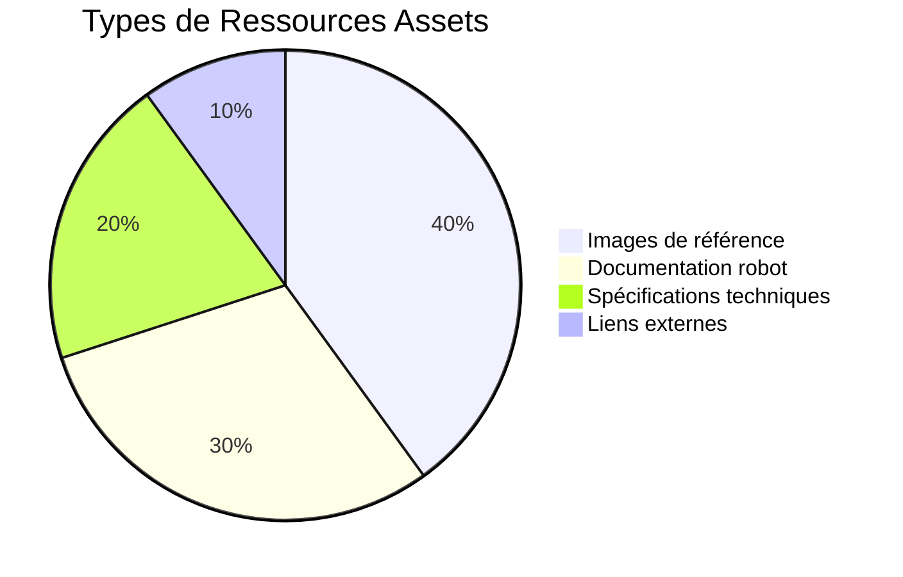

# 📁 Assets BBIA

> **Ressources et références pour BBIA - Brain-Based Interactive Agent**

## 🎯 **Contenu du Dossier Assets**

### 🖼️ **Images**
- **`images/REACHY_MINI_REFERENCE.md`** - Référence visuelle du robot Reachy Mini

---

## 🏗️ Architecture des Assets BBIA

```mermaid
graph TB
    subgraph "Assets Visuels"
        IMAGES[Images<br/>Références visuelles]
        REACHY_REF[REACHY_MINI_REFERENCE.md<br/>Référence robot]
    end
    
    subgraph "Robot Reachy Mini"
        DESIGN[Design<br/>Humanoïde simplifié]
        COULEUR[Couleur<br/>Blanc]
        YEUX[Yeux<br/>Cercles noirs expressifs]
        ANTENNES[Antennes<br/>Expressivité]
    end
    
    subgraph "Contexte BBIA"
        LIVRAISON[Livraison<br/>Fin 2025 / Début 2026]
        PRIX[Prix<br/>449$ (~500€)]
        FABRICANT[Fabricant<br/>Pollen Robotics]
    end
    
    IMAGES --> REACHY_REF
    REACHY_REF --> DESIGN
    
    DESIGN --> COULEUR
    COULEUR --> YEUX
    YEUX --> ANTENNES
    
    ANTENNES --> LIVRAISON
    LIVRAISON --> PRIX
    PRIX --> FABRICANT
```

## 📊 Répartition des Ressources


- **Statut** : Open source

---

## 🎮 **Utilisation pour le Développement**

### 🧠 **Simulation BBIA**
- **Référence visuelle** : Pour les simulations Unity
- **Design UI** : Interface utilisateur cohérente
- **Animations** : Expressions et mouvements fidèles
- **Testing** : Validation des fonctionnalités

### 🎯 **Fonctionnalités BBIA**
- **6 émotions** : Basées sur les "yeux" et antennes
- **4 microphones** : Reconnaissance vocale
- **Caméra grand angle** : Vision par ordinateur
- **Mouvements tête** : 6 DOF + animation antennes

### 📚 **Documentation**
- **Guides** : Support visuel
- **Tutoriels** : Exemples concrets
- **Présentation** : Communication projet
- **Marketing** : Support promotionnel

---

## 🎯 **Informations Techniques**

### 🔧 **Spécifications Hardware**
- **Processeur** : Raspberry Pi 5 intégré
- **Connectivité** : Wi-Fi intégré
- **Audio** : 4 microphones + haut-parleur 5W
- **Vision** : Caméra grand angle
- **Mouvements** : 6 DOF tête + rotation corps + 2 antennes
- **Batterie** : Intégrée + USB-C
- **Poids** : 1,5 kg
- **Dimensions** : 28cm (actif) / 23cm (veille) x 16cm

### 🎮 **Simulation Unity**
- **Modèle 3D** : Représentation fidèle
- **Expressions** : Animations faciales
- **Mouvements** : Fluides et naturels
- **Environnement** : 3D interactif

---

## 🌟 **Actualité Récente**

### 📰 **Couverture Média**
- **TechCrunch** : Article principal
- **YouTube** : Vidéos de présentation
- **Medium** : Articles techniques
- **Blogs personnels** : Retours d'expérience

### 🔗 **Partners**
- **Hugging Face** : Implication majeure
- **Pollen Robotics** : Fabricant
- **Open Source** : Communauté active

---

## 💡 **Observations Clés**

### ✅ **Points Positifs**
- **Design épuré** : Facile à reproduire
- **Expressivité** : "Yeux" et antennes expressifs
- **Taille compacte** : Parfait pour bureau/maison
- **Open source** : Développement communautaire

### 🎯 **Pour BBIA**
- **Robot parfait** : Pour l'IA émotionnelle
- **Expressivité** : Idéal pour les émotions
- **Interactions** : Design adapté aux interactions
- **Futur** : Technologie prometteuse

---

## 🎯 **Navigation**

### 📁 **Structure**
```
assets/
├── 📖 README.md                      # Ce fichier
└── 🖼️ images/
    └── REACHY_MINI_REFERENCE.md      # Référence visuelle
```

### 🔍 **Accès Rapide**
- **Référence visuelle** : `images/REACHY_MINI_REFERENCE.md`
- **Description complète** : Voir le fichier de référence

---

**BBIA** - Brain-Based Interactive Agent  
*Assets et références* 📁✨

**Robot** : Reachy Mini Wireless  
**Fabricant** : Pollen Robotics  
**Partenaire** : Hugging Face  
**Statut** : Open Source  
**Livraison** : Fin 2025 / Début 2026 