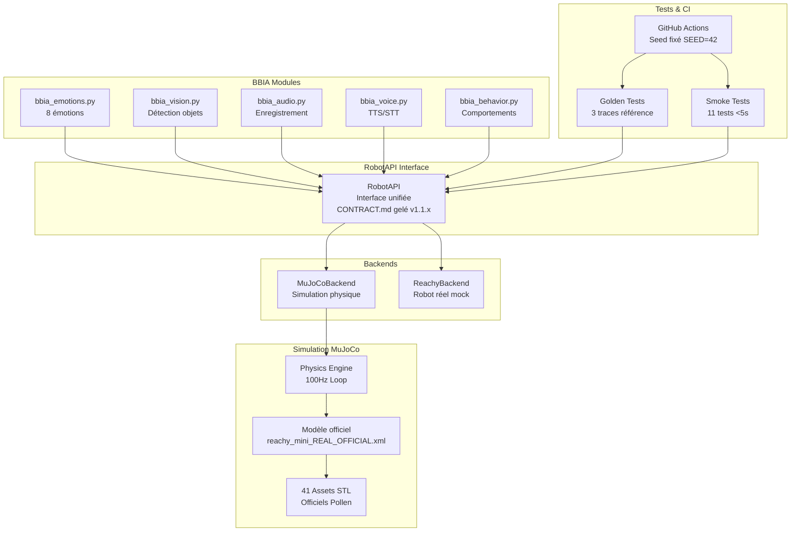
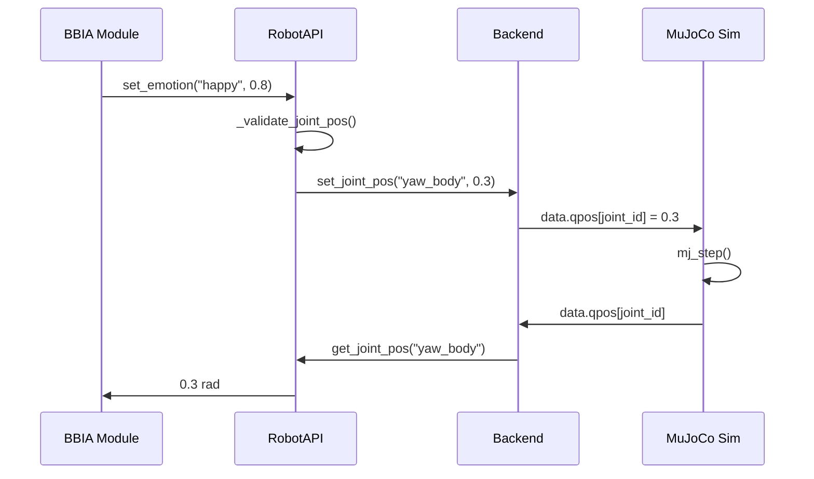

# Architecture BBIA-SIM v1.1.1

## Vue d'ensemble

BBIA-SIM est un système de simulation robotique modulaire avec **backend unifié RobotAPI** permettant de basculer facilement entre simulation MuJoCo et robot Reachy réel.

## Schéma d'architecture Mermaid

## Architecture détaillée

### 🧠 **Couche BBIA Modules**
- **bbia_emotions.py** : 8 émotions (happy, sad, angry, surprised, neutral, confused, determined, nostalgic, proud)
- **bbia_vision.py** : Détection d'objets et tracking
- **bbia_audio.py** : Enregistrement et traitement audio
- **bbia_voice.py** : Synthèse vocale (TTS) et reconnaissance (STT)
- **bbia_behavior.py** : Comportements prédéfinis (wake_up, greeting, etc.)

### 🔌 **Couche RobotAPI Interface**
- **Interface unifiée** : Même code pour simulation et robot réel
- **CONTRACT.md gelé** : API stable v1.1.x
- **Validation centralisée** : Limites d'amplitude, joints interdits
- **Télémétrie** : Métriques de performance

### 🎮 **Couche Backends**
- **MuJoCoBackend** : Simulation physique avec viewer 3D
- **ReachyBackend** : Mock du robot réel (prêt pour SDK)

### 🤖 **Couche Simulation MuJoCo**
- **Physics Engine** : Moteur physique MuJoCo
- **Modèle officiel** : reachy_mini_REAL_OFFICIAL.xml
- **Assets STL** : 41 fichiers officiels Pollen Robotics

### 🧪 **Couche Tests & CI**
- **Golden Tests** : 3 traces de référence (happy, look_at, wake_up)
- **Smoke Tests** : 11 tests rapides <5s
- **CI/CD** : GitHub Actions avec seed fixé

## Flux de données

## Sécurité et limites

### 🚫 **Joints interdits**
- `left_antenna`, `right_antenna` (bloqués)
- `passive_1` à `passive_7` (passifs)

### ⚠️ **Limites de sécurité**
- Amplitude maximale : 0.3 rad
- Validation centralisée dans RobotAPI
- Clamp automatique des positions

### 🔒 **Déterminisme**
- Seed global fixé : SEED=42
- Tests reproductibles
- CI headless stable

## Évolutivité

### 📈 **Versions futures**
- RobotAPI v1.2.x : Nouvelles méthodes
- ReachyBackend : Intégration SDK réelle
- Nouveaux modules BBIA

### 🔄 **Migration Sim → Robot**
- Même code BBIA
- Changement de backend uniquement
- Tests identiques

---

*Dernière mise à jour : Octobre 2025*