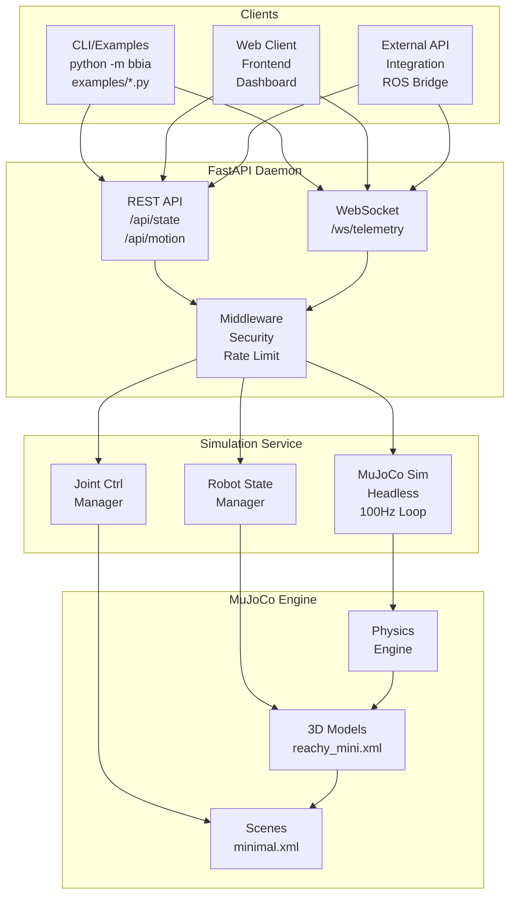
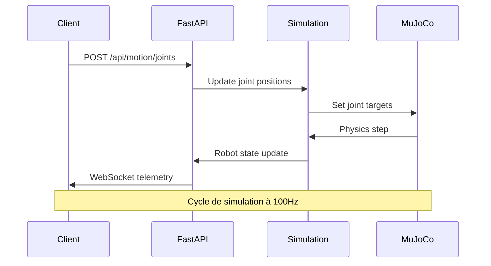
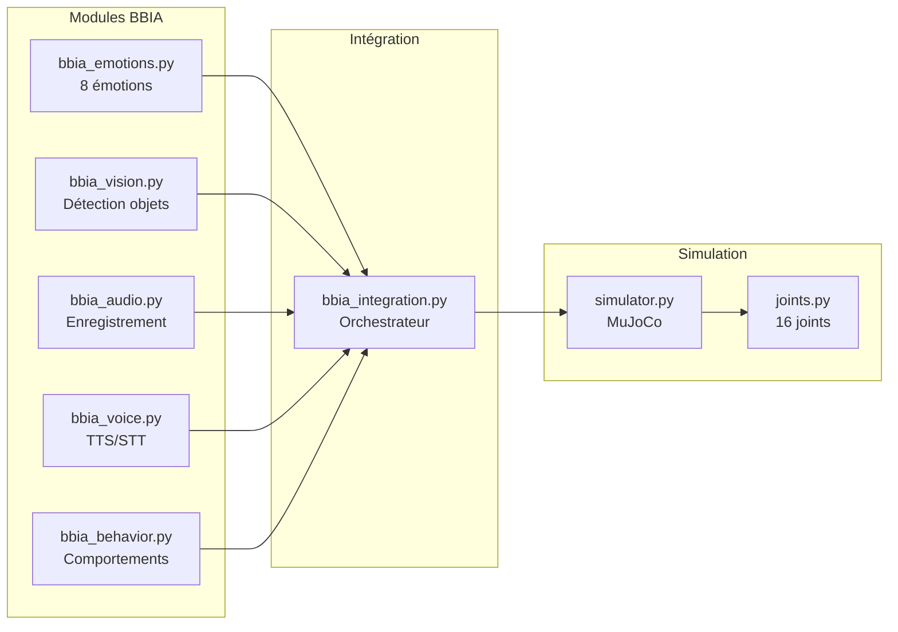
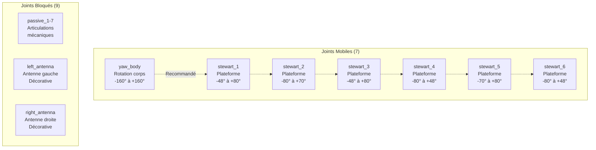

# Architecture BBIA-SIM

## Vue d'ensemble

BBIA-SIM est un système de simulation robotique modulaire avec API REST/WebSocket.

## Schéma d'architecture Mermaid



## Architecture détaillée

### 🎮 **Couche Client**
- **CLI/Examples** : Scripts Python pour tests et démonstrations
- **Web Client** : Interface web pour contrôle et monitoring
- **External API** : Intégrations tierces (ROS, etc.)

### 🌐 **Couche API**
- **REST API** : Endpoints HTTP pour contrôle du robot
- **WebSocket** : Communication temps réel pour télémétrie
- **Middleware** : Sécurité, rate limiting, authentification

### 🤖 **Couche Simulation**
- **MuJoCo Sim** : Moteur de simulation physique
- **Robot State** : Gestionnaire d'état du robot
- **Joint Control** : Contrôleur des articulations

### ⚙️ **Couche Physique**
- **Physics Engine** : Moteur physique MuJoCo
- **3D Models** : Modèles 3D du robot Reachy Mini
- **Scenes** : Environnements de simulation

## Flux de données



## Modules BBIA



## Joints du robot Reachy Mini


```
python -m bbia_sim --sim --headless
    ↓
MuJoCoSimulator.launch_simulation()
    ↓
MuJoCo Engine (100Hz loop)
```

### 2. API → Simulation
```
curl POST /api/motion/joints
    ↓
FastAPI Router (motion.py)
    ↓
SimulationService.set_joint_position()
    ↓
MuJoCo mj_step() + mj_forward()
```

### 3. WebSocket → Client
```
Client connects to /ws/telemetry
    ↓
ConnectionManager.broadcast()
    ↓
SimulationService.get_robot_state()
    ↓
JSON telemetry (10Hz)
```

## Composants principaux

### `src/bbia_sim/sim/`
- **`simulator.py`** : Interface MuJoCo, gestion viewer/headless
- **`models/reachy_mini.xml`** : Modèle 3D robot Reachy Mini
- **`scenes/minimal.xml`** : Scène de test simple

### `src/bbia_sim/daemon/`
- **`app/main.py`** : Application FastAPI principale
- **`config.py`** : Configuration centralisée (dev/prod)
- **`middleware.py`** : Sécurité, rate limiting, headers
- **`models.py`** : Validations Pydantic strictes
- **`simulation_service.py`** : Service de simulation asynchrone
- **`ws/telemetry.py`** : WebSocket télémétrie temps réel

### `examples/`
- **`hello_sim.py`** : Test simulation MuJoCo
- **`goto_pose.py`** : Contrôle mouvement via API
- **`subscribe_telemetry.py`** : Télémétrie WebSocket

## Configuration

### Variables d'environnement
```bash
BBIA_ENV=dev|prod          # Mode environnement
BBIA_TOKEN=secret          # Token authentification
BBIA_CORS_ORIGINS=*        # CORS (dev) ou domaines (prod)
BBIA_SIM_HEADLESS=true     # Mode simulation
BBIA_TELEMETRY_FREQUENCY=10 # Fréquence télémétrie Hz
```

### Sécurité
- **Dev** : CORS permissif, logs verbeux
- **Prod** : CORS restrictif, headers sécurité, rate limiting

## Performance

### Simulation
- **Fréquence** : 100Hz (configurable)
- **Mode** : Headless optimisé pour API
- **Mémoire** : Buffers réutilisés, pas d'allocations dans boucle

### API
- **REST** : < 50ms réponse typique
- **WebSocket** : 10Hz télémétrie stable
- **Rate limit** : 100 req/min (prod)

## Déploiement

### Développement
```bash
uvicorn src.bbia_sim.daemon.app.main:app --reload
```

### Production
```bash
BBIA_ENV=prod BBIA_TOKEN=secure uvicorn src.bbia_sim.daemon.app.main:app
```

### Docker (futur)
```dockerfile
FROM python:3.10-slim
COPY . /app
WORKDIR /app
RUN pip install -e ".[prod]"
CMD ["uvicorn", "src.bbia_sim.daemon.app.main:app"]
```
