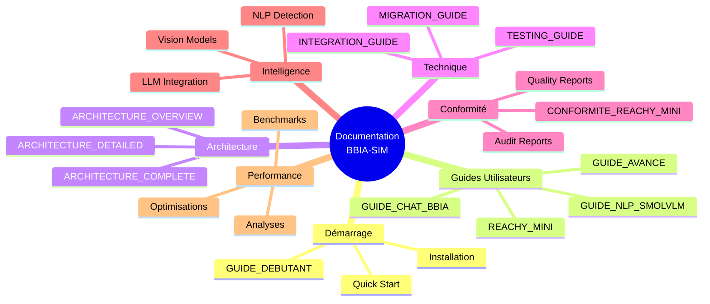
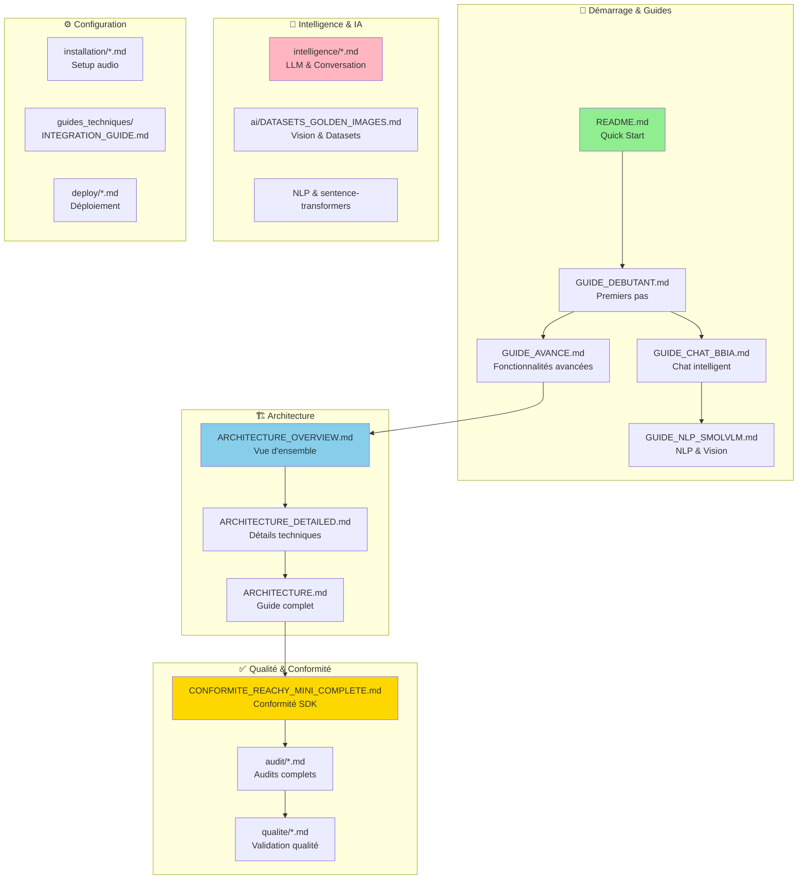

# 📚 INDEX DE LA DOCUMENTATION BBIA-SIM

> Compatibilité Python et CI
>
> - Python supporté: 3.11+
> - CI: `.github/workflows/ci.yml`
> - Setup rapide:
> ```bash
>   pyenv install 3.11.9 && pyenv local 3.11.9
>   python -m pip install --upgrade pip
>   pip install -e .
>   ```

**Version:** v1.3.2
**Dernière mise à jour:** Oct / No2025025025025025

---

## 🎯 DÉMARRAGE RAPIDE

- [README](../README.md) - Vue d'ensemble du projet
- [Guide Débutant](guides/GUIDE_DEBUTANT.md) - Commencer avec BBIA-SIM
- [Reachy Mini Guide](guides/REACHY_MINI_WIRELESS_COMPLETE_GUIDE.md) - Utiliser le robot physique

---

## 📚 DOCUMENTATION PAR CATÉGORIE

> **🤖 Guide Assistants IA :** Pour les assistants IA (Claude, GPT, Cursor, etc.), voir [`ASSISTANT_IA_GUIDE.md`](ASSISTANT_IA_GUIDE.md) - Scripts, conventions, tâches à poursuivre.

### 📖 Guides Utilisateurs
- [Guide Débutant](guides/GUIDE_DEBUTANT.md) - Installation et premiers pas
- [Guide Avancé](guides/GUIDE_AVANCE.md) - Fonctionnalités avancées
- [Guide Chat BBIA](guides/GUIDE_CHAT_BBIA.md) - Système de chat intelligent
- [Guide Reachy Mini Wireless](guides/REACHY_MINI_WIRELESS_COMPLETE_GUIDE.md) - Guide complet du robot
- [FAQ Troubleshooting](guides_techniques/FAQ_TROUBLESHOOTING.md)

### 🏗️ Architecture et Design
- [Architecture Vue d'Ensemble](architecture/ARCHITECTURE_OVERVIEW.md)
- [Architecture Détaillée](architecture/ARCHITECTURE_DETAILED.md)
- [Guide Architecture](architecture/ARCHITECTURE_OVERVIEW.md) (référence principale)
- [Index thématique (par profils)](references/INDEX_THEMATIQUE.md)

### ✅ Conformité et Qualité
- [Conformité Reachy-Mini Complète](conformite/CONFORMITE_REACHY_MINI_COMPLETE.md)
- [Rapports de Conformité](archives/conformite/) - Archives conformité
- [Validation Qualité](qualite/) - Rapports de validation
- [Résumés Validation](qualite/RESUME_VALIDATION_QUALITE_2025.md)
- [Pipeline CI/CD](ci/PIPELINE_CI.md)

### 🤖 Pour Assistants IA
- [Guide Assistants IA](ASSISTANT_IA_GUIDE.md) - Scripts, conventions, workflow pour assistants IA

### 🔧 Corrections et Améliorations
- [Corrections des démos Reachy](corrections/CORRECTIONS_DEMOS_REACHY.md)
- [Corrections appliquées](corrections/CORRECTIONS_APPLIQUEES.md)
- [Corrections modules non prioritaires](corrections/CORRECTIONS_MODULES_NON_PRIORITAIRES_2025.md)
- [Améliorations futures du SDK](ameliorations/AMELIORATIONS_FUTURES_SDK.md)

### 🎮 Mouvements et Contrôle
- [Mouvements Reachy Mini](mouvements/MOUVEMENTS_REACHY_MINI.md)
- [Guide Unity BBIA](unity/UNITY_BBIA_GUIDE.md)
- [Dépannage Unity](unity/UNITY_TROUBLESHOOTING.md)
- [Sécurité robot (DO/DON’T)](robot/SECURITE_ROBOT.md)

### ⚙️ Installation et Configuration
- [Installation Audio](installation/AUDIO_SETUP.md)
- [Configuration communautaire](references/COMMUNITY_CONFIG.md)
- [Guide d'intégration](guides_techniques/INTEGRATION_GUIDE.md)
- [Guide de migration](guides_techniques/MIGRATION_GUIDE.md)

### 🎯 Simulation
- [Simulation BBIA complète](simulations/SIMULATION_BBIA_COMPLETE.md)
- [Guide simulation MuJoCo](simulations/MUJOCO_SIMULATION_GUIDE.md)
- [Observabilité (logs/metrics/santé)](observabilite/OBSERVABILITE.md)

### 🧪 Tests et Qualité
- [Guide de test](guides_techniques/TESTING_GUIDE.md)
- [Organisation des tests d'intelligence](organisation/ORGANISATION_TESTS_INTELLIGENCE.md)
- [Rapports d'audit](audit/) - Tous les audits

### 🤖 Intelligence et IA
- [Améliorations intelligence BBIA](intelligence/AMELIORATIONS_INTELLIGENCE_BBIA_2025.md)
- [Intelligence conversationnelle LLM](intelligence/INTELLIGENCE_CONVERSATIONNELLE_LLM.md)
- [Analyse voix et intelligence](intelligence/ANALYSE_VOIX_ET_INTELLIGENCE_BBIA.md)
- [Datasets & Golden Images](ai/DATASETS_GOLDEN_IMAGES.md)

### 📊 Analyses et Rapports
- [Analyses de modules](analyses/ANALYSE_MODULES_NON_PRIORITAIRES_2025.md)
- [Résumés d'analyses](analyses/RESUME_ANALYSE_EXPERT_FINALE_2025.md)
- [Analyse code Unity AR](analyses/ANALYSE_CODE_UNITY_AR.md)
- [Contrats REST/WS](api/CONTRATS_REST_WS.md)
- [Roadmap Dashboard/UX](dashboard/ROADMAP_DASHBOARD.md)

### ⚡ Performance
- [Optimisations expert Reachy Mini](performance/OPTIMISATIONS_EXPERT_REACHY_MINI.md)
- [Optimisations expert robotique](performance/OPTIMISATIONS_EXPERT_ROBOTIQUE_2025.md)
- [Résumé performance](performance/RESUME_PERFORMANCE_CORRECTIONS_2025.md)

### 🤖 Reachy et Robotique
- [Prêt Reachy A4](reachy/PRET_REACHY_A4.md)
- [Reachy updates log](reachy/REACHY_UPDATES_LOG.md)

### 📋 Références et statuts
- [Statut du projet](references/STATUT_PROJET.md)
- [Historique du projet](references/PROJECT_HISTORY.md)
- [Release notes](references/RELEASE_NOTES.md)
- [Contrat](references/CONTRACT.md)
- [Gestion des processus](organisation/PROCESS_MANAGEMENT.md)

### 📱 Présentation
- [Portfolio one-pager](presentation/PORTFOLIO_ONEPAGER.md)

---

## 🔍 Archives

### Oct / No2025025025025025
- [Résumé final - Oct / No2025025025025022025rchives/2025-10/resumes/RESUME_FINAL_ULTIME_OCTOBRE_2025.md)
- [Résumés détaillés](archives/2025-10/resumes/)
- [Corrections et améliorations](archives/2025-10/)
- [Rapports d'audit](archives/audits/)

Voir le dossier `archives/` pour les rapports détaillés historiques.

---

## 🗺️ Navigation rapide

### Par Rôle

**Chef de projet**
- [Statut du projet](references/STATUT_PROJET.md)
- [Release notes](references/RELEASE_NOTES.md)
- [Historique](references/PROJECT_HISTORY.md)
- [Gestion des processus](organisation/PROCESS_MANAGEMENT.md)

**Développeur**
- [Guide avancé](guides/GUIDE_AVANCE.md)
- [Architecture](architecture/ARCHITECTURE_OVERVIEW.md)
- [Guide de test](guides_techniques/TESTING_GUIDE.md)
- [Guide d'intégration](guides_techniques/INTEGRATION_GUIDE.md)

**Utilisateur robotique**
- [Guide Reachy Mini](guides/REACHY_MINI_WIRELESS_COMPLETE_GUIDE.md)
- [Mouvements](mouvements/MOUVEMENTS_REACHY_MINI.md)
- [Conformité](conformite/CONFORMITE_REACHY_MINI_COMPLETE.md)
- [Simulation MuJoCo](simulations/MUJOCO_SIMULATION_GUIDE.md)

**QA / Tests**
- [Guide de test](guides_techniques/TESTING_GUIDE.md)
- [Rapports d'audit](audit/)
- [Corrections](corrections/)
- [Validation qualité](qualite/)

---

## 📁 Structure des documents

### Navigation Visuelle de la Documentation



### Structure Détaillée par Catégorie



**Organisation détaillée :**
```
docs/
├── guides/              # Guides utilisateurs
├── architecture/         # Documentation architecture
├── conformite/          # Conformité SDK
├── corrections/         # Corrections appliquées
├── qualite/            # Validation qualité
├── analyses/            # Analyses du projet
├── ameliorations/       # Améliorations futures
├── mouvements/          # Mouvements robot
├── reachy/              # Documentation Reachy
├── organisation/        # Organisation projets
├── presentation/        # Présentations
├── references/          # Références (statut, historique, etc.)
├── audit/              # Audits
├── guides_techniques/  # Guides techniques
├── installation/        # Guides d'installation
├── intelligence/        # Documentation IA
├── performance/         # Optimisations performance
├── simulations/         # Simulation
├── unity/              # Unity et AR
└── archives/           # Archives historiques
```

---

## ✅ Points clés (fonctionnel actuel)

- Backends: MuJoCo (simulation), Reachy-Mini (SDK)
- Behaviors: `wake_up`, `goto_sleep`, `nod`
- Sécurité: watchdog + `emergency_stop` (conforme)
- Audio: STT/TTS opérationnels (SDK-first + fallback)
- Vision: YOLO/MediaPipe (SDK-first + fallback)
- Télémétrie: SDK-first batterie/IMU avec fallback simulation (non bloquant)

### Flags utiles

```bash
# Simulation/headless (désactive audio matériel)
export BBIA_DISABLE_AUDIO=1

# Télémétrie SDK-first (avec robot, non bloquant si absent)
export BBIA_TELEMETRY_SDK=true
export BBIA_TELEMETRY_TIMEOUT=1.0
```

---

## 🆘 BESOIN D'AIDE ?

1. **Nouveau sur le projet ?** → [Guide Débutant](guides/GUIDE_DEBUTANT.md)
2. **Installer le projet ?** → [Installation Audio](installation/AUDIO_SETUP.md)
3. **Utiliser le robot ?** → [Guide Reachy Mini](guides/REACHY_MINI_WIRELESS_COMPLETE_GUIDE.md)
4. **Développer ?** → [Guide Avancé](guides/GUIDE_AVANCE.md)
5. **Tester ?** → [Guide de Test](guides_techniques/TESTING_GUIDE.md)

---

**Note :** ce fichier est l'index principal de la documentation. Tous les documents sont organisés dans des sous-dossiers par catégorie.
