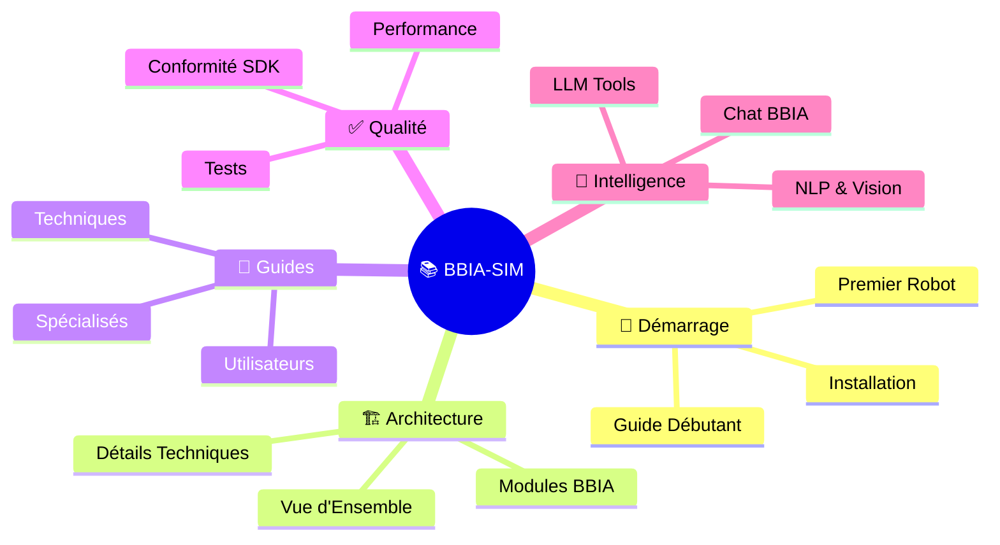
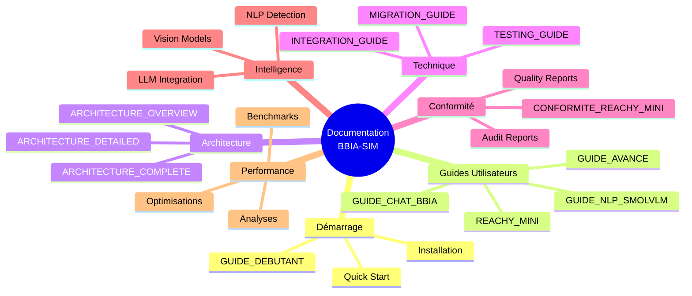
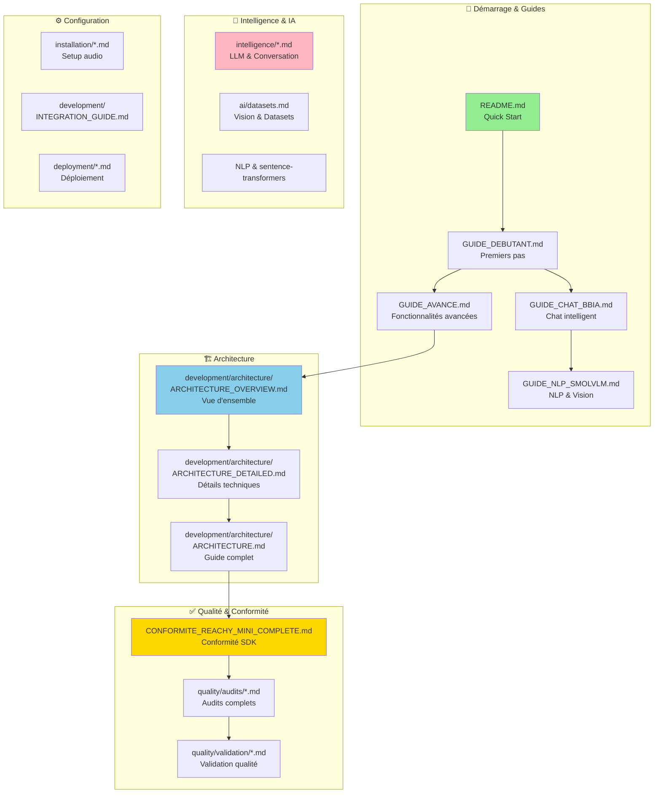

# 📚 INDEX DE LA DOCUMENTATION BBIA-SIM

<div align="center">

**🎯 Documentation complète du moteur cognitif BBIA-SIM**
* Organisée par catégorie • Navigation intuitive • Contenu exhaustif*

</div>

---

## ⚡ Démarrage Rapide

> **🚀 Prêt à commencer ?**

| Action | Commande | Temps |
|--------|----------|-------|
| **Installation** | `pip install -e .[dev]` | ~2 min |
| **Dashboard** | `python src/bbia_sim/dashboard_advanced.py` | Instant |
| **Premier robot** | Voir [Guide Débutant](guides/GUIDE_DEBUTANT.md) | 5 min |

### Configuration Requise

```bash
# Python 3.11+ requis
pyenv install 3.11.9 && pyenv local 3.11.9
python -m pip install --upgrade pip
pip install -e .
```

> **📊 CI/CD** : `.github/workflows/ci.yml` • **Version** : v1.3.2 • **Date** : Oct / Nov. 2025

---

## 🎯 Navigation Visuelle



---

## 🎯 Points d'Entrée Principaux

<div align="center">

| Document | Description | ⏱️ Temps |
|:--------:|-------------|:--------:|
| **[README](../README.md)** | Vue d'ensemble complète | 2 min |
| **[Guide Débutant](guides/GUIDE_DEBUTANT.md)** | Premiers pas en 5 minutes | 5 min |
| **[Reachy Mini Guide](guides/REACHY_MINI_WIRELESS_COMPLETE_GUIDE.md)** | Guide robot physique | 10 min |

</div>

---

## 📚 DOCUMENTATION PAR CATÉGORIE

> **🤖 Guide Assistants IA :** Pour les assistants IA (Claude, GPT, Cursor, etc.), voir [`assistant-ia-guide.md`](development/assistant-ia-guide.md) - Scripts, conventions, tâches à poursuivre.

### 📖 Guides Utilisateurs
- [Guide Débutant](guides/GUIDE_DEBUTANT.md) - Installation et premiers pas
- [Guide Avancé](guides/GUIDE_AVANCE.md) - Fonctionnalités avancées
- [Guide Chat BBIA](guides/GUIDE_CHAT_BBIA.md) - Système de chat intelligent
- [Guide Reachy Mini Wireless](guides/REACHY_MINI_WIRELESS_COMPLETE_GUIDE.md) - Guide complet du robot
- [FAQ Troubleshooting](development/troubleshooting.md)

### 🏗️ Architecture et Design
- [Architecture Vue d'Ensemble](development/architecture/ARCHITECTURE_OVERVIEW.md)
- [Architecture Détaillée](development/architecture/ARCHITECTURE_DETAILED.md)
- [Guide Architecture](development/architecture/ARCHITECTURE.md) (référence principale)
- [Index thématique (par profils)](reference/INDEX_THEMATIQUE.md)

### ✅ Conformité et Qualité
- [Conformité Reachy-Mini Complète](quality/compliance/CONFORMITE_REACHY_MINI_COMPLETE.md)
- [Conformité Complète](quality/compliance/CONFORMITE_REACHY_MINI_COMPLETE.md) - Conformité SDK (archives référencées dans le fichier)
- [Validation Qualité](quality/validation/VALIDATION_FINALE_QUALITE_2025.md) - Rapports de validation
- [Pipeline CI/CD](deployment/PIPELINE_CI.md)

### 📊 Documentation et Rapports
- [Bilan Final Documentation](archive/nettoyage-2025/BILAN_FINAL_DOCUMENTATION.md) - Résumé complet du nettoyage (archivé)
- [Résumé Corrections Finales](archive/nettoyage-2025/RESUME_CORRECTIONS_FINALES.md) - Liste des corrections appliquées (archivé)
- [Statut Nettoyage Final](archive/nettoyage-2025/STATUT_NETTOYAGE_FINAL.md) - Statut final du nettoyage (archivé)
- [Rapport Nettoyage Final](archive/nettoyage-2025/RAPPORT_NETTOYAGE_FINAL.md) - Rapport détaillé du nettoyage (archivé)
- [Tâches Restantes](archive/tasks/A_FAIRE_RESTANT.md) - Tâches optionnelles restantes (archivé)
- [Tâches Restantes Oct / Nov. 2025](archive/audits_termines/TACHES_RESTANTES_NOV2025.md) - ✅ **ARCHIVÉ** (toutes tâches terminées)

### 🤖 Pour Assistants IA
- [Guide Assistants IA](development/assistant-ia-guide.md) - Scripts, conventions, workflow pour assistants IA

### 🔧 Corrections et Améliorations
- [Corrections Appliquées](quality/corrections/applied.md) - Corrections démos et modules
- [Améliorations Futures SDK](quality/improvements/sdk-future.md) - Features SDK avancées
- [Améliorations Intelligence BBIA](quality/improvements/intelligence-bbia.md) - Intelligence conversationnelle
- [Améliorations Intelligence Contexte](quality/improvements/intelligence-context.md) - Intelligence contextuelle
- [Analyse Améliorations Gratuites](quality/improvements/free-improvements.md) - Solutions gratuites

### 🎮 Mouvements et Contrôle
- [Mouvements Reachy Mini](hardware/MOUVEMENTS_REACHY_MINI.md)
- [Guide Unity BBIA](unity/UNITY_BBIA_GUIDE.md)
- [Dépannage Unity](unity/UNITY_TROUBLESHOOTING.md)
- [Sécurité robot (DO/DON'T)](hardware/SECURITE_ROBOT.md)

### ⚙️ Installation et Configuration
- [Installation Audio](installation/AUDIO_SETUP.md)
- [Configuration communautaire](reference/COMMUNITY_CONFIG.md)
- [Guide d'intégration](development/integration.md)
- [Guide de migration](development/migration.md)
- [Setup Guides](development/setup/) - Configuration (environments, deepface, webcam, etc.)

### 🎯 Simulation
- [Simulation BBIA complète](simulations/SIMULATION_BBIA_COMPLETE.md)
- [Guide simulation MuJoCo](simulations/MUJOCO_SIMULATION_GUIDE.md)
- [Observabilité (logs/metrics/santé)](observabilite/OBSERVABILITE.md)

### 🧪 Tests et Qualité
- [Guide de test](development/testing.md)
- [Organisation des tests d'intelligence](organisation/ORGANISATION_TESTS_INTELLIGENCE.md)
- [Rapports d'audit](quality/audits/README.md) - Tous les audits

### 🤖 Intelligence et IA
- [Modules IA](ai/modules.md) - Audit modules pré-entraînés
- [Datasets & Golden Images](ai/datasets.md)
- [Intelligence conversationnelle LLM](ai/llm.md)
- [Analyse voix et intelligence](ai/voice.md)

### 📊 Analyses et Rapports
- [Analyse Modules Non Prioritaires](quality/analyses/modules-non-prioritaires.md) - Analyse modules et conformité SDK
- [Analyse Coverage Détails](quality/analyses/coverage-details.md) - Analyse détaillée code coverage
- [Analyse Code Unity AR](quality/analyses/unity-ar.md) - Évaluation pertinence Unity AR
- [Contrats REST/WS](development/api/CONTRATS_REST_WS.md)
- [Roadmap Dashboard/UX](dashboard/ROADMAP_DASHBOARD.md)

### ⚡ Performance
- [Optimisations expert Reachy Mini](quality/quality/performance/OPTIMISATIONS_EXPERT_REACHY_MINI.md)
- [Optimisations expert robotique](quality/quality/performance/OPTIMISATIONS_EXPERT_ROBOTIQUE_2025.md)
- [Résumé performance](quality/quality/performance/RESUME_PERFORMANCE_CORRECTIONS_2025.md)

### 🤖 Reachy et Robotique
- [Prêt Reachy A4](hardware/reachy-mini/PRET_REACHY_A4.md)
- [Reachy updates log](hardware/reachy-mini/REACHY_UPDATES_LOG.md)

### 📋 Références et statuts
- [Statut du projet](reference/STATUT_PROJET.md)
- [Historique du projet](reference/PROJECT_HISTORY.md)
- [Release notes](reference/RELEASE_NOTES.md)
- [Contrat](reference/CONTRACT.md)
- [Gestion des processus](organisation/PROCESS_MANAGEMENT.md)

### 📱 Présentation
- [Portfolio one-pager](presentation/PORTFOLIO_ONEPAGER.md)

---

## 🔍 Archives

### Oct / Nov. 2025
- [Résumé Final Ultime](reference/summaries/final-summary.md) - Résumé complet du projet
- [Archives Nettoyage](archive/nettoyage-2025/README.md) - Documents nettoyage
- [Index Audits](quality/audits/INDEX_AUDITS_CONSOLIDES.md) - Tous les audits (historiques inclus)
- [Tâches Archivées](archive/tasks/README.md) - Tâches archivées

Voir le dossier `archive/` pour les rapports détaillés historiques.

---

## 🗺️ Navigation rapide

### Par Rôle

**Chef de projet**
- [Statut du projet](reference/STATUT_PROJET.md)
- [Release notes](reference/RELEASE_NOTES.md)
- [Historique](reference/PROJECT_HISTORY.md)
- [Gestion des processus](organisation/PROCESS_MANAGEMENT.md)

**Développeur**
- [Guide avancé](guides/GUIDE_AVANCE.md)
- [Architecture](development/architecture/ARCHITECTURE_OVERVIEW.md)
- [Guide de test](development/testing.md)
- [Guide d'intégration](development/integration.md)

**Utilisateur robotique**
- [Guide Reachy Mini](guides/REACHY_MINI_WIRELESS_COMPLETE_GUIDE.md)
- [Mouvements](hardware/MOUVEMENTS_REACHY_MINI.md)
- [Conformité](quality/compliance/CONFORMITE_REACHY_MINI_COMPLETE.md)
- [Simulation MuJoCo](simulations/MUJOCO_SIMULATION_GUIDE.md)

**QA / Tests**
- [Guide de test](development/testing.md)
- [Index Audits](quality/audits/INDEX_AUDITS_CONSOLIDES.md) - Tous les audits
- [Corrections Appliquées](quality/corrections/applied.md) - Corrections
- [Validation Qualité](quality/validation/VALIDATION_FINALE_QUALITE_2025.md) - Validation qualité

---

## 📁 Structure des documents

### Navigation Visuelle de la Documentation



### Structure Détaillée par Catégorie



**Organisation détaillée :**
```
docs/
├── getting-started/     # 🚀 Démarrage rapide
├── guides/              # 📖 Guides utilisateurs
├── development/         # 💻 Développement (architecture, API, guides techniques)
│   ├── development/architecture/
│   └── development/api/
├── deployment/          # 🚀 Déploiement (CI/CD, Render)
├── hardware/           # 🤖 Hardware & robotique (Reachy Mini, mouvements)
│   └── reachy-mini/
├── intelligence/        # 🧠 Intelligence artificielle
├── quality/            # ✅ Qualité & conformité (compliance, audits, validation)
│   ├── compliance/
│   ├── audits/
│   └── validation/
├── performance/         # ⚡ Performance
├── reference/          # 📚 Références (statut, historique, releases)
├── archive/            # 📦 Archives (nettoyage, tâches, historique)
└── (autres dossiers spécifiques)
```

---

## ✅ Points clés (fonctionnel actuel)

- Backends: MuJoCo (simulation), Reachy-Mini (SDK)
- Behaviors: `wake_up`, `goto_sleep`, `nod`
- Sécurité: watchdog + `emergency_stop` (conforme)
- Audio: STT/TTS opérationnels (SDK-first + fallback)
- Vision: YOLO/MediaPipe (SDK-first + fallback)
- Télémétrie: SDK-first batterie/IMU avec fallback simulation (non bloquant)

### Flags utiles

```bash
# Simulation/headless (désactive audio matériel)
export BBIA_DISABLE_AUDIO=1

# Télémétrie SDK-first (avec robot, non bloquant si absent)
export BBIA_TELEMETRY_SDK=true
export BBIA_TELEMETRY_TIMEOUT=1.0
```

---

## 🆘 BESOIN D'AIDE ?

1. **Nouveau sur le projet ?** → [Guide Débutant](guides/GUIDE_DEBUTANT.md)
2. **Installer le projet ?** → [Installation Audio](installation/AUDIO_SETUP.md)
3. **Utiliser le robot ?** → [Guide Reachy Mini](guides/REACHY_MINI_WIRELESS_COMPLETE_GUIDE.md)
4. **Développer ?** → [Guide Avancé](guides/GUIDE_AVANCE.md)
5. **Tester ?** → [Guide de Test](development/testing.md)

---

**Note :** ce fichier est l'index principal de la documentation. Tous les documents sont organisés dans des sous-dossiers par catégorie.
