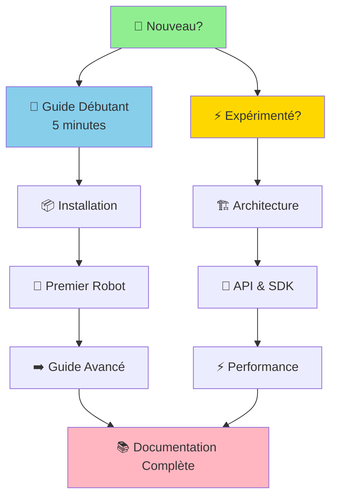

# 📚 Documentation BBIA-SIM — Navigation Rapide

> **Moteur cognitif Python pour robot Reachy Mini**
> *Simulation fidèle • IA avancée • SDK 100% conforme*

---

## 🎯 Parcours Recommandé

---

## 📊 Statut et Suivi

> **📈 Vue d'ensemble du projet**
> État par axe : Observabilité, Performance, Sécurité, CI/CD, Packaging, API/SDK, Robot, UX, IA, Docs, Qualité, Communauté

👉 **[project-status.md](reference/project-status.md)** — Tableau de bord complet du projet

---

## 🏗️ Architecture & Design

> **Structure technique du projet**

### Documents Principaux

| Document | Description | Niveau |
|----------|-------------|--------|
| [ARCHITECTURE_OVERVIEW.md](development/architecture/ARCHITECTURE_OVERVIEW.md) | Vue d'ensemble (v1.3.2) | 🟢 Débutant |
| [ARCHITECTURE.md](development/architecture/ARCHITECTURE.md) | Guide architecture | 🟡 Intermédiaire |
| [ARCHITECTURE_DETAILED.md](development/architecture/ARCHITECTURE_DETAILED.md) | Détails techniques | 🔴 Avancé |

---

## 📖 Guides Utilisateurs

> **Apprendre à utiliser BBIA-SIM**

### Par Niveau

- 🟢 **[Guide Débutant](guides/GUIDE_DEBUTANT.md)** — Installation et premiers pas en 5 minutes
- 🟡 **[Guide Avancé](guides/GUIDE_AVANCE.md)** — Fonctionnalités avancées et architecture
- 🔴 **[Guides Techniques](development/)** — Intégration, tests, migration

### Par Sujet

- 🤖 **[Reachy Mini Wireless](guides/REACHY_MINI_WIRELESS_COMPLETE_GUIDE.md)** — Guide complet du robot physique
- 💬 **[Chat BBIA](guides/GUIDE_CHAT_BBIA.md)** — Système de chat intelligent
- 🧠 **[NLP & SmolVLM2](guides/GUIDE_NLP_SMOLVLM.md)** — Intelligence artificielle

---

## 📦 Références & Historique

> **Version et historique du projet**

- 📝 **[RELEASE_NOTES.md](reference/RELEASE_NOTES.md)** — Notes de version
- 📚 **[PROJECT_HISTORY.md](reference/PROJECT_HISTORY.md)** — Historique du projet
- 🔄 **[CHANGELOG.md](../CHANGELOG.md)** — Journal des modifications

---

## ✅ Conformité & Qualité

> **Vérification et validation**

### Conformité SDK

- ✅ **[Conformité Complète](quality/compliance/CONFORMITE_REACHY_MINI_COMPLETE.md)** — Validation SDK officiel
- 🔍 **[Audit Synthèse](quality/audits/INDEX_AUDITS_CONSOLIDES.md)** — Audits consolidés

### Qualité Code

- 🎯 **[Performance](performance/RESUME_PERFORMANCE_CORRECTIONS_2025.md)** — Optimisations appliquées
- ✅ **[Validation Qualité](quality/validation/VALIDATION_FINALE_QUALITE_2025.md)** — Rapports de validation

---

## 📁 Navigation Complète

👉 **[INDEX_FINAL.md](INDEX_FINAL.md)** — Index complet de toute la documentation avec navigation thématique
👉 **[index.md](index.md)** — Index consolidé avec parcours recommandé

### 📊 Rapports et Bilans (Archivés)
- **[Bilan Final Documentation](archive/nettoyage-2025/BILAN_FINAL_DOCUMENTATION.md)** — Résumé complet du nettoyage documentation (archivé)
- **[Résumé Corrections Finales](archive/nettoyage-2025/RESUME_CORRECTIONS_FINALES.md)** — Liste des corrections appliquées (archivé)
- **[Tâches Restantes](archive/tasks/A_FAIRE_RESTANT.md)** — Tâches optionnelles restantes (archivé)

---

## 📚 Archives

> **Documents historiques et terminés**

👉 **[archive/README.md](archive/README.md)** — Index des archives (liens vers fichiers "final")

---

**💡 Besoin d'aide ?** Consultez le [Guide Débutant](guides/GUIDE_DEBUTANT.md) ou le [Troubleshooting](getting-started/troubleshooting.md)

