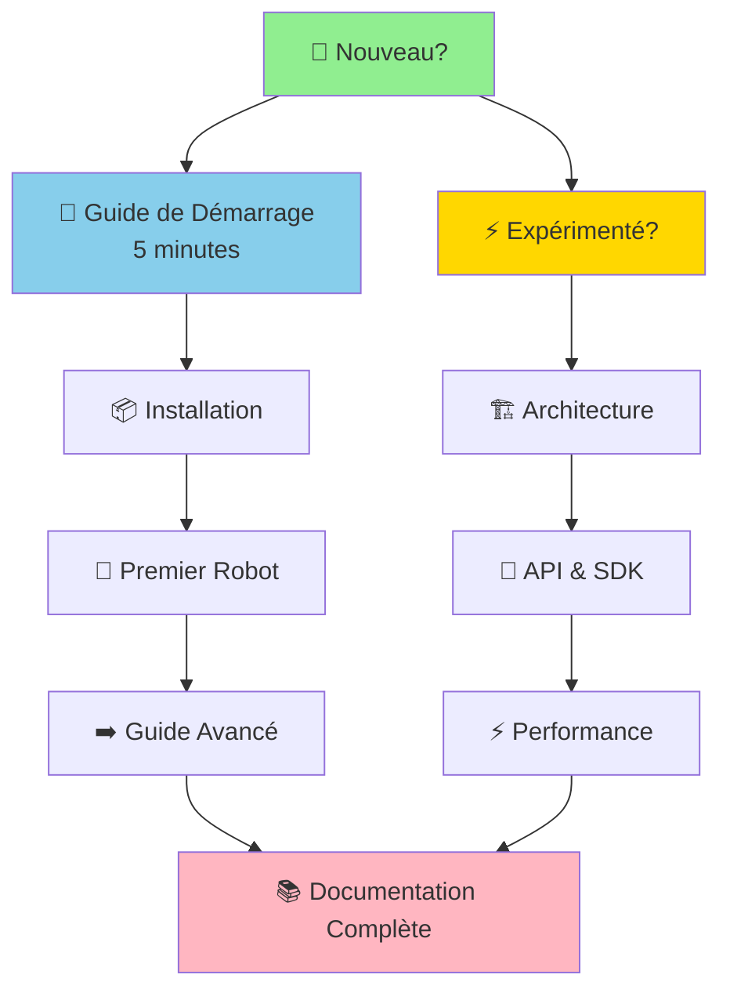

# 📚 Documentation BBIA-SIM — Navigation Rapide

**Date** : 26 Novembre 2025  
**Version** : v1.4.0

> **Moteur cognitif Python pour robot Reachy Mini**
> *Simulation fidèle • IA avancée • SDK 100% conforme*

---

## 🚀 Nouveau sur le projet ? Commencez ici !

> **⭐ POINT DE DÉPART RECOMMANDÉ** : Commencez par le **[Guide de Démarrage](guides/GUIDE_DEMARRAGE.md)** — Installation et premiers pas en 5 minutes

---

## 🎯 Parcours Recommandé

---

## 📊 Statut et Suivi

> **📈 Vue d'ensemble du projet**

| Document | Description | Public |
|----------|-------------|--------|
| **[project-status.md](reference/project-status.md)** | Tableau de bord complet par axe | Tous |

---

## 🏗️ Architecture & Design

> **Structure technique du projet**

### Documents Principaux

| Document | Description | Niveau |
|----------|-------------|--------|
| [ARCHITECTURE_OVERVIEW.md](development/architecture/ARCHITECTURE_OVERVIEW.md) | Vue d'ensemble (v1.4.0) | 🟢 Accessible |
| [ARCHITECTURE.md](development/architecture/ARCHITECTURE.md) | Guide architecture | 🟡 Intermédiaire |
| [ARCHITECTURE_DETAILED.md](development/architecture/ARCHITECTURE_DETAILED.md) | Détails techniques | 🔴 Avancé |

---

## 📖 Guides Utilisateurs

> **Apprendre à utiliser BBIA-SIM**

### Par Niveau

- 🟢 **[Guide de Démarrage](guides/GUIDE_DEMARRAGE.md)** — Installation et premiers pas en 5 minutes
- 🟡 **[Guide Avancé](guides/GUIDE_AVANCE.md)** — Fonctionnalités avancées et architecture
- 🔴 **[Guides Techniques](development/)** — Intégration, tests, migration

### Par Sujet

- 🤖 **[Reachy Mini Wireless](guides/REACHY_MINI_WIRELESS_COMPLETE_GUIDE.md)** — Guide complet du robot physique
- 💬 **[Chat BBIA](guides/GUIDE_CHAT_BBIA.md)** — Système de chat intelligent
- 🧠 **[NLP & SmolVLM2](guides/GUIDE_NLP_SMOLVLM.md)** — Intelligence artificielle

---

## 📦 Références & Historique

> **Version et historique du projet**

- 📝 **[RELEASE_NOTES.md](reference/RELEASE_NOTES.md)** — Notes de version
- 📚 **[PROJECT_HISTORY.md](reference/PROJECT_HISTORY.md)** — Historique du projet
- 🔄 **[CHANGELOG.md](../CHANGELOG.md)** — Journal des modifications

---

## ✅ Conformité & Qualité

> **Vérification et validation**

### Conformité SDK

- ✅ **[Conformité Complète](quality/compliance/CONFORMITE_REACHY_MINI_COMPLETE.md)** — Validation SDK officiel
- 🔍 **[Audit Synthèse](quality/audits/INDEX_AUDITS_CONSOLIDES.md)** — Audits consolidés

### Qualité Code

- 🎯 **[Performance](quality/performance/RESUME_PERFORMANCE_CORRECTIONS_2025.md)** — Optimisations appliquées
- ✅ **[Validation Qualité](quality/validation/VALIDATION_FINALE_QUALITE_2025.md)** — Rapports de validation

---

## 📁 Navigation Complète

- **[Guide de Navigation](getting-started/NAVIGATION.md)** — Guide simple pour trouver rapidement ce dont vous avez besoin
- **[INDEX_FINAL.md](INDEX_FINAL.md)** — Index complet avec navigation par profil et catégorie

---

**💡 Besoin d'aide ?** Consultez le [Guide de Démarrage](guides/GUIDE_DEMARRAGE.md) ou le [Troubleshooting](getting-started/troubleshooting.md)

