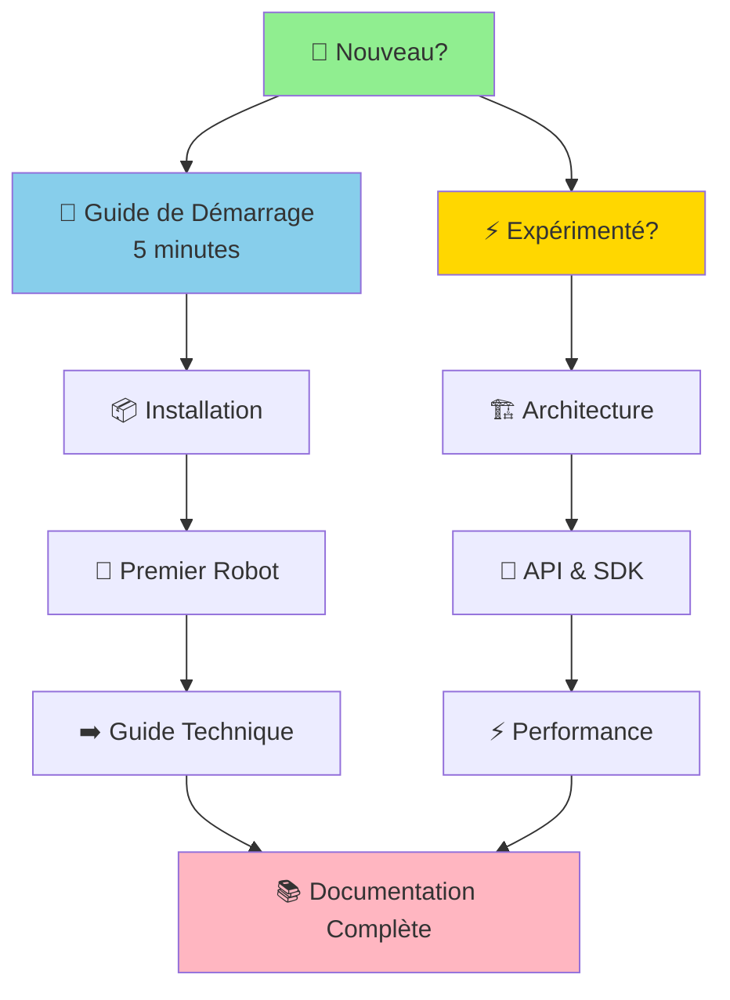

# 📚 Documentation BBIA-SIM — Navigation Rapide

**Dernière mise à jour :** 26 Janvier 2026  
**Version** : v1.4.0  
**Statut Robot** : ✅ Reçu le 18 déc 2025, monté le 20 déc 2025. **Installation moteurs 1, 2, 4 effectuée** (slots 1 et 2 = QC 2549, slot 4 = QC 2548). En attente de premier rallumage et validation.  
**SDK Reachy Mini** : Version installée 1.2.3 (dernière version officielle : v1.3.0 - 5 février 2026)  
**Nouvelles fonctionnalités v1.2.13/v1.3.0** : ✅ Outils calibration caméra, reflash Pi macOS ; v1.3.0 : HF auth dashboard, WebRTC, SDK simplifié (remote → app)

> **Moteur cognitif Python pour robot Reachy Mini**
> *Simulation • IA • SDK conforme*

---

## 🚀 Nouveau sur le projet ? Commencez ici

> **⭐ POINT DE DÉPART RECOMMANDÉ** : Commencez par le **[Guide de Démarrage](guides/GUIDE_DEMARRAGE.md)** — Installation et premiers pas en 5 minutes

---

## 🎯 Parcours Recommandé

```mermaid
flowchart TB
    START[🚀 Nouveau?] --> DEBUT[📖 Guide de Démarrage<br/>5 minutes]
    START --> AVANCE[⚡ Expérimenté?]

    DEBUT --> INSTALL[📦 Installation]
    INSTALL --> FIRST[🤖 Premier Robot]
    FIRST --> GUIDE[➡️ Guide Technique]

    AVANCE --> ARCH[🏗️ Architecture]
    ARCH --> API[🔌 API & SDK]
    API --> PERF[⚡ Performance]

    GUIDE --> NEXT[📚 Documentation Complète]
    PERF --> NEXT

    style START fill:#90EE90
    style DEBUT fill:#87CEEB
    style AVANCE fill:#FFD700
    style NEXT fill:#FFB6C1

```

---

## 📊 Statut et Suivi

> **📈 Vue d'ensemble du projet**

| Document | Description | Public |
|----------|-------------|--------|
| **[project-status.md](reference/project-status.md)** | Tableau de bord complet par axe | Tous |

---

## 🏗️ Architecture & Design

> **Structure technique du projet**

### Documents Principaux

| Document | Description | Niveau |
|----------|-------------|--------|
| [ARCHITECTURE_OVERVIEW.md](development/architecture/ARCHITECTURE_OVERVIEW.md) | Vue d'ensemble (v1.4.0) | 🟢 Accessible |
| [ARCHITECTURE.md](development/architecture/ARCHITECTURE.md) | Guide architecture | 🟡 Intermédiaire |
| [ARCHITECTURE_DETAILED.md](development/architecture/ARCHITECTURE_DETAILED.md) | Détails techniques | 🔴 Avancé |

---

## 📖 Guides Utilisateurs

> **Apprendre à utiliser BBIA-SIM**

### Par Niveau

- 🟢 **[Guide de Démarrage](guides/GUIDE_DEMARRAGE.md)** — Installation et premiers pas en 5 minutes
- 🟡 **[Guide Technique](guides/GUIDE_AVANCE.md)** — Fonctionnalités techniques et architecture
- 🔴 **[Guides Techniques](development/)** — Intégration, tests, migration

### Par Sujet

- 🤖 **[Reachy Mini Wireless](guides/REACHY_MINI_WIRELESS_COMPLETE_GUIDE.md)** — Guide complet du robot physique
- 💬 **[Chat BBIA](guides/GUIDE_CHAT_BBIA.md)** — Système de chat
- 🧠 **[NLP & SmolVLM2](guides/GUIDE_NLP_SMOLVLM.md)** — Intelligence artificielle

---

## 📦 Références & Historique

> **Version et historique du projet**

- 📝 **[RELEASE_NOTES.md](reference/RELEASE_NOTES.md)** — Notes de version
- 📚 **[PROJECT_HISTORY.md](reference/PROJECT_HISTORY.md)** — Historique du projet
- 🔄 **[CHANGELOG.md](../CHANGELOG.md)** — Journal des modifications

---

## ✅ Conformité & Qualité

> **Vérification et validation**

### Conformité SDK

- ✅ **[Conformité Complète](quality/compliance/CONFORMITE_REACHY_MINI_COMPLETE.md)** — Validation SDK officiel
- 🔍 **[Audit Synthèse](quality/INDEX_AUDITS.md)** — Audits consolidés

### Qualité Code

- 🎯 **[Performance](quality/performance/RESUME_PERFORMANCE_CORRECTIONS_2025.md)** — Optimisations appliquées
- ✅ **[Audit Consolidé](quality/AUDIT_CONSOLIDE_DECEMBRE_2025.md)** — Rapports consolidés

---

## 📁 Navigation Complète

- **[Guide de Navigation](getting-started/NAVIGATION.md)** — Guide pour trouver rapidement ce dont vous avez besoin
- **[INDEX_FINAL.md](INDEX_FINAL.md)** — Index complet avec navigation par profil et catégorie

---

## 📋 Organisation de la Documentation

La documentation a été réorganisée le **26 Janvier 2026** :

- ✅ **Structure clarifiée** : Tous les dossiers principaux ont un README
- ✅ **Fichiers obsolètes archivés** : Voir `docs/_archive/obsoletes_jan2026/`
- ✅ **Doublons supprimés** : Fichiers redondants fusionnés ou archivés
- ✅ **Dossiers vides supprimés** : `rapports/`, `semaines/`

---

**💡 Besoin d'aide ?** Consultez le [Guide de Démarrage](guides/GUIDE_DEMARRAGE.md) ou le [Troubleshooting](getting-started/troubleshooting.md)

**Dernière mise à jour** : 26 Janvier 2026
