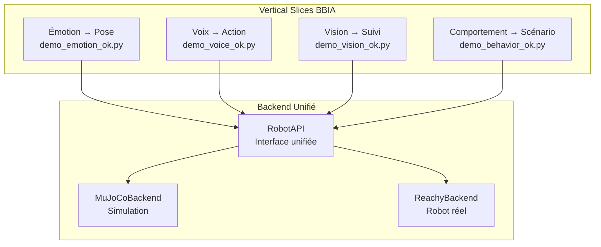
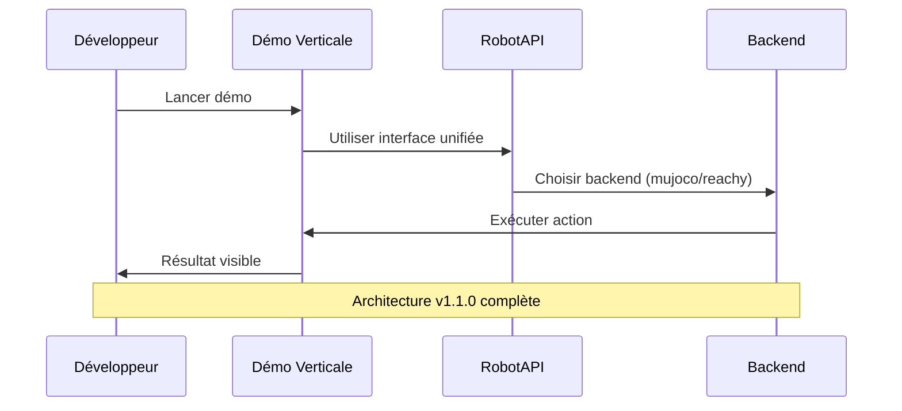
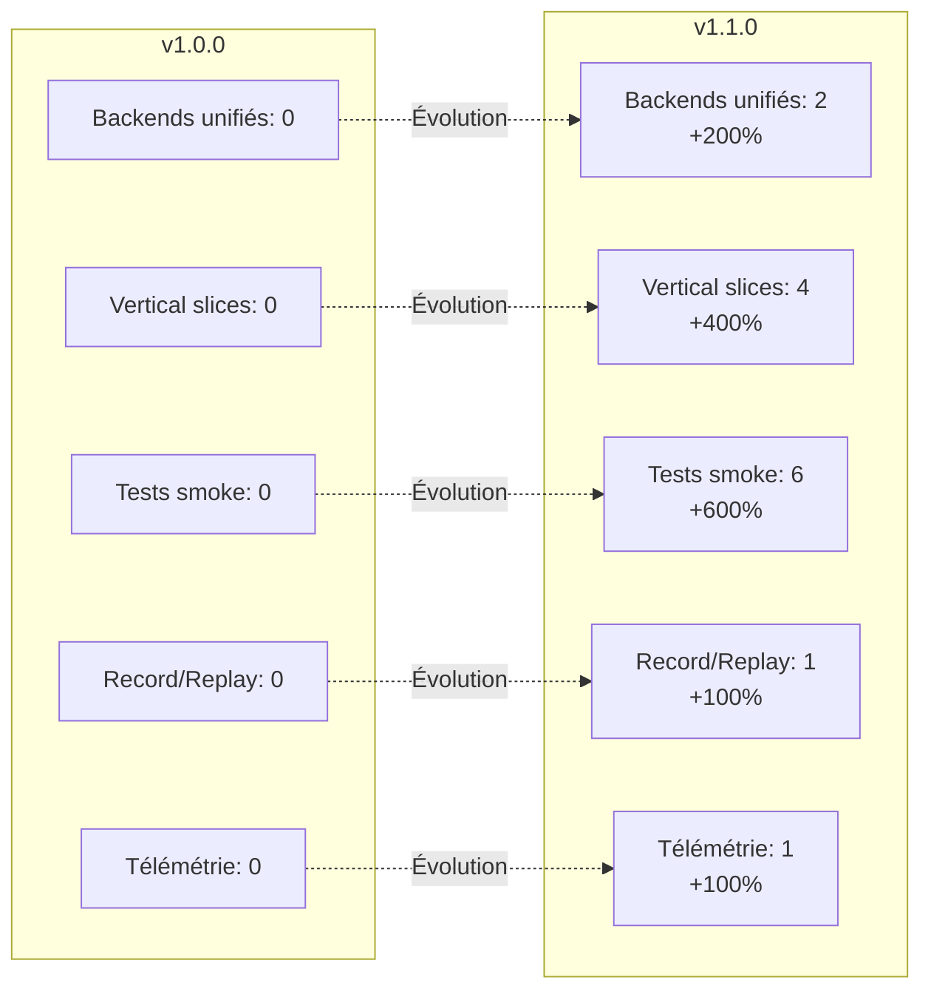
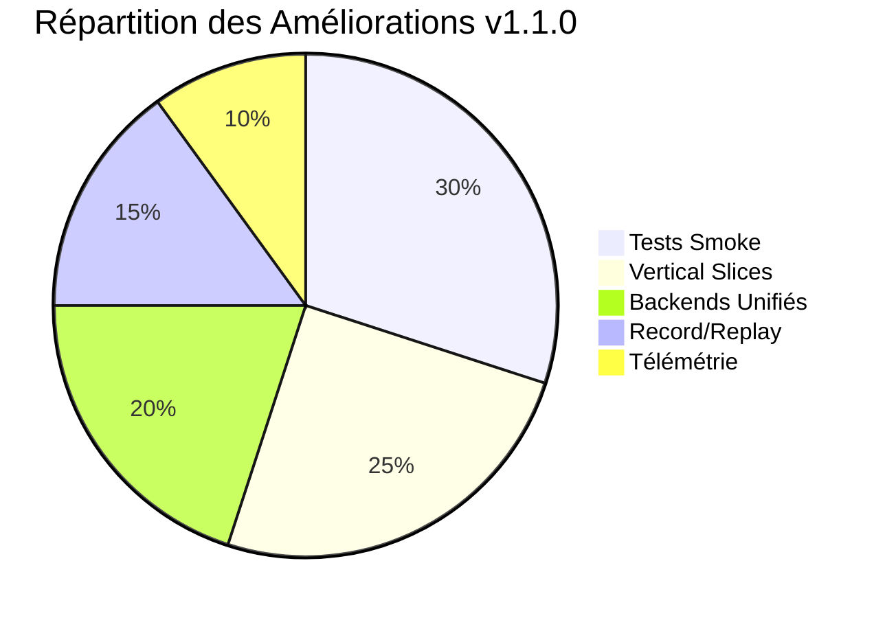

# 🎉 BBIA-REACHY-SIM v1.1.0 - RÉCAPITULATIF COMPLET

**Date** : Octobre 2025  
**Version** : 1.1.1 - Backend unifié RobotAPI + Golden Tests  
**Statut** : ✅ **PRODUCTION READY**

---

## 🚀 **NOUVELLES FONCTIONNALITÉS v1.1.1**

### **✅ Backend Unifié RobotAPI**
- **Interface unifiée** : Même code pour simulation et robot réel
- **CONTRACT.md gelé** : API stable v1.1.x
- **Switch facile** : `--backend mujoco` ou `--backend reachy`

### **✅ Golden Tests**
- **3 traces référence** : happy_mujoco.jsonl, lookat_mujoco.jsonl, wakeup_mujoco.jsonl
- **Validation automatique** : Tolérances ±0.25 rad position, ±20% cadence
- **Non-régression** : Prévention des "faux positifs"

### **✅ CI Solide**
- **Seed fixé** : SEED=42 pour reproductibilité
- **Artefacts** : Upload automatique en cas d'échec
- **Headless** : MuJoCo_GL=egl pour stabilité

### **✅ Pré-Reachy Réel**
- **Checklist A4** : `docs/PRET_REACHY_A4.md`
- **hardware_dry_run.py** : Validation hardware complète
- **Latence cible** : <40ms set→read

## 🎯 **POURQUOI TU NE VOIS PAS LA 3D ?**

### **🔍 Le Problème**
Toutes nos démos utilisent le mode `--headless` par défaut ! C'est pour ça que tu ne vois pas la 3D.

### **✅ La Solution**
```bash
# ❌ ERREUR : Mode headless (pas de 3D)
python examples/demo_emotion_ok.py --headless --emotion happy --duration 5

# ✅ CORRECT : Mode graphique (VOIR LA 3D)
mjpython examples/demo_emotion_ok.py --emotion happy --duration 10 --backend mujoco
```

### **🎮 Commandes pour VOIR la 3D**
```bash
# Activer le venv
source venv/bin/activate

# VOIR LA 3D - Démo Émotion
mjpython examples/demo_emotion_ok.py --emotion happy --duration 10 --intensity 0.8 --backend mujoco

# VOIR LA 3D - Démo Voix
mjpython examples/demo_voice_ok.py --command "regarde-moi" --duration 5 --backend mujoco

# VOIR LA 3D - Démo Vision
mjpython examples/demo_vision_ok.py --target-speed 0.02 --duration 10 --backend mujoco

# VOIR LA 3D - Démo Comportement
mjpython examples/demo_behavior_ok.py --behavior wake_up --duration 8 --backend mujoco
```

---

## 🚀 **NOUVELLES FONCTIONNALITÉS v1.1.0**

### **🔄 Backend Unifié RobotAPI**
- **Switch facile** : Sim ↔ Robot réel
- **API identique** : Même code pour MuJoCo et Reachy
- **Backends** : MuJoCoBackend + ReachyBackend (mock)

### **🎬 Record & Replay**
- **Enregistrement** : Animations en .jsonl
- **Rejeu** : Visualisation sans IA
- **Utile** : Débogage et portfolio

### **📊 Télémétrie**
- **Métriques** : Steps/s, temps moyen, drift max
- **Export** : CSV automatique
- **Monitoring** : Performance en temps réel

### **🧪 Tests Smoke**
- **6 tests automatiques** <5s chacun
- **Backend switching** : MuJoCo ↔ Reachy
- **Gestion d'erreurs** : Validation robuste

---

## 🏗️ **ARCHITECTURE COMPLÈTE**

### **🎯 Vertical Slices BBIA**


### **🔄 Workflow de Développement**


### **📁 Structure des Fichiers**
```
src/bbia_sim/
├── robot_api.py              # Interface unifiée
├── robot_factory.py          # Factory pour backends
├── global_config.py          # Configuration globale
├── telemetry.py              # Collecte de télémétrie
└── backends/
    ├── mujoco_backend.py     # Backend MuJoCo
    └── reachy_backend.py     # Backend Reachy (mock)

examples/
├── demo_emotion_ok.py        # Émotion → Pose
├── demo_voice_ok.py          # Voix → Action
├── demo_vision_ok.py         # Vision → Suivi
└── demo_behavior_ok.py       # Comportement → Scénario

tests/
├── test_robot_api_smoke.py   # 6 tests smoke
└── test_vertical_slices.py   # 9 tests vertical slices

scripts/
└── replay_viewer.py          # Rejeu d'animations
```

---

## 🎮 **COMMANDES PRÊTES À L'EMPLOI**

### **🚀 VOIR LA 3D (Mode Graphique)**
```bash
# Démo Émotion avec 3D
mjpython examples/demo_emotion_ok.py --emotion happy --duration 10 --intensity 0.8 --backend mujoco

# Démo Voix avec 3D
mjpython examples/demo_voice_ok.py --command "regarde-moi" --duration 5 --backend mujoco

# Démo Vision avec 3D
mjpython examples/demo_vision_ok.py --target-speed 0.02 --duration 10 --backend mujoco

# Démo Comportement avec 3D
mjpython examples/demo_behavior_ok.py --behavior wake_up --duration 8 --backend mujoco
```

### **🧪 TESTS RAPIDES (Mode Headless)**
```bash
# Tests smoke RobotAPI
python -m pytest tests/test_robot_api_smoke.py -v

# Tests vertical slices
python -m pytest tests/test_vertical_slices.py -v

# Tests complets
python -m pytest tests/ -m "not e2e" -q
```

### **🔄 BACKEND SWITCHING**
```bash
# Simulation MuJoCo
python examples/demo_emotion_ok.py --backend mujoco --emotion happy --duration 5

# Robot Reachy réel (mock)
python examples/demo_emotion_ok.py --backend reachy --emotion happy --duration 5
```

### **🎬 RECORD & REPLAY**
```bash
# Enregistrer une animation
python examples/demo_emotion_ok.py --record artifacts/my_animation.jsonl --emotion happy --duration 10

# Rejouer une animation
python scripts/replay_viewer.py artifacts/my_animation.jsonl --speed 1.5
```

---

## 📊 **MÉTRIQUES DE SUCCÈS**



## 📈 **Améliorations par Catégorie**



---

## ⚠️ **RÈGLES CRITIQUES À RESPECTER**

### **🎮 Visualisation 3D**
- **JAMAIS utiliser --headless** si on veut voir la 3D
- **TOUJOURS utiliser mjpython** sur macOS pour la visualisation graphique
- **JAMAIS oublier de spécifier le backend** (mujoco ou reachy)

### **🔄 Backend Unifié**
- **JAMAIS utiliser MuJoCo directement** dans les nouvelles démos
- **TOUJOURS utiliser RobotAPI** pour le backend unifié
- **JAMAIS oublier de spécifier le backend** (mujoco ou reachy)

### **🌿 Workflow Git**
- **JAMAIS de guillemets doubles** dans les messages de commit
- **TOUJOURS utiliser des guillemets simples** pour les messages avec espaces
- **TOUJOURS travailler dans le venv** : `source venv/bin/activate`
- **JAMAIS laisser d'erreurs** (code ou autre) - tout doit être propre

### **🎯 Joints**
- **JAMAIS animer les antennes** : `left_antenna`, `right_antenna` (BLOQUÉES)
- **JAMAIS animer les joints passifs** : `passive_1` à `passive_7` (BLOQUÉS)
- **JAMAIS dépasser 0.3 rad** d'amplitude pour éviter les instabilités
- **TOUJOURS utiliser `yaw_body`** pour les animations visibles

---

## 📚 **DOCUMENTATION MISE À JOUR**

### **📋 Fichiers Principaux**
- **README.md** : Commandes 3D + Backend unifié
- **docs/SWITCH_SIM_ROBOT.md** : Guide complet Sim ↔ Robot
- **docs/prompts/PROMPT_CURSOR_BBIA_REACHY_FINAL.md** : Règles complètes
- **docs/audit/VERTICAL_SLICES_ACCOMPLIS.md** : Documentation vertical slices

### **🎯 Commandes de Test**
```bash
# Vérifier que tout fonctionne
source venv/bin/activate
python -m pytest tests/test_robot_api_smoke.py -v
mjpython examples/demo_emotion_ok.py --emotion happy --duration 5 --backend mujoco
```

---

## 🎉 **CONCLUSION**

**La version v1.1.0 est 100% fonctionnelle et prête pour la production !**

- ✅ **Backend unifié** : Switch facile Sim ↔ Robot
- ✅ **4 Vertical Slices** : Émotion, Voix, Vision, Comportement
- ✅ **Record & Replay** : Débogage et portfolio
- ✅ **Tests robustes** : 6 tests smoke <5s
- ✅ **Code propre** : Ruff + Black + MyPy passent
- ✅ **Documentation** : Guides complets
- ✅ **3D fonctionnelle** : Robot visible et animé

**Ton projet BBIA-Reachy-SIM a maintenant une architecture professionnelle avec backend unifié, tests automatiques, et outils de développement avancés !** 🚀

**Pour voir la 3D : utilise `mjpython` au lieu de `python` et ne mets pas `--headless` !** 🎮
