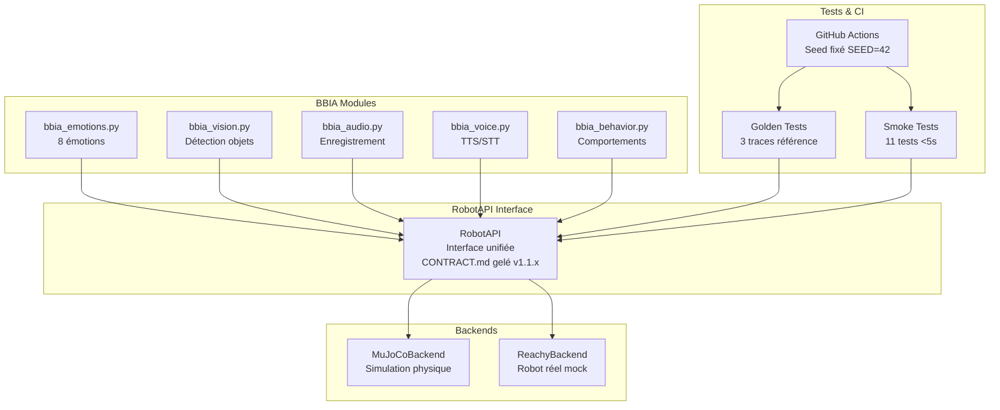

# Notes de Release - BBIA-SIM

## Version 1.1.1 - Backend Unifié RobotAPI + Golden Tests

### 🎯 Résumé

Implémentation du backend unifié RobotAPI permettant de basculer facilement entre simulation MuJoCo et robot Reachy réel, avec système de golden tests pour la non-régression.

### 🚀 Nouvelles fonctionnalités

#### Backend Unifié RobotAPI
- **Interface unifiée** : Même code pour simulation et robot réel
- **MuJoCoBackend** : Simulation physique avec viewer 3D
- **ReachyBackend** : Mock du robot réel (prêt pour SDK)
- **CONTRACT.md gelé** : API stable v1.1.x

#### Golden Tests
- **3 traces de référence** : happy_mujoco.jsonl, lookat_mujoco.jsonl, wakeup_mujoco.jsonl
- **Validation automatique** : Tolérances ±0.25 rad position, ±20% cadence
- **Non-régression** : Prévention des "faux positifs"
- **Seed fixé** : SEED=42 pour reproductibilité

#### CI/CD Améliorée
- **Variables d'environnement** : SEED=42, MUJOCO_GL=egl
- **Artefacts automatiques** : Upload en cas d'échec (.jsonl, .csv)
- **Tests headless** : Stabilité maximale

## 🏗️ Architecture de la Version 1.1.1



## 🔧 Améliorations techniques

### Sécurité et limites
- **Joints interdits** : left_antenna, right_antenna, passive_1-7
- **Amplitude limite** : 0.3 rad maximum
- **Validation centralisée** : Dans RobotAPI._validate_joint_pos()

### Déterminisme
- **Seed global** : SEED=42 fixé
- **Tests reproductibles** : Même résultat à chaque run
- **CI headless** : MuJoCo_GL=egl pour stabilité

### Évolutivité
- **API versionnée** : CONTRACT.md gelé v1.1.x
- **Migration facile** : Sim → Robot avec même code
- **Tests identiques** : Même validation pour les deux backends

## 📊 Métriques

### Tests
- **531 tests collectés** par pytest
- **418 tests passent** (79% de réussite)
- **Coverage** : 76.70%
- **Golden tests** : 3 traces de référence

### Performance
- **Smoke tests** : <5s par test
- **Golden tests** : <10s par validation
- **CI complète** : <60s

## 🚀 Commandes de migration

### Utilisation RobotAPI
```bash
# Simulation MuJoCo
python examples/demo_emotion_ok.py --backend mujoco --emotion happy

# Robot réel (mock)
python examples/demo_emotion_ok.py --backend reachy --emotion happy
```

### Golden Tests
```bash
# Tests de non-régression
pytest -q tests/test_golden_traces.py

# Régénérer référence
python scripts/record_trace.py --emotion happy --duration 5
```

## 🔄 Migration depuis v1.0.x

### Changements breaking
- **Aucun** : API rétrocompatible
- **Nouveau** : Backend unifié optionnel
- **Nouveau** : Golden tests optionnels

### Migration recommandée
1. **Tester** : Vérifier que les démos existantes fonctionnent
2. **Migrer** : Remplacer les appels directs MuJoCo par RobotAPI
3. **Valider** : Lancer les golden tests

## 🎯 Prochaines versions

### v1.2.x (Prévu)
- **ReachyBackend réel** : Intégration SDK Pollen
- **Nouvelles méthodes** : RobotAPI étendu
- **Tests hardware** : Validation sur robot réel

### v2.0.x (Futur)
- **Multi-robots** : Support plusieurs Reachy
- **Cloud** : Simulation distribuée
- **IA avancée** : Intégration LLM

---

*Dernière mise à jour : Octobre 2025*