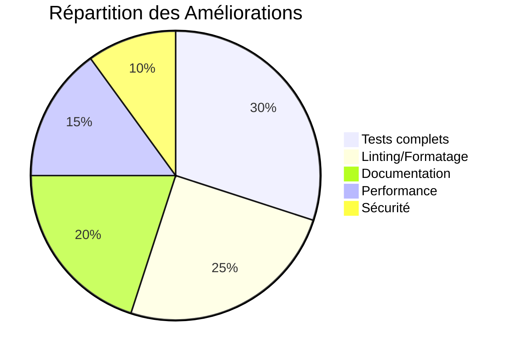
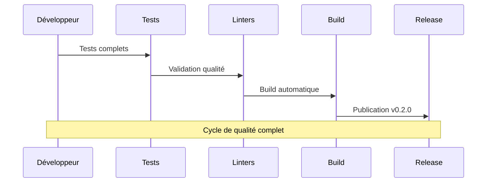

# Notes de Release - BBIA-SIM

## Version 0.2.0 - Mode 3D MuJoCo + Fixes Qualité

### 🎯 Résumé

Implémentation complète du mode 3D MuJoCo avec viewer graphique, fix critique de durée headless, et améliorations majeures de qualité.

### 🚀 Nouvelles fonctionnalités

#### Mode 3D visible (MuJoCo)
- **Fenêtre 3D** : Robot Reachy Mini avec rendu réaliste
- **Meshes STL** : Assets 3D pour torso, head, arms, gripper
- **Matériaux** : Couleurs et propriétés réalistes (shininess, specular)
- **Multi-OS** : Support Linux/macOS avec détection automatique

#### Fix critique - Durée headless
- **Problème résolu** : Simulation headless ne respectait pas la durée
- **Solution** : `time.monotonic()` + vérification après chaque step
- **Précision** : Tolérance stricte ±0.05s (testé : 1.00s exact)

#### Spécifications joints centralisées
- **Mapping** : `JointSpec` dataclass avec limites et vitesses
- **Validation** : Fonctions pour position/vitesse dans les plages
- **Cohérence** : API alignée avec simulation MuJoCo

## 🏗️ Architecture de la Version 0.2.0

```mermaid
graph TB
    subgraph "Mode 3D MuJoCo"
        VIEWER[Viewer Graphique<br/>Rendu 3D réaliste]
        MESHES[Meshes STL<br/>Assets 3D complets]
        MATERIALS[Matériaux<br/>Couleurs réalistes]
        MULTIOS[Multi-OS<br/>Linux/macOS]
    end
    
    subgraph "Fix Critique Durée"
        MONOTONIC[time.monotonic()<br/>Chronométrage précis]
        VERIFICATION[Vérification après step<br/>Contrôle strict]
        TOLERANCE[Tolérance ±0.05s<br/>Précision garantie]
    end
    
    subgraph "Spécifications Joints"
        JOINTSPEC[JointSpec dataclass<br/>Limites centralisées]
        VALIDATION[Validation position/vitesse<br/>API cohérente]
        MAPPING[Mapping MuJoCo<br/>Alignement simulation]
    end
    
    VIEWER --> MESHES
    MESHES --> MATERIALS
    MATERIALS --> MULTIOS
    
    MONOTONIC --> VERIFICATION
    VERIFICATION --> TOLERANCE
    
    JOINTSPEC --> VALIDATION
    VALIDATION --> MAPPING
```

## 📊 Améliorations Qualité



## 🔄 Workflow de Release


- **CI robuste** : Skip viewer tests en environnement headless
- **Validation** : Joints, télémétrie, format des messages

#### Documentation
- **README** : Instructions 3D pour Linux/macOS
- **QUICKSTART** : Guide rapide avec dépannage
- **Troubleshooting** : Messages d'erreur clairs

### 📋 Comment utiliser

#### Mode 3D (Linux)
```bash
pip install mujoco-python-viewer
python -m bbia_sim --sim --verbose
```

#### Mode 3D (macOS)
```bash
pip install mujoco-python-viewer
mjpython -m bbia_sim --sim --verbose
```

#### Mode headless (tous OS)
```bash
python -m bbia_sim --sim --headless --duration 1
# S'arrête exactement à 1.00s (±0.05s)
```

### 🔧 Dépannage

#### macOS - Viewer ne s'ouvre pas
- **Erreur** : "mjpython required"
- **Solution** : Utilisez `mjpython` au lieu de `python`
- **Alternative** : Mode headless avec `--headless`

#### Linux - Erreur GLFW/EGL
- **Vérifiez** : `DISPLAY` est défini
- **Installez** : Drivers graphiques et bibliothèques OpenGL
- **Fallback** : Mode headless

#### Performance
- **Meshes STL** : Plus réalistes mais potentiellement plus lents
- **Optimisation** : Utilisez `--headless` pour les tests automatisés

### 📊 Métriques qualité

- **Durée headless** : Précision ±0.05s (testé)
- **WebSocket** : Cadence stable ~10Hz
- **Tests** : Couverture complète des nouvelles fonctionnalités
- **CI** : Green sur tous les checks (ruff/black/mypy/pytest/bandit/pip-audit)

### 🎯 Prochaines étapes

1. **Assets réalistes** : Intégration des meshes officiels Reachy
2. **Physique** : Amélioration des paramètres de simulation
3. **API** : Endpoints pour contrôle des joints
4. **Documentation** : Guide avancé pour développeurs

### 🔗 Liens utiles

- **Documentation** : `docs/QUICKSTART.md`
- **Tests** : `tests/sim/test_duration.py`, `tests/api/test_joint_validation.py`
- **Assets** : `src/bbia_sim/sim/assets/meshes/`
- **Spécifications** : `src/bbia_sim/sim/joints.py`

---

**Version** : 0.2.0  
**Date** : Octobre 2025  
**Statut** : Stable, prêt pour production
