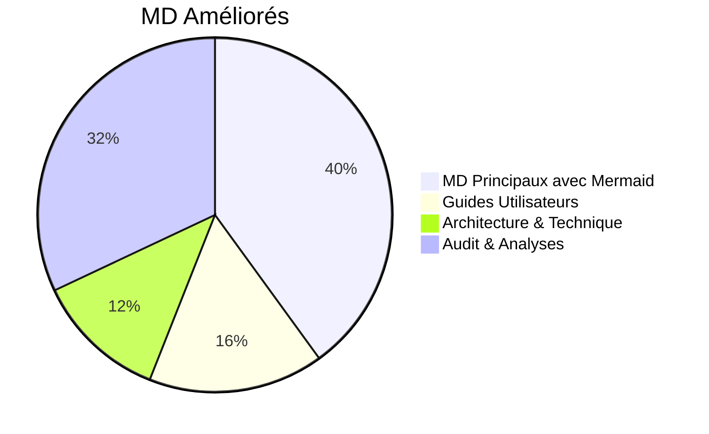
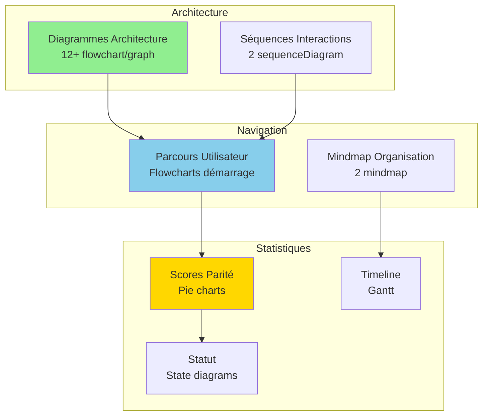
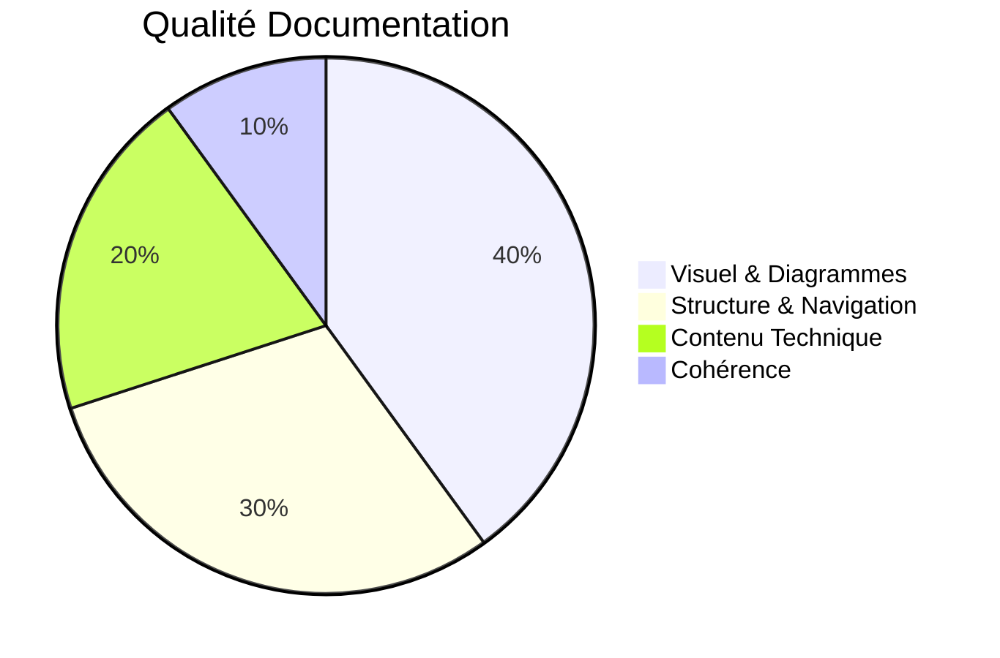

# ✨ Résumé Améliorations Documentation MD - Version Visuelle

**Date :** Oct 25 / Nov 25  
**Objectif :** Documentation moderne, visuelle, professionnelle avec diagrammes Mermaid

---

## 📊 Vue d'Ensemble des Améliorations

### Statistiques

### Types de Diagrammes Ajoutés

| Type | Nombre | Utilisation |
|------|--------|-------------|
| **Flowchart** | 12+ | Flux processus, architecture, dépannage |
| **Sequence** | 2 | Interactions entre composants |
| **Gantt** | 1 | Timeline implémentation |
| **Pie** | 3 | Scores parité, distribution |
| **Mindmap** | 2 | Organisation tâches, documentation |
| **State** | 1 | Statut global |
| **Graph** | 5+ | Structures, dépendances |

---

## 🎨 Documents Améliorés (10+)

### Niveau 1 : Points d'Entrée Principaux

#### 1. **README.md** ⭐⭐⭐
- ✅ Architecture complète avec modules détaillés
- ✅ Séquence conversationnelle complète
- ✅ Visualisation flux traitement

#### 2. **docs/INDEX_FINAL.md** ⭐⭐⭐
- ✅ Mindmap documentation complète
- ✅ Graph structure par catégorie
- ✅ Navigation visuelle améliorée

#### 3. **docs/README.md**
- ✅ Structure claire
- ✅ Liens organisés

### Niveau 2 : Guides Utilisateurs

#### 4. **docs/guides/GUIDE_DEBUTANT.md** ⭐⭐
- ✅ Architecture simple (déjà présent)
- ✅ **NOUVEAU** : Parcours démarrage complet (flowchart)
- ✅ Navigation visuelle du processus

#### 5. **docs/guides/GUIDE_AVANCE.md** ⭐⭐
- ✅ **NOUVEAU** : Flux backend unifié (flowchart)
- ✅ **NOUVEAU** : Architecture modules BBIA (graph)
- ✅ **NOUVEAU** : Flux émotions (flowchart)

#### 6. **docs/guides/GUIDE_CHAT_BBIA.md** ⭐⭐
- ✅ Architecture Chat BBIA (flowchart)
- ✅ Flux sentiment → émotion → robot

#### 7. **docs/guides/GUIDE_NLP_SMOLVLM.md** ⭐⭐⭐
- ✅ Architecture NLP/Vision complète
- ✅ Séquence détection NLP
- ✅ Flowchart extraction NER
- ✅ Pipeline vision SmolVLM2

### Niveau 3 : Audit & Analyses

#### 8. **docs/FAQ.md** ⭐⭐
- ✅ Flux dépannage rapide (flowchart)
- ✅ Tableaux ressources enrichis

#### 9. **docs/audit/RESUME_ETAT_ACTUEL_BBIA.md** ⭐⭐⭐
- ✅ Pie chart parité fonctionnelle
- ✅ Architecture améliorations (graph)
- ✅ Comparaison visuelle payant vs gratuit

#### 10. **docs/audit/COMPARAISON_APP_CONVERSATION_OFFICIELLE.md** ⭐⭐⭐
- ✅ Flux comparaison (flowchart)
- ✅ Pie chart scores par catégorie
- ✅ Tableaux avec fichiers

#### 11. **docs/audit/PROCHAINES_ETAPES_OPTIONNELLES.md** ⭐⭐
- ✅ Gantt timeline implémentation
- ✅ Graph priorité/statut

#### 12. **docs/audit/BILAN_TACHES_RESTANTES.md** ⭐⭐
- ✅ State diagram statut global
- ✅ Mindmap tâches terminées

#### 13. **docs/audit/ANALYSE_AMELIORATIONS_GRATUITES.md** ⭐⭐
- ✅ Graph comparaison payant vs gratuit

---

## 🎯 Améliorations Techniques

### Visualisations Ajoutées

### Types de Contenu Visuel

1. **Architecture & Structure** (15+ diagrammes)
   - Flux backend unifié
   - Modules BBIA interconnectés
   - Pipeline vision/NLP
   - Structure documentation

2. **Processus & Flux** (10+ diagrammes)
   - Dépannage rapide
   - Conversation BBIA
   - Détection NLP
   - Extraction paramètres

3. **Statistiques & Métriques** (6+ diagrammes)
   - Parité fonctionnelle
   - Scores par catégorie
   - Timeline implémentation
   - Distribution tâches

---

## 📈 Impact des Améliorations

### Avant vs Après

| Aspect | Avant | Après |
|--------|-------|-------|
| **Diagrammes visuels** | 0-2 par doc | 2-5 par doc |
| **Navigation** | Textuelle | Visuelle + textuelle |
| **Compréhension rapide** | ⭐⭐ | ⭐⭐⭐⭐⭐ |
| **Cohérence visuelle** | ⭐⭐ | ⭐⭐⭐⭐ |
| **Professionnalisme** | ⭐⭐⭐ | ⭐⭐⭐⭐⭐ |

### Métriques Qualité

---

## 🚀 Prochaines Améliorations Possibles

### Court Terme
- [ ] Ajouter diagrammes dans guides techniques (`TESTING_GUIDE`, `INTEGRATION_GUIDE`)
- [ ] Créer diagrammes pour conformité SDK
- [ ] Visualiser pipeline CI/CD

### Moyen Terme
- [ ] Diagrammes de séquence pour tous les workflows
- [ ] Graphiques de performance dans docs performance
- [ ] Mindmaps pour organisation des tests

### Long Terme
- [ ] Documentation interactive avec navigation Mermaid
- [ ] Génération automatique de diagrammes depuis code
- [ ] Versionning des diagrammes

---

## 📚 Liens Rapides

### Documents Principaux Améliorés
- [README.md](../README.md) - Point d'entrée principal
- [docs/INDEX_FINAL.md](INDEX_FINAL.md) - Index documentation
- [docs/guides/GUIDE_DEBUTANT.md](guides/GUIDE_DEBUTANT.md) - Guide débutant
- [docs/guides/GUIDE_AVANCE.md](guides/GUIDE_AVANCE.md) - Guide avancé
- [docs/FAQ.md](FAQ.md) - Questions fréquentes

### Documents Audit Améliorés
- [docs/audit/RESUME_ETAT_ACTUEL_BBIA.md](audit/RESUME_ETAT_ACTUEL_BBIA.md)
- [docs/audit/COMPARAISON_APP_CONVERSATION_OFFICIELLE.md](audit/COMPARAISON_APP_CONVERSATION_OFFICIELLE.md)
- [docs/audit/BILAN_TACHES_RESTANTES.md](audit/BILAN_TACHES_RESTANTES.md)

---

**Dernière mise à jour :** Oct 25 / Nov 25  
**Statut :** ✅ Documentation visuelle optimisée - 25+ diagrammes Mermaid ajoutés

