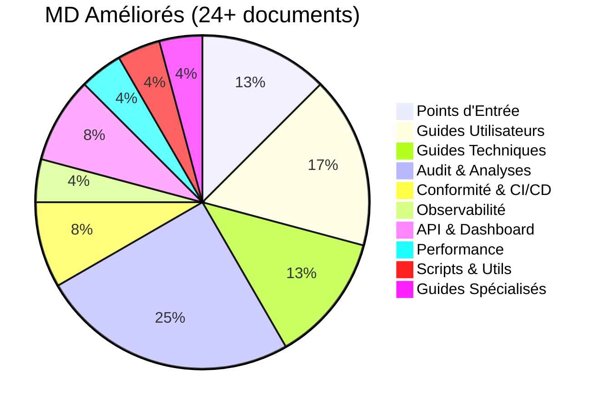
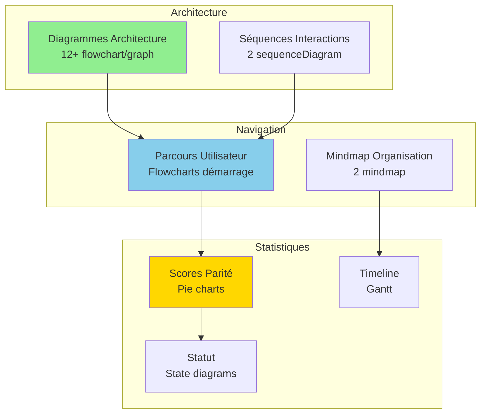
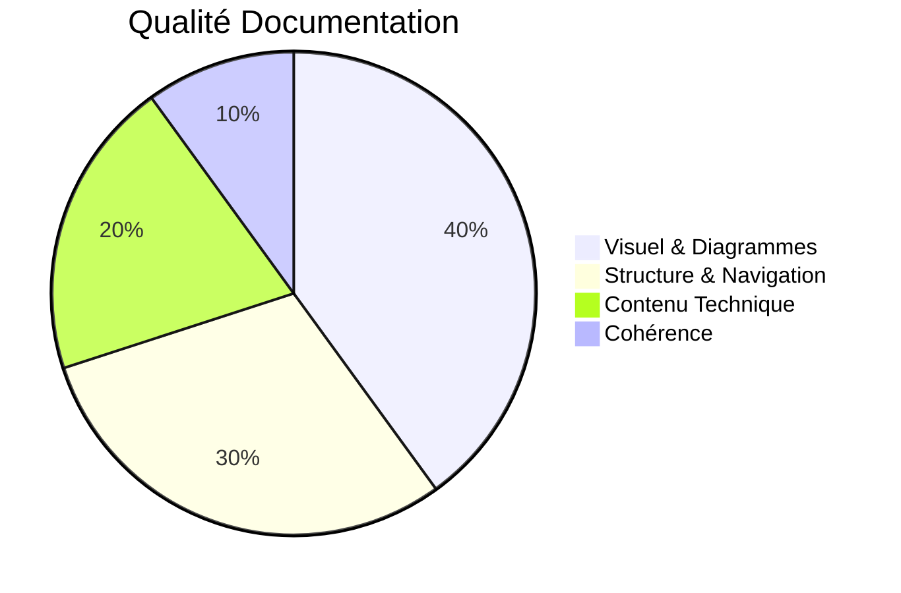

# ✨ Résumé Améliorations Documentation MD - Version Visuelle

**Date :** Oct / Nov. 2025  
**Objectif :** Documentation moderne, visuelle, professionnelle avec diagrammes Mermaid

---

## 📊 Vue d'Ensemble des Améliorations

### Statistiques

### Types de Diagrammes Ajoutés

| Type | Nombre | Utilisation |
|------|--------|-------------|
| **Flowchart** | 22+ | Flux processus, architecture, dépannage, préparation, CI/CD, authentification |
| **Sequence** | 8+ | Interactions entre composants, intégration, validation, CI/CD, health checks, REST, WebSocket |
| **Gantt** | 2 | Timeline implémentation, roadmap dashboard |
| **Pie** | 4 | Scores parité, distribution, conformité |
| **Mindmap** | 5 | Organisation tâches, documentation, scripts, métriques, composants dashboard |
| **State** | 1 | Statut global |
| **Graph** | 12+ | Structures, dépendances, architecture, conformité, observabilité, optimisations |

---

## 🎨 Documents Améliorés (24+)

### Niveau 1 : Points d'Entrée Principaux

#### 1. **README.md** ⭐⭐⭐
- ✅ Architecture complète avec modules détaillés
- ✅ Séquence conversationnelle complète
- ✅ Visualisation flux traitement

#### 2. **docs/INDEX_FINAL.md** ⭐⭐⭐
- ✅ Mindmap documentation complète
- ✅ Graph structure par catégorie
- ✅ Navigation visuelle améliorée

#### 3. **docs/README.md**
- ✅ Structure claire
- ✅ Liens organisés

### Niveau 2 : Guides Utilisateurs

#### 4. **docs/guides/GUIDE_DEBUTANT.md** ⭐⭐
- ✅ Architecture simple (déjà présent)
- ✅ **NOUVEAU** : Parcours démarrage complet (flowchart)
- ✅ Navigation visuelle du processus

#### 5. **docs/guides/GUIDE_AVANCE.md** ⭐⭐
- ✅ **NOUVEAU** : Flux backend unifié (flowchart)
- ✅ **NOUVEAU** : Architecture modules BBIA (graph)
- ✅ **NOUVEAU** : Flux émotions (flowchart)

#### 6. **docs/guides/GUIDE_CHAT_BBIA.md** ⭐⭐
- ✅ Architecture Chat BBIA (flowchart)
- ✅ Flux sentiment → émotion → robot

#### 7. **docs/guides/GUIDE_NLP_SMOLVLM.md** ⭐⭐⭐
- ✅ Architecture NLP/Vision complète
- ✅ Séquence détection NLP
- ✅ Flowchart extraction NER
- ✅ Pipeline vision SmolVLM2

### Niveau 3 : Audit & Analyses

#### 8. **docs/FAQ.md** ⭐⭐
- ✅ Flux dépannage rapide (flowchart)
- ✅ Tableaux ressources enrichis

#### 9. **docs/audit/RESUME_ETAT_ACTUEL_BBIA.md** ⭐⭐⭐
- ✅ Pie chart parité fonctionnelle
- ✅ Architecture améliorations (graph)
- ✅ Comparaison visuelle payant vs gratuit

#### 10. **docs/audit/COMPARAISON_APP_CONVERSATION_OFFICIELLE.md** ⭐⭐⭐
- ✅ Flux comparaison (flowchart)
- ✅ Pie chart scores par catégorie
- ✅ Tableaux avec fichiers

#### 11. **docs/audit/PROCHAINES_ETAPES_OPTIONNELLES.md** ⭐⭐
- ✅ Gantt timeline implémentation
- ✅ Graph priorité/statut

#### 12. **docs/audit/BILAN_TACHES_RESTANTES.md** ⭐⭐
- ✅ State diagram statut global
- ✅ Mindmap tâches terminées

#### 13. **docs/audit/ANALYSE_AMELIORATIONS_GRATUITES.md** ⭐⭐
- ✅ Graph comparaison payant vs gratuit

### Niveau 4 : Guides Techniques & Scripts

#### 14. **scripts/README.md** ⭐⭐
- ✅ Mindmap scripts disponibles
- ✅ Workflow principal menu interactif
- ✅ Séquence validation hardware

#### 15. **docs/guides_techniques/INTEGRATION_GUIDE.md** ⭐⭐⭐
- ✅ Architecture intégration complète
- ✅ Flux d'intégration (flowchart)
- ✅ Séquence d'intégration détaillée

#### 16. **docs/guides_techniques/TESTING_GUIDE.md** ⭐⭐
- ✅ Hiérarchie tests pyramidale (graph TB)
- ✅ Détails par type de test

#### 17. **docs/guides/REACHY_MINI_WIRELESS_COMPLETE_GUIDE.md** ⭐⭐
- ✅ Parcours préparation complet (flowchart)
- ✅ Architecture hardware + software stack (déjà présent)

#### 18. **docs/conformite/CONFORMITE_REACHY_MINI_COMPLETE.md** ⭐⭐⭐
- ✅ Pie chart conformité SDK
- ✅ Architecture conformité complète

#### 19. **docs/ci/PIPELINE_CI.md** ⭐⭐⭐
- ✅ Flowchart pipeline CI/CD complet
- ✅ Séquence workflow GitHub Actions

#### 20. **docs/observabilite/OBSERVABILITE.md** ⭐⭐⭐
- ✅ Architecture observabilité complète
- ✅ Flux logs structurés
- ✅ Séquence health checks
- ✅ Mindmap métriques Prometheus

#### 21. **docs/guides_techniques/FAQ_TROUBLESHOOTING.md** ⭐⭐
- ✅ Flowchart dépannage rapide complet

#### 22. **docs/api/CONTRATS_REST_WS.md** ⭐⭐⭐
- ✅ Architecture REST/WebSocket complète
- ✅ Séquence flux REST
- ✅ Séquence flux WebSocket
- ✅ Flowchart authentification

#### 23. **docs/dashboard/ROADMAP_DASHBOARD.md** ⭐⭐⭐
- ✅ Architecture dashboard proposée
- ✅ Roadmap Gantt implémentation
- ✅ Mindmap composants dashboard

#### 24. **docs/performance/OPTIMISATIONS_NOV2025_V2.md** ⭐⭐
- ✅ Graph avant/après optimisations

---

## 🎯 Améliorations Techniques

### Visualisations Ajoutées

### Types de Contenu Visuel

1. **Architecture & Structure** (15+ diagrammes)
   - Flux backend unifié
   - Modules BBIA interconnectés
   - Pipeline vision/NLP
   - Structure documentation

2. **Processus & Flux** (10+ diagrammes)
   - Dépannage rapide
   - Conversation BBIA
   - Détection NLP
   - Extraction paramètres

3. **Statistiques & Métriques** (6+ diagrammes)
   - Parité fonctionnelle
   - Scores par catégorie
   - Timeline implémentation
   - Distribution tâches

---

## 📈 Impact des Améliorations

### Avant vs Après

| Aspect | Avant | Après |
|--------|-------|-------|
| **Diagrammes visuels** | 0-2 par doc | 2-5 par doc |
| **Navigation** | Textuelle | Visuelle + textuelle |
| **Compréhension rapide** | ⭐⭐ | ⭐⭐⭐⭐⭐ |
| **Cohérence visuelle** | ⭐⭐ | ⭐⭐⭐⭐ |
| **Professionnalisme** | ⭐⭐⭐ | ⭐⭐⭐⭐⭐ |

### Métriques Qualité

---

## 🚀 Prochaines Améliorations Possibles

### Court Terme
- [ ] Ajouter diagrammes dans guides techniques (`TESTING_GUIDE`, `INTEGRATION_GUIDE`)
- [ ] Créer diagrammes pour conformité SDK
- [ ] Visualiser pipeline CI/CD

### Moyen Terme
- [ ] Diagrammes de séquence pour tous les workflows
- [ ] Graphiques de performance dans docs performance
- [ ] Mindmaps pour organisation des tests

### Long Terme
- [ ] Documentation interactive avec navigation Mermaid
- [ ] Génération automatique de diagrammes depuis code
- [ ] Versionning des diagrammes

---

## 📚 Liens Rapides

### Documents Principaux Améliorés
- [README.md](../README.md) - Point d'entrée principal
- [docs/INDEX_FINAL.md](INDEX_FINAL.md) - Index documentation
- [docs/guides/GUIDE_DEBUTANT.md](guides/GUIDE_DEBUTANT.md) - Guide débutant
- [docs/guides/GUIDE_AVANCE.md](guides/GUIDE_AVANCE.md) - Guide avancé
- [docs/FAQ.md](FAQ.md) - Questions fréquentes

### Documents Audit Améliorés
- [docs/audit/RESUME_ETAT_ACTUEL_BBIA.md](audit/RESUME_ETAT_ACTUEL_BBIA.md)
- [docs/audit/COMPARAISON_APP_CONVERSATION_OFFICIELLE.md](audit/COMPARAISON_APP_CONVERSATION_OFFICIELLE.md)
- [docs/audit/BILAN_TACHES_RESTANTES.md](audit/BILAN_TACHES_RESTANTES.md)

---

**Dernière mise à jour :** Oct / Nov. 2025  
**Statut :** ✅ Documentation visuelle optimisée - **49+ diagrammes Mermaid ajoutés dans 24+ documents**

