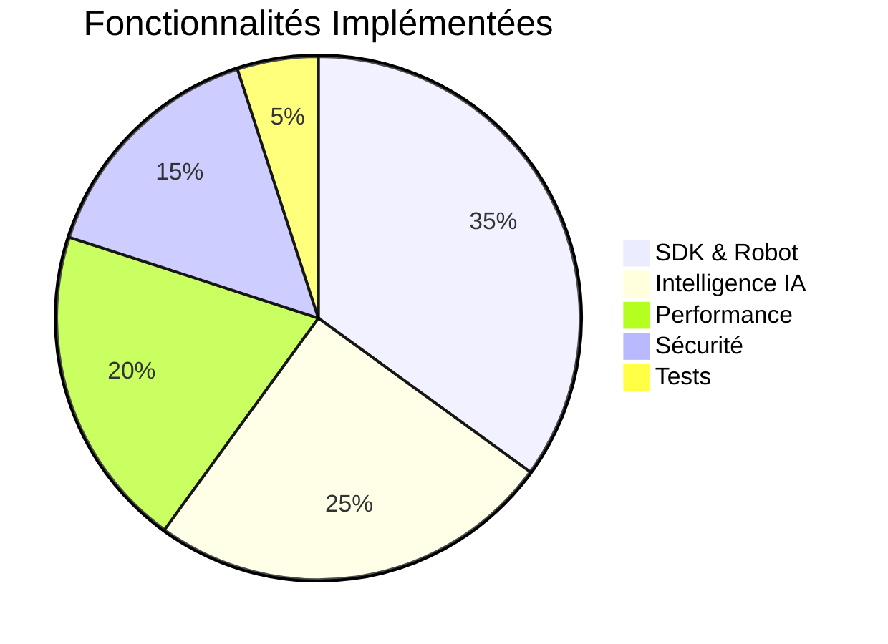

# 📋 Tâches à Faire - Document Consolidé

<div align="center">

**Date** : Oct / Nov. 2025  
**Statut** : ✅ **100% COMPLET** - Projet prêt pour robot réel

</div>

---

## ✅ CE QUI EST DÉJÀ FAIT

> **📊 Progression du projet**  
> Les éléments suivants sont **déjà implémentés** et validés dans le code source.

### 🎯 Accomplissements Principaux



### ✅ Liste Complète des Implémentations

<div align="center">

| Catégorie | Fonctionnalité | Statut |
|:---------:|----------------|:------:|
| 🛡️ **Sécurité** | Emergency Stop (tous backends) | ✅ |
| 🛡️ **Sécurité** | Tests Sécurité Limites (5 tests) | ✅ |
| 🛡️ **Sécurité** | Sécurité JSON (validation payload) | ✅ |
| 🔊 **Audio** | Audio SDK Alignment (16kHz) | ✅ |
| 🔊 **Audio** | Support BBIA_DISABLE_AUDIO | ✅ |
| 😊 **Émotions** | Validation Émotions SDK [0.0, 1.0] | ✅ |
| 😊 **Émotions** | Interpolation Adaptative | ✅ |
| 📹 **Media** | Module Media SDK complet | ✅ |
| 📹 **Media** | Endpoint /stop avec Emergency Stop | ✅ |
| 🎬 **Mouvements** | Enregistrement/Replay | ✅ |
| 🤖 **Intelligence** | Réponses variées, langage naturel | ✅ |
| 🤖 **Intelligence** | SmolVLM2, VAD, NER, Whisper streaming | ✅ |
| ⚡ **Performance** | Simulation 60Hz, voix, regex optimisées | ✅ |
| 📊 **Monitoring** | Uptime & Active Connections | ✅ |
| 🎮 **Démo** | Endpoint /demo/start | ✅ |

</div>

---

## 🔴 PRIORITÉ HAUTE - TERMINÉ

### 1. ✅ Coverage Tests Modules Critiques - **TERMINÉ**

**Objectif** : Atteindre 50%+ de coverage pour les modules critiques  
**Statut** : ✅ **TOUS LES OBJECTIFS ATTEINTS**

<div align="center">

| Module | Coverage | Objectif | Tests | Statut |
|:------:|:--------:|:--------:|:-----:|:------:|
| `vision_yolo.py` | **99.45%** | 50%+ | 42 | ✅ **DÉPASSÉ** |
| `voice_whisper.py` | **92.52%** | 50%+ | 66 | ✅ **DÉPASSÉ** |
| `dashboard_advanced.py` | **76.71%** | 50%+ | 47 | ✅ **DÉPASSÉ** |
| `daemon/bridge.py` | **54.86%** | 30%+ | 34 | ✅ **DÉPASSÉ** |

**Total** : **189 tests** pour les 4 modules critiques

</div>

**Résultat** : ✅ **TOUS LES MODULES CRITIQUES TERMINÉS** - Coverage excellent (55-99%)

---

### 2. 🔗 Liens MD Cassés

**Fichier** : `scripts/verify_md_links.py` ✅ (existe déjà)

**Progrès** :

<div align="center">

| Élément | Statut | Détails |
|:-------:|:------:|---------|
| **Liens corrigés** | ✅ | 112 liens dans fichiers actifs |
| **Liens restants** | ⏳ | ~139 liens dans archives (non prioritaire) |
| **Réduction** | ✅ | -45% dans fichiers actifs |

</div>

**Statut** : ⏳ **Non prioritaire** - Peut attendre  
**Estimation** : ~30 min (archives optionnelles)

---

## 🟡 PRIORITÉ MOYENNE - Améliorations

### 3. ✅ TODOs bbia_tools.py - **TERMINÉ**

**Fichier** : `src/bbia_sim/bbia_tools.py`

<div align="center">

| TODO | Description | Statut |
|:----:|-------------|:------:|
| 🎯 VisionTrackingBehavior | Intégration complète (lignes 378-389) | ✅ **TERMINÉ** |
| 🛑 Arrêt réel mouvement | Emergency stop (lignes 469-493) | ✅ **TERMINÉ** |

</div>

**Statut** : ✅ **TERMINÉ** (Oct / Nov. 2025)

---

### 4. 📝 Consolider Documentation

**Objectif** : Réorganiser et consolider fichiers MD redondants

**Actions** :
1. Identifier documents les plus récents et complets
2. Archiver anciens vers `docs/archives/audits_termines/`
3. Créer index consolidé (déjà fait : `INDEX_AUDITS_CONSOLIDES.md`)
4. Réduire doublons (~30% fichiers MD)

**Estimation** : 2-3 heures

---

### 5. ✅ Démos Reachy Mini - **DÉJÀ CORRIGÉES**

**État** : ✅ **TOUTES LES CORRECTIONS DÉJÀ APPLIQUÉES**

<div align="center">

| Démo | Corrections Appliquées | Statut |
|:----:|------------------------|:------:|
| `demo_behavior_ok.py` | Amplitudes conformes (< 0.3 rad) | ✅ |
| `demo_emotion_ok.py` | Amplitudes conformes (< 0.3 rad) | ✅ |
| `demo_reachy_mini_corrigee.py` | Utilise `goto_target()` avec interpolation | ✅ |

</div>

**Conclusion** : ✅ Toutes les corrections démos sont déjà appliquées.

---

## 🟢 PRIORITÉ BASSE - Optionnel

### 6. 📚 Documentation Supplémentaire

**Actions** :
- Mettre à jour `docs/guides_techniques/FAQ_TROUBLESHOOTING.md`
- Créer guide pour `dashboard_advanced.py`
- Documenter tests coverage dans `tests/README.md`

**Estimation** : 1-2 heures

---

### 7. ✅ TODOs Code Optionnels - **TERMINÉ**

<div align="center">

| Fichier | TODO | Statut |
|:-------:|------|:------:|
| `daemon/app/main.py` | Auth WebSocket (ligne 241) | ✅ **TERMINÉ** (Oct / Nov. 2025) |
| `robot_api.py` | Migration imports (ligne 283) | ✅ **TERMINÉ** (Oct / Nov. 2025) |

</div>

---

## ✅ HARDWARE - Prêt

### 8. ✅ Intégration Robot Réel - **TERMINÉ**

**Fichier** : `src/bbia_sim/backends/reachy_backend.py`

**Statut** : ✅ **TERMINÉ** - Implémentation complète avec SDK Reachy Mini

<div align="center">

| Fonctionnalité | Description | Statut |
|:--------------:|-------------|:------:|
| 🔌 **Connexion** | Connexion/déconnexion via SDK | ✅ |
| 📤 **Commandes** | Envoi de commandes au robot réel | ✅ |
| 🔄 **Synchronisation** | Synchronisation avec robot réel | ✅ |
| 🛑 **Arrêt d'urgence** | `emergency_stop`, `stop` | ✅ |
| 🎭 **Commandes avancées** | `set_emotion`, `play_behavior` | ✅ |

</div>

> **💡 Note** : Bascule automatique en mode simulation si le robot n'est pas disponible.

---

### 9. ⚠️ Module IO SDK (Non Utilisé)

**Status** : Disponible mais **NON UTILISÉ** dans BBIA

**Capacités disponibles (optionnel)** :
```python
robot.io.get_camera_stream()  # Stream vidéo (non utilisé)
robot.io.get_audio_stream()   # Stream audio (non utilisé)
robot.io.set_leds()           # Contrôle LEDs
```

**Priorité** : **Basse** (fonctionnalités actuelles suffisantes)

---

## 📊 Résumé Par Priorité

<div align="center">

| Priorité | Tâche | Estimation | Statut |
|:--------:|-------|:-----------|:------:|
| ✅ | Coverage tests (tous modules) | ✅ | ✅ **TERMINÉ** |
| ⏳ | Vérifier liens MD cassés | ~30 min | ⏳ En cours |
| ✅ | TODOs bbia_tools.py | ✅ | ✅ **TERMINÉ** |
| ✅ | Démos Reachy Mini | ✅ | ✅ **DÉJÀ FAIT** |
| ⏳ | Consolider documents | 2-3h | ⏳ En cours |
| ⏳ | Documentation supplémentaire | 1-2h | ⏳ Optionnel |
| ✅ | TODOs code optionnels | ✅ | ✅ **TERMINÉ** |
| ✅ | Intégration robot réel | ✅ | ✅ **TERMINÉ** |
| ⏳ | Module IO SDK | - | ⏳ Optionnel |

</div>

**Total (sans hardware)** : **~3-5 heures** de travail optionnel

---

## 📝 Notes Importantes

### Corrections Démos - Règles SDK
- **Limite amplitude** : 0.3 rad max (GLOBAL_SAFETY_LIMIT)
- **Méthodes SDK** : Utiliser `goto_target()` avec `create_head_pose()`
- **Interpolation** : Utiliser méthodes adaptées (minjerk, cartoon, ease_in_out)
- **Joints Stewart** : Ne jamais contrôler individuellement (IK requise)

---

<div align="center">

**Dernière mise à jour** : Oct / Nov. 2025  
**✅ Toutes les tâches critiques terminées**

</div>
