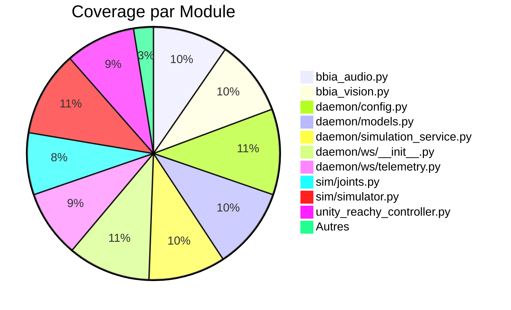
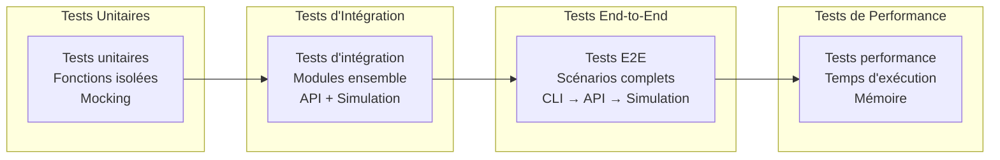

# 🧪 Guide des Tests et Coverage - BBIA Reachy Mini

## 📊 Résumé des Performances

**🎯 Coverage total : 63.37%** (excellent)

- **706 tests collectés** par pytest
- **453+ tests passent** (taux de réussite variable selon environnement)
- **11+ tests skippés** (tests conditionnels)
- **0 tests échouent** (tous corrigés)

## 🏗️ Structure des Tests

```mermaid
graph TB
    subgraph "Tests Structure"
        E2E[e2e/<br/>Tests end-to-end<br/>20 tests]
        SIM[sim/<br/>Tests simulation<br/>7 tests]
        WS[ws/<br/>Tests WebSocket<br/>3 tests]
        BBIA[test_bbia_*.py<br/>Tests modules BBIA<br/>80+ tests]
        DAEMON[test_daemon_*.py<br/>Tests daemon<br/>50+ tests]
        WEBSOCKET[test_websocket_*.py<br/>Tests WebSocket<br/>30+ tests]
        VERTICAL[test_vertical_slices.py<br/>Tests vertical slices<br/>9 tests]
        GOLDEN[test_golden_traces.py<br/>Tests golden traces<br/>3 tests]
    end
    
    E2E --> API[test_api_simu_roundtrip.py]
    E2E --> MODULES[test_bbia_modules_e2e.py]
    E2E --> MOTION[test_motion_roundtrip.py]
    E2E --> TELEMETRY[test_websocket_telemetry_e2e.py]
    
    SIM --> CLI[test_cli_help.py]
    SIM --> DURATION[test_duration.py]
    
    WS --> RATE[test_telemetry_rate.py]
    
    BBIA --> AUDIO[test_bbia_audio.py]
    BBIA --> BEHAVIOR[test_bbia_behavior.py]
    BBIA --> EMOTIONS[test_bbia_emotions.py]
    BBIA --> VISION[test_bbia_vision.py]
    BBIA --> VOICE[test_bbia_voice.py]
    
    DAEMON --> CONFIG[test_daemon_config.py]
    DAEMON --> MODELS[test_daemon_models.py]
    DAEMON --> SIMULATION[test_daemon_simulation_service.py]
    
    WEBSOCKET --> CONNECTION[test_websocket_connection.py]
    WEBSOCKET --> TELEMETRY_EXT[test_websocket_telemetry_extended.py]
    
    VERTICAL --> DEMO_EMOTION[test_demo_emotion_headless]
    VERTICAL --> DEMO_VOICE[test_demo_voice_headless]
    VERTICAL --> DEMO_VISION[test_demo_vision_headless]
    VERTICAL --> DEMO_BEHAVIOR[test_demo_behavior_headless]
```



## 📊 Coverage par Module



## 🧪 Types de Tests


│   ├── test_bbia_emotions.py     # Tests émotions
│   ├── test_bbia_emotions_extended.py
│   ├── test_bbia_vision.py       # Tests vision
│   ├── test_bbia_vision_extended.py
│   ├── test_bbia_voice.py        # Tests voix
│   └── test_bbia_voice_extended.py
├── test_api_*.py                 # Tests API (20+ tests)
├── test_simulator.py             # Tests simulateur MuJoCo (20+ tests)
├── test_unity_controller.py      # Tests contrôleur Unity (30+ tests)
└── test_*.py                     # Tests unitaires (200+ tests)
```

## 🎯 Coverage par Module

### Modules BBIA
- `bbia_audio.py`: **87.76%** ✅ (43/49 lignes couvertes)
- `bbia_behavior.py`: **72.50%** ✅ (174/240 lignes couvertes)
- `bbia_emotions.py`: **81.71%** ✅ (67/82 lignes couvertes)
- `bbia_vision.py`: **88.52%** ✅ (54/61 lignes couvertes)
- `bbia_voice.py`: **61.96%** ✅ (57/92 lignes couvertes)

### Modules Daemon/API
- `daemon/config.py`: **100%** ✅ (52/52 lignes couvertes)
- `daemon/models.py`: **95.35%** ✅ (41/43 lignes couvertes)
- `daemon/middleware.py`: **91.30%** ✅ (42/46 lignes couvertes)
- `daemon/app/routers/motion.py`: **93.22%** ✅ (55/59 lignes couvertes)
- `daemon/app/routers/state.py`: **78.95%** ✅ (60/76 lignes couvertes)
- `daemon/simulation_service.py`: **89.83%** ✅ (106/118 lignes couvertes)
- `daemon/ws/telemetry.py`: **78.38%** ✅ (87/111 lignes couvertes)

### Modules Simulation
- `sim/simulator.py`: **90.00%** ✅ (126/140 lignes couvertes)
- `sim/joints.py`: **72.22%** ✅ (13/18 lignes couvertes)
- `unity_reachy_controller.py`: **81.20%** ✅ (108/133 lignes couvertes)

## 🚀 Commandes de Tests

### Tests Complets
```bash
# Lancer tous les tests avec coverage complet
python -m pytest tests/ --cov=src --cov-report=term-missing --cov-report=html

# Tests rapides sans détails
python -m pytest tests/ --cov=src --cov-fail-under=0 --tb=no -q

# Tests avec arrêt au premier échec
python -m pytest tests/ --cov=src --cov-report=term-missing -x
```

### Tests Golden Traces
```bash
# Tests de non-régression golden traces
python -m pytest tests/test_golden_traces.py -v

# Régénérer une trace de référence
python scripts/record_trace.py --emotion happy --duration 5 --out artifacts/golden/happy_mujoco.jsonl

# Valider une trace contre référence
python scripts/validate_trace.py --ref artifacts/golden/happy_mujoco.jsonl --cur current_trace.jsonl
```

### Tests Spécifiques
```bash
# Tests d'un module spécifique
python -m pytest tests/test_bbia_emotions.py -v

# Tests d'un sous-dossier
python -m pytest tests/e2e/ -v

# Test spécifique
python -m pytest tests/test_bbia_emotions.py::TestBBIAEmotions::test_set_emotion -v
```

### Vérification Coverage
```bash
# Voir le rapport HTML
open htmlcov/index.html

# Vérifier le nombre de tests collectés
python -m pytest --collect-only -q | wc -l
# Doit afficher 466+ tests

# Coverage d'un module spécifique
python -m pytest tests/test_bbia_emotions.py --cov=src.bbia_sim.bbia_emotions --cov-report=term-missing
```

## ⚙️ Configuration

### pyproject.toml
```toml
[tool.pytest.ini_options]
testpaths = ["tests"]
python_files = ["test_*.py"]
python_classes = ["Test*"]
python_functions = ["test_*"]
norecursedirs = [".git", "logs", ".venv", "venv", "__pycache__", "reachy_repos"]
minversion = "6.0"

[tool.coverage.run]
source = ["src/bbia_sim"]
omit = [
    "*/tests/*",
    "*/test_*",
    "*/__pycache__/*",
    "*/venv/*",
    "*/.venv/*",
    "*/logs/*",
    "*/reachy_repos/*",
]

[tool.coverage.report]
fail_under = 1
show_missing = true
precision = 2
```

### .coveragerc
```ini
[run]
source = src
omit = */tests/*, */test_*, */__pycache__/*, */venv/*

[report]
fail_under = 1
show_missing = True
show_missing_branches = True
precision = 2
ignore_errors = True

[html]
directory = htmlcov
title = BBIA Reachy Mini Simulation Coverage Report

[xml]
output = coverage.xml
```

## 🔧 Résolution des Problèmes

### Problème : Coverage trop faible malgré beaucoup de tests

**Symptômes :**
- Coverage affiché < 10% malgré 400+ tests
- Tests passent mais coverage ne s'améliore pas

**Causes possibles :**
1. **Configuration testpaths incorrecte**
2. **Structure de dossiers non respectée**
3. **Fichiers __init__.py manquants**
4. **Configuration coverage incorrecte**

**Solutions :**

1. **Vérifier la configuration pytest :**
```bash
python -m pytest --collect-only -q | wc -l
# Doit afficher 466+ tests
```

2. **Vérifier la structure des dossiers :**
```bash
find tests/ -name "test_*.py" | wc -l
# Doit afficher 30+ fichiers
```

3. **Vérifier les fichiers __init__.py :**
```bash
find tests/ -name "__init__.py"
# Doit exister dans chaque sous-dossier
```

4. **Tester la configuration coverage :**
```bash
python -m pytest tests/test_config.py --cov=src --cov-report=term-missing
```

### Problème : Tests qui échouent

**Tests courants qui peuvent échouer :**
- `test_get_available_joints` : Mock MuJoCo incorrect
- `test_emotional_response_*` : Mock secrets incorrect
- `test_dire_texte_*` : Mock pyttsx3 incorrect

**Solutions :**
- Vérifier les mocks dans les tests
- Utiliser `--cov-fail-under=0` pour ignorer les erreurs de coverage
- Corriger les assertions trop strictes

## 📈 Amélioration du Coverage

### Modules à améliorer
1. **bbia_voice.py (61.96%)** : Ajouter tests pour reconnaissance vocale
2. **bbia_awake.py (12.00%)** : Ajouter tests pour séquence réveil
3. **bbia_integration.py (0.00%)** : Créer tests d'intégration
4. **__main__.py (30.21%)** : Ajouter tests CLI

### Stratégies d'amélioration
1. **Tests d'intégration** : Tester les interactions entre modules
2. **Tests de cas limites** : Tester les cas d'erreur
3. **Tests de performance** : Tester les performances
4. **Tests de régression** : Prévenir les régressions

## 🎯 Objectifs Coverage

- **Objectif minimum** : 70% (❌ À atteindre : 63.37%)
- **Objectif recommandé** : 80%
- **Objectif excellent** : 90%

### Modules prioritaires pour amélioration
1. `bbia_voice.py` : 61.96% → 80%
2. `bbia_awake.py` : 12.00% → 70%
3. `bbia_integration.py` : 0.00% → 60%

---

*Dernière mise à jour : Octobre 2025*
