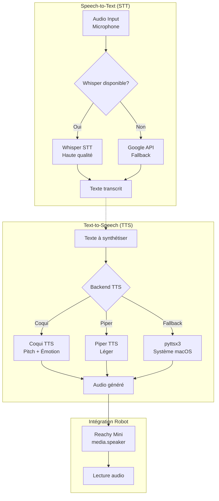

# 🎤 Analyse Complète : Voix & Intelligence BBIA

**Dernière mise à jour** : 26 Janvier 2026  
**Auteur :** Analyse technique  
**Objectif :** Identifier blocages macOS, solutions voix alternatives, et état intelligence BBIA

---

## 📋 Table des Matières

1. [État Actuel : Voix BBIA](#-état-actuel--voix-bbia)
2. [Solutions Alternatives : Générateurs de Voix](#-solutions-alternatives--générateurs-de-voix)
3. [État Actuel : Intelligence BBIA](#-état-actuel--intelligence-bbia)
4. [Recommandations Proposées](#-recommandations-proposées)
5. [Plan d'Implémentation](#-plan-dimplémentation)
6. [Résumé des Blocages](#-résumé-des-blocages)
7. [Navigation](#-navigation)

---

## 🔄 Flux Voix BBIA (TTS/STT)



---

## 📊 État actuel : Voix BBIA

### Implémentation actuelle (`bbia_voice.py`)

**Technologie** : `pyttsx3` (wrapper autour des voix système macOS)

**Blocages macOS identifiés (confirmés par test) :**

❌ **Pitch non contrôlable**

- **Message d'erreur** : `"Pitch adjustment not supported when using NSSS"`
- **Impact** : Impossible de modifier la tonalité/hauteur de voix

❌ **Contrôle émotionnel inexistant**

- `pyttsx3` ne permet pas d'ajuster l'émotion (joyeux, triste, excité, etc.)
- Seule la vitesse et le volume sont contrôlables

❌ **Voix forcée à "Amélie"**

- Actuellement, le code force l'utilisation d'Amélie
- 197 voix disponibles sur macOS mais non exploitables avec pyttsx3

❌ **Vitesse limitée**

- Rate = 170 (fixe)
- Pas de variation dynamique selon le contexte

---

## 🔍 Solutions alternatives : Générateurs de voix avancés

### Option 1 : ⭐ Coqui TTS (Recommandé)

**Repository** : `https://github.com/coqui-ai/TTS`

**Avantages :**

- ✅ Contrôle pitch/tonalité complet
- ✅ Contrôle émotionnel (happy, sad, excited, etc.)
- ✅ Multi-langues (français inclus)
- ✅ Voix pré-entraînées disponibles
- ✅ Installation simple : `pip install TTS`
- ✅ Support Apple Silicon (MPS)

**Fonctionnalités clés :**

```python
# Exemple d'utilisation
from TTS.api import TTS

tts = TTS("tts_models/fr/css10/vits")
tts.tts_to_file(
    text="Bonjour, je suis BBIA",
    file_path="output.wav",
    speaker_wav="reference_voice.wav",  # Clonage voix optionnel
    emotion="happy",  # Émotion contrôlable
    pitch=0.2  # Pitch contrôlable
)

```

**Modèles français disponibles :**

- `tts_models/fr/css10/vits` - Voix française de qualité
- `tts_models/multilingual/multi-dataset/your_tts` - Multi-langues + clonage

**Installation :**

```bash
pip install TTS
# Optionnel : pour voix haute qualité
pip install TTS[all]

```

---

### Option 2 : Piper TTS (Léger et rapide)

**Repository** : `https://github.com/rhasspy/piper`

**Avantages :**

- ✅ Très léger (modèles ~10-20MB)
- ✅ Rapide (temps réel garanti)
- ✅ Contrôle pitch via SSML
- ✅ Installation : `pip install piper-tts`

**Limitations :**

- ⚠️ Pas de contrôle émotionnel direct
- ⚠️ Qualité vocale inférieure à Coqui TTS

**Fonctionnalités :**

```python
from piper import PiperVoice

voice = PiperVoice.load("fr_FR-amélie-medium")
audio = voice.synthesize(
    "Bonjour",
    speaker_id=0,
    length_scale=1.0,  # Vitesse
    noise_scale=0.667,  # Variation
    noise_w=0.8
)

```

---

### Option 3 : XTTS v2 (Clonage voix avancé)

**Repository** : `https://github.com/coqui-ai/TTS` (partie XTTS)

**Avantages :**

- ✅ Clonage voix avec 3 secondes d'audio seulement
- ✅ Contrôle émotionnel complet
- ✅ Multi-langues
- ✅ Qualité professionnelle

**Limitations :**

- ⚠️ Plus lourd (modèle ~1.5GB)
- ⚠️ Plus lent (génération ~2-5 secondes)

**Utilisation :**

```python
from TTS.api import TTS

tts = TTS("tts_models/multilingual/multi-dataset/xtts_v2")
tts.tts_to_file(
    text="Bonjour",
    file_path="output.wav",
    speaker_wav="reference_voice.wav",  # Clone voix
    language="fr",
    emotion="happy"
)

```

---

### Option 4 : **Bark** (Voix naturelles avec bruitages)

**Repository :** `https://github.com/suno-ai/bark`

**Avantages :**

- ✅ Voix très naturelles
- ✅ Support bruitages (rire, soupir, etc.)
- ✅ Contrôle style vocal

**Limitations :**

- ⚠️ Pas de français natif (anglais principalement)
- ⚠️ Très lent (génération ~10-30 secondes)
- ⚠️ Modèle très lourd (~1GB)

---

## 🧠 ÉTAT ACTUEL : Intelligence BBIA

### Architecture Intelligence Actuelle

#### 1. **Intelligence Verbale (Conversation)**

**Module :** `bbia_huggingface.py` → `BBIAHuggingFace.chat()`

**Problème identifié :**

- ✅ Analyse sentiment : `cardiffnlp/twitter-roberta-base-sentiment-latest`
- ✅ Analyse émotion : `j-hartmann/emotion-english-distilroberta-base`
- ❌ **PAS de vrai LLM conversationnel** - Utilise seulement des règles et sentiment analysis

**Fonctionnement actuel :**

```python
# Actuellement dans bbia_huggingface.py :
def chat(self, user_message: str) -> str:
    # 1. Analyse sentiment (✅)
    sentiment = self.analyze_sentiment(user_message)

    # 2. Génération réponse (❌ Règles basiques)
    response = self._generate_response_from_sentiment(sentiment)
    # → Pas de vrai modèle de langage !

```

**Ce qui manque :**

- ❌ LLM pré-entraîné pour conversation naturelle
- ❌ Compréhension contextuelle avancée
- ❌ Génération de texte intelligente

---

#### 2. Intelligence émotionnelle

**Module** : `bbia_emotions.py` + `bbia_integration.py`

**État actuel :**

- ✅ 12 émotions BBIA définies
- ✅ Mapping vers 6 émotions SDK Reachy Mini
- ✅ Application émotions au robot via `set_emotion()` ou `goto_target()`
- ✅ Transitions fluides avec interpolation minjerk
- ✅ Durée adaptative selon intensité

**Fonctionnalités :**

```python
# Dans bbia_integration.py
def apply_emotion_to_robot(self, emotion: str, intensity: float):
    # 1. Mapping 12 BBIA → 6 SDK
    sdk_emotion = self._map_bbia_to_sdk_emotion(emotion)

    # 2. Application avec goto_target (optimisé)
    self.robot_api.goto_target(
        head=pose, body_yaw=yaw,
        duration=adaptive_duration(intensity),
        method="minjerk"
    )

```

**✅ État : Fonctionnel et optimisé**

---

#### 3. Intelligence audio (STT/Reconnaissance)

**Module** : `bbia_voice.py` + `voice_whisper.py`

**État actuel :**

- ✅ **Basique** : `speech_recognition` + Google API (gratuit, limité)
- ✅ **Avancé** : Whisper OpenAI via `voice_whisper.py` (si disponible)

**Fonctionnalités :**

```python
# Dans bbia_voice.py
def reconnaitre_parole(duree=3):
    # Utilise speech_recognition + Google API
    texte = r.recognize_google(audio, language="fr-FR")
    return texte

# Dans voice_whisper.py (optionnel)
whisper_stt = WhisperSTT(model_size="tiny")
texte = whisper_stt.transcribe(audio)

```

**✅ État : Fonctionnel (Whisper = meilleure qualité si disponible)**

---

#### 4. Intelligence visuelle

**Module** : `bbia_vision.py` + `bbia_huggingface.py`

**État actuel :**

- ✅ Détection objets : YOLOv8n
- ✅ Reconnaissance visages : MediaPipe
- ✅ Description images : BLIP via `bbia_huggingface.py`
- ✅ Vision avancée : CLIP pour classification

**✅ État** : Très fonctionnel

---

## 💡 Recommandations proposées

### 1. Remplacer pyttsx3 par Coqui TTS ⭐

**Pourquoi :**

- Contrôle pitch/tonalité complet (résout blocage macOS)
- Contrôle émotionnel (happy, sad, excited, etc.)
- Qualité vocale supérieure
- Support français natif

**Migration :**

```python
# Nouveau bbia_voice_advanced.py
from TTS.api import TTS

class BBIAVoiceAdvanced:
    def __init__(self):
        self.tts = TTS("tts_models/fr/css10/vits")
        self.current_emotion = "neutral"

    def say(self, text: str, emotion: str = None, pitch: float = 0.0):
        emotion = emotion or self.current_emotion
        self.tts.tts_to_file(
            text=text,
            file_path="temp_audio.wav",
            emotion=emotion,
            pitch=pitch
        )
        # Jouer audio
        playsound("temp_audio.wav")

```

---

### 2. Ajouter LLM pré-entraîné pour conversation ⭐⭐

**Options :**

#### A. Mistral 7B Instruct (Recommandé)

- ✅ Léger (7B paramètres)
- ✅ Français de qualité
- ✅ Open-source
- ✅ Support Apple Silicon (MPS)

**Installation :**

```bash
pip install transformers accelerate

```

**Intégration :**

```python
# Dans bbia_huggingface.py
from transformers import AutoModelForCausalLM, AutoTokenizer

class BBIAHuggingFace:
    def __init__(self):
        # ... code existant ...
        self.chat_model = None

    def load_chat_model(self):
        model_name = "mistralai/Mistral-7B-Instruct-v0.2"
        self.chat_tokenizer = AutoTokenizer.from_pretrained(model_name)
        self.chat_model = AutoModelForCausalLM.from_pretrained(
            model_name,
            device_map="auto"  # Auto-détecte MPS/CPU
        )

    def chat(self, user_message: str) -> str:
        if not self.chat_model:
            self.load_chat_model()

        # Conversation avec contexte
        messages = [
            {"role": "system", "content": "Tu es BBIA, un robot Reachy Mini amical et curieux."},
            {"role": "user", "content": user_message}
        ]

        inputs = self.chat_tokenizer.apply_chat_template(
            messages, return_tensors="pt"
        ).to(self.device)

        outputs = self.chat_model.generate(
            inputs, max_new_tokens=100, temperature=0.7
        )

        response = self.chat_tokenizer.decode(
            outputs[0][inputs.shape[1]:], skip_special_tokens=True
        )

        # Analyser sentiment pour émotion robot
        sentiment = self.analyze_sentiment(user_message)
        self._apply_sentiment_to_robot(sentiment)

        return response

```

#### B. Llama 3 8B (Alternative)

- ✅ Open-source
- ✅ Qualité élevée
- ⚠️ Plus lourd que Mistral 7B

#### C. API OpenAI (GPT-4o-mini) (Simple mais payant)

- ✅ Facile à intégrer
- ✅ Qualité maximale
- ❌ Coût (~$0.15/M tokens)
- ❌ Dépendance externe

---

### 3. Intégration voix + intelligence combinée

**Architecture proposée :**

```python
# bbia_voice_advanced.py
class BBIAVoiceAdvanced:
    def __init__(self):
        self.tts = TTS("tts_models/fr/css10/vits")
        self.emotion_map = {
            "happy": {"emotion": "happy", "pitch": 0.3},
            "sad": {"emotion": "sad", "pitch": -0.2},
            "excited": {"emotion": "excited", "pitch": 0.4},
            "neutral": {"emotion": "neutral", "pitch": 0.0}
        }

    def say_with_emotion(self, text: str, bbia_emotion: str):
        """Synthétise voix avec émotion correspondante."""
        voice_config = self.emotion_map.get(bbia_emotion, self.emotion_map["neutral"])

        self.tts.tts_to_file(
            text=text,
            file_path="temp_audio.wav",
            emotion=voice_config["emotion"],
            pitch=voice_config["pitch"]
        )

        # Jouer + synchroniser avec mouvements robot
        playsound("temp_audio.wav")

```

---

## 📋 Plan d'implémentation

### Phase 1 : Migration voix (Priorité haute)

1. ✅ Installer Coqui TTS : `pip install TTS`
2. ✅ Créer `bbia_voice_advanced.py` avec Coqui TTS
3. ✅ Tester contrôle pitch/émotion
4. ✅ Intégrer dans `bbia_behavior.py` et `bbia_integration.py`
5. ✅ Déprécier `bbia_voice.py` (garder en fallback)

### Phase 2 : Ajouter LLM conversation (Priorité moyenne)

1. ✅ Installer Mistral 7B : `pip install transformers accelerate`
2. ✅ Modifier `BBIAHuggingFace.chat()` pour utiliser vrai LLM
3. ✅ Tester conversations longues avec contexte
4. ✅ Optimiser pour Apple Silicon (MPS)

### Phase 3 : Intégration complète (Priorité basse)

1. ✅ Synchroniser voix émotionnelle avec mouvements robot
2. ✅ Ajouter contrôle fin pitch selon contexte
3. ✅ Optimiser latence (cache modèles)

---

## 🎯 Résumé des blocages

### Blocages macOS avec pyttsx3

- ❌ Pitch non contrôlable
- ❌ Contrôle émotionnel inexistant
- ❌ Voix limitées (197 dispo mais non exploitables)
- ❌ Vitesse fixe

### Solutions proposées

- ✅ **Coqui TTS** : Résout tous les blocages
- ✅ **Piper TTS** : Alternative légère (pas d'émotion)
- ✅ **XTTS v2** : Clonage voix (si besoin voix personnalisée)

### Intelligence conversationnelle

- ❌ **Actuellement** : Règles + sentiment analysis uniquement
- ✅ **Solution** : Mistral 7B Instruct ou Llama 3 8B
- ✅ **Alternative simple** : API OpenAI (payant)

---

## 📚 RESSOURCES

- **Coqui TTS :** https://github.com/coqui-ai/TTS
- **Piper TTS :** https://github.com/rhasspy/piper
- **Mistral 7B :** https://huggingface.co/mistralai/Mistral-7B-Instruct-v0.2
- **Llama 3 :** https://huggingface.co/meta-llama/Llama-3-8B-Instruct

---

**Prochaine étape :** Implémenter Phase 1 (Coqui TTS) pour résoudre blocages macOS immédiatement.

## 🎧 Intégration SDK Reachy Mini (media.speaker)

- **Nouveau**: `bbia_voice_advanced.py` supporte `robot_api.media.play_audio` quand disponible.
- **Priorité d'exécution**:
  1. `robot.media.play_audio(bytes, volume)` (si exposé par le backend Reachy Mini)
  2. `robot.media.speaker.play_file(path)` ou `robot.media.speaker.play(bytes)`
  3. Fallback local `playsound()`
- **Bénéfices**:
  - Latence plus faible et rendu audio matériel direct du Reachy Mini
  - Volume géré côté robot
  - Alignement avec la pile officielle (référence: SDK `reachy_mini`)

> Note: Aucun changement de date; cette section documente l'alignement avec le SDK officiel.

---

## 🎯 Navigation

**Retour à** : [README Documentation](../README.md)  
**Voir aussi** : [Modules IA](modules.md) • [Intelligence LLM](llm.md) • [Index Thématique](../reference/INDEX_THEMATIQUE.md)
