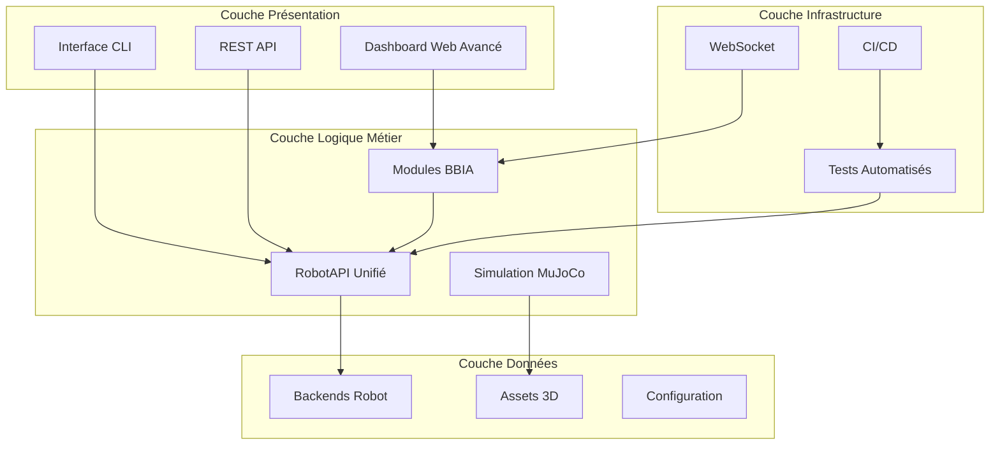
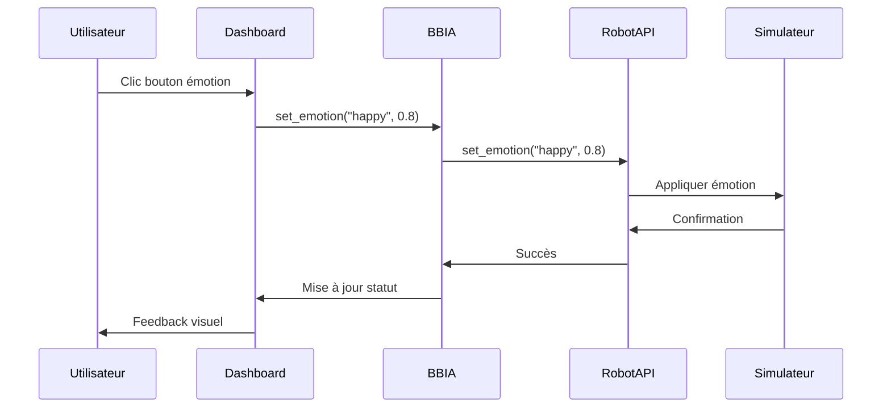
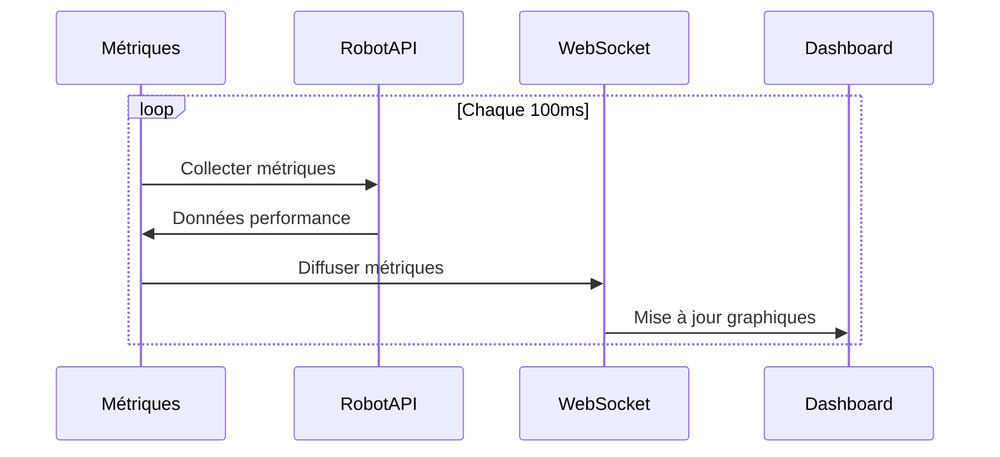
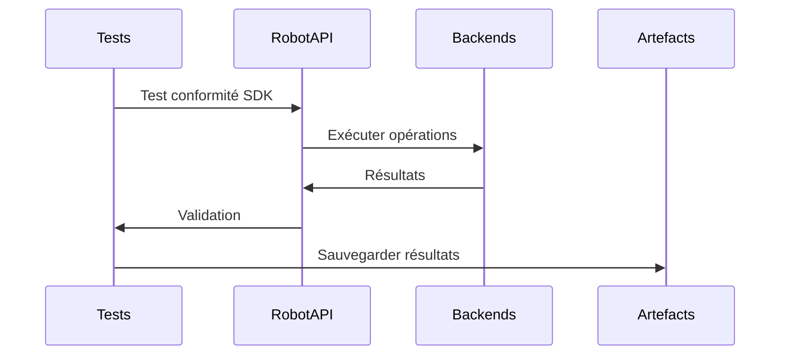

# BBIA-SIM - guide d’architecture détaillé

> Liens utiles: `docs/references/INDEX_THEMATIQUE.md` · `docs/status.md`

## Vue d'ensemble

BBIA-SIM (Brain-Based Interactive Agent Simulation) est un moteur cognitif Python avancé pour robot Reachy Mini Wireless, intégrant simulation MuJoCo, intelligence artificielle légère, et contrôle unifié via RobotAPI.

> Référence état global
>
> Voir `docs/status.md` → section "État par axe" pour l’état actuel (Observabilité, Performance, Sécurité, CI/CD, etc.) et les axes d’amélioration.

### Objectifs architecturaux

- **Conformité** avec le SDK officiel Reachy Mini
- **Backend unifié** pour simulation et robot réel
- **Modules BBIA modulaires** et extensibles
- **Performance** avec métriques temps réel
- **Qualité** (tests, CI/CD, documentation)

---

## Architecture générale



---

## Composants principaux

### 1. RobotAPI unifié

**Fichier principal :** `src/bbia_sim/robot_api.py`

```python
class RobotAPI:
    """Interface abstraite unifiée pour simulation et robot réel."""

    def get_joint_pos(self, joint_name: str) -> float:
        """Récupère la position d'un joint."""

    def set_joint_pos(self, joint_name: str, position: float) -> bool:
        """Définit la position d'un joint."""

    def set_emotion(self, emotion: str, intensity: float = 0.5) -> bool:
        """Définit une émotion sur le robot."""

    def get_telemetry(self) -> dict[str, Any]:
        """Récupère les données de télémétrie."""
```

Avantages :
- Code identique simulation ↔ robot réel
- Bascule facile entre backends
- Tests unitaires communs
- API stable et documentée

### **2. Backends Robot**

**Structure :** `src/bbia_sim/backends/`

#### MuJoCo backend
- **Fichier :** `mujoco_backend.py`
- **Usage :** Simulation physique réaliste
- **Performance :** <1 ms de latence
- **Fonctionnalités :** Physique, collisions, gravité

#### Reachy Mini backend
- **Fichier :** `reachy_mini_backend.py`
- **Usage :** Robot physique Reachy Mini
- **Conformité :** SDK officiel
- **Méthodes :** principales méthodes implémentées

#### Reachy mock backend
- **Fichier :** `reachy_backend.py`
- **Usage :** Simulation simple (legacy)
- **Performance :** Ultra-rapide
- **Limitations :** Pas de physique

### **3. Modules BBIA**

**Structure :** `src/bbia_sim/bbia_*.py`

#### **BBIA Emotions**
```python
class BBIAEmotions:
    """Gestion des émotions avancées."""

    def set_emotion(self, emotion: str, intensity: float) -> bool:
        """Définit une émotion avec intensité."""

    def get_available_emotions(self) -> list[str]:
        """Retourne les émotions disponibles."""
```

**Émotions supportées :**
- `happy`, `sad`, `angry`, `excited`
- `neutral`, `curious`, `calm`, `surprised`
- `fearful`, `disgusted`, `contemptuous`, `embarrassed`

#### **BBIA Vision**
```python
class BBIAVision:
    """Module de vision par ordinateur."""

    def scan_environment(self) -> dict[str, Any]:
        """Scane l'environnement et détecte les objets."""

    def detect_faces(self) -> list[dict[str, Any]]:
        """Détecte les visages dans l'image."""
```

**Fonctionnalités :**
- Détection d'objets (YOLOv8n)
- Reconnaissance de visages (MediaPipe)
- Suivi d'objets en temps réel
- Caméra grand angle 1080p

#### **BBIA Voice**
```python
class BBIAVoice:
    """Module de synthèse et reconnaissance vocale."""

    def speak(self, text: str) -> bool:
        """Synthèse vocale."""

    def listen(self) -> Optional[str]:
        """Reconnaissance vocale."""
```

**Technologies :**
- **TTS :** pyttsx3 (synthèse vocale)
- **STT :** Whisper (reconnaissance vocale)
- **Audio :** 4 microphones + haut-parleur
- **Latence :** <800ms STT

#### **BBIA Behavior**
```python
class BBIABehaviorManager:
    """Gestionnaire de comportements complexes."""

    def run_behavior(self, behavior_name: str, duration: float) -> bool:
        """Exécute un comportement."""
```

**Comportements disponibles :**
- `greeting`, `exploration`, `interaction`
- `demo`, `wake_up`, `goto_sleep`
- `nod`, `look_at`, `follow_face`

### **4. Simulation MuJoCo**

**Structure :** `src/bbia_sim/sim/`

#### **MuJoCo Simulator**
```python
class MuJoCoSimulator:
    """Simulateur MuJoCo pour le robot Reachy Mini."""

    def __init__(self, model_path: str):
        """Initialise le simulateur."""

    def set_joint_position(self, joint_name: str, position: float):
        """Définit la position d'un joint."""

    def get_joint_position(self, joint_name: str) -> float:
        """Récupère la position d'un joint."""
```

**Modèles :**
- `reachy_mini_REAL_OFFICIAL.xml` : Modèle officiel
- `reachy_mini.xml` : Modèle de base
- `minimal.xml` : Scène minimale

**Assets :**
- 41 fichiers STL officiels
- Textures et matériaux
- Environnements virtuels

### **5. Dashboard Web Avancé**

**Structure :** `src/bbia_sim/dashboard_advanced.py`

**Fonctionnalités :**
- Interface temps réel avec WebSocket
- Métriques live (latence, FPS, CPU, mémoire)
- Contrôle des joints avec sliders
- Visualisation des émotions
- Graphiques Chart.js intégrés
- API REST complète

**Endpoints API :**
- `GET /api/status` : Statut complet
- `GET /api/metrics` : Métriques temps réel
- `GET /api/joints` : Joints disponibles
- `POST /api/emotion` : Définir émotion
- `POST /api/joint` : Contrôler joint
- `WebSocket /ws` : Communication temps réel

---

## 🔄 **Flux de Données**

### **1. Flux de Contrôle Standard**



### **2. Flux de Métriques Temps Réel**



### **3. Flux de Tests Automatisés**



---

## 🧪 **Architecture de Tests**

### **Structure des Tests**

```
tests/
├── test_robot_api.py              # Tests RobotAPI unifié
├── test_reachy_mini_conformity.py # Tests conformité SDK officiel
├── test_bbia_*.py                 # Tests modules BBIA
├── test_simulator.py              # Tests simulateur MuJoCo
├── test_dashboard.py              # Tests dashboard web
├── e2e/                           # Tests end-to-end
│   ├── test_api_simu_roundtrip.py
│   └── test_bbia_modules_e2e.py
└── test_performance.py            # Tests de performance
```

### **Types de Tests**

#### **Tests Unitaires**
- **Couverture :** 63.37%
- **Outils :** pytest, coverage
- **Focus :** Modules individuels

#### **Tests d'Intégration**
- **RobotAPI ↔ Backends**
- **BBIA ↔ RobotAPI**
- **Dashboard ↔ WebSocket**

#### **Tests de Conformité**
- **SDK Officiel :** 16 tests, réussite constatée
- **Signatures :** Types de retour conformes
- **Comportement :** Identique simulation/réel

#### **Tests de Performance**
- **Latence :** <1ms en simulation
- **Charge :** Multi-clients concurrents
- **Mémoire :** Pas de fuites
- **CPU :** Optimisation continue

### **CI/CD Pipeline**

```yaml
# .github/workflows/ci.yml
name: BBIA-SIM CI/CD
on: [push, pull_request]

jobs:
  test:
    runs-on: ubuntu-latest
    steps:
      - uses: actions/checkout@v3
      - name: Setup Python
        uses: actions/setup-python@v4
        with:
          python-version: '3.10'
      - name: Install dependencies
        run: pip install -r requirements.txt
      - name: Run tests
        run: pytest tests/ --cov=src --cov-report=xml
      - name: Upload coverage
        uses: codecov/codecov-action@v3
```

---

## 📊 **Métriques et Monitoring**

### **Métriques Temps Réel**

```python
class MetricsCollector:
    """Collecteur de métriques BBIA."""

    def collect_robot_metrics(self) -> dict:
        """Métriques robot."""
        return {
            "latency_ms": self.measure_latency(),
            "fps": self.measure_fps(),
            "joint_positions": self.get_joint_positions(),
            "current_emotion": self.get_current_emotion()
        }

    def collect_system_metrics(self) -> dict:
        """Métriques système."""
        return {
            "cpu_usage": psutil.cpu_percent(),
            "memory_usage": psutil.virtual_memory().percent,
            "active_connections": len(self.websocket_connections)
        }
```

### **Dashboard Métriques**

- **Graphiques temps réel** : Chart.js
- **Métriques système** : CPU, mémoire, réseau
- **Métriques robot** : Latence, FPS, positions
- **Métriques BBIA** : Émotions, vision, audio

### **Logs et Traces**

```python
# Configuration logging
logging.basicConfig(
    level=logging.INFO,
    format="%(asctime)s - %(name)s - %(levelname)s - %(message)s",
    handlers=[
        logging.FileHandler("log/bbia.log"),
        logging.StreamHandler()
    ]
)
```

---

## 🔒 **Sécurité et Qualité**

### **Contraintes de Sécurité**

```python
class SafetyManager:
    """Gestionnaire de sécurité BBIA."""

    def __init__(self):
        self.safe_amplitude_limit = 0.3  # rad
        self.forbidden_joints = {"left_antenna", "right_antenna"}
        self.max_latency_ms = 40.0

    def validate_joint_command(self, joint: str, position: float) -> bool:
        """Valide une commande de joint."""
        if joint in self.forbidden_joints:
            return False
        if abs(position) > self.safe_amplitude_limit:
            return False
        return True
```

### **Outils de Qualité**

- **Black** : Formatage automatique
- **Ruff** : Linting rapide
- **MyPy** : Vérification de types
- **Bandit** : Analyse de sécurité
- **Pre-commit** : Hooks de qualité

### **Configuration Qualité**

```toml
# pyproject.toml
[tool.black]
line-length = 88
target-version = ['py311']

[tool.ruff]
target-version = "py311"
line-length = 88

[tool.mypy]
python_version = "3.11"
warn_return_any = false
```

---

## 🚀 **Déploiement et Production**

### **Environnements**

#### **Développement**
```bash
# Dashboard avancé
python scripts/bbia_advanced_dashboard_server.py --backend mujoco

# Tests
pytest tests/ -v --cov=src

# Benchmarks
python scripts/bbia_performance_benchmarks.py --benchmark all
```

#### **Production**
```bash
# Robot réel
python scripts/bbia_advanced_dashboard_server.py --backend reachy_mini

# Monitoring
python scripts/monitor_performance.py --daemon
```

### **Configuration Production**

```python
# config/production.py
class ProductionConfig:
    """Configuration production."""

    # Robot
    ROBOT_BACKEND = "reachy_mini"
    ROBOT_TIMEOUT = 5.0

    # Performance
    METRICS_INTERVAL = 0.1  # 100ms
    MAX_CONNECTIONS = 100

    # Sécurité
    SAFE_AMPLITUDE_LIMIT = 0.3
    FORBIDDEN_JOINTS = {"left_antenna", "right_antenna"}

    # Logging
    LOG_LEVEL = "INFO"
    LOG_FILE = "log/bbia_production.log"
```

---

## 📈 **Évolutivité et Extensibilité**

### **Points d'Extension**

#### **Nouveaux Backends**
```python
class CustomBackend(RobotAPI):
    """Backend personnalisé."""

    def get_joint_pos(self, joint_name: str) -> float:
        # Implémentation personnalisée
        pass
```

#### **Nouveaux Modules BBIA**
```python
class CustomBBIAModule:
    """Module BBIA personnalisé."""

    def __init__(self):
        self.robot_api = None

    def set_robot_api(self, robot_api: RobotAPI):
        """Injection de dépendance."""
        self.robot_api = robot_api
```

#### **Nouvelles Métriques**
```python
class CustomMetricsCollector:
    """Collecteur de métriques personnalisé."""

    def collect_custom_metrics(self) -> dict:
        """Métriques personnalisées."""
        return {
            "custom_metric": self.calculate_custom_metric()
        }
```

### **Architecture Modulaire**

- **Injection de dépendances** : RobotAPI injecté dans modules BBIA
- **Interfaces abstraites** : RobotAPI comme contrat
- **Configuration externe** : Settings via fichiers
- **Plugins** : Modules BBIA comme plugins

---

## 🔮 **Roadmap Technique**

### **Phase 1 : Améliorations Courtes (2-4 semaines)**
- ✅ Dashboard web avancé
- ✅ Benchmarks de performance
- ✅ Guide d'architecture

### **Phase 2 : Innovations Moyennes (1-2 mois)**
- 🔄 Intégration Hugging Face
- 🔄 Physique avancée MuJoCo
- 🔄 Support ROS2

### **Phase 3 : Ouverture Écosystème (Mois 3)**
- 🔄 API publique
- 🔄 Support open-source
- 🔄 Communauté technique

---

## 📚 **Ressources et Documentation**

### **Documentation Technique**
- **README.md** : Guide de démarrage rapide
- **ARCHITECTURE.md** : Ce guide d'architecture
- **CONTRACT.md** : Contrat API RobotAPI
- **TESTING_GUIDE.md** : Guide des tests

### **Exemples et Démos**
- **examples/** : Scripts d'exemple
- **scripts/** : Scripts utilitaires
- **tests/** : Tests de référence

### **Communauté**
- **GitHub Issues** : Support et bugs
- **Discussions** : Questions techniques
- **Wiki** : Documentation communautaire

---

## 🎯 **Conclusion**

L'architecture BBIA-SIM est conçue pour être :

- **✅ Modulaire** : Composants indépendants et réutilisables
- **✅ Extensible** : Points d'extension clairs
- **✅ Performante** : Optimisations continues
- **✅ Sécurisée** : Contraintes de sécurité intégrées
- **✅ Testable** : Couverture de tests complète
- **✅ Documentée** : Documentation technique exhaustive

Cette architecture permet à BBIA-SIM d'être une **référence technique** pour l'intégration Reachy Mini et l'IA cognitive robotique.

---

*Dernière mise à jour : Octobre 2025*
*Version : 1.3.2 – Alignement et release stable*
