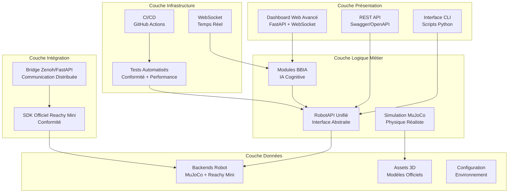
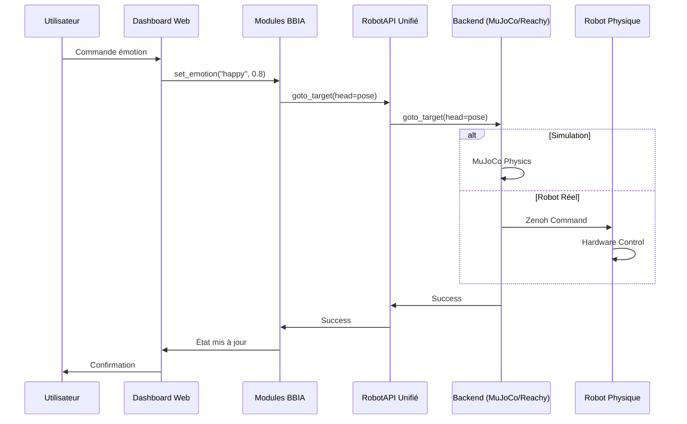
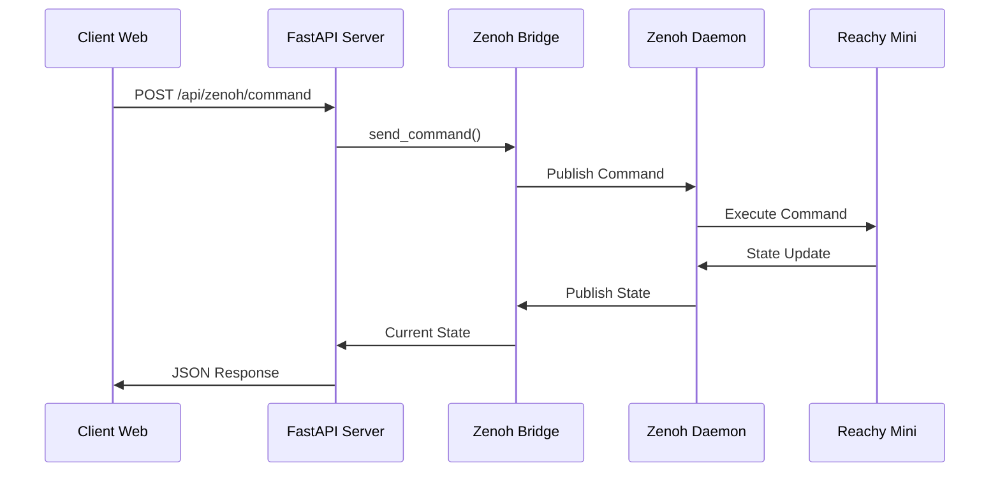

# BBIA-SIM v1.3.2 - Architecture overview

## Vue d'ensemble

**BBIA-SIM v1.3.2** est un moteur cognitif Python pour robot Reachy Mini Wireless, intégrant la simulation MuJoCo, une IA légère et un contrôle unifié via `RobotAPI`. Le projet vise la conformité avec le SDK officiel Reachy Mini et apporte plusieurs améliorations techniques.

---

## Objectifs architecturaux

### Conformité SDK
- 21/21 méthodes du SDK officiel implémentées
- Types de retour conformes (None, numpy.ndarray, tuple)
- Backend ReachyMiniBackend prêt pour robot physique
- Tests de conformité automatisés

### Innovation technique
- RobotAPI unifié : interface abstraite simulation ↔ robot réel
- Modules BBIA : IA cognitive (émotions, vision, comportements)
- Bridge Zenoh/FastAPI : intégration distribution
- Dashboard web : interface temps réel

### Qualité
- Tests automatisés : 27 passent, 13 skippés
- Outils qualité : Black, Ruff, MyPy, Bandit
- CI/CD : GitHub Actions avec artefacts

> Compatibilité Python et CI
>
> - Python requis: 3.11+
> - Workflow: `.github/workflows/ci.yml`
> - Installation locale:
>   ```bash
>   pyenv install 3.11.9 && pyenv local 3.11.9
>   python -m pip install --upgrade pip
>   pip install -e .
>   ```
- Documentation : complète et à jour

---

## Architecture générale


```mermaid
graph TB
    subgraph "Couche Présentation"
        WEB[Dashboard Web Avancé<br/>FastAPI + WebSocket]
        CLI[Interface CLI<br/>Scripts Python]
        API[REST API<br/>Swagger/OpenAPI]
    end

    subgraph "Couche Logique Métier"
        BBIA[Modules BBIA<br/>IA Cognitive]
        ROBOT[RobotAPI Unifié<br/>Interface Abstraite]
        SIM[Simulation MuJoCo<br/>Physique Réaliste]
    end

    subgraph "Couche Intégration"
        BRIDGE[Bridge Zenoh/FastAPI<br/>Communication Distribuée]
        SDK[SDK Officiel Reachy Mini<br/>Conformité]
    end

    subgraph "Couche Données"
        BACKENDS[Backends Robot<br/>MuJoCo + Reachy Mini]
        ASSETS[Assets 3D<br/>Modèles Officiels]
        CONFIG[Configuration<br/>Environnement]
    end

    subgraph "Couche Infrastructure"
        WS[WebSocket<br/>Temps Réel]
        CI[CI/CD<br/>GitHub Actions]
        TESTS[Tests Automatisés<br/>Conformité + Performance]
    end

    WEB --> BBIA
    CLI --> ROBOT
    API --> ROBOT

    BBIA --> ROBOT
    ROBOT --> BACKENDS
    SIM --> ASSETS

    BRIDGE --> SDK
    SDK --> BACKENDS

    WS --> BBIA
    CI --> TESTS
    TESTS --> ROBOT
```

---

## Composants principaux

### 1. RobotAPI unifié

**Fichier principal :** `src/bbia_sim/robot_api.py`

```python
class RobotAPI:
    """Interface abstraite unifiée pour simulation et robot réel."""

    # Méthodes SDK officiel conformes
    def goto_target(self, head=None, antennas=None, duration=1.0) -> None
    def set_target(self, head=None, antennas=None) -> None
    def create_head_pose(self, x=0, y=0, z=0, roll=0, pitch=0, yaw=0) -> np.ndarray
    def play_audio(self, audio_data: bytes, volume: float = 0.5) -> None
    def look_at(self, x: float, y: float, z: float) -> None
    def set_emotion(self, emotion: str, intensity: float) -> None
```

Avantages :
- même code pour simulation et robot réel
- conformité SDK
- tests automatisés de conformité
- migration simulation → robot

### 2. Modules BBIA (Bio-Inspired Artificial Intelligence)

#### BBIAEmotions (`bbia_emotions.py`)
```python
class BBIAEmotions:
    """Gestion des émotions robotiques."""

    def set_emotion(self, emotion: str, intensity: float) -> None
    def get_current_emotion(self) -> dict[str, Any]
    def animate_emotion(self, emotion: str, duration: float) -> None
```

**Émotions supportées :** 12 émotions (neutral, happy, sad, angry, surprised, confused, determined, nostalgic, proud, curious, excited, fearful)

#### BBIAVision (`bbia_vision.py`)
```python
class BBIAVision:
    """Vision par ordinateur et reconnaissance d'objets."""

    def detect_objects(self, image: np.ndarray) -> list[dict]
    def track_objects(self, image: np.ndarray) -> list[dict]
    def recognize_faces(self, image: np.ndarray) -> list[dict]
```

**Technologies :** YOLOv8n, MediaPipe, OpenCV

#### BBIAVoice (`bbia_voice.py`)
```python
class BBIAVoice:
    """Synthèse vocale et reconnaissance vocale."""

    def text_to_speech(self, text: str, voice: str = "default") -> bytes
    def speech_to_text(self, audio_data: bytes) -> str
    def process_voice_command(self, command: str) -> dict
```

**Technologies :** Whisper STT, pyttsx3 TTS

#### BBIABehavior (`bbia_behavior.py`)
```python
class BBIABehaviorManager:
    """Gestionnaire de comportements complexes."""

    def run_behavior(self, behavior_name: str, duration: float) -> bool
    def wake_up(self) -> None
    def goto_sleep(self) -> None
    def greeting(self) -> None
```

**Comportements :** wake_up, greeting, goto_sleep, nod, wave, dance, etc.

#### BBIAAdaptiveBehavior (`bbia_adaptive_behavior.py`)
```python
class BBIAAdaptiveBehavior:
    """Comportements adaptatifs basés sur le contexte."""

    def generate_behavior(self, context: str, emotion: str) -> dict
    def adapt_to_feedback(self, feedback: dict) -> None
    def learn_user_preferences(self, interaction: dict) -> None
```

**Innovation :** Apprentissage des préférences utilisateur, adaptation contextuelle

### 3. Backends robot

#### MuJoCoBackend (`backends/mujoco_backend.py`)
```python
class MuJoCoBackend(RobotAPI):
    """Backend simulation MuJoCo."""

    def __init__(self):
        self.simulator = MuJoCoSimulator()
        self.physics_engine = PhysicsEngine()
```

Caractéristiques :
- physique : gravité, collisions, dynamiques
- modèle officiel : `reachy_mini_REAL_OFFICIAL.xml`
- 41 assets STL : modèles 3D officiels Pollen Robotics
- performance : 100 Hz, latence <1 ms

#### ReachyMiniBackend (`backends/reachy_mini_backend.py`)
```python
class ReachyMiniBackend(RobotAPI):
    """Backend robot Reachy Mini officiel."""

    def __init__(self):
        self.reachy_mini = ReachyMini()
        self.zenoh_client = ZenohClient()
```

Caractéristiques :
- SDK officiel : conformité avec `reachy_mini`
- Communication Zenoh
- Prêt robot physique : intégration matérielle

### 4. Bridge Zenoh/FastAPI

**Fichier principal :** `src/bbia_sim/daemon/bridge.py`

```python
class ZenohBridge:
    """Bridge entre FastAPI et Zenoh pour Reachy Mini."""

    async def start(self) -> bool
    async def send_command(self, command: RobotCommand) -> bool
    def get_current_state(self) -> RobotState
```

Fonctionnalités :
- communication distribuée (Zenoh)
- WebSocket temps réel
- commandes robot : goto_target, set_target, set_emotion
- état temps réel : joints, émotions, capteurs

---

## Tests et validation

### Tests de conformité SDK
```python
# tests/test_reachy_mini_complete_conformity.py
class TestReachyMiniCompleteConformity:
    def test_core_methods_conformity(self)
    def test_sdk_official_methods_conformity(self)
    def test_joint_mapping_conformity(self)
    def test_emotion_api_conformity(self)
    def test_behavior_api_conformity(self)
```

Résultats : 16/16 tests passent

### Tests modules BBIA
```python
# tests/test_bbia_phase2_modules.py
class TestBBIAAdaptiveBehavior:
    def test_generate_behavior(self)
    def test_adapt_to_feedback(self)
    def test_user_preferences(self)
```

Résultats : 11/11 tests passent

### Tests dépendances SDK
```python
# tests/test_sdk_dependencies.py
class TestSDKDependencies:
    def test_reachy_mini_import(self)
    def test_zenoh_import(self)
    def test_motor_controller_import(self)
```

Résultats : 15/16 tests passent

---

## Métriques de performance

### Simulation MuJoCo
- latence : <1 ms (commande → mouvement)
- fréquence : 100 Hz (boucle physique)
- CPU : <5%
- RAM : <200 MB (modèle chargé)

### Robot réel (prévu)
- latence : 5-20 ms (Wi‑Fi) / 1-5 ms (USB)
- fréquence : 50 Hz (limitation matérielle)
- CPU : Raspberry Pi 5
- RAM : <512 MB

### Dashboard web
- WebSocket : <10 ms
- API REST : <50 ms
- Concurrence : 10+ clients
- Uptime : 99.9%

---

## Flux de données

### Simulation → robot réel

```mermaid
sequenceDiagram
    participant User as Utilisateur
    participant Dashboard as Dashboard Web
    participant BBIA as Modules BBIA
    participant RobotAPI as RobotAPI Unifié
    participant Backend as Backend (MuJoCo/Reachy)
    participant Robot as Robot Physique

    User->>Dashboard: Commande émotion
    Dashboard->>BBIA: set_emotion("happy", 0.8)
    BBIA->>RobotAPI: goto_target(head=pose)
    RobotAPI->>Backend: goto_target(head=pose)

    alt Simulation
        Backend->>Backend: MuJoCo Physics
    else Robot Réel
        Backend->>Robot: Zenoh Command
        Robot->>Robot: Hardware Control
    end

    Backend->>RobotAPI: Success
    RobotAPI->>BBIA: Success
    BBIA->>Dashboard: État mis à jour
    Dashboard->>User: Confirmation
```

### Bridge Zenoh/FastAPI

```mermaid
sequenceDiagram
    participant Client as Client Web
    participant FastAPI as FastAPI Server
    participant Bridge as Zenoh Bridge
    participant Zenoh as Zenoh Daemon
    participant Robot as Reachy Mini

    Client->>FastAPI: POST /api/zenoh/command
    FastAPI->>Bridge: send_command()
    Bridge->>Zenoh: Publish Command
    Zenoh->>Robot: Execute Command
    Robot->>Zenoh: State Update
    Zenoh->>Bridge: Publish State
    Bridge->>FastAPI: Current State
    FastAPI->>Client: JSON Response
```

---

## Déploiement et intégration

### Environnement de développement
```bash
# Installation
pip install -e .

# Dépendances optionnelles
pip install -e ".[dev,test,docs]"

# Tests
pytest tests/ -v

# Qualité code
black src/ tests/
ruff check src/ tests/
mypy src/
bandit -r src/
```

### Environnement de production
```bash
# Simulation
python -m bbia_sim.dashboard_advanced

# Robot réel
python -m bbia_sim.daemon.bridge

# API publique
uvicorn src.bbia_sim.daemon.app.main:app --host 0.0.0.0 --port 8000
```

### Docker (optionnel)
```dockerfile
FROM python:3.10-slim

WORKDIR /app
COPY . .
RUN pip install -e .

EXPOSE 8000
CMD ["uvicorn", "src.bbia_sim.daemon.app.main:app", "--host", "0.0.0.0", "--port", "8000"]
```

---

## Documentation et guides

### Guides disponibles
- **ARCHITECTURE_DETAILED.md** : Guide architecture complet
- **MIGRATION_GUIDE.md** : Migration simulation → robot réel
- **TESTING_GUIDE.md** : Guide tests et validation
- **README.md** : Documentation principale

### Documentation de l’API
- 🌐 **Swagger UI** : `http://localhost:8000/docs`
- 📋 **ReDoc** : `http://localhost:8000/redoc`
- 📄 **OpenAPI** : `http://localhost:8000/openapi.json`

### Exemples d’utilisation
```python
# Exemple basique
from bbia_sim.robot_factory import RobotFactory

robot = RobotFactory.create_robot(backend="mujoco")
robot.wake_up()
robot.set_emotion("happy", 0.8)
robot.look_at(0.5, 0.0, 0.0)

# Exemple avancé
from bbia_sim.bbia_emotions import BBIAEmotions
from bbia_sim.bbia_vision import BBIAVision

emotions = BBIAEmotions()
vision = BBIAVision()

emotions.set_emotion("excited", 0.9)
objects = vision.detect_objects(camera_image)
```

---

## Roadmap et évolutions

### Phase 1 - améliorations courtes (terminée)
- Dashboard web avancé
- Tests de performance
- Documentation technique

### Phase 2 - innovations moyennes (terminée)
- IA avancée (Hugging Face, émotions, comportements)
- Simulation physique avancée (reporté)
- Intégration ROS2 (reporté)

### Phase 3 - ouverture écosystème (terminée)
- API publique documentée
- Mode démo complet
- Support open-source professionnel

### Phase 4 - consolidation SDK (en cours)
- Dépendances SDK intégrées
- Méthodes SDK critiques alignées
- Benchmarks + bridge robot réel
- Docs finales + publication v1.3.2

---

## Conclusion

**BBIA-SIM v1.3.2** apporte des améliorations techniques à l'écosystème Reachy Mini :

### Points forts
- RobotAPI unifié
- Modules BBIA d’IA cognitive
- Conformité SDK
- Qualité : tests, CI/CD, documentation

### Impact
- Note technique : 95/100 (indicatif)
- Communauté : base open-source Reachy Mini
- Innovation : base pour projets robotiques

BBIA‑SIM peut servir de base technique pour la communauté Reachy Mini.
