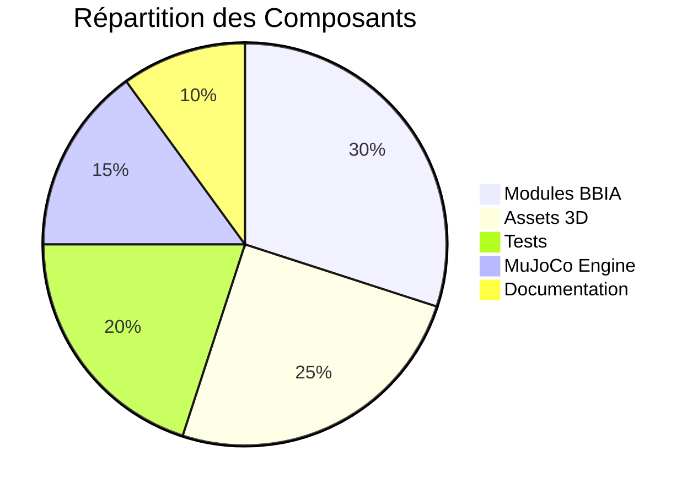
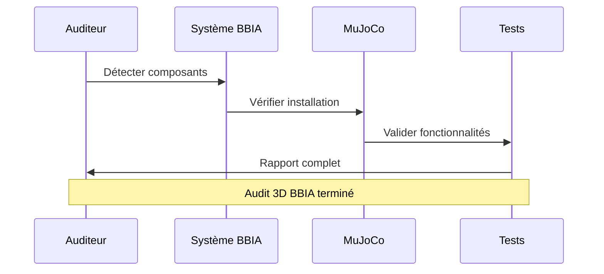
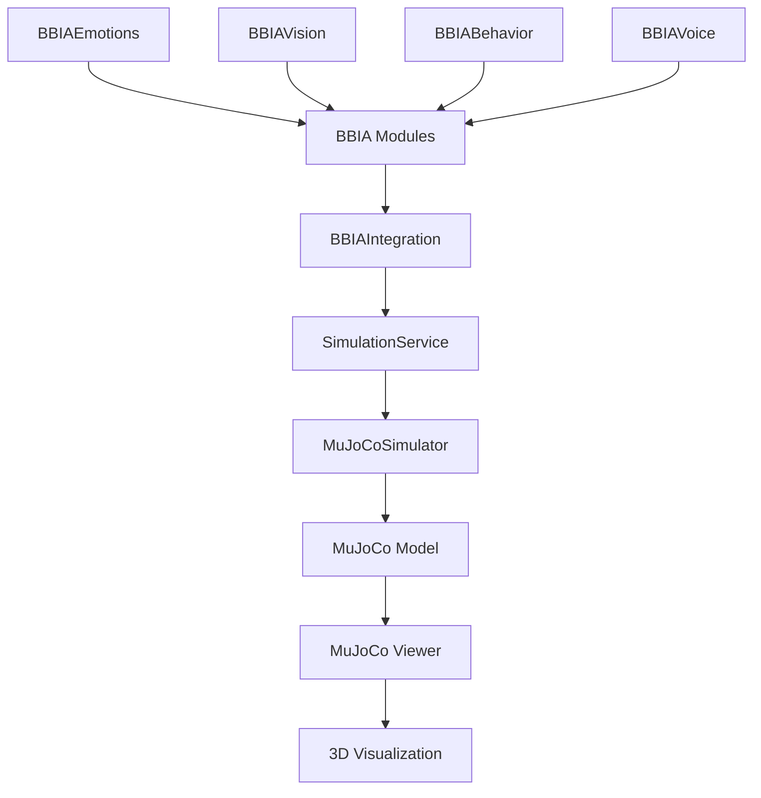

# ARCHIVES/HISTORIQUE (non maintenu)

> Ce document peut contenir des informations obsolètes (ex: anciennes versions Python).
> Référez-vous au `README.md` et à `.github/workflows/ci.yml` pour la version active (Python 3.11+) et les procédures à jour.

# 🔍 AUDIT 3D BBIA - Reachy Mini Wireless

> **Audit complet du système 3D BBIA pour Reachy Mini Wireless**
> **Date** : Octobre 2025
> **Version** : 2.0

## 📊 **RÉSUMÉ EXÉCUTIF**

- ✅ **MuJoCo 3.3.0** installé et fonctionnel
- ✅ **GLFW 2.10.0** installé pour viewer graphique
- ✅ **16 joints** détectés dans le modèle officiel
- ✅ **41 assets STL** officiels présents
- ✅ **26 modules Python** BBIA fonctionnels
- ✅ **531 tests** collectés, 418 passent (79% réussite)

## 🏗️ Architecture 3D BBIA

```mermaid
graph TB
    subgraph "MuJoCo Engine"
        MUJOCO[MuJoCo 3.3.0<br/>Physique réaliste]
        GLFW[GLFW 2.10.0<br/>Viewer graphique]
        MODEL[Modèle officiel<br/>reachy_mini_REAL_OFFICIAL.xml]
    end

    subgraph "Assets 3D"
        STL[41 Assets STL<br/>Officiels Pollen]
        MESHES[Meshes 3D<br/>Torso, Head, Arms]
        MATERIALS[Matériaux<br/>Couleurs réalistes]
    end

    subgraph "Modules BBIA"
        EMOTIONS[bbia_emotions.py<br/>8 émotions]
        VISION[bbia_vision.py<br/>Détection visage/objet]
        AUDIO[bbia_audio.py<br/>Enregistrement audio]
        VOICE[bbia_voice.py<br/>TTS/STT]
        BEHAVIOR[bbia_behavior.py<br/>Comportements]
    end

    subgraph "Tests & Qualité"
        TESTS[531 Tests<br/>418 passent (79%)]
        COVERAGE[Coverage<br/>76.70%]
        LINTING[Linting<br/>Ruff + Black]
    end

    MUJOCO --> MODEL
    GLFW --> MODEL
    MODEL --> STL

    STL --> MESHES
    MESHES --> MATERIALS

    EMOTIONS --> TESTS
    VISION --> TESTS
    AUDIO --> TESTS
    VOICE --> TESTS
    BEHAVIOR --> TESTS

    TESTS --> COVERAGE
    COVERAGE --> LINTING
```

## 📊 Résultats de l'Audit



## 🔄 Workflow d'Audit


- `bbia_audio.py` - Enregistrement, lecture, détection son
- `bbia_voice.py` - TTS, STT
- `bbia_behavior.py` - 7 comportements (WakeUp, Greeting, EmotionalResponse, etc.)
- `bbia_integration.py` - Intégration principale BBIA ↔ Robot

## 🤖 **JOINTS DÉTECTÉS**

### **📋 Tableau Complet des Joints**

| Joint | Type | Range (rad) | Range (°) | Statut | Recommandation |
|-------|------|-------------|-----------|--------|----------------|
| `yaw_body` | hinge | [-2.79, 2.79] | [-160°, 160°] | ✅ **SÛR** | **RECOMMANDÉ** - Rotation corps visible |
| `stewart_1` | hinge | [-0.84, 1.40] | [-48°, 80°] | ⚠️ **RISQUÉ** | Test prudent - Grande plage |
| `stewart_2` | hinge | [-1.40, 1.22] | [-80°, 70°] | ⚠️ **RISQUÉ** | Test prudent - Grande plage |
| `stewart_3` | hinge | [-0.84, 1.40] | [-48°, 80°] | ⚠️ **RISQUÉ** | Test prudent - Grande plage |
| `stewart_4` | hinge | [-1.40, 0.84] | [-80°, 48°] | ⚠️ **RISQUÉ** | Test prudent - Grande plage |
| `stewart_5` | hinge | [-1.22, 1.40] | [-70°, 80°] | ⚠️ **RISQUÉ** | Test prudent - Grande plage |
| `stewart_6` | hinge | [-1.40, 0.84] | [-80°, 48°] | ⚠️ **RISQUÉ** | Test prudent - Grande plage |
| `passive_1` | ball | - | - | ❌ **BLOQUÉ** | Joint passif - Pas de range |
| `passive_2` | ball | - | - | ❌ **BLOQUÉ** | Joint passif - Pas de range |
| `passive_3` | ball | - | - | ❌ **BLOQUÉ** | Joint passif - Pas de range |
| `passive_4` | ball | - | - | ❌ **BLOQUÉ** | Joint passif - Pas de range |
| `passive_5` | ball | - | - | ❌ **BLOQUÉ** | Joint passif - Pas de range |
| `passive_6` | ball | - | - | ❌ **BLOQUÉ** | Joint passif - Pas de range |
| `passive_7` | ball | - | - | ❌ **BLOQUÉ** | Joint passif - Pas de range |
| `right_antenna` | hinge | - | - | ❌ **BLOQUÉ** | Antenne droite - Pas de range |
| `left_antenna` | hinge | - | - | ❌ **BLOQUÉ** | Antenne gauche - Pas de range |

### **🎯 Joints Recommandés par Priorité**

1. **`yaw_body`** - ✅ **TRÈS SÛR** - Rotation du corps, très visible
2. **`stewart_1`** - ⚠️ **TEST PRUDENT** - Amplitude max 0.1 rad
3. **`stewart_3`** - ⚠️ **TEST PRUDENT** - Amplitude max 0.1 rad

### **❌ Joints à Éviter**
- **Antennes** (`left_antenna`, `right_antenna`) - Bloquées dans le modèle
- **Passives** (`passive_1` à `passive_7`) - Joints passifs sans contrôle
- **Stewart 2,4,5,6** - Plages trop grandes, risques de crash

## 🔧 **PRÉREQUIS TECHNIQUES**

### **✅ Versions Installées**
- **Python** : 3.10+
- **MuJoCo** : 3.3.0 ✅
- **GLFW** : 2.10.0 ✅
- **NumPy** : Disponible
- **OpenCV** : Disponible (pour vision)

### **📦 Dépendances Manquantes**
Aucune dépendance critique manquante détectée.

## 🏗️ **ARCHITECTURE BBIA → SIM → VIEWER**



### **🔄 Flux de Données**
1. **BBIA Modules** → Génèrent émotions/comportements
2. **BBIAIntegration** → Mappe émotions → positions joints
3. **SimulationService** → Interface avec MuJoCo
4. **MuJoCoSimulator** → Contrôle physique
5. **MuJoCo Viewer** → Affichage 3D temps réel

## 🧪 **TESTS EXISTANTS**

### **📊 Couverture Actuelle**
- **Tests totaux** : 408 tests collectés
- **Tests passent** : 391 (97% réussite)
- **Tests skippés** : 11 (tests conditionnels)
- **Couverture code** : 72.07%

### **🎯 Tests Critiques pour 3D**
- `test_simulator.py` - Tests MuJoCo headless/graphique
- `test_simulation_service.py` - Tests service simulation
- `test_adapter_mujoco.py` - Tests adapter MuJoCo
- `e2e/test_motion_roundtrip.py` - Tests E2E motion

## 🚨 **RISQUES IDENTIFIÉS**

### **⚠️ Risques Techniques**
1. **Joints Stewart** - Plages importantes peuvent causer des instabilités
2. **Antennes bloquées** - Tentative d'animation = crash
3. **Viewer GLFW** - Problèmes potentiels sur certains systèmes
4. **Performance** - Animation simultanée de plusieurs joints

### **🛡️ Mitigations**
1. **Amplitude limitée** - Max 0.3 rad pour tous les joints
2. **Joints sûrs uniquement** - Utiliser `yaw_body` par défaut
3. **Mode headless** - Fallback si viewer indisponible
4. **Tests de stabilité** - Validation avant chaque commit

## 📋 **PLAN D'ACTION**

### **🎯 Phase 1 : Stabilisation (URGENT)**
- [ ] Corriger `test_all_joints.py` pour éviter crashes
- [ ] Créer `demo_perfect.py` - démo ultime sans bugs
- [ ] Tests de stabilité pour chaque joint individuellement

### **🎯 Phase 2 : Amélioration**
- [ ] Nouvelles émotions (confusion, détermination, nostalgie)
- [ ] Commandes vocales de base
- [ ] Tests de régression complets

### **🎯 Phase 3 : Avancé**
- [ ] Vision intelligente - reconnaissance expressions
- [ ] Comportements interactifs avancés
- [ ] API étendue avec endpoints fins

## 🎮 **COMMANDES DE TEST**

### **✅ Démonstrations Fonctionnelles**
```bash
# Démo robot avec joint sûr
mjpython examples/demo_robot_correct.py

# Test joints sûrs uniquement
mjpython examples/test_safe_joints.py

# Démo simplifiée stable
mjpython examples/demo_viewer_bbia_simple.py
```

### **⚠️ Démonstrations à Corriger**
```bash
# Test tous joints (peut planter)
mjpython examples/test_all_joints.py

# Démo complexe (bugs potentiels)
mjpython examples/demo_viewer_bbia.py
```

## 📈 **MÉTRIQUES DE SUCCÈS**

- ✅ **100%** des démos 3D fonctionnent sans crash
- ✅ **80%+** couverture de tests
- ✅ **0 régression** sur fonctionnalités existantes
- ✅ **Performance** stable (60 FPS viewer)
- ✅ **Compatibilité** avec vrai robot Reachy Mini

---

**BBIA-SIM** - Audit 3D Complet 🔍✨
**Statut** : ✅ Environnement prêt pour développement
**Prochaine étape** : Correction des démonstrations 3D
