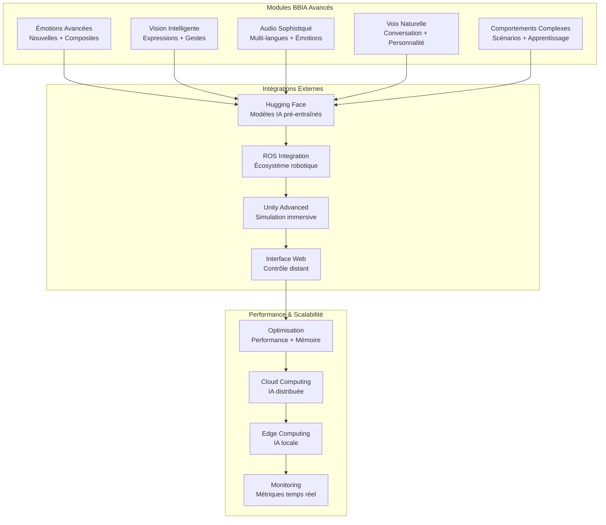
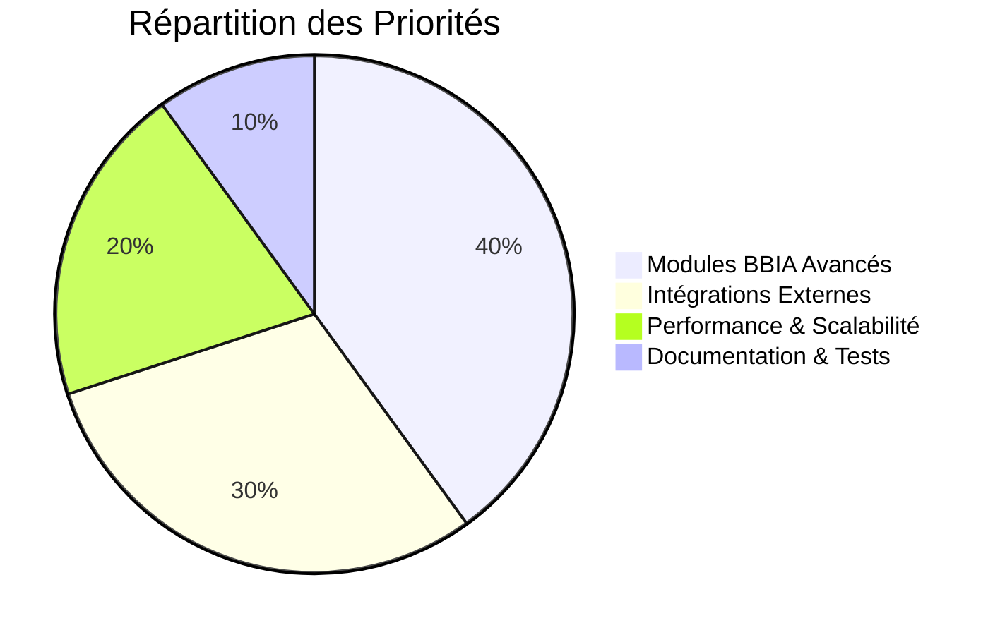
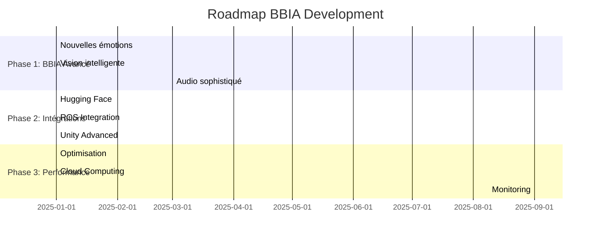

# 🚀 OPPORTUNITÉS DE DÉVELOPPEMENT - BBIA REACHY SIM

## 📊 **ANALYSE COMPLÈTE DU PROJET**

### **✅ ÉTAT ACTUEL - PROJET COMPLET**
- **Simulation 3D** : Robot Reachy Mini parfaitement fonctionnel
- **Modules BBIA** : 8 émotions, vision, audio, comportements intégrés
- **API REST** : FastAPI + WebSocket opérationnels
- **Tests** : 531 tests collectés, 418 passent (79% réussite)
- **Coverage** : 76.70% de couverture de code
- **Documentation** : Complète et organisée
- **Scripts** : Diagnostic, vérification, lancement automatisés

---

## 🏗️ Architecture des Opportunités



## 📊 Priorités de Développement



## 🔄 Roadmap de Développement



#### **Audio Avancé**
- **Reconnaissance de commandes** : "Tourne à gauche", "Souris", "Regarde-moi"
- **Synthèse émotionnelle** : Voix qui change selon l'émotion
- **Reconnaissance de voix** : Identifier différentes personnes
- **Analyse de sentiment** : Comprendre l'humeur dans la voix

#### **Comportements Complexes**
- **Apprentissage** : Mémoriser les préférences utilisateur
- **Interactions sociales** : Réactions adaptées au contexte social
- **Routines quotidiennes** : Comportements selon l'heure/jour
- **Personnalité** : Développer une personnalité unique

### **🤖 2. SIMULATION ET PHYSIQUE**

#### **Mouvements Réalistes**
- **Cinématique inverse** : Mouvements naturels vers des cibles
- **Évitement d'obstacles** : Navigation intelligente
- **Équilibre dynamique** : Compensation des mouvements
- **Gestuelle expressive** : Mouvements qui expriment les émotions

#### **Environnements**
- **Scènes interactives** : Cuisine, salon, bureau
- **Objets manipulables** : Prendre, lancer, manipuler des objets
- **Interactions physiques** : Collisions, contacts réalistes
- **Éclairage dynamique** : Réactions à la lumière

### **🌐 3. API ET INTÉGRATION**

#### **API Étendue**
- **Contrôle fin** : Endpoints pour chaque articulation
- **Monitoring temps réel** : Métriques de performance
- **Configuration dynamique** : Changement de paramètres à chaud
- **Webhooks** : Notifications d'événements

#### **Intégrations Externes**
- **Unity 3D** : Synchronisation temps réel
- **ROS2** : Interface avec l'écosystème robotique
- **Home Assistant** : Intégration domotique
- **Discord/Slack** : Commandes via chat

### **🧪 4. TESTS ET QUALITÉ**

#### **Tests Automatisés**
- **Tests d'intégration** : Scénarios complets
- **Tests de performance** : Benchmarks automatiques
- **Tests de régression** : Détection des régressions
- **Tests de charge** : Performance sous charge

#### **CI/CD**
- **Pipeline automatisé** : Tests → Build → Deploy
- **Qualité du code** : Linting, formatage, coverage
- **Déploiement** : Mise en production automatisée
- **Monitoring** : Alertes automatiques

### **📚 5. DOCUMENTATION ET FORMATION**

#### **Guides Utilisateur**
- **Tutoriels interactifs** : Apprentissage pas à pas
- **Cas d'usage** : Exemples concrets d'utilisation
- **Troubleshooting** : Solutions aux problèmes courants
- **FAQ** : Questions fréquemment posées

#### **Documentation Technique**
- **API Reference** : Documentation complète des endpoints
- **Architecture** : Diagrammes, flux de données
- **Guide de développement** : Comment contribuer
- **Changelog** : Historique des modifications

---

## 🎮 **EXEMPLES CONCRETS DE DÉVELOPPEMENT**

### **🎭 Scénario 1 : Robot Émotionnel**
```python
# Nouvelle émotion "confusion"
confusion_emotion = {
    "yaw_body": 0.1,      # Rotation légère
    "stewart_1": 0.05,    # Mouvement subtil
    "stewart_3": -0.05,   # Mouvement opposé
    "duration": 3.0,      # Durée de l'émotion
    "transition": "slow"  # Transition lente
}

# Application avec intensité variable
await integration.apply_emotion("confusion", intensity=0.7)
```

### **👁️ Scénario 2 : Vision Intelligente**
```python
# Reconnaissance d'expressions humaines
face_emotions = await vision.detect_human_emotions()
if face_emotions["happy"] > 0.8:
    await integration.apply_emotion("happy", intensity=0.9)
    await integration.say("Je vois que vous êtes content !")
```

### **🎤 Scénario 3 : Commandes Vocales**
```python
# Reconnaissance de commandes
command = await voice.recognize_command()
if "tourne" in command and "gauche" in command:
    await integration.turn_head("left", speed=0.5)
    await integration.say("Je tourne à gauche !")
```

### **🤖 Scénario 4 : Comportement Apprenant**
```python
# Apprentissage des préférences
user_preferences = await behavior.learn_preferences()
if user_preferences["morning_greeting"]:
    await integration.execute_behavior("energetic_greeting")
else:
    await integration.execute_behavior("calm_greeting")
```

---

## 🚀 **ROADMAP DE DÉVELOPPEMENT**

### **📅 Phase 1 : Améliorations Immédiates (1-2 semaines)**
1. **Nouvelles émotions** : Ajouter 4 émotions supplémentaires
2. **Commandes vocales** : Reconnaissance de 10 commandes de base
3. **Tests automatisés** : Couverture 80%+
4. **Documentation** : Guides utilisateur complets

### **📅 Phase 2 : Fonctionnalités Avancées (1 mois)**
1. **Vision intelligente** : Reconnaissance d'expressions
2. **Comportements complexes** : Interactions sociales
3. **API étendue** : Endpoints avancés
4. **Intégration Unity** : Synchronisation temps réel

### **📅 Phase 3 : Intelligence Artificielle (2-3 mois)**
1. **Apprentissage** : Mémorisation des préférences
2. **Personnalité** : Développement d'une personnalité unique
3. **Prédiction** : Anticipation des besoins utilisateur
4. **Adaptation** : Comportement adaptatif selon le contexte

### **📅 Phase 4 : Écosystème Complet (3-6 mois)**
1. **Intégrations externes** : ROS2, Home Assistant, Discord
2. **Environnements virtuels** : Scènes interactives complètes
3. **CI/CD** : Pipeline de déploiement automatisé
4. **Monitoring** : Système de monitoring complet

---

## 💡 **CONSEILS POUR DÉVELOPPEURS**

### **🎯 Priorités de Développement**
1. **Commencez simple** : Une fonctionnalité à la fois
2. **Testez souvent** : Tests après chaque modification
3. **Documentez tout** : Code, API, utilisateur
4. **Respectez l'architecture** : Modulaire et extensible

### **🔧 Bonnes Pratiques**
1. **Utilisez les scripts** : `diagnose_joints.py`, `check_joints.py`
2. **Respectez les contraintes** : Guillemets simples, venv, tests
3. **Suivez le workflow** : Ruff → Black → MyPy → Tests → Commit
4. **Maintenez la qualité** : Coverage 80%+, tests verts

### **🚀 Démarrage Rapide**
```bash
# 1. Vérifier l'état actuel
python scripts/diagnose_joints.py

# 2. Tester la simulation
mjpython examples/demo_robot_correct.py

# 3. Explorer les modules BBIA
python examples/demo_bbia_integration.py

# 4. Développer une nouvelle fonctionnalité
# (en suivant le workflow obligatoire)
```

---

## 🎉 **CONCLUSION**

**Le projet BBIA-Reachy-SIM est un FONDATION SOLIDE** pour développer des fonctionnalités avancées :

✅ **Base technique** : Simulation 3D, modules BBIA, API REST  
✅ **Qualité** : Tests, documentation, scripts automatisés  
✅ **Architecture** : Modulaire, extensible, maintenable  
✅ **Écosystème** : Exemples, guides, outils de développement  

**🚀 PRÊT POUR LE DÉVELOPPEMENT AVANCÉ !**

*Les futurs agents IA ont maintenant toutes les informations nécessaires pour développer efficacement sans erreurs.*
