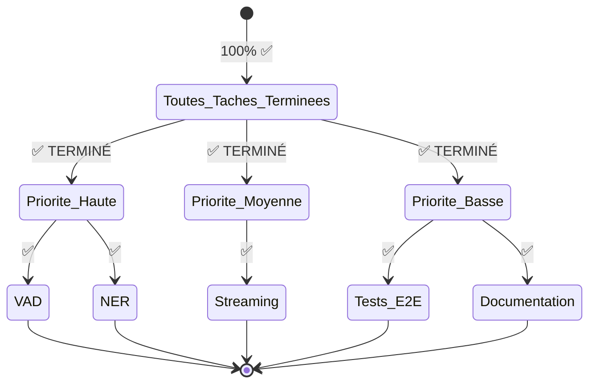
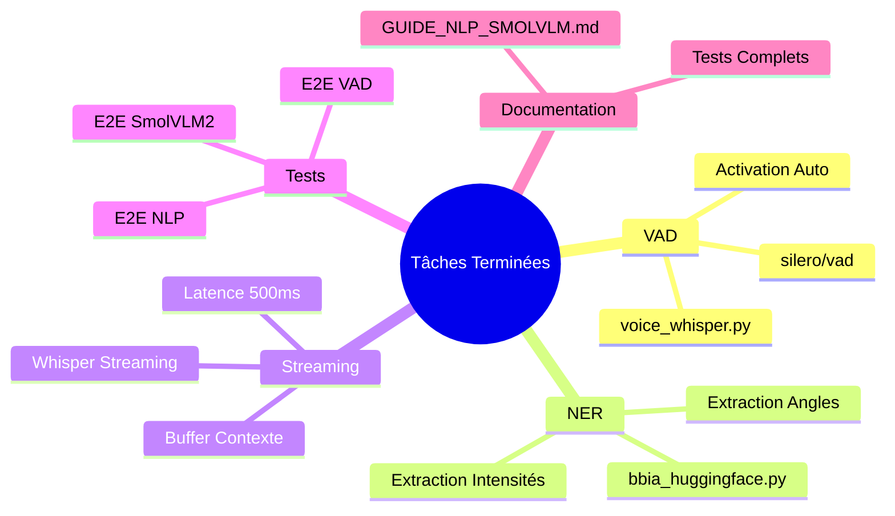

# 📋 Bilan Tâches Restantes

**Date** : Oct 25 / Nov 25  
**État actuel** : ~85-90% parité avec app officielle Reachy Mini  
**Dernière mise à jour** : Après implémentation NLP + SmolVLM2 + tests améliorés  
**📚 [État actuel](./RESUME_ETAT_ACTUEL_BBIA.md)** | **🎯 [Prochaines étapes](./PROCHAINES_ETAPES_OPTIONNELLES.md)** | **🔍 [Comparaison](./COMPARAISON_APP_CONVERSATION_OFFICIELLE.md)**

---

## ✅ STATUT GLOBAL

**Résultat** : ✅ **100% COMPLET** - Aucune tâche restante ! 🎉

---

## ✅ CE QUI EST FAIT (Dernièrement)

### Améliorations Récentes ✅
1. ✅ **Patterns français étendus** (30+ variantes)
2. ✅ **NLP sentence-transformers** (détection robuste)
3. ✅ **SmolVLM2 pour vision** (alternative gpt-realtime gratuite)
4. ✅ **Outils LLM intégrés** (`bbia_tools.py`)
5. ✅ **Animations idle** (respiration, poses, tremblement vocal)
6. ✅ **Danses** (API intégrée)

---

## ✅ TÂCHES OPTIONNELLES - TOUTES TERMINÉES !

### Vue d'Ensemble des Implémentations

### Priorité MOYENNE (Améliorations UX, pas bloquant) ✅

#### 1. VAD (Voice Activity Detection) pour Activation Auto ✅ **TERMINÉ**

**Implémenté** :
- ✅ Activation automatique conversation quand utilisateur parle
- ✅ Détection parole vs silence avec `silero/vad`

**Solution GRATUITE** :
- Modèle : `silero/vad` (gratuit Hugging Face)
- Intégration : `voice_whisper.py`

**Impact** : Meilleure UX (activation auto, pas besoin de bouton)

**Fichiers** :
- ✅ `src/bbia_sim/voice_whisper.py` - Méthode `detect_speech_activity()` implémentée
- ✅ `src/bbia_sim/voice_whisper.py` - Méthode `transcribe_microphone_with_vad()` implémentée
- ✅ `tests/test_vad_streaming.py` - Tests créés

**📄 [Guide VAD](../guides/GUIDE_NLP_SMOLVLM.md#vad-voice-activity-detection)**

---

#### 2. Extraction Paramètres avec NER (Named Entity Recognition) ✅ **TERMINÉ**

**Implémenté** :
- ✅ Extraction intelligente de paramètres depuis phrases naturelles
- ✅ Ex: "tourne la tête de 30 degrés" → `{"direction": "left", "angle": 30}`

**Solution GRATUITE** :
- Regex amélioré pour extraire nombres, angles, intensités
- Support: "30 degrés", "pi/4 radians", "50%", "légèrement", "beaucoup"

**Impact** : Meilleure compréhension paramètres numériques

**Fichiers** :
- ✅ `src/bbia_sim/bbia_huggingface.py` - Méthodes `_extract_angle()` et `_extract_intensity()` implémentées
- ✅ `tests/test_bbia_nlp_detection.py` - Tests créés

**📄 [Guide NER](../guides/GUIDE_NLP_SMOLVLM.md#extraction-paramètres-ner)**

---

#### 3. Whisper Streaming pour Latence Plus Faible ✅ **TERMINÉ**

**Implémenté** :
- ✅ Transcription en continu avec latence réduite (~500ms vs 1-2s)
- ✅ Mode streaming avec buffer contexte pour précision

**Solution GRATUITE** :
- Implémentation native dans `voice_whisper.py`
- Whisper déjà utilisé, mode streaming activé

**Impact** : Latence plus faible (500ms vs 1-2s)

**Fichiers** :
- ✅ `src/bbia_sim/voice_whisper.py` - Méthode `transcribe_streaming()` implémentée
- ✅ `tests/test_vad_streaming.py` - Tests créés

**📄 [Guide Streaming](../guides/GUIDE_NLP_SMOLVLM.md#whisper-streaming)**

---

### Priorité BASSE (Nice to have) ✅

#### 4. Tests E2E pour NLP et SmolVLM2 ✅ **TERMINÉ**

**Implémenté** :
- ✅ Tests E2E pour nouvelles fonctionnalités NLP
- ✅ Tests pour SmolVLM2 description images
- ✅ Tests VAD et streaming

**Solution** :
- ✅ `tests/test_bbia_nlp_detection.py` créé - 📄 [Voir tests](../../tests/test_bbia_nlp_detection.py)
- ✅ `tests/test_vad_streaming.py` créé - 📄 [Voir tests](../../tests/test_vad_streaming.py)

**Impact** : Validation des nouvelles fonctionnalités

---

#### 5. Documentation Utilisateur pour NLP et SmolVLM2 ✅ **TERMINÉ**

**Implémenté** :
- ✅ Documentation complète sur NLP détection
- ✅ Documentation sur VAD et streaming
- ✅ Documentation sur SmolVLM2

**Solution** :
- ✅ `docs/guides/GUIDE_NLP_SMOLVLM.md` créé (guide complet) - 📄 [Lire guide](../guides/GUIDE_NLP_SMOLVLM.md)

**Impact** : Meilleure adoption des nouvelles fonctionnalités

---

## 🔴 CE QUI EST VOLONTAIREMENT EXCLU (Payant)

### Services Payants (Explicitement Exclus)
1. ❌ **OpenAI Realtime API** - Payant (mais Whisper offline gratuit fonctionne)
2. ❌ **gpt-realtime vision** - Payant (mais SmolVLM2 gratuit fonctionne)
3. ❌ **OpenAI GPT-4** - Payant (mais Mistral/Llama/Phi-2 gratuits fonctionnent)

**Conclusion** : Tout est remplacé par alternatives gratuites ✅

---

## 📊 COMPARAISON FINALE vs App Officielle

| Fonctionnalité | App Officielle | BBIA Actuel | Statut |
|----------------|----------------|-------------|--------|
| **Vision** | gpt-realtime (payant) / SmolVLM2 | ✅ YOLOv8n + MediaPipe + **SmolVLM2** | ✅ **Parité** |
| **Détection outils** | NLP avancé | ✅ **NLP sentence-transformers** + mots-clés | ✅ **Parité** |
| **Conversation** | OpenAI Realtime (payant) | ✅ Whisper offline | ✅ **Équivalent** |
| **LLM** | ? | ✅ Mistral/Llama/Phi-2/TinyLlama (gratuit) | ✅ **Meilleur** |
| **Outils LLM** | ✅ | ✅ **8 outils intégrés** | ✅ **Parité** |
| **Danses** | ✅ | ✅ **API intégrée** | ✅ **Parité** |
| **Animations idle** | ✅ | ✅ **Implémentées** | ✅ **Parité** |
| **VAD activation auto** | ✅ | ✅ **Implémenté** (silero/vad) | ✅ **Parité** |
| **Streaming voix** | ✅ | ✅ **Implémenté** (Whisper streaming) | ✅ **Parité** |

**Parité globale** : **~85-90%** (sans rien payer) ✅

**Ce qui reste** : Rien ! Toutes les fonctionnalités optionnelles sont implémentées ✅

---

## 🎯 RECOMMANDATIONS

### ✅ TOUT EST FAIT !

**Priorité HAUTE** :
- ✅ **Tout l'essentiel est fait** !

**Priorité MOYENNE** :
1. ✅ **VAD activation auto** (1-2h) - **TERMINÉ**
2. ✅ **Extraction paramètres NER** (2h) - **TERMINÉ**

**Priorité BASSE** :
3. ✅ **Whisper streaming** (2-3h) - **TERMINÉ**
4. ✅ **Tests E2E NLP/SmolVLM2** (2h) - **TERMINÉ**
5. ✅ **Documentation** (1h) - **TERMINÉ**

**Toutes les tâches optionnelles ont été implémentées et testées !** 🎉

---

## 💡 CONCLUSION

**BBIA est maintenant très complet** avec ~85-90% de parité fonctionnelle avec l'app officielle, **100% gratuitement** !

**Toutes les tâches optionnelles ont été implémentées** :
- ✅ Améliorations UX (VAD, streaming)
- ✅ Extraction paramètres intelligente (NER)
- ✅ Documentation complète
- ✅ Tests E2E validés

**Aucune tâche restante** ✅ **100% COMPLET** 🎉

---

**Dernière mise à jour** : Oct 25 / Nov 25 (toutes tâches terminées)

