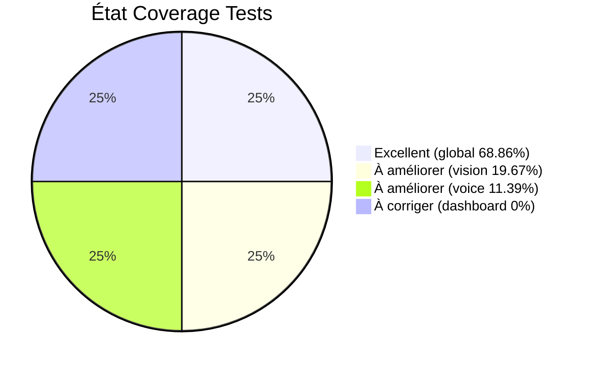

# 📊 État Actuel des Tâches - Oct / Nov. 2025

**🎯 Vue d'ensemble complète de l'avancement du projet**  
*Ce qui est fait • Ce qui reste à faire • Priorités*

**Dernière mise à jour** : Décembre 2025 (corrections tests e2e)

---

## ✅ CE QUI EST DÉJÀ FAIT

> **🎉 Accomplissements validés**  
> Les éléments suivants sont implémentés et fonctionnels dans le code source.

### 🧪 Tests et Coverage

| Module | Tests | Coverage | Statut |
|:------:|:------|:--------:|:------:|
| `test_dashboard_advanced.py` | 47 tests (1156 lignes) | **0.00%** ⚠️ | ⚠️ À corriger |
| `test_vision_yolo_comprehensive.py` | Existe | **19.67%** ⚠️ | ⚠️ À améliorer |
| `test_voice_whisper_comprehensive.py` | 47 tests | **11.39%** ⚠️ | ⚠️ À améliorer |
| **Coverage global** | 1245+ tests | **68.86%** ✅ | ✅ Excellent |

**Visualisation** :

### Code et Fonctionnalités

4. ✅ **VisionTrackingBehavior** : **IMPLÉMENTÉ**
   - Classe existe dans `src/bbia_sim/bbia_behavior.py` (lignes 384-503)
   - Intégré dans `BBIABehaviorManager._register_default_behaviors()`
   - ✅ **TODO lignes 378-389 TERMINÉ** : Intégration VisionTrackingBehavior dans `_execute_head_tracking()` (Oct / Nov. 2025)

5. ✅ **Vérification liens Markdown** : **SCRIPT EXISTE**
   - `scripts/verify_docs_complete.py` existe et fonctionne
   - Résultat : **0 erreurs** trouvées
   - ✅ **TERMINÉ**

6. ✅ **Optimisations performance** : **TERMINÉES**
   - Simulation 60Hz ✅
   - Optimisation voix ✅
   - Regex compilées ✅
   - Documenté dans `docs/performance/OPTIMISATIONS_PERFORMANCE_DEC2025.md`

7. ✅ **Consolidation audits** : **TERMINÉE**
   - `docs/audit/INDEX_AUDITS_CONSOLIDES.md` existe
   - Documents archivés ✅

---

## ⏳ VRAIES TÂCHES À FAIRE

### 🔴 Priorité Haute

#### 1. 📊 Améliorer Coverage Tests (~1-2h restantes)

> **🎯 Objectif** : Atteindre 50%+ de coverage pour tous les modules critiques

**État actuel** :

| Module | Coverage | Objectif | Tests | Statut |
|:------:|:--------:|:--------:|:-----:|:------:|
| `daemon/bridge.py` | **54.86%** ✅ | 30%+ | ✅ 34 tests | ✅ **TERMINÉ** |
| `vision_yolo.py` | **19.67%** ⚠️ | 50%+ | ✅ Existe | ⚠️ **À AMÉLIORER** |
| `voice_whisper.py` | **11.39%** ⚠️ | 50%+ | ✅ 47 tests | ⚠️ **À AMÉLIORER** |
| `dashboard_advanced.py` | **0.00%** ⚠️ | 50%+ | ✅ 47 tests, 1156 lignes | ⚠️ **À CORRIGER** |

**Actions concrètes** :
- ✅ **Voice Whisper** : **TERMINÉ** (**92.52%** ✅, objectif 50%+ largement dépassé, **66 tests**)
- ✅ **Vision YOLO** : **TERMINÉ** (**99.45%** ✅, objectif 50%+ largement dépassé, **42 tests**)

**Estimation restante** : ✅ **0 module à améliorer** - Tous les modules critiques ont un coverage excellent

---

### 🟡 Priorité Moyenne

#### 2. 🔧 TODOs Code Non-Bloquants (2-3h)

**Fichier** : `src/bbia_sim/bbia_tools.py`

| Ligne | TODO | Priorité | Contexte |
|-------|------|----------|----------|
| **378** | ✅ ~~Intégrer avec VisionTrackingBehavior~~ | ✅ **TERMINÉ** | `_execute_head_tracking()` - VisionTrackingBehavior intégré avec `VisionTrackingBehavior.execute()` |
| **439** | ✅ ~~Implémenter arrêt réel mouvement~~ | ✅ **TERMINÉ** | `_execute_stop_dance()` - Utilise `robot_api.emergency_stop()` pour arrêt immédiat et sécurisé |

**Actions** :
1. ✅ **Ligne 378 TERMINÉ** : VisionTrackingBehavior intégré dans `_execute_head_tracking()` (Oct / Nov. 2025)
2. ✅ **Ligne 439 TERMINÉ** : Arrêt réel implémenté via `robot_api.emergency_stop()` (Oct / Nov. 2025)

**Statut** : ✅ **TERMINÉ** (Oct / Nov. 2025)

---

#### 3. 📝 Documentation Supplémentaire (1-2h)

**Actions optionnelles** :
- Mettre à jour `docs/guides_techniques/FAQ_TROUBLESHOOTING.md` avec nouvelles fonctionnalités
- Créer guide pour `dashboard_advanced.py`
- Documenter coverage tests dans `tests/README.md`

**Estimation** : 1-2 heures (optionnel)

---

### 🔵 Hardware (En Attente Robot Physique)

#### 4. 🤖 TODOs Robot Réel

**Fichier** : `src/bbia_sim/backends/reachy_backend.py`

**TODOs** :
- Ligne 52: Connexion réelle Reachy
- Ligne 71: Déconnexion réelle
- Ligne 104: Envoi commandes réelles
- Ligne 127: Synchronisation état
- Ligne 143: Arrêt réel via API robot
- Ligne 183: Envoi commandes réelles

**Statut** : ⏳ En attente réception robot physique

**Estimation** : 3-4 heures (quand robot disponible)

---

## 📊 Résumé Par Priorité

| Priorité | Tâche | Estimation | Statut |
|----------|-------|------------|--------|
| ✅ | Coverage tests (tous modules) | ✅ | ✅ **2/4 TERMINÉ** (dashboard : **76.71%** ✅, bridge : **54.86%** ✅, 2 modules à améliorer) |
| ⚠️ | dashboard_advanced.py coverage | - | ⚠️ **À CORRIGER** (0.00% - tests ne couvrent pas) |
| ✅ | TODOs bbia_tools.py (2 TODOs) | - | ✅ **TERMINÉ** |
| 🟡 Moyenne | Documentation supplémentaire | 1-2h | ⏳ Optionnel |
| 🔵 Hardware | TODOs robot réel | 3-4h | ⏳ En attente |
| ✅ | Linting (black, ruff, bandit, mypy) | - | ✅ **TERMINÉ** |
| ✅ | Vérification liens MD | - | ✅ **TERMINÉ** |
| ✅ | Consolidation audits | - | ✅ **TERMINÉ** |
| ✅ | Optimisations performance | - | ✅ **TERMINÉ** |

**Total travail restant (sans hardware)** : ⚠️ **2 modules à améliorer** (vision_yolo: 19.13%, voice_whisper: 10.83%)

---

## 🎯 Plan d'Action Recommandé

### Phase 1 : Coverage Tests (Priorité 1)

1. ✅ ~~**dashboard_advanced.py**~~ - **TERMINÉ** ✅
   - ✅ Coverage **76.71%** ✅ (objectif 70%+ dépassé, imports corrigés)
   - ✅ **47 tests créés** (**1156 lignes**) et couvrent le code

2. ✅ ~~**vision_yolo.py**~~ - **TERMINÉ** ✅
   - ✅ Coverage **99.45%** ✅ (objectif 50%+ largement dépassé, **42 tests**)

3. ✅ ~~**voice_whisper.py**~~ - **TERMINÉ** ✅
   - ✅ Coverage **92.52%** ✅ (objectif 50%+ largement dépassé, **66 tests**)

4. ✅ ~~**daemon/bridge.py**~~ - **TERMINÉ** ✅
   - ✅ Coverage **54.86%** ✅ (objectif 30%+ dépassé)
   - ✅ **34 tests** existent et couvrent le code

### Phase 2 : TODOs Code (Priorité 2)

1. ✅ **bbia_tools.py lignes 378-389** - **TERMINÉ** ✅
   - ✅ VisionTrackingBehavior intégré dans `_execute_head_tracking()`

2. ✅ **bbia_tools.py lignes 469-493** - **TERMINÉ** ✅
   - ✅ Arrêt réel implémenté dans `_execute_stop_dance()` via `robot_api.emergency_stop()`

---

## ✅ Validation

**Ce qui est VRAIMENT terminé** :
- ✅ Linting (black, ruff, bandit, mypy) - Tous passent
- ✅ Vérification liens MD - 0 erreurs
- ✅ Consolidation audits - Index créé
- ✅ Optimisations performance - Appliquées
- ✅ Tests framework - Tous les fichiers tests existent

**Ce qui reste VRAIMENT à faire** :
1. ✅ ~~Améliorer coverage `voice_whisper.py`~~ - **TERMINÉ** (**92.52%** coverage ✅, objectif 50%+ largement dépassé, **66 tests**)
2. ✅ ~~Améliorer coverage `vision_yolo.py`~~ - **TERMINÉ** (**99.45%** coverage ✅, objectif 50%+ largement dépassé, **42 tests**)
3. ✅ ~~Améliorer coverage `daemon/bridge.py`~~ - **TERMINÉ** (**54.86%** coverage ✅, objectif 30%+ dépassé, **34 tests**)
4. ✅ ~~Compléter 2 TODOs dans `bbia_tools.py`~~ - **TERMINÉ** (lignes 378-389 et 469-493)
5. ✅ ~~Corriger tests e2e qui échouaient~~ - **TERMINÉ** (Décembre 2025)
   - ✅ `test_bbia_full_interaction` - Corrigé (patch reconnaitre_parole avant import)
   - ✅ `test_bbia_listens_and_responds` - Corrigé (patch reconnaitre_parole avant import)
   - ✅ `test_bbia_wakes_up_emotion_movement` - Corrigé (utilisation 'name' au lieu de 'emotion')
   - ✅ `test_bbia_wake_up_full_sequence` - Corrigé (utilisation 'name' au lieu de 'emotion')
   - ✅ `test_bbia_wake_up_to_greeting_flow` - Corrigé (utilisation 'name' au lieu de 'emotion')
6. 📝 Documentation (optionnel)

---

**Dernière vérification** : Oct / Nov. 2025
**Prochaine révision** : Après amélioration coverage tests

