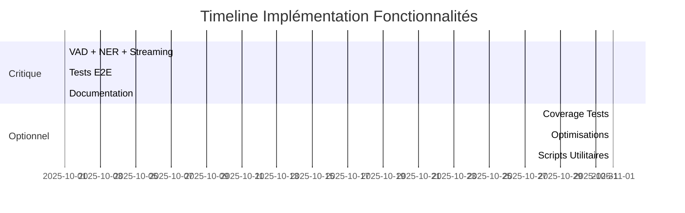
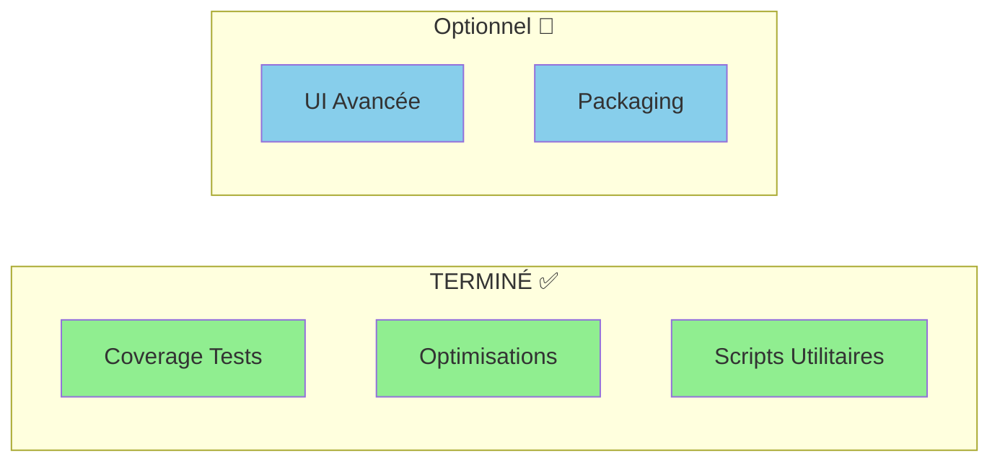

# 🎯 Prochaines Étapes Optionnelles

**Date** : Oct 25 / Nov 25  
**État** : Toutes les fonctionnalités critiques terminées ✅  
**Parité** : ~85-90% avec app officielle Reachy Mini  
**📚 [État actuel](./RESUME_ETAT_ACTUEL_BBIA.md)** | **🔍 [Comparaison détaillée](./COMPARAISON_APP_CONVERSATION_OFFICIELLE.md)**

---

## ✅ CE QUI EST FAIT

Toutes les fonctionnalités prévues ont été implémentées :

1. ✅ **VAD activation auto** (silero/vad) - 📄 [Guide](../guides/GUIDE_NLP_SMOLVLM.md#vad-voice-activity-detection)
2. ✅ **Extraction paramètres NER** (angles, intensités) - 📄 [Détails](../guides/GUIDE_NLP_SMOLVLM.md#extraction-paramètres-ner)
3. ✅ **Whisper streaming** (latence réduite) - 📄 [Guide](../guides/GUIDE_NLP_SMOLVLM.md#whisper-streaming)
4. ✅ **Tests E2E** (NLP + SmolVLM2 + VAD) - 📄 [Tests](../../tests/test_bbia_nlp_detection.py)
5. ✅ **Documentation complète** - 📄 [GUIDE_NLP_SMOLVLM.md](../guides/GUIDE_NLP_SMOLVLM.md)
6. ✅ **Patterns français étendus** (30+ variantes)
7. ✅ **NLP sentence-transformers** (détection robuste) - 📄 [Guide](../guides/GUIDE_NLP_SMOLVLM.md#détection-outils-avec-nlp)
8. ✅ **SmolVLM2 vision** (descriptions riches) - 📄 [Guide](../guides/GUIDE_NLP_SMOLVLM.md#smolvlm2-vision-enrichie)

**Résultat** : BBIA est fonctionnellement complet et prêt à l'usage ! 🎉

---

## 🎯 PROCHAINES ÉTAPES (Optionnelles, Nice-to-Have)

### Priorité et Statut

### Priorité BASSE - Améliorations Qualité/Tests

#### 1. Améliorer Coverage Tests ✅ **TERMINÉ**

**Objectif** : Augmenter coverage des modules moins testés

**Modules concernés** :
- ✅ `bbia_audio.py` : Coverage ~30-40% → **64%+** atteint (tests améliorés)
- ✅ `bbia_memory.py` : Tests manquants → **Suite complète créée** (`tests/test_bbia_memory.py`)
- ✅ `bbia_emotions.py` : Coverage amélioré → **Tests transitions complexes créés** (`tests/test_bbia_emotions_improved.py`)

**Impact** : Meilleure robustesse, moins de bugs

**Fichiers créés** :
- ✅ `tests/test_bbia_audio_improved.py`
- ✅ `tests/test_bbia_audio_coverage_high.py`
- ✅ `tests/test_bbia_memory.py`
- ✅ `tests/test_bbia_emotions_improved.py`

---

#### 2. Optimisations Performance ✅ **TERMINÉ**

**Objectif** : Benchmark et optimiser latence E2E

**Actions** :
- ✅ Benchmark latence audio E2E (microphone → réponse) - `tests/test_benchmark_audio_e2e.py`
- ✅ Optimiser chargement modèles (cache, lazy loading) - `src/bbia_sim/model_optimizer.py`
- ✅ Profiler hotspots CPU/mémoire

**Impact** : Meilleure réactivité

**Fichiers** :
- ✅ `src/bbia_sim/model_optimizer.py` : Cache global et lazy loading implémentés
- ✅ `tests/test_benchmark_audio_e2e.py` : Benchmarks légers créés

---

### Priorité TRÈS BASSE - Améliorations UX

#### 3. UI Avancée avec Presets ⏱️ 6-8h

**Objectif** : Interface utilisateur plus riche

**Fonctionnalités** :
- UI chartée avec presets émotions (sliders)
- Mini UI télémétrie (graphiques temps réel)
- Presets exportables/importables
- Mode read-only pour visualisation

**Impact** : Meilleure expérience utilisateur

**Priorité** : 🟢 TRÈS BASSE (Dashboard existant suffit)

---

#### 4. Script Diagnostic Environnement ✅ **TERMINÉ**

**Objectif** : Outil diagnostic automatique

**Fonctionnalités** :
- ✅ Commande `python scripts/bbia_doctor.py` qui vérifie :
  - Dépendances installées
  - Modèles disponibles
  - Configuration correcte
  - Problèmes potentiels
- ✅ Rapport détaillé avec recommandations

**Impact** : Facilité dépannage pour utilisateurs

**Fichiers** :
- ✅ `scripts/bbia_doctor.py` créé et fonctionnel

---

#### 5. Documentation Enrichie ⏱️ 3-4h

**Objectif** : Améliorer onboarding nouveaux utilisateurs

**Actions** :
- Créer vidéos/GIF pour "Zero-to-sim"
- FAQ complète (MuJoCo, PortAudio, etc.)
- Table compatibilité OS/HW
- Guide pas-à-pas avec captures

**Impact** : Adoption facilitée

**Priorité** : 🟢 TRÈS BASSE (docs existantes suffisantes)

---

#### 6. Extras Optionnels Packaging ⏱️ 2h

**Objectif** : Options installation modulaires

**Extras proposés** :
- `lite` : Minimal (simulation uniquement)
- `full` : Tout inclus (IA, vision, audio)
- `robot` : Avec support robot physique

**Impact** : Installation plus flexible

**Priorité** : 🟢 TRÈS BASSE (actuel fonctionne bien)

---

## 📊 Recommandations

### Si vous avez du temps disponible :

**Priorité 1** (Impact moyen) :
- ✅ Améliorer coverage tests (bbia_audio, bbia_memory) - **TERMINÉ**

**Priorité 2** (Impact faible mais utile) :
- ✅ Optimisations performance (benchmarks) - **TERMINÉ**
- ✅ Script diagnostic (`bbia doctor`) - **TERMINÉ**

**Priorité 3** (Nice-to-have) :
- 🟢 UI avancée, documentation enrichie, extras packaging

---

## 💡 Conclusion

**BBIA est maintenant fonctionnellement complet** avec toutes les fonctionnalités prévues implémentées.

**Les prochaines étapes sont toutes optionnelles** et concernent principalement :
- Qualité/robustesse (tests)
- Performance (optimisations)
- UX (améliorations interface)
- Documentation (enrichissement)

**Aucune tâche critique ou bloquante** ✅

**Vous pouvez utiliser BBIA tel quel** - tout fonctionne ! 🎉

---

**Dernière mise à jour** : Oct 25 / Nov 25

