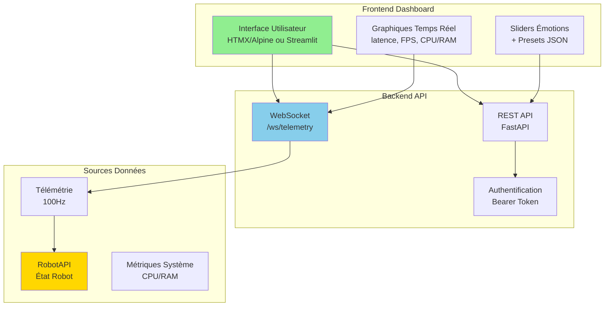
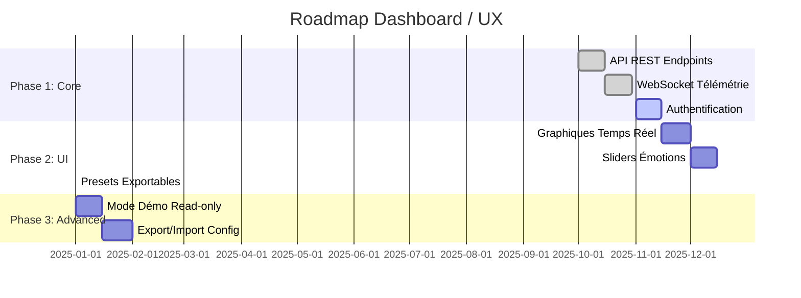
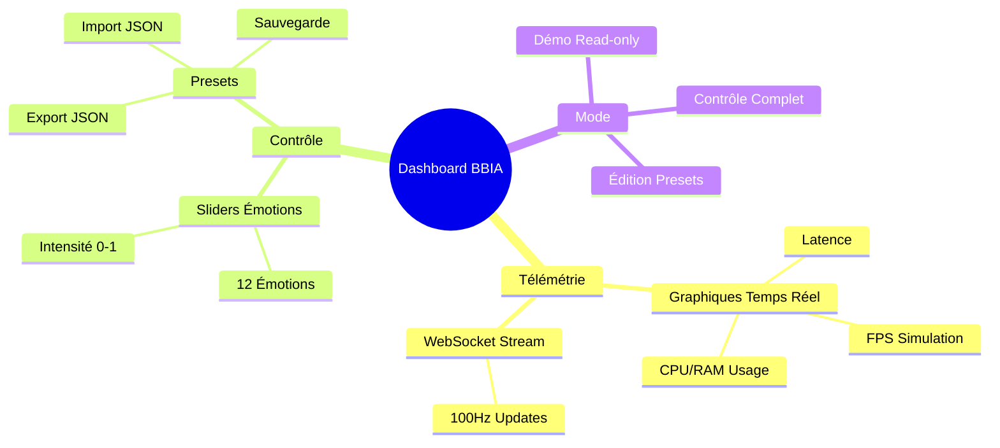

# 🗺️ Roadmap Dashboard / UX

**Date** : Oct / Nov. 2025  
**Version** : 1.0

> **Voir aussi** : [`docs/reference/INDEX_THEMATIQUE.md`](../reference/INDEX_THEMATIQUE.md) et [`docs/reference/project-status.md`](../reference/project-status.md)

**📊 [CI/CD Pipeline](../deployment/PIPELINE_CI.md)** | **🔧 [Guide avancé](../guides/GUIDE_AVANCE.md)**

---

## Architecture Dashboard Proposée

## Roadmap Implémentation

## Mini UI télémétrie (proposé)

- Graphiques temps réel: latence, FPS, CPU/RAM
- Sliders émotions + presets exportables (JSON)
- Mode démo read-only (pas d'actions)

### Composants Dashboard

## Stack suggérée

- FastAPI + HTMX/Alpine (léger) ou Streamlit (rapide)

---

## 📚 Références

- **État par axe** : [`docs/reference/project-status.md`](../reference/project-status.md) → Dashboard / UX

---

**Dernière mise à jour** : Oct / Nov. 2025
