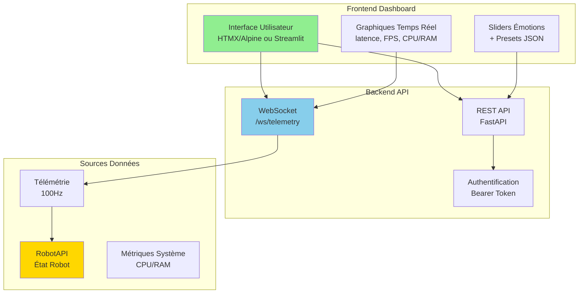
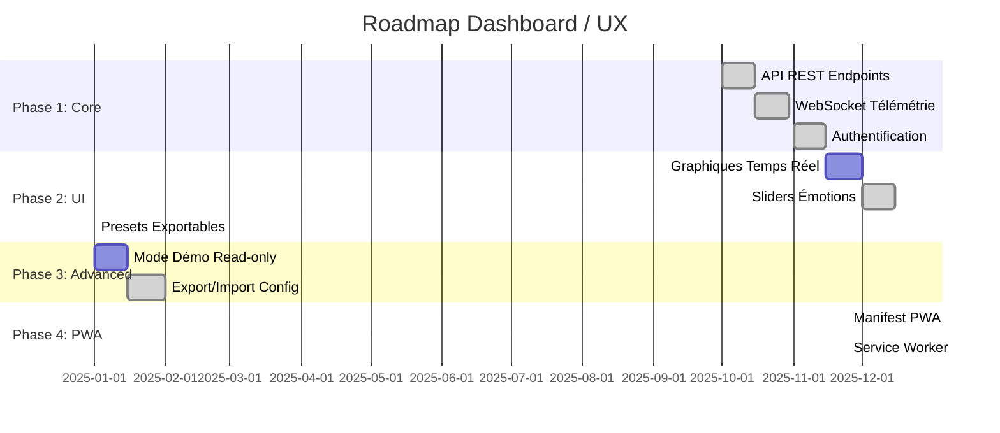
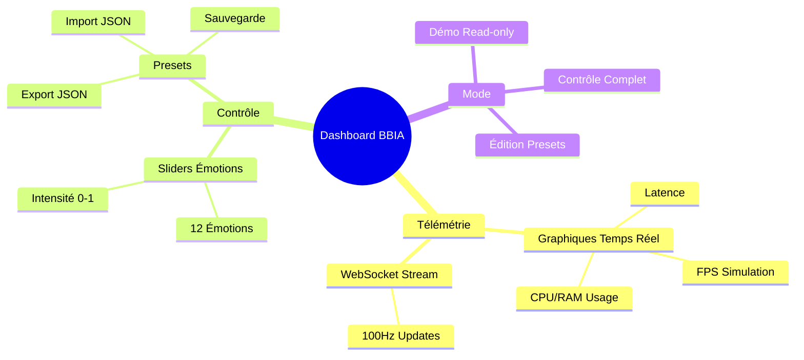

# 🗺️ Roadmap Dashboard / UX

**Date** : 8 Décembre 2025  
**Version** : 1.4.0

> **Voir aussi** : [`docs/reference/INDEX_THEMATIQUE.md`](../reference/INDEX_THEMATIQUE.md) et [`docs/reference/project-status.md`](../reference/project-status.md)

**📊 [CI/CD Pipeline](../deployment/PIPELINE_CI.md)** | **🔧 [Guide avancé](../guides/GUIDE_AVANCE.md)**

---

## Architecture Dashboard Proposée



## Roadmap Implémentation



## Mini UI télémétrie (proposé)

- Graphiques temps réel: latence, FPS, CPU/RAM
- Sliders émotions + presets exportables (JSON)
- Mode démo read-only (pas d'actions)

### Composants Dashboard



## Stack suggérée

- FastAPI + HTMX/Alpine (léger) ou Streamlit (rapide)

---

## 📱 Applications Mobiles & Cross-Platform (24 Novembre 2025)

### 🎯 État Actuel de l'Écosystème

**Ce qui existe déjà :**

1. **✅ Dashboard Web Complet** (`src/bbia_sim/daemon/app/dashboard/`)
   - Interface web moderne avec FastAPI
   - WebSocket temps réel (`/ws/telemetry`)
   - API REST complète (`/api/*`)
   - Support CORS configuré
   - Authentification Bearer Token
   - App Store intégré (Hugging Face Hub)
   - **✅ PWA Support** (manifest.json + service worker) - 24 Nov 2025
   - **✅ Sliders Émotions avec Intensité** - 24 Nov 2025
   - **✅ Presets Exportables** (API `/api/presets`) - 24 Nov 2025

2. **✅ API REST Complète**
   - Endpoints : `/api/motion`, `/api/state`, `/api/ecosystem`, `/api/media`, etc.
   - Documentation OpenAPI/Swagger : `/docs`
   - Support JSON natif
   - Rate limiting configuré

3. **✅ WebSocket Temps Réel**
   - `/ws/telemetry` : Télémétrie 100Hz
   - `/ws/full` : État complet robot
   - `/ws/updates` : Mises à jour mouvements
   - `/ws/apps-manager/{job_id}` : Gestion apps

4. **✅ Intégration Hugging Face Hub**
   - App Store dans dashboard
   - Installation apps communauté
   - Partage apps via HF Spaces

### 📱 Recommandations Expert pour Apps Mobiles

#### **1. Progressive Web App (PWA) - PRIORITÉ HAUTE** ⭐

**Pourquoi :**
- ✅ Fonctionne sur Android, iOS, Desktop
- ✅ Pas besoin de stores (déploiement direct)
- ✅ Installation native (icône sur écran d'accueil)
- ✅ Mode offline possible
- ✅ Push notifications

**Implémentation recommandée :**

```javascript
// manifest.json (à créer dans dashboard/static/)
{
  "name": "BBIA Robot Control",
  "short_name": "BBIA",
  "description": "Contrôle robot Reachy Mini",
  "start_url": "/",
  "display": "standalone",
  "background_color": "#ffffff",
  "theme_color": "#6366f1",
  "icons": [
    {
      "src": "/static/images/icon-192.png",
      "sizes": "192x192",
      "type": "image/png"
    },
    {
      "src": "/static/images/icon-512.png",
      "sizes": "512x512",
      "type": "image/png"
    }
  ]
}
```

**Service Worker** (pour mode offline) :
- Cache API REST
- Cache WebSocket avec queue
- Synchronisation différée

**Avantages :**
- ✅ Déploiement immédiat (pas d'attente stores)
- ✅ Mises à jour instantanées
- ✅ Coût zéro (pas de frais Play Store/App Store)
- ✅ Compatible tous navigateurs modernes

#### **2. Application Android Native (Kotlin/Java)**

**Quand développer :**
- Besoin accès hardware avancé (caméra native, capteurs)
- Performance critique
- Intégration services Google (Play Services)

**Stack recommandée :**
- **Kotlin** (langage moderne Android)
- **Jetpack Compose** (UI moderne)
- **Retrofit** (client HTTP REST)
- **OkHttp WebSocket** (WebSocket client)
- **Kotlin Coroutines** (async/await)

**Architecture :**
```
app/
├── data/
│   ├── api/          # Retrofit interfaces
│   ├── websocket/    # WebSocket manager
│   └── repository/   # Data layer
├── domain/
│   └── models/       # Domain models
└── ui/
    ├── screens/      # Compose screens
    └── components/   # Reusable components
```

**API Client Example :**
```kotlin
interface BBIAAPI {
    @GET("/api/state")
    suspend fun getState(): RobotState
    
    @POST("/api/motion/emotion")
    suspend fun setEmotion(
        @Query("emotion") emotion: String,
        @Query("intensity") intensity: Float
    ): Response<EmotionResponse>
}
```

**Avantages :**
- ✅ Performance native
- ✅ Accès hardware complet
- ✅ Distribution Play Store
- ✅ Intégration services Android

#### **3. Application iOS Native (Swift/SwiftUI)**

**Quand développer :**
- Cible utilisateurs iOS exclusivement
- Besoin intégration Apple services
- Design iOS natif requis

**Stack recommandée :**
- **Swift** + **SwiftUI** (UI moderne)
- **URLSession** (HTTP client)
- **Combine** (reactive programming)
- **WebSocketKit** (WebSocket client)

**Architecture :**
```
BBIAiOS/
├── Models/
│   └── RobotState.swift
├── Services/
│   ├── APIService.swift
│   └── WebSocketService.swift
├── Views/
│   ├── DashboardView.swift
│   └── ControlView.swift
└── ViewModels/
    └── RobotViewModel.swift
```

**Avantages :**
- ✅ Performance native iOS
- ✅ Design iOS natif
- ✅ Distribution App Store
- ✅ Intégration services Apple

#### **4. Application Cross-Platform (React Native / Flutter)**

**Quand développer :**
- Budget limité (une seule codebase)
- Équipe web existante
- Déploiement rapide Android + iOS

**Option A : React Native** ⭐ **RECOMMANDÉ**

**Pourquoi :**
- ✅ Codebase web existante (JavaScript)
- ✅ Écosystème riche
- ✅ Performance acceptable
- ✅ Hot reload

**Stack :**
- React Native
- React Query (API state)
- WebSocket client natif
- React Navigation

**Option B : Flutter**

**Pourquoi :**
- ✅ Performance excellente
- ✅ UI native
- ✅ Dart (nouveau langage)

**Inconvénient :**
- ⚠️ Courbe d'apprentissage
- ⚠️ Écosystème plus petit

### 🎯 Plan d'Action Recommandé (Priorités)

#### **Phase 1 : PWA (Immédiat - 1-2 semaines)** ⭐⭐⭐ **✅ TERMINÉ (24 Nov 2025)**

**Actions :**
1. ✅ Créer `manifest.json` dans `dashboard/static/` - **FAIT**
2. ✅ Créer Service Worker (`sw.js`) - **FAIT**
3. ✅ Ajouter icônes (192x192, 512x512) - **FAIT** (icônes créées)
4. ✅ Ajouter bouton "Installer PWA" - **FAIT** (`pwa_install.js` + bouton flottant)
5. ✅ Optimiser responsive mobile - **FAIT** (CSS tactile, min-height 44px)
6. ⚠️ Tester installation sur Android/iOS - **À TESTER** (nécessite appareils physiques)
7. ✅ Implémenter cache offline - **FAIT** (service worker avec stratégie cache-first/network-first)

**Fichiers créés :**
- ✅ `src/bbia_sim/daemon/app/dashboard/static/manifest.json`
- ✅ `src/bbia_sim/daemon/app/dashboard/static/sw.js`
- ✅ `src/bbia_sim/daemon/app/dashboard/static/js/pwa_install.js` - **CRÉÉ** (gestion installation PWA)
- ✅ `src/bbia_sim/daemon/app/dashboard/static/images/icon-192.png` - **CRÉÉ**
- ✅ `src/bbia_sim/daemon/app/dashboard/static/images/icon-512.png` - **CRÉÉ**
- ✅ Mise à jour `templates/base.html` (meta mobile-web-app, apple-mobile-web-app)
- ✅ Mise à jour `static/style.css` (responsive mobile, boutons tactiles)

**Avantages immédiats :**
- ✅ App "native" sans développement mobile
- ✅ Distribution instantanée
- ✅ Mises à jour automatiques
- ✅ Mode offline avec cache API

#### **Phase 2 : React Native (Court terme - 1-2 mois)** ⭐⭐

**Actions :**
1. Setup projet React Native
2. Créer client API (réutiliser endpoints existants)
3. Implémenter WebSocket client
4. UI dashboard mobile
5. Tests Android + iOS

**Structure projet :**
```
bbia-mobile/
├── src/
│   ├── api/
│   │   ├── client.ts
│   │   └── websocket.ts
│   ├── screens/
│   │   ├── Dashboard.tsx
│   │   └── Control.tsx
│   └── components/
└── package.json
```

#### **Phase 3 : Apps Natives (Moyen terme - 3-6 mois)** ⭐

**Actions :**
1. Évaluer besoins spécifiques
2. Développer Android (Kotlin)
3. Développer iOS (Swift)
4. Distribution stores

### 📊 Comparaison Solutions

| Solution | Temps Dev | Coût | Performance | Distribution | Recommandation |
|----------|-----------|------|-------------|--------------|----------------|
| **PWA** | 1-2 sem | Gratuit | ⭐⭐⭐ | Direct | ⭐⭐⭐ **PRIORITÉ** |
| **React Native** | 1-2 mois | Gratuit | ⭐⭐⭐⭐ | Stores | ⭐⭐ **Court terme** |
| **Flutter** | 1-2 mois | Gratuit | ⭐⭐⭐⭐⭐ | Stores | ⭐⭐ Alternative |
| **Android Natif** | 2-3 mois | Gratuit | ⭐⭐⭐⭐⭐ | Play Store | ⭐ Si besoin |
| **iOS Natif** | 2-3 mois | 99€/an | ⭐⭐⭐⭐⭐ | App Store | ⭐ Si besoin |

### 🔧 Intégration API Existante

**Tous les endpoints sont déjà prêts :**

```javascript
// Exemple utilisation API depuis mobile
const API_BASE = 'http://192.168.1.100:8000'; // IP robot

// REST API
fetch(`${API_BASE}/api/state`)
  .then(r => r.json())
  .then(state => console.log(state));

// WebSocket
const ws = new WebSocket(`ws://192.168.1.100:8000/ws/telemetry`);
ws.onmessage = (event) => {
  const data = JSON.parse(event.data);
  // Mettre à jour UI
};
```

**Authentification :**
```javascript
// Header Bearer Token
headers: {
  'Authorization': `Bearer ${token}`,
  'Content-Type': 'application/json'
}
```

### 📱 Stores Distribution

#### **Google Play Store**
- **Coût** : Gratuit (one-time $25)
- **Temps review** : 1-3 jours
- **Requis** : APK signé, privacy policy

#### **Apple App Store**
- **Coût** : 99€/an (Apple Developer)
- **Temps review** : 1-7 jours
- **Requis** : Certificats, privacy policy, guidelines strictes

**Recommandation :**
- ✅ Commencer par PWA (pas de store nécessaire)
- ✅ Puis React Native (stores optionnels)
- ✅ Apps natives seulement si besoins spécifiques

### 🎨 Design Mobile

**Guidelines :**
- **Material Design** (Android)
- **Human Interface Guidelines** (iOS)
- **Responsive** : S'adapter à toutes tailles d'écran
- **Touch-friendly** : Boutons min 44x44px
- **Dark mode** : Support thème sombre

### 📚 Ressources & Documentation

**PWA :**
- MDN Web Docs : https://developer.mozilla.org/en-US/docs/Web/Progressive_web_apps
- Service Workers : https://developer.mozilla.org/en-US/docs/Web/API/Service_Worker_API

**React Native :**
- Documentation : https://reactnative.dev/
- Expo (démarrage rapide) : https://expo.dev/

**Flutter :**
- Documentation : https://flutter.dev/
- Codelabs : https://flutter.dev/docs/codelabs

**Android :**
- Kotlin : https://kotlinlang.org/
- Jetpack Compose : https://developer.android.com/jetpack/compose

**iOS :**
- Swift : https://swift.org/
- SwiftUI : https://developer.apple.com/xcode/swiftui/

---

## 📚 Références

- **État par axe** : [`docs/reference/project-status.md`](../reference/project-status.md) → Dashboard / UX
- **Guide dashboard avancé** : [`docs/development/dashboard-advanced.md`](../development/dashboard-advanced.md)
- **Captures d'écran** : 4 captures du dashboard disponibles dans `assets/images/` (Nov 2025) - Voir [`assets/MEDIAS_INVENTAIRE.md`](../../assets/MEDIAS_INVENTAIRE.md)
- **API Documentation** : `/docs` (Swagger UI) ou `/redoc`
- **Guide Partage Apps** : [`docs/guides/PARTAGE_APPS_BBIA_HF_HUB.md`](../guides/PARTAGE_APPS_BBIA_HF_HUB.md)

---

---

## ✅ État d'Implémentation (24 Novembre 2025)

### Phase 1: Core - ✅ **100% TERMINÉ**
- ✅ API REST Endpoints (`/api/*`)
- ✅ WebSocket Télémétrie (`/ws/telemetry`)
- ✅ Authentification Bearer Token

### Phase 2: UI - ✅ **100% TERMINÉ**
- ✅ Graphiques Temps Réel - **TERMINÉ** (`sections/telemetry_charts.html` avec Chart.js)
  - ✅ Légendes améliorées, zoom/pan interactif (chartjs-plugin-zoom)
  - ✅ Tooltips avec valeurs précises
  - ✅ Export CSV/JSON
  - ✅ Support dark mode
- ✅ Sliders Émotions avec Intensité - **TERMINÉ** (`sections/emotions.html`)
- ✅ Presets Exportables - **TERMINÉ** (API `/api/presets`)
- ✅ Dark Mode - **TERMINÉ** (`dark_mode.js` + variables CSS)
  - ✅ Toggle dark mode (bouton flottant)
  - ✅ Persistance localStorage
  - ✅ Support prefers-color-scheme
  - ✅ Adaptation couleurs graphiques

### Phase 3: Advanced - ✅ **100% TERMINÉ**
- ✅ Mode Démo Read-only - **TERMINÉ** (`sections/demo_mode.html`)
- ✅ Export/Import Config - **TERMINÉ** (presets JSON)

### Phase 4: PWA - ✅ **100% TERMINÉ**
- ✅ Manifest PWA (`manifest.json`)
- ✅ Service Worker (`sw.js`)
- ✅ Icônes (192x192, 512x512) - **TERMINÉ**
- ✅ Bouton "Installer PWA" (`pwa_install.js`) - **TERMINÉ**
- ✅ Responsive mobile optimisé (CSS tactile) - **TERMINÉ**
- ✅ Meta tags mobile (apple-mobile-web-app) - **TERMINÉ**

### Fichiers Créés (24 Nov 2025)
- ✅ `src/bbia_sim/daemon/app/dashboard/static/manifest.json` - Manifest PWA
- ✅ `src/bbia_sim/daemon/app/dashboard/static/sw.js` - Service Worker
- ✅ `src/bbia_sim/daemon/app/dashboard/static/js/pwa_install.js` - Gestion installation PWA
- ✅ `src/bbia_sim/daemon/app/dashboard/static/images/icon-192.png` - Icône PWA 192x192
- ✅ `src/bbia_sim/daemon/app/dashboard/static/images/icon-512.png` - Icône PWA 512x512
- ✅ `src/bbia_sim/daemon/app/dashboard/templates/sections/telemetry_charts.html` - Graphiques temps réel Chart.js
- ✅ `src/bbia_sim/daemon/app/dashboard/templates/sections/demo_mode.html` - Mode démo read-only
- ✅ `src/bbia_sim/daemon/app/dashboard/templates/sections/emotions.html` - Sliders émotions avec intensité
- ✅ `src/bbia_sim/daemon/app/routers/presets.py` - API presets (GET, POST, DELETE, apply)
- ✅ `tests/test_presets_edge_cases.py` - Tests edge cases presets (14 tests)
- ✅ Mise à jour `templates/base.html` (lien manifest + enregistrement SW + meta mobile + dark_mode.js)
- ✅ Mise à jour `templates/index.html` (sections + script pwa_install.js)
- ✅ Mise à jour `static/style.css` (responsive mobile, boutons tactiles, variables dark mode)
- ✅ Mise à jour `routers/motion.py` (endpoint `POST /api/motion/emotion` avec body JSON)
- ✅ `src/bbia_sim/daemon/app/dashboard/static/js/dark_mode.js` - Gestion dark mode (nouveau)
- ✅ Mise à jour `sections/telemetry_charts.html` (zoom, export, dark mode)

### Endpoints API Ajoutés
- `POST /api/motion/emotion` - Définir émotion avec intensité
- `GET /api/presets` - Liste des presets
- `GET /api/presets/{name}` - Récupérer un preset
- `POST /api/presets` - Créer/mettre à jour preset
- `POST /api/presets/{name}/apply` - Appliquer un preset
- `DELETE /api/presets/{name}` - Supprimer un preset

---

**Dernière mise à jour** : 24 Novembre 2025  
**Expert Review** : Recommandations cross-platform et mobile ajoutées  
**Implémentation** : ✅ **100% TERMINÉ** - Toutes les phases complétées (24 Nov 2025)
- ✅ Phase 1: Core (100%)
- ✅ Phase 2: UI (100% - Graphiques, Sliders, Presets)
- ✅ Phase 3: Advanced (100% - Mode Démo, Export/Import)
- ✅ Phase 4: PWA (100% - Manifest, SW, Icônes)
