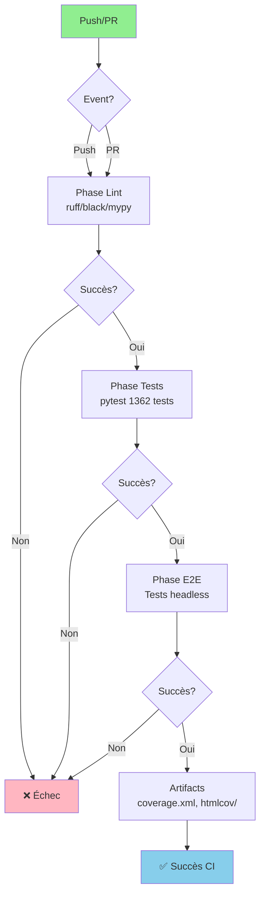
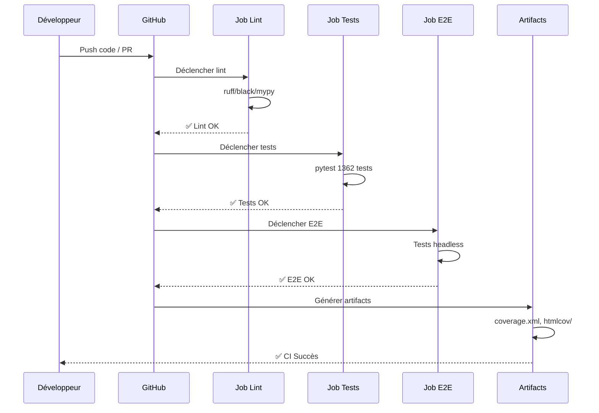

# 🔄 Pipeline CI/CD

**Date** : 24 novembre 2025  
**Version** : 1.4.0  
**Compatibilité Python** : 3.11+ ✅ **Matrice 3.12 ajoutée** (24 Nov. 2025)

> **Voir aussi** : [`docs/reference/INDEX_THEMATIQUE.md`](../reference/INDEX_THEMATIQUE.md) et [`docs/reference/project-status.md`](../reference/project-status.md)

**📚 [Guide tests](../development/testing.md)** | **🔧 [Guide avancé](../guides/GUIDE_AVANCE.md)**

---

## État actuel

- **GitHub Actions** : `.github/workflows/ci.yml`, Python 3.11
- **Phases** : lint (ruff/black/mypy), tests, e2e headless, artifacts, codecov

### Architecture Pipeline CI/CD



### Workflow GitHub Actions



## Axes d'amélioration

- ✅ Matrice Python : 3.11 / 3.12 - **TERMINÉ** (24 Nov. 2025)
- ✅ Hooks pre-commit : ruff/black/mypy + gitleaks - **TERMINÉ** (24 Nov. 2025)
- ⏳ Sharding/xdist tests si durée > 10 min - Optionnel
- ✅ Gitleaks (sécurité) en CI - **TERMINÉ** (24 Nov. 2025)
- ⏳ Perf baselines : exporter p50/p95 en JSONL et valider fourchette - Optionnel

---

## 🎉 Améliorations Phase 1 - Terminées (24 Nov. 2025)

### ✅ Quick Wins Implémentés

1. **Python 3.12 dans CI** ✅
   - Matrice ajoutée dans job `lint` (3.11 + 3.12)
   - Détection précoce problèmes compatibilité

2. **Pre-commit hooks améliorés** ✅
   - Gitleaks ajouté (scan secrets)
   - `check-json`, `check-toml` ajoutés
   - Versions mises à jour

3. **Scan secrets automatisé** ✅
   - Gitleaks intégré dans CI
   - Installation automatique si absent
   - Continue-on-error pour ne pas bloquer

4. **Métriques Prometheus complétées** ✅
   - `bbia_watchdog_heartbeat_age_seconds`
   - `bbia_robot_connected`
   - `bbia_latency_p50_ms`, `bbia_latency_p95_ms`, `bbia_latency_p99_ms`

5. **Dépendances système** ✅
   - `ffmpeg` ajouté dans tous les jobs CI

## Artifacts & Reporting

- **Coverage** : `coverage.xml`, `htmlcov/`
- **Logs e2e** : upload sur échec

## Références

- **État par axe** : `docs/reference/project-status.md` → CI/CD
- **Index** : `docs/reference/INDEX_THEMATIQUE.md`

---

**Dernière mise à jour** : 24 novembre 2025

## Pré-commit (optionnel)

```bash
pip install pre-commit
pre-commit install
pre-commit run --all-files

```
