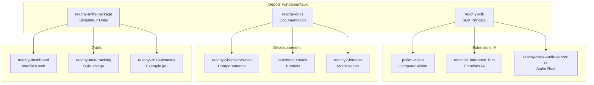
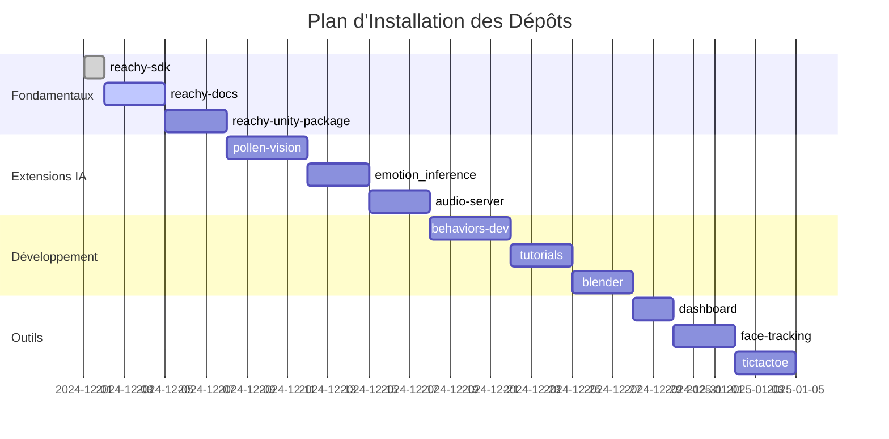

# 🚀 Guide Complet des Dépôts GitHub pour BBIA

## 🏗️ Architecture des Dépôts GitHub



## 📊 Priorité d'Installation



### 🔧 1.1 SDK Principal - `reachy-sdk`
**URL** : https://github.com/pollen-robotics/reachy-sdk  
**Statut** : ✅ DÉJÀ INSTALLÉ  
**Description** : SDK principal pour contrôler Reachy  
**Utilisation BBIA** : Contrôle des mouvements, accès aux capteurs

```bash
# Vérifier l'installation
pip show reachy-sdk
```

### 📚 1.2 Documentation Officielle - `reachy-docs`
**URL** : https://github.com/pollen-robotics/reachy-docs  
**Statut** : ❌ MANQUANT  
**Description** : Documentation complète et tutoriels  
**Utilisation BBIA** : Référence pour toutes les fonctionnalités

```bash
# Cloner la documentation
git clone https://github.com/pollen-robotics/reachy-docs.git
cd reachy-docs
```

### 🎮 1.3 Package Unity - `reachy-unity-package`
**URL** : https://github.com/pollen-robotics/reachy-unity-package  
**Statut** : ✅ DÉJÀ CONFIGURÉ  
**Description** : Simulation 3D dans Unity  
**Utilisation BBIA** : Tests et développement en simulation

---

## 🧠 ÉTAPE 2 : Dépôts pour l'Intelligence Artificielle

### 🤖 2.1 Vision et Reconnaissance - `pollen-vision`
**URL** : https://github.com/pollen-robotics/pollen-vision  
**Statut** : ❌ MANQUANT  
**Description** : Outils de vision par ordinateur  
**Utilisation BBIA** : Reconnaissance d'objets, détection de visages

```bash
# Installer pollen-vision
pip install git+https://github.com/pollen-robotics/pollen-vision.git
```

### 🎭 2.2 Inférence d'Émotions - `emotion_inference_hub`
**URL** : https://github.com/pollen-robotics/emotion_inference_hub  
**Statut** : ❌ MANQUANT  
**Description** : Détection et inférence d'émotions  
**Utilisation BBIA** : Comprendre les émotions de l'utilisateur

```bash
# Installer emotion_inference_hub
pip install git+https://github.com/pollen-robotics/emotion_inference_hub.git
```

### 🗣️ 2.3 Audio et Voix - `reachy2-sdk-audio-server-rs`
**URL** : https://github.com/pollen-robotics/reachy2-sdk-audio-server-rs  
**Statut** : ❌ MANQUANT  
**Description** : Serveur audio pour reconnaissance vocale  
**Utilisation BBIA** : Compréhension et synthèse vocale

```bash
# Cloner le serveur audio
git clone https://github.com/pollen-robotics/reachy2-sdk-audio-server-rs.git
```

---

## 🎯 ÉTAPE 3 : Dépôts pour les Comportements Avancés

### 🎪 3.1 Comportements - `reachy2-behaviors-dev`
**URL** : https://github.com/pollen-robotics/reachy2-behaviors-dev  
**Statut** : ❌ MANQUANT  
**Description** : Bibliothèque de comportements pré-programmés  
**Utilisation BBIA** : Actions et réactions automatiques

```bash
# Cloner les comportements
git clone https://github.com/pollen-robotics/reachy2-behaviors-dev.git
```

### 🎓 3.2 Tutoriels - `reachy2-tutorials`
**URL** : https://github.com/pollen-robotics/reachy2-tutorials  
**Statut** : ❌ MANQUANT  
**Description** : Exemples et tutoriels pratiques  
**Utilisation BBIA** : Apprentissage et exemples de code

```bash
# Cloner les tutoriels
git clone https://github.com/pollen-robotics/reachy2-tutorials.git
```

### 🎨 3.3 Blender - `reachy2-blender`
**URL** : https://github.com/pollen-robotics/reachy2-blender  
**Statut** : ❌ MANQUANT  
**Description** : Modèles 3D pour Blender  
**Utilisation BBIA** : Visualisation et animation 3D

---

## 🔧 ÉTAPE 4 : Dépôts Utilitaires

### 📊 4.1 Dashboard - `reachy-dashboard`
**URL** : https://github.com/pollen-robotics/reachy-dashboard  
**Statut** : ❌ MANQUANT  
**Description** : Interface web de contrôle  
**Utilisation BBIA** : Interface utilisateur pour BBIA

### 🎯 4.2 Suivi de Visage - `reachy-face-tracking`
**URL** : https://github.com/pollen-robotics/reachy-face-tracking  
**Statut** : ❌ MANQUANT  
**Description** : Suivi automatique des visages  
**Utilisation BBIA** : Regarder l'utilisateur

### 🎪 4.3 Jeux - `reachy-2019-tictactoe`
**URL** : https://github.com/pollen-robotics/reachy-2019-tictactoe  
**Statut** : ❌ MANQUANT  
**Description** : Exemple de jeu interactif  
**Utilisation BBIA** : Inspiration pour interactions

---

## 🚀 ÉTAPE 5 : Installation Automatisée

### 📦 Script d'Installation Complet
```bash
#!/bin/bash
# install_all_reachy_repos.sh

echo "🚀 Installation de tous les dépôts Reachy pour BBIA..."

# Créer le dossier des dépôts
mkdir -p reachy_repos
cd reachy_repos

# ÉTAPE 1 : Fondamentaux
echo "📚 Étape 1 : Dépôts fondamentaux..."
git clone https://github.com/pollen-robotics/reachy-docs.git
git clone https://github.com/pollen-robotics/reachy-unity-package.git

# ÉTAPE 2 : Intelligence Artificielle
echo "🧠 Étape 2 : Dépôts IA..."
pip install git+https://github.com/pollen-robotics/pollen-vision.git
pip install git+https://github.com/pollen-robotics/emotion_inference_hub.git
git clone https://github.com/pollen-robotics/reachy2-sdk-audio-server-rs.git

# ÉTAPE 3 : Comportements
echo "🎪 Étape 3 : Comportements..."
git clone https://github.com/pollen-robotics/reachy2-behaviors-dev.git
git clone https://github.com/pollen-robotics/reachy2-tutorials.git
git clone https://github.com/pollen-robotics/reachy2-blender.git

# ÉTAPE 4 : Utilitaires
echo "🔧 Étape 4 : Utilitaires..."
git clone https://github.com/pollen-robotics/reachy-dashboard.git
git clone https://github.com/pollen-robotics/reachy-face-tracking.git
git clone https://github.com/pollen-robotics/reachy-2019-tictactoe.git

echo "✅ Installation terminée !"
echo "📁 Dépôts installés dans : reachy_repos/"
```

---

## 🎯 ÉTAPE 6 : Intégration dans BBIA

### 🔗 Structure BBIA avec Dépôts
```
bbia-reachy-sim/
├── src/bbia_sim/
│   ├── bbia_awake.py              # ✅ Existant
│   ├── vision_manager.py          # 🔄 À créer avec pollen-vision
│   ├── emotion_manager.py         # 🔄 À créer avec emotion_inference_hub
│   ├── voice_manager.py           # 🔄 À créer avec audio-server
│   ├── behavior_manager.py        # 🔄 À créer avec behaviors-dev
│   └── movement_controller.py     # 🔄 À créer avec reachy-sdk
├── reachy_repos/                  # 📁 Nouveau dossier
│   ├── reachy-docs/               # 📚 Documentation
│   ├── pollen-vision/             # 👁️ Vision
│   ├── emotion_inference_hub/     # 🎭 Émotions
│   ├── reachy2-behaviors-dev/     # 🎪 Comportements
│   └── reachy-dashboard/          # 📊 Interface
└── tests/
    ├── test_vision.py             # 🔄 À créer
    ├── test_emotions.py           # 🔄 À créer
    └── test_behaviors.py          # 🔄 À créer
```

---

## 🎯 ÉTAPE 7 : Plan de Développement BBIA

### 📅 Phase 1 : Fondamentaux (Maintenant - 2 semaines)
- [ ] Installer tous les dépôts manquants
- [ ] Étudier la documentation officielle
- [ ] Tester les fonctionnalités de base
- [ ] Créer les managers BBIA de base

### 📅 Phase 2 : Intelligence (2-4 semaines)
- [ ] Intégrer pollen-vision pour la reconnaissance
- [ ] Intégrer emotion_inference_hub pour les émotions
- [ ] Configurer le serveur audio
- [ ] Tester en simulation Unity

### 📅 Phase 3 : Comportements (4-6 semaines)
- [ ] Étudier reachy2-behaviors-dev
- [ ] Créer des comportements personnalisés
- [ ] Intégrer le suivi de visage
- [ ] Développer l'interface dashboard

### 📅 Phase 4 : Optimisation (6-8 semaines)
- [ ] Tests complets
- [ ] Optimisation des performances
- [ ] Documentation BBIA
- [ ] Préparation pour le robot physique

---

## 🎯 ÉTAPE 8 : Commandes d'Installation

### 🚀 Installation Rapide
```bash
# Créer le script d'installation
cat > install_all_reachy_repos.sh << 'EOF'
#!/bin/bash
echo "🚀 Installation de tous les dépôts Reachy pour BBIA..."

# Créer le dossier des dépôts
mkdir -p reachy_repos
cd reachy_repos

# Dépôts fondamentaux
git clone https://github.com/pollen-robotics/reachy-docs.git
git clone https://github.com/pollen-robotics/reachy-unity-package.git

# Dépôts IA
pip install git+https://github.com/pollen-robotics/pollen-vision.git
pip install git+https://github.com/pollen-robotics/emotion_inference_hub.git
git clone https://github.com/pollen-robotics/reachy2-sdk-audio-server-rs.git

# Comportements
git clone https://github.com/pollen-robotics/reachy2-behaviors-dev.git
git clone https://github.com/pollen-robotics/reachy2-tutorials.git
git clone https://github.com/pollen-robotics/reachy2-blender.git

# Utilitaires
git clone https://github.com/pollen-robotics/reachy-dashboard.git
git clone https://github.com/pollen-robotics/reachy-face-tracking.git
git clone https://github.com/pollen-robotics/reachy-2019-tictactoe.git

echo "✅ Installation terminée !"
echo "📁 Dépôts installés dans : reachy_repos/"
EOF

# Rendre exécutable et lancer
chmod +x install_all_reachy_repos.sh
./install_all_reachy_repos.sh
```

### 🔍 Vérification
```bash
# Vérifier les dépôts installés
ls -la reachy_repos/

# Vérifier les packages Python
pip list | grep -i reachy
pip list | grep -i pollen
```

---

## 🎯 ÉTAPE 9 : Tests et Validation

### 🧪 Tests de Base
```bash
# Test SDK principal
python3 -c "import reachy; print('✅ reachy-sdk OK')"

# Test pollen-vision
python3 -c "import pollen_vision; print('✅ pollen-vision OK')"

# Test emotion_inference_hub
python3 -c "import emotion_inference_hub; print('✅ emotion_inference_hub OK')"
```

### 🎮 Test Unity
```bash
# Lancer la simulation Unity
cd reachy_repos/reachy-unity-package
# Suivre les instructions du README
```

---

## 🎯 ÉTAPE 10 : Prochaines Actions

### 📋 Actions Immédiates
1. **Exécuter le script d'installation** des dépôts manquants
2. **Étudier la documentation** officielle
3. **Tester les fonctionnalités** de base
4. **Planifier l'intégration** dans BBIA

### 🎯 Objectifs Court Terme
- [ ] Avoir tous les dépôts installés
- [ ] Comprendre l'architecture de chaque composant
- [ ] Créer des tests de base
- [ ] Préparer l'intégration BBIA

### 🎯 Objectifs Moyen Terme
- [ ] BBIA avec vision fonctionnelle
- [ ] BBIA avec reconnaissance d'émotions
- [ ] BBIA avec synthèse vocale
- [ ] BBIA avec comportements avancés

---

## 🌟 Résumé

### ✅ Ce que vous avez déjà
- `reachy-sdk` : SDK principal
- `reachy-unity-package` : Simulation Unity
- Structure de projet BBIA
- Scripts d'installation

### ❌ Ce qui manque (ESSENTIEL)
- `reachy-docs` : Documentation officielle
- `pollen-vision` : Vision par ordinateur
- `emotion_inference_hub` : Détection d'émotions
- `reachy2-sdk-audio-server-rs` : Serveur audio
- `reachy2-behaviors-dev` : Comportements
- `reachy-dashboard` : Interface web
- `reachy-face-tracking` : Suivi de visage

### 🚀 Prochaine Action
**Exécutez le script d'installation** pour récupérer tous les dépôts manquants et commencer l'intégration dans BBIA !

---

**BBIA** - Brain-Based Interactive Agent  
*Guide complet des dépôts GitHub* 🚀✨

**Version** : 1.0  
**Date** : Décembre 2024  
**Statut** : Prêt pour installation 