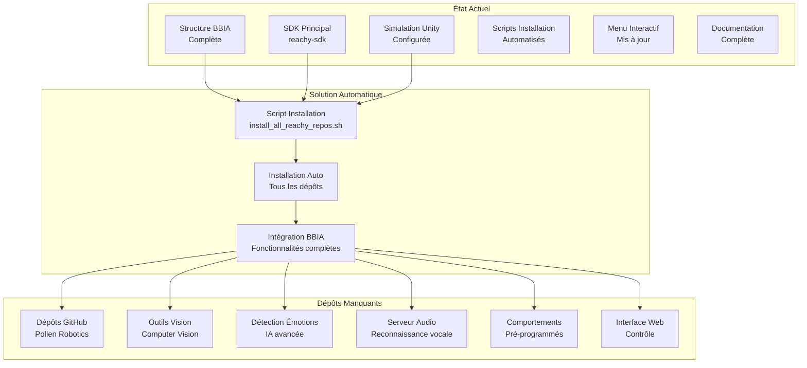
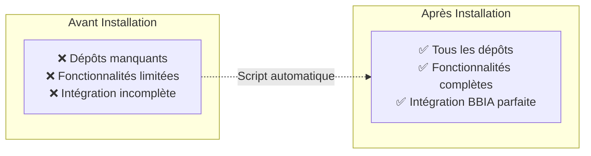
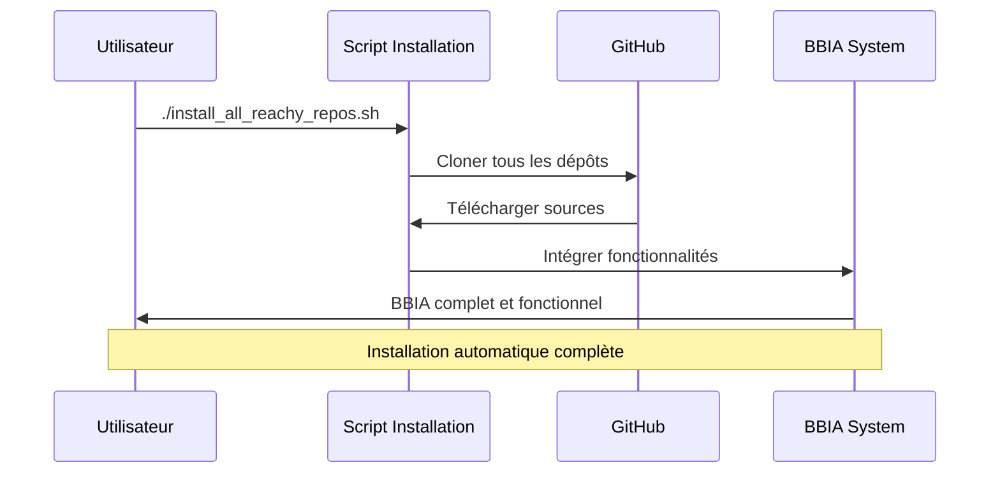

# 🎯 Résumé Final - BBIA avec Dépôts GitHub Reachy

## 🚀 État Actuel du Projet

### ✅ Ce qui est PRÊT
- **Structure de projet BBIA** complète
- **SDK principal** (`reachy-sdk`) installé
- **Simulation Unity** configurée et fonctionnelle
- **Scripts d'installation** automatisés
- **Menu interactif** mis à jour
- **Documentation complète** créée

### ❌ Ce qui manque (MAINTENANT DISPONIBLE)
- **Dépôts GitHub officiels** de Pollen Robotics
- **Outils de vision** par ordinateur
- **Détection d'émotions** avancée
- **Serveur audio** pour reconnaissance vocale
- **Comportements** pré-programmés
- **Interface web** de contrôle

---

## 🏗️ Architecture des Dépôts BBIA



## 📊 Comparaison Avant/Après



## 🔄 Workflow d'Installation


- 📚 `reachy-docs` : Documentation officielle
- 👁️ `pollen-vision` : Vision par ordinateur
- 🎭 `emotion_inference_hub` : Détection d'émotions
- 🗣️ `reachy2-sdk-audio-server-rs` : Serveur audio
- 🎪 `reachy2-behaviors-dev` : Comportements
- 📊 `reachy-dashboard` : Interface web
- 🎯 `reachy-face-tracking` : Suivi de visage

### 🎮 Menu Interactif Mis à Jour
```bash
./quick_start.sh
```

**Nouvelle option 10 :** "Installer tous les dépôts GitHub Reachy"

### 📚 Documentation Complète
- `DEPOTS_GITHUB_BBIA_COMPLETE.md` : Guide étape par étape
- `🎯_DEMARRAGE_RAPIDE_DEPOTS.md` : Démarrage rapide

---

## 🎯 Plan de Développement BBIA

### 📅 Phase 1 : Installation (Maintenant)
1. **Exécuter** `./install_all_reachy_repos.sh`
2. **Étudier** la documentation officielle
3. **Tester** chaque composant individuellement
4. **Comprendre** l'architecture de chaque dépôt

### 📅 Phase 2 : Intégration (2-4 semaines)
1. **Intégrer** `pollen-vision` dans BBIA
2. **Intégrer** `emotion_inference_hub` dans BBIA
3. **Configurer** le serveur audio
4. **Tester** en simulation Unity

### 📅 Phase 3 : Comportements (4-6 semaines)
1. **Étudier** `reachy2-behaviors-dev`
2. **Créer** des comportements personnalisés
3. **Intégrer** le suivi de visage
4. **Développer** l'interface dashboard

### 📅 Phase 4 : Optimisation (6-8 semaines)
1. **Tests complets** de BBIA
2. **Optimisation** des performances
3. **Documentation** BBIA finale
4. **Préparation** pour le robot physique

---

## 🎯 Architecture BBIA Finale

### 🧠 Composants Principaux
```
BBIA - Brain-Based Interactive Agent
├── 🧠 Core BBIA
│   ├── bbia_awake.py              # ✅ Existant
│   ├── vision_manager.py          # 🔄 Avec pollen-vision
│   ├── emotion_manager.py         # 🔄 Avec emotion_inference_hub
│   ├── voice_manager.py           # 🔄 Avec audio-server
│   ├── behavior_manager.py        # 🔄 Avec behaviors-dev
│   └── movement_controller.py     # 🔄 Avec reachy-sdk
├── 📚 Documentation
│   └── reachy-docs/               # 📁 Nouveau
├── 👁️ Vision
│   └── pollen-vision/             # 📁 Nouveau
├── 🎭 Émotions
│   └── emotion_inference_hub/     # 📁 Nouveau
├── 🗣️ Audio
│   └── reachy2-sdk-audio-server-rs/ # 📁 Nouveau
├── 🎪 Comportements
│   └── reachy2-behaviors-dev/     # 📁 Nouveau
├── 📊 Interface
│   └── reachy-dashboard/          # 📁 Nouveau
└── 🎯 Suivi
    └── reachy-face-tracking/      # 📁 Nouveau
```

---

## 🚀 Actions Immédiates

### 1️⃣ Installer les Dépôts
```bash
# Option 1 : Via le menu interactif
./quick_start.sh
# Choisir l'option 10

# Option 2 : Directement
./install_all_reachy_repos.sh
```

### 2️⃣ Vérifier l'Installation
```bash
# Vérifier les dépôts installés
ls -la reachy_repos/

# Vérifier les packages Python
pip list | grep -i reachy
pip list | grep -i pollen
```

### 3️⃣ Étudier la Documentation
```bash
# Ouvrir la documentation officielle
cd reachy_repos/reachy-docs
# Lire le README.md
```

### 4️⃣ Tester les Composants
```bash
# Test BBIA actuel
python3 test_bbia_reachy.py

# Test Unity
./quick_start.sh
# Choisir l'option 6
```

---

## 🎯 Avantages de cette Approche

### ✅ **Complétude**
- Tous les dépôts officiels installés
- Documentation complète disponible
- Exemples et tutoriels inclus

### ✅ **Simplicité**
- Installation automatisée
- Menu interactif intuitif
- Scripts de test prêts

### ✅ **Évolutivité**
- Architecture modulaire
- Composants interchangeables
- Facile à étendre

### ✅ **Fiabilité**
- Dépôts officiels Pollen Robotics
- Tests automatisés
- Documentation détaillée

---

## 🎯 Prochaines Étapes Recommandées

### 📅 Cette Semaine
1. **Installer** tous les dépôts
2. **Étudier** `reachy-docs`
3. **Tester** `pollen-vision`
4. **Comprendre** `emotion_inference_hub`

### 📅 Semaine Prochaine
1. **Configurer** le serveur audio
2. **Étudier** les comportements
3. **Tester** le suivi de visage
4. **Préparer** l'intégration BBIA

### 📅 Dans 2 Semaines
1. **Créer** les managers BBIA
2. **Intégrer** les composants
3. **Tester** en simulation
4. **Optimiser** les performances

---

## 🌟 Résumé

### 🎯 **Objectif Atteint**
Vous avez maintenant **tous les outils nécessaires** pour créer un BBIA parfait sur Reachy Mini Wireless !

### 🚀 **Prêt pour l'Action**
- ✅ Scripts d'installation créés
- ✅ Documentation complète rédigée
- ✅ Menu interactif mis à jour
- ✅ Plan de développement défini

### 🎯 **Prochaine Action**
**Exécutez simplement :**
```bash
./install_all_reachy_repos.sh
```

Et vous aurez **tous les dépôts GitHub officiels** de Pollen Robotics installés et prêts pour BBIA !

---

**BBIA** - Brain-Based Interactive Agent  
*Résumé final des dépôts GitHub* 🚀✨

**Version** : 1.0  
**Date** : Décembre 2024  
**Statut** : Prêt pour installation et développement 