# Guide d'intégration BBIA-SIM - Phase 3

> Compatibilité Python et CI
>
> - Python requis: 3.11+
> - CI: `.github/workflows/ci.yml`
> - Setup rapide:
> ```bash
>   pyenv install 3.11.9 && pyenv local 3.11.9
>   python -m pip install --upgrade pip
>   pip install -e .
>   ```

**Version** : 1.2.0
**Date** : Oct 25 / Nov 25
**Public** : développeurs, chercheurs, communauté technique  
**📚 [Guide débutant](../guides/GUIDE_DEBUTANT.md)** | **🔧 [Guide avancé](../guides/GUIDE_AVANCE.md)** | **🧪 [Guide tests](TESTING_GUIDE.md)**

## Introduction

Ce guide vous accompagne dans l'intégration de BBIA-SIM dans vos projets. BBIA-SIM est un écosystème ouvert pour le contrôle du robot Reachy Mini avec des modules BBIA (Bio-Inspired Artificial Intelligence).

> État du projet (référence)
>
> Voir `docs/reference/project-status.md` → section "État par axe" pour connaître le niveau actuel (Observabilité, Perf, Sécurité, CI/CD, etc.) et les axes futurs proposés.

### Fonctionnalités principales

- Contrôle robot : API REST + WebSocket pour le contrôle du robot Reachy Mini
- Émotions BBIA : 12 émotions contrôlant les articulations du robot
- Comportements : 8 comportements prédéfinis (wake_up, greeting, etc.)
- Modes démo : simulation MuJoCo, robot réel, mode mixte
- Documentation : Swagger UI, ReDoc, OpenAPI complète
- Écosystème ouvert : support multi-robots, communauté technique

---

## Architecture d'Intégration

### Vue d'Ensemble

```mermaid
graph TB
    subgraph "Application Externe"
        APP[Votre Application<br/>Python/Web/CLI]
        API_CLIENT[Client API<br/>FastAPI]
    end
    
    subgraph "BBIA-SIM Core"
        REST_API[REST API<br/>FastAPI]
        WEBSOCKET[WebSocket<br/>Temps réel]
        ROBOTAPI[RobotAPI<br/>Interface Unifiée]
    end
    
    subgraph "Backends"
        MUJOCO[Backend MuJoCo<br/>Simulation]
        REACHY[Backend Reachy<br/>Robot Physique]
    end
    
    APP --> API_CLIENT
    API_CLIENT --> REST_API
    API_CLIENT --> WEBSOCKET
    
    REST_API --> ROBOTAPI
    WEBSOCKET --> ROBOTAPI
    
    ROBOTAPI --> MUJOCO
    ROBOTAPI --> REACHY
    
    style APP fill:#90EE90
    style ROBOTAPI fill:#FFD700
    style REST_API fill:#87CEEB
```



### Flux d'Intégration

```mermaid
flowchart TD
    START[Démarrer avec BBIA-SIM] --> INSTALL[Installation<br/>pip install -e .]
    INSTALL --> CONFIG[Configuration<br/>Variables d'environnement]
    CONFIG --> API[Démarrer API<br/>deployment/public_api.py --dev]
    API --> TEST[Tester API<br/>--check ou Swagger UI]
    TEST --> INTEG[Intégrer dans votre code<br/>RobotAPI ou HTTP client]
    INTEG --> DEPLOY[Déployer<br/>Production ou Docker]

    style START fill:#90EE90
    style DEPLOY fill:#87CEEB
```



### Séquence d'Intégration


---

## Démarrage rapide

### 1. Installation

```bash
# Cloner le repository
git clone https://github.com/arkalia-luna-system/bbia-sim.git
cd bbia-sim

# Installer les dépendances
pip install -r requirements.txt

# Installer en mode développement
pip install -e .
```

### 2. Démarrage de l'API

```bash
# Démarrage en mode développement
python deployment/public_api.py --dev

# Démarrage en mode production
python deployment/public_api.py --prod --port 8000

# Démarrage sur toutes les interfaces
python deployment/public_api.py --host 0.0.0.0 --port 8000
```

### 3. Test de l'API

```bash
# Test automatisé
python deployment/public_api.py --check

# Démonstration complète
python scripts/demo_public_api.py

# Mode démo spécifique
python scripts/demo_mode_complete.py --mode simulation
```

### 4. Documentation interactive

- **Swagger UI** : http://localhost:8000/docs
- **ReDoc** : http://localhost:8000/redoc
- **OpenAPI** : http://localhost:8000/openapi.json

---

## Intégration API

### Authentification

L'API utilise l'authentification Bearer Token :

```python
import httpx

# Configuration du client
headers = {
    "Authorization": "Bearer YOUR_API_TOKEN"
}

async with httpx.AsyncClient() as client:
    response = await client.get(
        "http://localhost:8000/development/api/ecosystem/capabilities",
        headers=headers
    )
    data = response.json()
```

### Endpoints principaux

#### Écosystème

```python
# Capacités du robot
GET /development/api/ecosystem/capabilities

# Statut de l'API
GET /development/api/ecosystem/status

# Émotions disponibles
GET /development/api/ecosystem/emotions/available

# Comportements disponibles
GET /development/api/ecosystem/behaviors/available

# Modes de démonstration
GET /development/api/ecosystem/demo/modes
```

#### Moteurs et Daemon

```python
# Statut moteurs
GET /development/api/motors/status

# Changer mode moteurs
POST /development/api/motors/set_mode/{mode}  # enabled, disabled, gravity_compensation

# Statut daemon
GET /development/api/daemon/status

# Contrôle daemon
POST /development/api/daemon/start
POST /development/api/daemon/stop
POST /development/api/daemon/restart
```

#### Mouvement avec Interpolation

```python
# Déplacer robot avec interpolation
POST /development/api/motion/goto_pose?duration=2.0&interpolation=minjerk
{
    "x": 0.1, "y": 0.0, "z": 0.3,
    "roll": 0.0, "pitch": 0.0, "yaw": 0.1
}

# Modes interpolation disponibles: linear, minjerk, ease, cartoon

# Réveiller robot
POST /development/api/motion/wake_up

# Mettre en veille
POST /development/api/motion/goto_sleep
```

#### État du Robot

```python
# Pose tête actuelle
GET /development/api/state/present_head_pose

# Yaw corps actuel
GET /development/api/state/present_body_yaw

# Positions antennes
GET /development/api/state/present_antenna_joint_positions

# WebSocket streaming état complet
WS /development/api/state/ws/full?frequency=10.0
```

#### Cinématique

```python
# Informations cinématique
GET /development/api/kinematics/info

# Représentation URDF
GET /development/api/kinematics/urdf

# Fichiers STL (assets)
GET /development/api/kinematics/stl/{filename}
```

#### Applications HuggingFace

```python
# Lister toutes les applications disponibles
GET /development/api/apps/list-available

# Lister par source (huggingface, local)
GET /development/api/apps/list-available/huggingface

# Installer une application
POST /development/api/apps/install
{
    "name": "bbia_chat",
    "source_kind": "huggingface"
}

# Supprimer une application
POST /development/api/apps/remove/{app_name}

# Statut d'un job d'installation/suppression
GET /development/api/apps/job-status/{job_id}

# WebSocket pour suivre un job en temps réel
WS /development/api/apps/ws/apps-manager/{job_id}

# Démarrer une application
POST /development/api/apps/start-app/{app_name}

# Redémarrer l'application courante
POST /development/api/apps/restart-current-app

# Arrêter l'application courante
POST /development/api/apps/stop-current-app

# Statut de l'application courante
GET /development/api/apps/current-app-status
```

#### Émotions BBIA

```python
# Appliquer une émotion
POST /development/api/ecosystem/emotions/apply
{
    "emotion": "happy",
    "intensity": 0.7,
    "duration": 5.0,
    "joint": "yaw_body"  # optionnel
}
```

#### Comportements BBIA

```python
# Exécuter un comportement
POST /development/api/ecosystem/behaviors/execute
{
    "behavior": "greeting",
    "intensity": 1.0,
    "duration": 10.0  # optionnel
}
```

#### Modes de démonstration

```python
# Démarrer une démonstration
POST /development/api/ecosystem/demo/start
{
    "mode": "simulation",  # ou "robot_real", "mixed"
    "duration": 30.0,
    "emotion": "happy"  # optionnel
}
```

#### Contrôle moteurs (SDK officiel)

```python
# Statut des moteurs
GET /development/api/motors/status

# Changer mode moteurs
POST /development/api/motors/set_mode/{mode}  # enabled, disabled, gravity_compensation
```

#### Contrôle daemon (SDK officiel)

```python
# Statut du daemon
GET /development/api/daemon/status

# Démarrer le daemon
POST /development/api/daemon/start?wake_up=false

# Arrêter le daemon
POST /development/api/daemon/stop?goto_sleep=false

# Redémarrer le daemon
POST /development/api/daemon/restart
```

#### Mouvements robot (SDK officiel)

```python
# Réveiller le robot
POST /development/api/motion/wake_up

# Mettre en veille
POST /development/api/motion/goto_sleep
```

#### État robot (SDK officiel)

```python
# Pose actuelle de la tête
GET /development/api/state/present_head_pose

# Yaw du corps actuel
GET /development/api/state/present_body_yaw

# Positions des antennes
GET /development/api/state/present_antenna_joint_positions
```

### WebSocket télémétrie

```python
import asyncio
import websockets
import json

async def telemetry_client():
    uri = "ws://localhost:8000/ws/telemetry"

    async with websockets.connect(uri) as websocket:
        while True:
            data = await websocket.recv()
            telemetry = json.loads(data)
            print(f"Télémétrie: {telemetry}")

# Démarrage du client
asyncio.run(telemetry_client())
```

---

## Intégration robot

### Backends disponibles

BBIA-SIM supporte plusieurs backends :

```python
from bbia_sim.robot_factory import RobotFactory

# Backend MuJoCo (simulation)
robot = RobotFactory.create_backend("mujoco")

# Backend Reachy Mini SDK (robot réel)
robot = RobotFactory.create_backend("reachy_mini")

# Backend Reachy Mock (développement)
robot = RobotFactory.create_backend("reachy")
```

### Contrôle direct

```python
from bbia_sim.robot_factory import RobotFactory
from bbia_sim.bbia_emotions import BBIAEmotions

# Initialisation
robot = RobotFactory.create_backend("mujoco")
emotions = BBIAEmotions()

# Application d'émotion
emotions.apply_emotion("happy", intensity=0.8, duration=5.0)

# Contrôle direct des joints
robot.set_joint_position("yaw_body", 0.2)
```

### Modules BBIA

```python
from bbia_sim.bbia_emotions import BBIAEmotions
from bbia_sim.bbia_behavior import BBIABehavior
from bbia_sim.bbia_vision import BBIAVision
from bbia_sim.bbia_voice import BBIAVoice

# Initialisation des modules
emotions = BBIAEmotions()
behavior = BBIABehavior()
vision = BBIAVision()
voice = BBIAVoice()

# Utilisation
emotions.apply_emotion("curious", 0.6, 3.0)
behavior.execute_behavior("greeting", 1.0)
vision.detect_objects()
voice.speak("Bonjour !")
```

---

## Modes de démonstration

### Mode simulation

```bash
# Démonstration simulation complète
python scripts/demo_mode_complete.py --mode simulation

# Caractéristiques :
# - Simulation MuJoCo 3D
# - Physique réaliste
# - Contrôle complet
# - Sécurité maximale
# - Fonctionnalités complètes
```

### Mode robot réel

```bash
# Démonstration robot réel (nécessite robot physique)
python scripts/demo_mode_complete.py --mode robot_real

# Caractéristiques :
# - Robot Reachy Mini physique
# - SDK officiel Pollen Robotics
# - Contrôle sécurisé
# - Intensités réduites
# - Surveillance continue
```

### Mode mixte

```bash
# Démonstration mode mixte
python scripts/demo_mode_complete.py --mode mixed

# Caractéristiques :
# - Basculement automatique
# - Comparaison simulation/réel
# - Tests de conformité
# - Analyse des performances
```

---

## Exemples d'intégration

### Exemple 1 : Application web simple

```python
import asyncio
import httpx
from fastapi import FastAPI
from fastapi.responses import HTMLResponse

app = FastAPI()

@app.get("/", response_class=HTMLResponse)
async def home():
    return """
    <html>
        <head><title>BBIA-SIM Control</title></head>
        <body>
            <h1>BBIA-SIM Control</h1>
            <button onclick="applyEmotion('happy')">Happy</button>
            <button onclick="applyEmotion('sad')">Sad</button>
            <button onclick="executeBehavior('greeting')">Greeting</button>

            <script>
                async function applyEmotion(emotion) {
                    const response = await fetch('/development/api/ecosystem/emotions/apply', {
                        method: 'POST',
                        headers: {'Content-Type': 'application/json'},
                        body: JSON.stringify({
                            emotion: emotion,
                            intensity: 0.7,
                            duration: 3.0
                        })
                    });
                    const result = await response.json();
                    console.log(result);
                }

                async function executeBehavior(behavior) {
                    const response = await fetch('/development/api/ecosystem/behaviors/execute', {
                        method: 'POST',
                        headers: {'Content-Type': 'application/json'},
                        body: JSON.stringify({
                            behavior: behavior,
                            intensity: 1.0
                        })
                    });
                    const result = await response.json();
                    console.log(result);
                }
            </script>
        </body>
    </html>
    """

if __name__ == "__main__":
    import uvicorn
    uvicorn.run(app, host="0.0.0.0", port=3000)
```

### Exemple 2 : Client Python

```python
import asyncio
import httpx

class BBIAClient:
    def __init__(self, base_url: str = "http://localhost:8000"):
        self.base_url = base_url
        self.client = httpx.AsyncClient()

    async def apply_emotion(self, emotion: str, intensity: float = 0.7, duration: float = 5.0):
        """Applique une émotion BBIA."""
        response = await self.client.post(
            f"{self.base_url}/development/api/ecosystem/emotions/apply",
            params={
                "emotion": emotion,
                "intensity": intensity,
                "duration": duration
            }
        )
        return response.json()

    async def execute_behavior(self, behavior: str, intensity: float = 1.0):
        """Exécute un comportement BBIA."""
        response = await self.client.post(
            f"{self.base_url}/development/api/ecosystem/behaviors/execute",
            params={
                "behavior": behavior,
                "intensity": intensity
            }
        )
        return response.json()

    async def get_capabilities(self):
        """Récupère les capacités du robot."""
        response = await self.client.get(f"{self.base_url}/development/api/ecosystem/capabilities")
        return response.json()

    async def close(self):
        """Ferme le client."""
        await self.client.aclose()

# Utilisation
async def main():
    client = BBIAClient()

    try:
        # Récupération des capacités
        capabilities = await client.get_capabilities()
        print(f"Robot: {capabilities['model']}")
        print(f"Joints: {capabilities['joints']}")
        print(f"Émotions: {len(capabilities['emotions'])}")

        # Application d'émotions
        await client.apply_emotion("happy", 0.8, 5.0)
        await asyncio.sleep(1.0)
        await client.apply_emotion("curious", 0.6, 3.0)

        # Exécution de comportements
        await client.execute_behavior("greeting", 1.0)
        await asyncio.sleep(2.0)
        await client.execute_behavior("nod", 0.8)

    finally:
        await client.close()

if __name__ == "__main__":
    asyncio.run(main())
```

### Exemple 3 : Intégration ROS2

```python
import rclpy
from rclpy.node import Node
from std_msgs.msg import String
import httpx
import asyncio

class BBIAROS2Node(Node):
    def __init__(self):
        super().__init__('bbia_ros2_node')

        # Subscription aux commandes
        self.subscription = self.create_subscription(
            String,
            'bbia_command',
            self.command_callback,
            10
        )

        # Client HTTP pour BBIA-SIM
        self.client = httpx.AsyncClient()
        self.base_url = "http://localhost:8000"

        self.get_logger().info('BBIA ROS2 Node démarré')

    def command_callback(self, msg):
        """Traite les commandes ROS2."""
        command = msg.data
        self.get_logger().info(f'Commande reçue: {command}')

        # Exécution asynchrone
        asyncio.create_task(self.execute_command(command))

    async def execute_command(self, command: str):
        """Exécute une commande BBIA."""
        try:
            if command.startswith("emotion:"):
                emotion = command.split(":")[1]
                response = await self.client.post(
                    f"{self.base_url}/development/api/ecosystem/emotions/apply",
                    params={"emotion": emotion, "intensity": 0.7, "duration": 3.0}
                )
                self.get_logger().info(f'Émotion {emotion} appliquée')

            elif command.startswith("behavior:"):
                behavior = command.split(":")[1]
                response = await self.client.post(
                    f"{self.base_url}/development/api/ecosystem/behaviors/execute",
                    params={"behavior": behavior, "intensity": 1.0}
                )
                self.get_logger().info(f'Comportement {behavior} exécuté')

        except Exception as e:
            self.get_logger().error(f'Erreur: {e}')

def main(args=None):
    rclpy.init(args=args)
    node = BBIAROS2Node()

    try:
        rclpy.spin(node)
    except KeyboardInterrupt:
        pass
    finally:
        node.destroy_node()
        rclpy.shutdown()

if __name__ == '__main__':
    main()
```

---

## Configuration avancée

### Variables d'environnement

```bash
# Configuration API
export BBIA_API_HOST=0.0.0.0
export BBIA_API_PORT=8000
export BBIA_API_TOKEN=your_secret_token

# Configuration Simulation
export MUJOCO_GL=egl
export BBIA_DISABLE_AUDIO=1

# Configuration Robot
export REACHY_SDK_PATH=/path/to/reachy-sdk
export REACHY_ROBOT_IP=192.168.1.100
```

### Configuration Docker

```dockerfile
FROM python:3.11-slim

WORKDIR /app

# Installation des dépendances
COPY requirements.txt .
RUN pip install -r requirements.txt

# Copie du code
COPY . .

# Exposition du port
EXPOSE 8000

# Démarrage
CMD ["python", "scripts/start_public_api.py", "--prod"]
```

### Configuration production

```python
# Configuration uvicorn pour production
uvicorn.run(
    "bbia_sim.daemon.app.main:app",
    host="0.0.0.0",
    port=8000,
    workers=4,
    log_level="info",
    access_log=True
)
```

---

## Tests et validation

### Tests automatisés

```bash
# Tests complets
python scripts/test_public_api.py

# Tests spécifiques
python -m pytest tests/test_api_ecosystem.py -v

# Tests de conformité
python scripts/conformity/test_conformity_sdk_officiel.py

# Tests de performance
python scripts/hardware_dry_run.py --duration 30
```

### Validation de l'intégration

```python
# Script de validation
import asyncio
import httpx

async def validate_integration():
    """Valide l'intégration BBIA-SIM."""
    client = httpx.AsyncClient()

    try:
        # Test de connectivité
        response = await client.get("http://localhost:8000/health")
        assert response.status_code == 200

        # Test des capacités
        response = await client.get("http://localhost:8000/development/api/ecosystem/capabilities")
        assert response.status_code == 200

        # Test des émotions
        response = await client.get("http://localhost:8000/development/api/ecosystem/emotions/available")
        assert response.status_code == 200

        # Test des comportements
        response = await client.get("http://localhost:8000/development/api/ecosystem/behaviors/available")
        assert response.status_code == 200

        print("Intégration validée avec succès")

    except Exception as e:
        print(f"Erreur de validation: {e}")
    finally:
        await client.aclose()

asyncio.run(validate_integration())
```

---

## Support et communauté

### Documentation

- **README Principal** : https://github.com/arkalia-luna-system/bbia-sim#readme
- **Documentation API** : http://localhost:8000/docs
- **Guides Techniques** : `docs/` directory
- **Exemples** : `examples/` directory

### Support communautaire

- **GitHub Issues** : https://github.com/arkalia-luna-system/bbia-sim/issues
- **Discussions** : https://github.com/arkalia-luna-system/bbia-sim/discussions
- **Email** : arkalia.luna.system@gmail.com

### Contribution

- **Fork** le repository
- **Créer** une branche feature
- **Commiter** vos changements
- **Pousser** vers la branche
- **Ouvrir** une Pull Request

---

## Checklist d'intégration

### Prérequis

- [ ] Python 3.11+ installé
- [ ] Dépendances installées (`pip install -r requirements.txt`)
- [ ] API BBIA-SIM démarrée (`python deployment/public_api.py --dev`)
- [ ] Tests de base passent (`python deployment/public_api.py --check`)

### Intégration API

- [ ] Authentification configurée (Bearer Token)
- [ ] Endpoints testés et fonctionnels
- [ ] Gestion d'erreurs implémentée
- [ ] WebSocket télémétrie configuré (optionnel)

### Intégration robot

- [ ] Backend approprié sélectionné (mujoco/reachy_mini/reachy)
- [ ] Modules BBIA intégrés
- [ ] Contrôle des émotions fonctionnel
- [ ] Exécution des comportements fonctionnelle

### Tests et validation

- [ ] Tests automatisés passent
- [ ] Validation de l'intégration réussie
- [ ] Performance acceptable
- [ ] Sécurité respectée

### Production

- [ ] Configuration production déployée
- [ ] Monitoring configuré
- [ ] Logs centralisés
- [ ] Sauvegarde des configurations

---

Vous avez intégré BBIA-SIM dans votre projet. Bienvenue dans l'écosystème BBIA-SIM.
