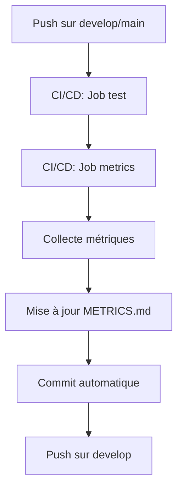

# 📊 Collecte Automatique des Métriques

> **Guide d'utilisation de arkalia-metrics-collector pour BBIA-SIM**

**Dernière mise à jour** : 8 Décembre 2025

---

## 🎉 Améliorations Phase 1 - Terminées (24 Nov. 2025)

### ✅ Métriques Prometheus Complétées

Les métriques Prometheus ont été complétées avec :
- ✅ `bbia_watchdog_heartbeat_age_seconds` - âge heartbeat watchdog
- ✅ `bbia_robot_connected` - statut connexion robot (1/0)
- ✅ `bbia_latency_p50_ms`, `bbia_latency_p95_ms`, `bbia_latency_p99_ms` - latence percentiles

**Endpoint** : `GET /metrics/prometheus`

Voir `docs/observabilite/OBSERVABILITE.md` pour plus de détails.

---

---

## 🎯 Vue d'ensemble

BBIA-SIM utilise [arkalia-metrics-collector](https://github.com/arkalia-luna-system/arkalia-metrics-collector) pour collecter et mettre à jour automatiquement les métriques du projet.

### Métriques collectées

- **Fichiers Python** : Nombre de fichiers source et de tests
- **Lignes de code** : Total de lignes dans le projet
- **Tests** : Nombre de tests collectés par pytest
- **Coverage** : Coverage global depuis `coverage.xml`
- **Documentation** : Nombre de fichiers Markdown

---

## 🚀 Utilisation

### Collecte manuelle

```bash
# Collecter les métriques
./scripts/collect_metrics.sh

# Mettre à jour la documentation
python3 scripts/update_metrics_doc.py
```

### Collecte automatique (CI/CD)

Les métriques sont automatiquement collectées et mises à jour via le job `metrics` dans `.github/workflows/ci.yml` :

- **Déclenchement** : Sur les branches `develop` et `main`
- **Fréquence** : À chaque push après les tests
- **Action** : Collecte → Mise à jour de `METRICS.md` → Commit automatique

---

## 📁 Fichiers

### Configuration

- **`arkalia-metrics.yaml`** : Configuration de arkalia-metrics-collector
  - Exclusions : venv, cache, logs, etc.
  - Formats de sortie : JSON, Markdown, HTML, CSV, YAML

### Scripts

- **`scripts/collect_metrics.sh`** : Script de collecte
  - Copie uniquement `src/` et `tests/` dans un répertoire temporaire
  - Lance arkalia-metrics-collector
  - Génère les fichiers dans `metrics/`

- **`scripts/update_metrics_doc.py`** : Script de mise à jour
  - Lit `metrics/metrics.json`
  - Extrait le coverage depuis `coverage.xml`
  - Met à jour `docs/reference/METRICS.md`

### Sortie

- **`metrics/metrics.json`** : Métriques au format JSON
- **`metrics/metrics.md`** : Métriques au format Markdown
- **`docs/reference/METRICS.md`** : Documentation mise à jour automatiquement

---

## 🔧 Configuration

### Personnaliser les exclusions

Éditez `arkalia-metrics.yaml` :

```yaml
exclusions:
  - "**/venv/**"
  - "**/logs/**"
  # Ajoutez vos exclusions ici
```

### Personnaliser les formats

Modifiez `scripts/collect_metrics.sh` :

```bash
arkalia-metrics collect "$TEMP_DIR" \
  --output metrics \
  --format json,markdown,html  # Formats souhaités
```

---

## 📊 Métriques disponibles

### Depuis arkalia-metrics-collector

- Fichiers Python (source + tests)
- Lignes de code totales
- Tests (via pytest --collect-only)
- Documentation (fichiers Markdown)
- Complexité du code (si activé)
- Scan de sécurité (si activé)

### Depuis coverage.xml

- Coverage global
- Coverage par module (si disponible)

### Depuis CI/CD

- Tests sélectionnés en CI
- Coverage depuis Codecov
- Statut des outils de qualité (Black, Ruff, MyPy, Bandit)

---

## 🔄 Workflow complet



---

## 🐛 Dépannage

### Les métriques ne se mettent pas à jour

1. Vérifier que `coverage.xml` existe (généré par pytest)
2. Vérifier que arkalia-metrics-collector est installé :
   ```bash
   pip install git+https://github.com/arkalia-luna-system/arkalia-metrics-collector.git
   ```
3. Vérifier les permissions des scripts :
   ```bash
   chmod +x scripts/collect_metrics.sh
   chmod +x scripts/update_metrics_doc.py
   ```

### Les métriques sont incorrectes

1. Vérifier les exclusions dans `arkalia-metrics.yaml`
2. Vérifier que seuls `src/` et `tests/` sont collectés
3. Relancer la collecte manuellement

### Le job CI/CD échoue

1. Vérifier les logs du job `metrics` dans GitHub Actions
2. Vérifier que les dépendances sont installées
3. Vérifier les permissions Git pour le commit automatique

---

## 📚 Ressources

- **arkalia-metrics-collector** : https://github.com/arkalia-luna-system/arkalia-metrics-collector
- **METRICS.md** : `docs/reference/METRICS.md`
- **CI/CD** : `.github/workflows/ci.yml` (job `metrics`)

---

**Note** : Les métriques sont mises à jour automatiquement. Pour une mise à jour manuelle, utilisez les scripts fournis.

