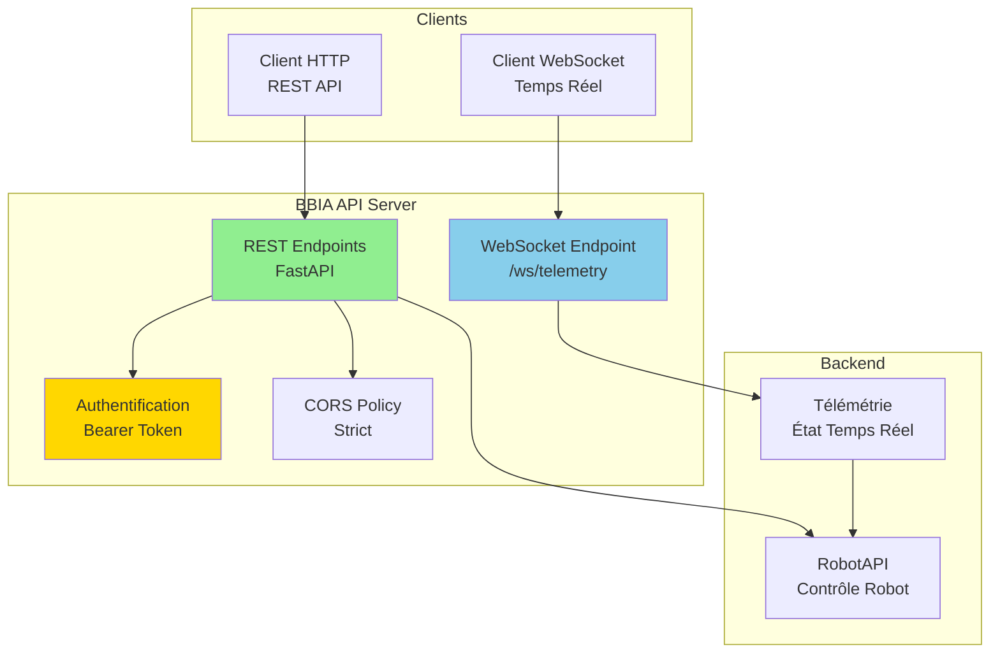
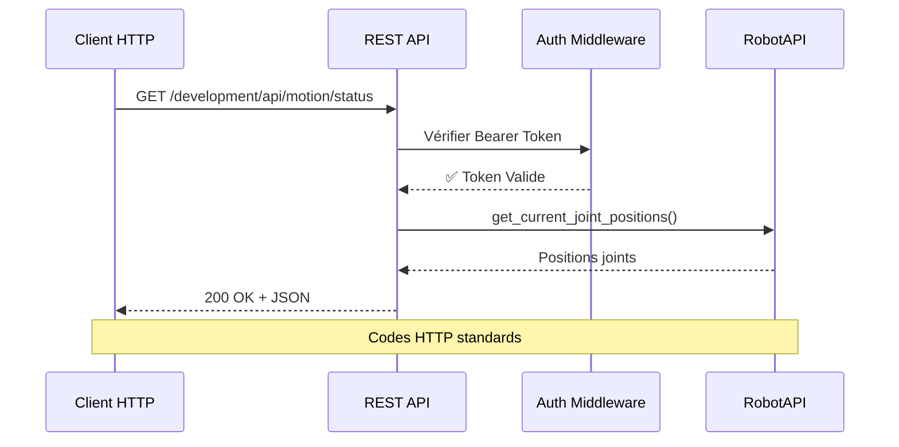
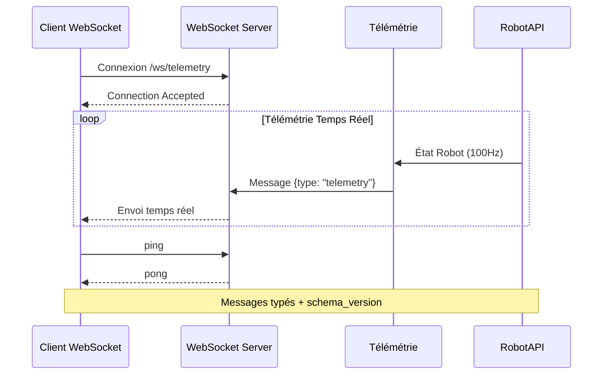
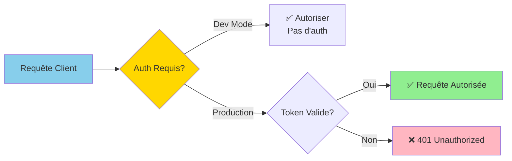

# 📡 Contrats REST & WebSocket

**Date** : Oct / Nov. 2025  
**Version** : 1.0  
**Compatibilité Python** : 3.11+

> **Liens utiles** : [`docs/reference/INDEX_THEMATIQUE.md`](../reference/INDEX_THEMATIQUE.md), [`docs/reference/project-status.md`](../reference/project-status.md)

**📚 [Guide intégration](../development/integration.md)** | **📊 [CI/CD Pipeline](../deployment/PIPELINE_CI.md)**

---

## Architecture REST & WebSocket



## REST
- Pagination: `?limit=50&offset=0`
- Filtre: paramètres explicites (`?emotion=happy`), pas d'opérateur caché
- Codes HTTP: 200/400/401/404/429/500 (minimaux)

### Flux REST



## WebSocket
- Channel: `/ws/telemetry`
- Messages typés (`type`): ping/pong/status/telemetry
- Versionnement: champ `schema_version` (semver), compat descendante sur 1 version

### Flux WebSocket



## Sécurité
- Auth Bearer (facultatif en dev)
- CORS strict côté REST

### Flux Authentification



## Références

- **OpenAPI** : `http://localhost:8000/openapi.json`
- **État par axe** : `docs/reference/project-status.md` → API & SDK

### Curl rapide
```bash
curl -s http://localhost:8000/health || true
curl -s http://localhost:8000/openapi.json | head -n 20
```

---

**Dernière mise à jour** : Oct / Nov. 2025
