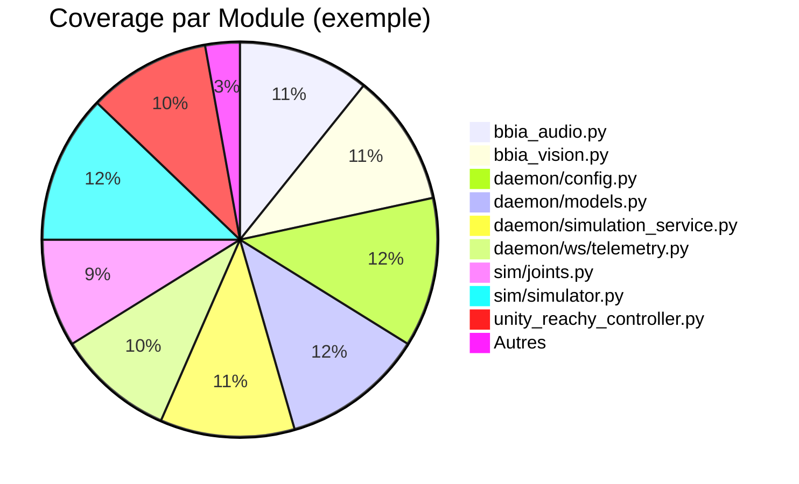
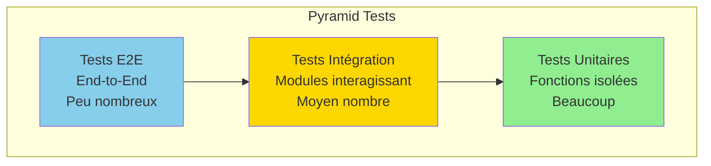
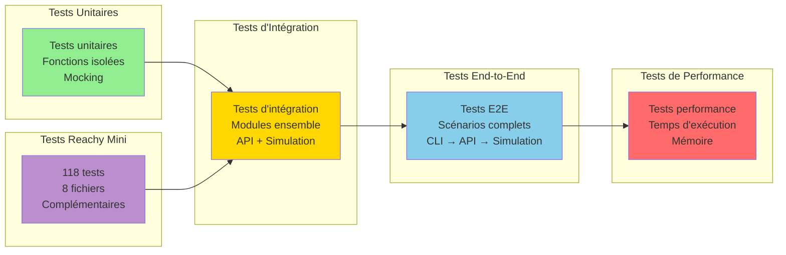

# 🧪 Guide des Tests et de la Couverture - BBIA Reachy Mini

**Dernière mise à jour : 15 Décembre 2025  
**Version** : 1.4.0

> **Référence état global** : Voir [`docs/reference/project-status.md`](../reference/project-status.md) → "État par axe" (Qualité/Performance/CI) pour l'état actuel et les axes futurs.

## 📊 Résumé des performances

**Coverage totale : validée en CI** (voir `coverage.xml` et `htmlcov/`)

- **Suite de tests complète** exécutée par pytest (compteur variable selon CI)
- **Résultats** : voir le récapitulatif CI (pass/failed/skipped)
- **Tests skippés** justifiés (robot physique requis)

## 🏗️ Structure des tests

```mermaid
graph TB
    subgraph "Tests Structure"
        E2E[e2e/<br/>Tests end-to-end]
        SIM[sim/<br/>Tests simulation]
        WS[ws/<br/>Tests WebSocket]
        BBIA[test_bbia_*.py<br/>Tests modules BBIA]
        DAEMON[test_daemon_*.py<br/>Tests daemon]
        WEBSOCKET[test_websocket_*.py<br/>Tests WebSocket]
        VERTICAL[test_vertical_slices.py<br/>Tests vertical slices]
        GOLDEN[test_golden_traces.py<br/>Tests golden traces]
    end

    E2E --> API[test_api_simu_roundtrip.py]
    E2E --> MODULES[test_bbia_modules_e2e.py]
    E2E --> MOTION[test_motion_roundtrip.py]
    E2E --> TELEMETRY[test_websocket_telemetry_e2e.py]

    SIM --> CLI[test_cli_help.py]
    SIM --> DURATION[test_duration.py]

    WS --> RATE[test_telemetry_rate.py]

    BBIA --> AUDIO[test_bbia_audio.py]
    BBIA --> BEHAVIOR[test_bbia_behavior.py]
    BBIA --> EMOTIONS[test_bbia_emotions.py]
    BBIA --> VISION[test_bbia_vision.py]
    BBIA --> VOICE[test_bbia_voice.py]

    DAEMON --> CONFIG[test_daemon_config.py]
    DAEMON --> MODELS[test_daemon_models.py]
    DAEMON --> SIMULATION[test_daemon_simulation_service.py]

    WEBSOCKET --> CONNECTION[test_websocket_connection.py]
    WEBSOCKET --> TELEMETRY_EXT[test_websocket_telemetry_extended.py]

    VERTICAL --> DEMO_EMOTION[test_demo_emotion_headless]
    VERTICAL --> DEMO_VOICE[test_demo_voice_headless]
    VERTICAL --> DEMO_VISION[test_demo_vision_headless]
    VERTICAL --> DEMO_BEHAVIOR[test_demo_behavior_headless]
    
    style E2E fill:#87CEEB
    style SIM fill:#4ECDC4
    style WS fill:#45B7D1
    style BBIA fill:#BB8FCE
    style DAEMON fill:#F8B739
    style WEBSOCKET fill:#FF6B6B
    style VERTICAL fill:#98D8C8
    style GOLDEN fill:#FFD700

```



## 📊 Couverture par module



## 🧪 Types de tests

### Hiérarchie des Tests



### Détails par Type



### 🤖 Tests Backend Reachy Mini (8 Décembre 2025)

**📊 Statistiques**:

- ✅ **118 tests** répartis dans **8 fichiers complémentaires**
- ✅ **116 tests uniques** (98.3% - très peu de redondance)
- ⚠️ **1 doublon mineur** (`test_robot_factory_integration`)

**📁 Structure** (voir [`tests/REACHY_MINI_TESTS_STRUCTURE.md`](../../tests/REACHY_MINI_TESTS_STRUCTURE.md) pour détails):

| Fichier | Tests | Rôle |
|---------|-------|------|
| `test_reachy_mini_full_conformity_official.py` | 37 | Conformité complète SDK officiel |
| `test_reachy_mini_backend.py` | 24 | Tests de base du backend |
| `test_reachy_mini_complete_conformity.py` | 16 | Conformité API complète |
| `test_reachy_mini_advanced_conformity.py` | 12 | Patterns/optimisations expertes |
| `test_reachy_mini_strict_conformity.py` | 10 | Tests stricts (valeurs exactes XML) |
| `test_reachy_mini_backend_extended.py` | 9 | Tests structure/compatibilité |
| `test_reachy_mini_backend_rapid.py` | 8 | Tests coverage rapide |
| `test_reachy_mini_conformity.py` | 2 | Script de vérification |

**💡 Conclusion analyse**: Tous les fichiers sont complémentaires et doivent être conservés. Aucune consolidation nécessaire.

```bash
# Lancer tous les tests Reachy Mini
pytest tests/test_reachy_mini*.py -v

# Vérifier les doublons/redondances
python scripts/verify_tests_consolidation.py

```

│ ├── test_bbia_emotions.py # Tests émotions
│ ├── test_bbia_emotions_extended.py
│ ├── test_bbia_vision.py # Tests vision
│ ├── test_bbia_vision_extended.py
│ ├── test_bbia_voice.py # Tests voix
│ └── test_bbia_voice_extended.py
├── test_api_*.py # Tests API
├── test_simulator.py # Tests simulateur MuJoCo
├── test_unity_controller.py # Tests contrôleur Unity
└── test_*.py # Tests unitaires

```text

## Commandes de tests

### Tests avec visibilité maximale (debug)

```bash
# Script dédié pour identifier les tests lents
./scripts/test_verbose.sh

# Voir tous les tests sauf e2e
./scripts/test_verbose.sh "not e2e"
```

Le script affiche la progression en temps réel et liste les tests les plus lents.

### Tests complets

```bash

# Lancer tous les tests avec coverage complet

python -m pytest tests/ --cov=src --cov-report=term-missing --cov-report=html

# Tests rapides sans détails

python -m pytest tests/ --cov=src --cov-fail-under=0 --tb=no -q

# Tests avec arrêt au premier échec

python -m pytest tests/ --cov=src --cov-report=term-missing -x

```text

### Tests golden traces

```bash

# Tests de non-régression golden traces

python -m pytest tests/test_golden_traces.py -v

# Régénérer une trace de référence

python scripts/record_trace.py --emotion happy --duration 5 --out artifacts/golden/happy_mujoco.jsonl

# Valider une trace contre référence

python scripts/validate_trace.py --ref artifacts/golden/happy_mujoco.jsonl --cur current_trace.jsonl

```text

### Tests spécifiques

```bash

# Tests d'un module spécifique

python -m pytest tests/test_bbia_emotions.py -v

# Tests Reachy Mini (tous les fichiers)

pytest tests/test_reachy_mini*.py -v

# Test de conformité complet (recommandé)

pytest tests/test_reachy_mini_full_conformity_official.py -v

# Tests stricts (valeurs exactes XML)

pytest tests/test_reachy_mini_strict_conformity.py -v

# Tests d'un sous-dossier

python -m pytest tests/e2e/ -v

# Test spécifique

python -m pytest tests/test_bbia_emotions.py::TestBBIAEmotions::test_set_emotion -v

```text

### Vérification de la couverture

```bash

# Ouvrir le rapport HTML (macOS)

open htmlcov/index.html

# Compter le nombre de tests collectés (variable selon CI)

python -m pytest --collect-only -q | wc -l

# Coverage d'un module spécifique

python -m pytest tests/test_bbia_emotions.py --cov=src.bbia_sim.bbia_emotions --cov-report=term-missing

```text

## ⚙️ Configuration

### pyproject.toml

```toml ⚙️

[tool.pytest.ini_options]
testpaths = ["tests"]
python_files = ["test_*.py"]
python_classes = ["Test*"]
python_functions = ["test_*"]
norecursedirs = [".git", "logs", ".venv", "venv", "__pycache__", "reachy_repos"]
minversion = "6.0"

[tool.coverage.run]
source = ["src/bbia_sim"]
omit = [
 "*/tests/*",
 "*/test_*",
 "*/__pycache__/*",
 "*/venv/*",
 "*/.venv/*",
 "*/logs/*",
 "*/reachy_repos/*",
]

[tool.coverage.report]
fail_under = 1
show_missing = true
precision = 2

```text

### .coveragerc

```ini

[run]
source = src
omit = */tests/*, */test_*, */__pycache__/*, */venv/*

[report]
fail_under = 1
show_missing = True
show_missing_branches = True
precision = 2
ignore_errors = True

[html]
directory = htmlcov
title = BBIA Reachy Mini Simulation Coverage Report

[xml]
output = coverage.xml

```text

## 🔧 Résolution des problèmes

### Problème : couverture trop faible malgré un grand nombre de tests

**Symptômes :**
- Coverage affiché bas malgré de nombreux tests
- Tests passent mais coverage ne s'améliore pas

**Causes possibles :**
1. **Configuration testpaths incorrecte**
2. **Structure de dossiers non respectée**
3. **Fichiers __init__.py manquants**
4. **Configuration coverage incorrecte**

**Solutions :**

1. **Vérifier la configuration pytest :**

```bash

python -m pytest --collect-only -q | wc -l

# Nombre indicatif selon la configuration CI

```text

2. **Vérifier la structure des dossiers :**

```bash

find tests/ -name "test_*.py" | wc -l

```text

3. **Vérifier les fichiers __init__.py :**

```bash

find tests/ -name "__init__.py"

```text

4. **Tester la configuration coverage :**

```bash

python -m pytest tests/test_config.py --cov=src --cov-report=term-missing

```text

### Problème : tests qui échouent

**Tests courants qui peuvent échouer :**
- `test_get_available_joints` : Mock MuJoCo incorrect
- `test_emotional_response_*` : Mock secrets incorrect
- `test_dire_texte_*` : Mock pyttsx3 incorrect

**Solutions :**
- Vérifier les mocks dans les tests
- Utiliser `--cov-fail-under=0` pour ignorer les erreurs de coverage
- Corriger les assertions trop strictes

## 📈 Amélioration de la couverture

### Modules à améliorer
1. **bbia_voice.py** : Ajouter tests pour reconnaissance vocale
2. **bbia_awake.py** : Ajouter tests pour séquence réveil
3. **bbia_integration.py** : Créer tests d'intégration
4. **__main__.py** : Ajouter tests CLI

### Stratégies d'amélioration
1. **Tests d'intégration** : Tester les interactions entre modules
2. **Tests de cas limites** : Tester les cas d'erreur
3. **Tests de performance** : Tester les performances
4. **Tests de régression** : Prévenir les régressions

## 🎯 Objectifs de couverture

- **Objectif minimum** : 70%
- **Objectif recommandé** : 80%
- **Objectif ambitieux** : 90%

---

**Dernière mise à jour** : 8 Décembre 2025
