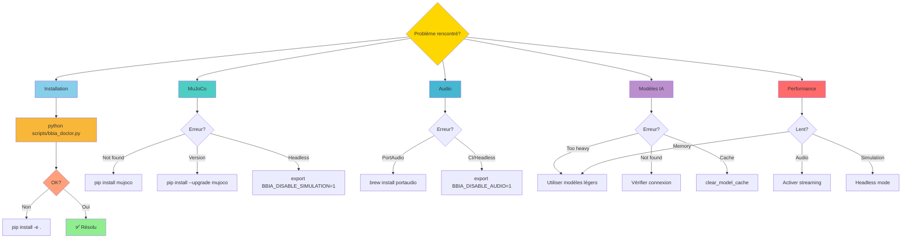

# ❓ FAQ - Questions Fréquentes BBIA

<div align="center">

**💡 Réponses rapides aux questions les plus courantes**  
*Trouvez rapidement la solution à votre problème*

**Version** : 1.3.2 • **Date** : Oct / Nov. 2025

[📚 Documentation complète](../README.md) • [🐛 Signaler un problème](https://github.com/arkalia-luna-system/bbia-sim/issues)

</div>

---

## 📋 Navigation Rapide

<div align="center">

| Catégorie | Questions | ⏱️ Temps |
|:---------:|:---------:|:--------:|
| [🔧 Installation](#-installation) | Dépendances, setup | 2 min |
| [🎮 MuJoCo](#-mujoco) | Simulation 3D | 3 min |
| [🔊 Audio](#-portaudioaudio) | PortAudio, TTS/STT | 5 min |
| [🤖 Modèles IA](#-modèles-ia) | LLM, Vision, NLP | 5 min |
| [⚡ Performance](#-performance) | Optimisations | 3 min |
| [❌ Erreurs](#-erreurs-communes) | Solutions courantes | 5 min |
| [🔌 Compatibilité](#-compatibilité) | OS, versions | 2 min |

</div>

---

## 🔄 Flux de Dépannage Rapide



---

## 🔧 Installation

> **⚡ Configuration rapide du projet**

### Comment installer BBIA ?

<div align="center">

| Mode | Commande | Description |
|:----:|:--------:|-------------|
| **Standard** | `pip install -e .` | Installation minimale |
| **Développement** | `pip install -e .[dev]` | Avec outils dev |
| **Complet** | `pip install -e .[dev,test,audio]` | Toutes dépendances |

</div>

```bash
# Installation standard (recommandée pour débuter)
pip install -e .

# Installation avec extras
pip install -e ".[dev,test,audio]"
```

### Quelles sont les dépendances requises ?

- Python 3.11+
- MuJoCo (simulation)
- PortAudio (audio optionnel)
- CUDA/MPS optionnel pour accélération GPU

Voir `pyproject.toml` pour liste complète.

### Comment vérifier l'installation ?

```bash
python scripts/bbia_doctor.py
```

Diagnostic complet de l'environnement.

---

## 🎮 MuJoCo

### Erreur "MuJoCo not found"

**Cause** : MuJoCo non installé ou non configuré.

**Solution** :
```bash
pip install mujoco
```

### Erreur "MuJoCo version incompatible"

**Cause** : Version MuJoCo trop ancienne.

**Solution** :
```bash
pip install --upgrade mujoco
```

### Comment désactiver MuJoCo (headless) ?

```bash
export BBIA_DISABLE_SIMULATION=1
```

Ou dans code :
```python
os.environ["BBIA_DISABLE_SIMULATION"] = "1"
```

---

## 🎤 PortAudio/Audio

### Erreur "PortAudio not found"

**Cause** : PortAudio non installé.

**Solutions** :
- **macOS** : `brew install portaudio`
- **Linux** : `sudo apt-get install portaudio19-dev`
- **Windows** : Installer depuis [PortAudio](http://www.portaudio.com/)

### Comment désactiver audio (CI/headless) ?

```bash
export BBIA_DISABLE_AUDIO=1
```

### Erreur "sounddevice unavailable"

**Solution** :
```bash
pip install sounddevice soundfile
```

Ou désactiver audio :
```bash
export BBIA_DISABLE_AUDIO=1
```

### Audio ne fonctionne pas sur Raspberry Pi

**Cause** : Configuration audio ALSA/PulseAudio.

**Solutions** :
1. Vérifier `alsamixer` (volume)
2. Configurer `~/.asoundrc`
3. Utiliser `export BBIA_DISABLE_AUDIO=1` si non nécessaire

---

## 🧠 Modèles IA

### Modèles trop lourds pour Raspberry Pi

**Solution** : Utiliser modèles légers configurés par défaut :
- Whisper `tiny` (au lieu de `base`/`small`)
- LLM `phi-2` ou `tinyllama` (au lieu de `mistral-7b`)
- YOLOv8n (nano, déjà configuré)

### Erreur "Model not found" Hugging Face

**Cause** : Modèle non téléchargé.

**Solution** : Modèles téléchargés automatiquement au premier usage. Vérifier connexion internet.

### Modèles en cache trop volumineux

**Solution** : Effacer cache :
```python
from bbia_sim.model_optimizer import clear_model_cache
clear_model_cache()
```

Ou manuellement :
```bash
rm -rf ~/.cache/huggingface/
```

---

## ⚡ Performance

### Latence audio élevée (> 2s)

**Solutions** :
1. Utiliser Whisper `tiny` au lieu de `base`
2. Activer streaming : `transcribe_streaming()`
3. Utiliser VAD pour activation automatique

### Mémoire insuffisante

**Solutions** :
1. Utiliser modèles légers (phi-2, tinyllama)
2. Effacer cache modèles : `clear_model_cache()`
3. Désactiver fonctionnalités non utilisées

### Simulation MuJoCo lente

**Solutions** :
1. Réduire résolution si visualisation
2. Utiliser headless : `BBIA_DISABLE_SIMULATION=1`
3. Accélération GPU si disponible

---

## ❌ Erreurs Communes

### `ModuleNotFoundError: No module named 'bbia_sim'`

**Solution** :
```bash
pip install -e .
```

### `ImportError: cannot import name 'RobotAPI'`

**Solution** : Vérifier structure projet :
```bash
python scripts/bbia_doctor.py
```

### Tests échouent en CI

**Solution** : Désactiver audio/simulation :
```bash
export BBIA_DISABLE_AUDIO=1
export BBIA_DISABLE_SIMULATION=1
```

---

## 🔄 Compatibilité

### Compatible Python 3.10 ?

**Réponse** : Non, Python 3.11+ requis (type hints modernes).

### Compatible Windows ?

**Réponse** : Partiellement. MuJoCo peut nécessiter configuration spéciale.

**Recommandation** : macOS ou Linux pour meilleure compatibilité.

### Compatible Raspberry Pi 5 ?

**Réponse** : Oui, avec modèles légers configurés par défaut.

**Recommandations** :
- Utiliser Python 3.11+
- Modèles légers uniquement
- Désactiver simulation si non nécessaire

---

## 📚 Ressources

| Ressource | Lien | Description |
|-----------|------|-------------|
| 📖 **Documentation complète** | [`docs/README.md`](../README.md) | Index de toute la documentation |
| 📊 **Architecture** | [`../development/architecture/ARCHITECTURE_OVERVIEW.md`](../development/architecture/ARCHITECTURE_OVERVIEW.md) | Vue d'ensemble technique |
| 🧪 **Tests** | [`../../tests/README.md`](../../tests/README.md) | Guide des tests |
| 💡 **Exemples** | [`../../examples/README.md`](../../examples/README.md) | Exemples d'utilisation |
| 🔧 **Scripts** | [`../../scripts/README.md`](../../scripts/README.md) | Outils utilitaires |
| 🎯 **Guide débutant** | [`../guides/GUIDE_DEBUTANT.md`](../guides/GUIDE_DEBUTANT.md) | Démarrage rapide |
| 🔍 **Diagnostic** | `python scripts/bbia_doctor.py` | Vérification environnement |

## 🔗 Liens Utiles

- **GitHub** : [arkalia-luna-system/bbia-sim](https://github.com/arkalia-luna-system/bbia-sim)
- **Issues** : [Signaler un bug](https://github.com/arkalia-luna-system/bbia-sim/issues)
- **État du projet** : [`../quality/audits/TACHES_RESTANTES_NOV2025.md`](../quality/audits/TACHES_RESTANTES_NOV2025.md) (si existe)
- **Comparaison officielle** : [`../quality/audits/COMPARAISON_DOCUMENTATION_OFFICIELLE.md`](../quality/audits/COMPARAISON_DOCUMENTATION_OFFICIELLE.md) (si existe)

---

**Dernière mise à jour** : Oct / Nov. 2025

