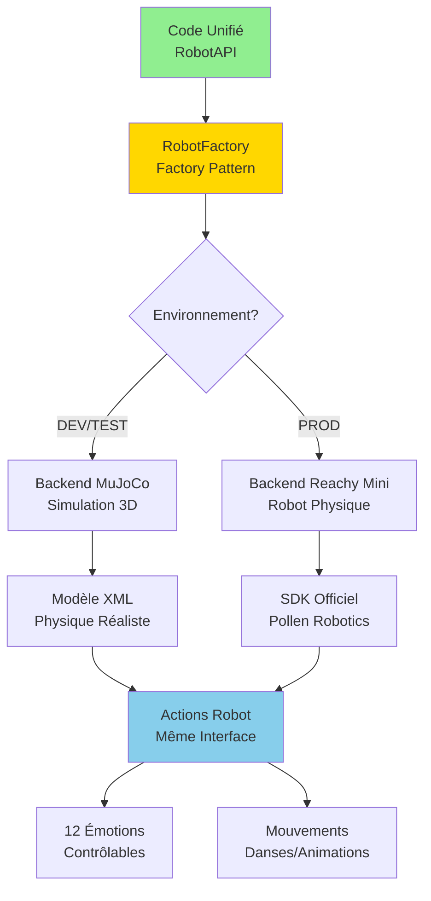
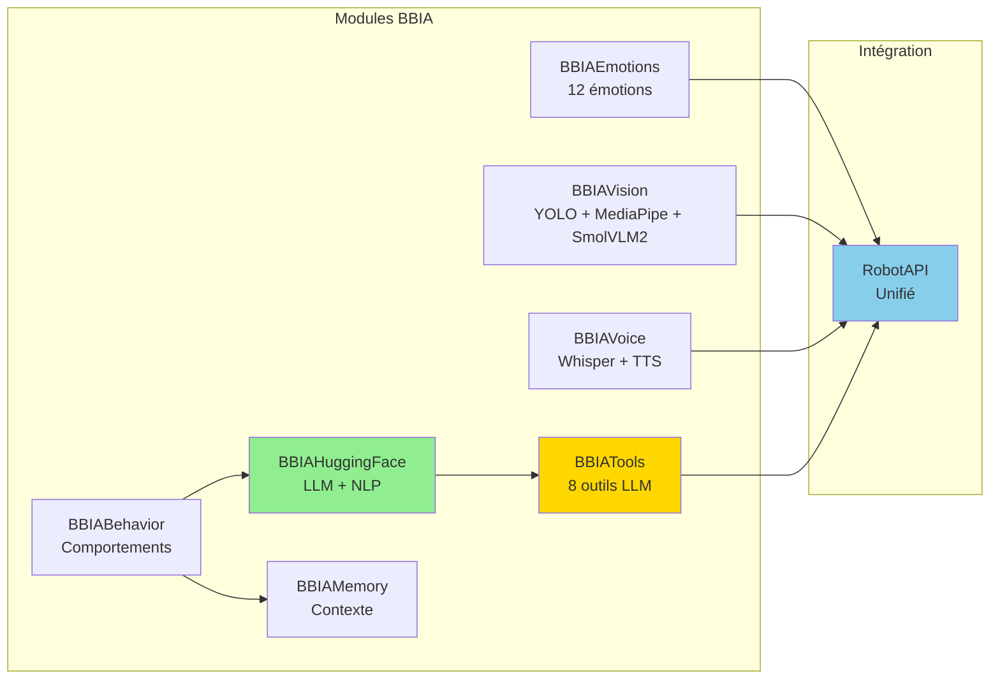
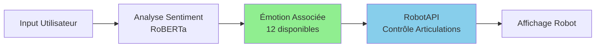

# 🚀 Guide Avancé - BBIA-SIM

<div align="center">

**Date** : 21 novembre 2025
[](https://github.com/arkalia-luna-system/bbia-sim)
[](docs/guides/)
[](#architecture-détaillée)

</div>

> **Liens utiles** : [`docs/reference/INDEX_THEMATIQUE.md`](../reference/INDEX_THEMATIQUE.md) · [`docs/reference/project-status.md`](../reference/project-status.md)

> **Compatibilité Python et CI**
>
> - **Python** : 3.11+
> - **CI** : `.github/workflows/ci.yml`
> - **Setup rapide** :
> ```bash
> pyenv install 3.11.9 && pyenv local 3.11.9
> python -m pip install --upgrade pip
> pip install -e .
> ```

## 🎯 Pour Développeurs Avancés

<div align="center">

**Version :** 1.3.2  
**Public cible :** développeurs expérimentés souhaitant exploiter les fonctionnalités de BBIA

[](#backend-unifié)
[](#modules-bbia-avancés)
[](#api-avancée)
[](#tests-avancés)

</div>

---

## 📋 Table des Matières

- [Guide avancé - BBIA-SIM](#guide-avancé---bbia-sim)
  - [Pour développeurs avancés](#pour-développeurs-avancés)
  - [📋 Table des Matières](#-table-des-matières)
  - [Architecture détaillée](#architecture-détaillée)
    - [Backend unifié](#backend-unifié)
      - [Flux Backend Unifié](#flux-backend-unifié)
    - [Modules BBIA avancés](#modules-bbia-avancés)
      - [Architecture Modules BBIA](#architecture-modules-bbia)
      - [1. Module Émotions](#1-module-émotions)
      - [2. Module Comportements](#2-module-comportements)
      - [3. Module Vision](#3-module-vision)
    - [Tests avancés](#tests-avancés)
    - [Optimisations de performance](#optimisations-de-performance)
  - [Migration simulation → robot réel](#migration-simulation--robot-réel)
  - [API avancée](#api-avancée)
    - [Conformité SDK officiel](#conformité-sdk-officiel)
  - [🎯 Navigation](#-navigation)

---

## 🏗️ Architecture Détaillée

### 🔧 Backend Unifié

<div align="center">

### 🌟 Développez une fois, déployez partout !

[](#flux-backend-unifié)
[](#optimisations-de-performance)

</div>

Le backend unifié permet de développer et tester en simulation, puis de basculer vers le robot physique avec le même code.

```python
# Backend unifié : Simulation ↔ Robot réel
from bbia_sim.robot_factory import RobotFactory

# Simulation (développement et tests)
robot_sim = RobotFactory.create_backend('mujoco')
robot_sim.connect()

# Robot réel (production)
robot_real = RobotFactory.create_backend('reachy_mini')
robot_real.connect()

# Même code fonctionne sur les deux
robot_sim.set_emotion('happy', 0.8)
robot_real.set_emotion('happy', 0.8)

# Basculer facilement
backend = 'mujoco' if os.getenv('DEV') else 'reachy_mini'
robot = RobotFactory.create_backend(backend)

```

#### Flux Backend Unifié



**Avantages :**

- Développement sans matériel
- Tests automatisés
- Debugging facilité
- Migration transparente vers robot réel

### 🧠 Modules BBIA Avancés

#### 🏛️ Architecture Modules BBIA

<div align="center">

### 🤖 12 modules intelligents pour robot avancé

[](#1-module-émotions)
[](#3-module-vision)
[](#2-module-comportements)

</div>



#### 1. Module Émotions

```python
from bbia_sim.bbia_emotions import BBIAEmotions

emotions = BBIAEmotions()

# Toutes les émotions disponibles
emotions.set_emotion('excited', intensity=0.9)
emotions.set_emotion('curious', intensity=0.6)
emotions.set_emotion('calm', intensity=0.4)

```

**Flux Émotions** :



#### 2. Module Comportements

```python
from bbia_sim.bbia_behavior import BBIABehaviorManager

manager = BBIABehaviorManager()

# Créer comportement personnalisé
class MyBehavior(BBIABehavior):
    def execute(self, context):
        # Votre logique ici
        pass

manager.register_behavior(MyBehavior())

```

#### 3. Module Vision

```python
from bbia_sim.bbia_vision import BBIAVision

vision = BBIAVision()
objects = vision.scan_environment()
faces = vision.detect_faces()

```

### Tests avancés

```bash
# Lancer tous les tests
pytest tests/ -v --tb=short

# Tests avec coverage
pytest tests/ --cov=src --cov-report=html

# Voir rapport coverage
open htmlcov/index.html

```

### Optimisations de performance

```python
# Mode headless (rapide)
MUJOCO_GL=disable python your_script.py

# Activer cache simulation
bbia_sim.sim.enable_caching()

```

---

## 🔄 Migration Simulation → Robot Réel

<div align="center">

### 🚀 Passage transparent du développement à la production

[](../development/migration.md)
[](../quality/compliance/CONFORMITE_REACHY_MINI_COMPLETE.md)

</div>

Voir : [MIGRATION_GUIDE.md](../development/migration.md)

---

## 🚀 API Avancée

### ✅ Conformité SDK Officiel

<div align="center">

### 🎯 100% compatible avec le SDK Pollen Robotics

[](../quality/compliance/CONFORMITE_REACHY_MINI_COMPLETE.md)
[](#-toutes-les-méthodes-sdk-officiel-disponibles)

</div>

```python
# Toutes les méthodes SDK officiel disponibles
robot.get_current_head_pose()
robot.get_current_joint_positions()
robot.look_at_world(x, y, z)
robot.goto_target(head=pose)
robot.start_recording()
robot.stop_recording()

```

Voir : [Conformité SDK Complète](../quality/compliance/CONFORMITE_REACHY_MINI_COMPLETE.md)

---

**Pour plus d'infos :** Toute la documentation dans `docs/` 📚

---

## 🎯 Navigation

**Retour à** : [README Documentation](../README.md)  
**Voir aussi** : [Guide Débutant](GUIDE_DEMARRAGE.md) • [Index Thématique](../reference/INDEX_THEMATIQUE.md)
