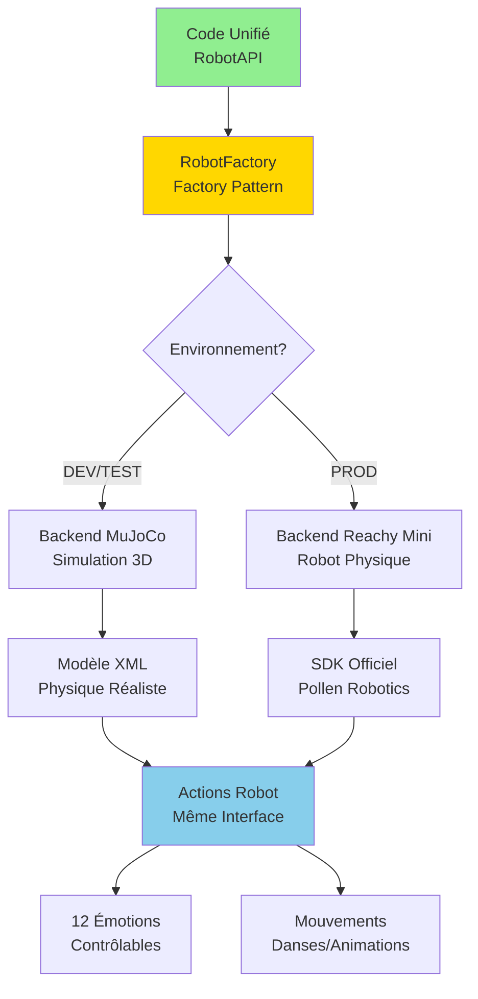
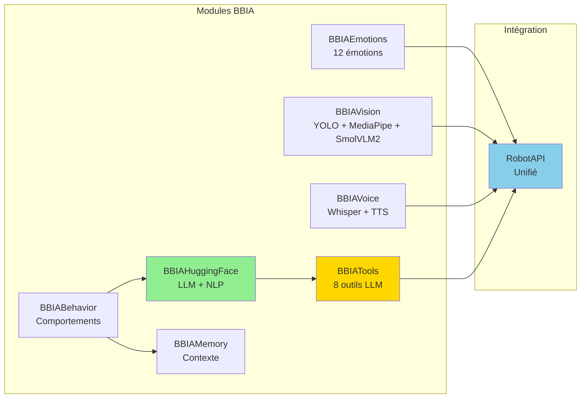
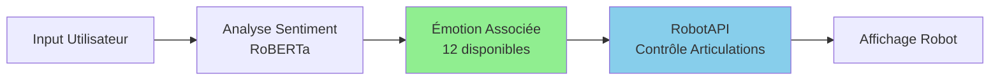

# Guide avancé - BBIA-SIM

> Liens utiles: `docs/references/INDEX_THEMATIQUE.md` · `docs/status.md`

> Compatibilité Python et CI
>
> - Python: 3.11+
> - CI: `.github/workflows/ci.yml`
> - Setup rapide:
> ```bash
>   pyenv install 3.11.9 && pyenv local 3.11.9
>   python -m pip install --upgrade pip
>   pip install -e .
>   ```

## Pour développeurs avancés

**Version :** 1.3.0
**Public cible :** développeurs expérimentés souhaitant exploiter les fonctionnalités de BBIA

---

## Architecture détaillée

### Backend unifié

```python
# Backend unifié : Simulation ↔ Robot réel
from bbia_sim.robot_factory import RobotFactory

# Simulation (développement et tests)
robot_sim = RobotFactory.create_backend('mujoco')
robot_sim.connect()

# Robot réel (production)
robot_real = RobotFactory.create_backend('reachy_mini')
robot_real.connect()

# Même code fonctionne sur les deux
robot_sim.set_emotion('happy', 0.8)
robot_real.set_emotion('happy', 0.8)

# Basculer facilement
backend = 'mujoco' if os.getenv('DEV') else 'reachy_mini'
robot = RobotFactory.create_backend(backend)
```

#### Flux Backend Unifié



Avantages :
- développement sans matériel
- tests automatisés
- debugging facilité
- migration transparente vers robot réel

### Modules BBIA avancés

#### Architecture Modules BBIA



#### 1. Module Émotions

```python
from bbia_sim.bbia_emotions import BBIAEmotions

emotions = BBIAEmotions()

# Toutes les émotions disponibles
emotions.set_emotion('excited', intensity=0.9)
emotions.set_emotion('curious', intensity=0.6)
emotions.set_emotion('calm', intensity=0.4)
```

**Flux Émotions** :


#### 2. Module Comportements

```python
from bbia_sim.bbia_behavior import BBIABehaviorManager

manager = BBIABehaviorManager()

# Créer comportement personnalisé
class MyBehavior(BBIABehavior):
    def execute(self, context):
        # Votre logique ici
        pass

manager.register_behavior(MyBehavior())
```

#### 3. Module Vision

```python
from bbia_sim.bbia_vision import BBIAVision

vision = BBIAVision()
objects = vision.scan_environment()
faces = vision.detect_faces()
```

### Tests avancés

```bash
# Lancer tous les tests
pytest tests/ -v --tb=short

# Tests avec coverage
pytest tests/ --cov=src --cov-report=html

# Voir rapport coverage
open htmlcov/index.html
```

### Optimisations de performance

```python
# Mode headless (rapide)
MUJOCO_GL=disable python your_script.py

# Activer cache simulation
bbia_sim.sim.enable_caching()
```

---

## Migration simulation → robot réel

Voir : [MIGRATION_GUIDE.md](../guides_techniques/MIGRATION_GUIDE.md)

---

## API avancée

### Conformité SDK officiel

```python
# Toutes les méthodes SDK officiel disponibles
robot.get_current_head_pose()
robot.get_current_joint_positions()
robot.look_at_world(x, y, z)
robot.goto_target(head=pose)
robot.start_recording()
robot.stop_recording()
```

Voir : [RAPPORT_CONFORMITE_SDK_2024.md](../archives/conformite/RAPPORT_CONFORMITE_SDK_2024.md)

---

**Pour plus d'infos :** Toute la documentation dans `docs/` 📚

