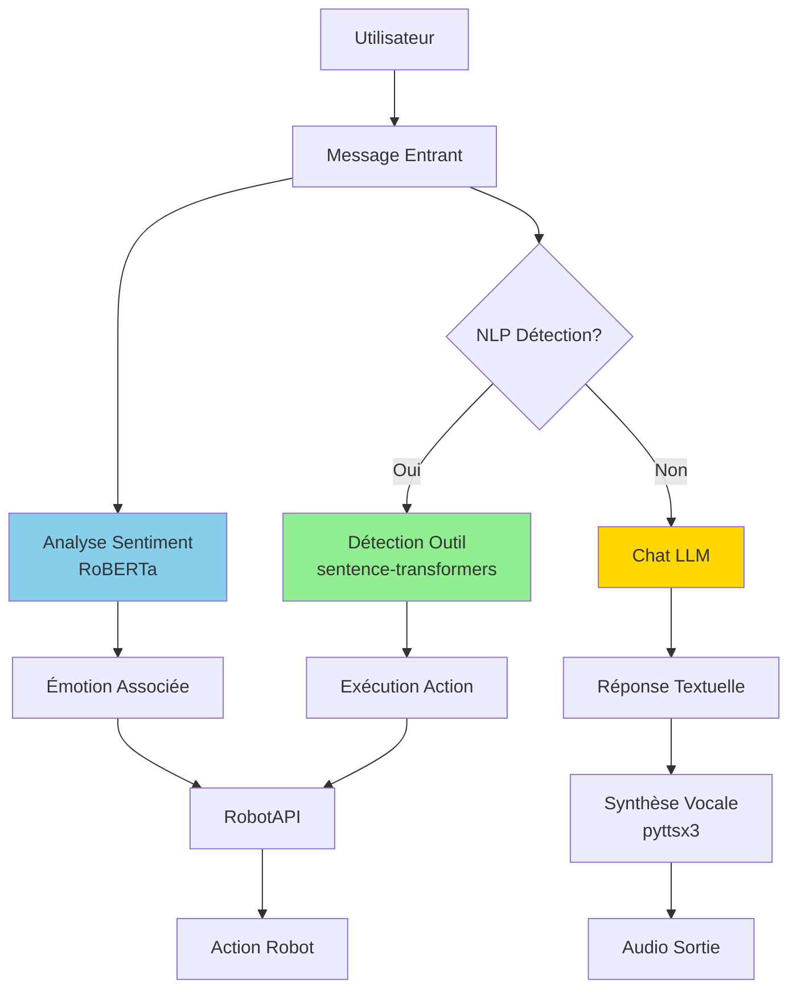

# 💬 Guide du Chat Intelligent BBIA

<div align="center">

**🤖 Conversations naturelles avec votre robot Reachy Mini**
* IA avancée • Réponses contextuelles • Personnalités multiples*

**Dernière mise à jour** : 15 Décembre 2025

[📚 FAQ](../getting-started/troubleshooting.md) • [🧠 Guide NLP](../guides/GUIDE_NLP_SMOLVLM.md) • [📊 État actuel](../quality/audits/archives/obsoletes_decembre_2025/RESUME_ETAT_ACTUEL_BBIA.md)

</div>

---

## 📋 Table des Matières

1. [Vue d'ensemble](#-vue-densemble)
2. [Démarrage Rapide](#-démarrage-rapide)
3. [Personnalités BBIA](#-personnalités-bbia)
4. [Référence API](#référence-api)
5. [Cas d'usage](#cas-dusage)
6. [Configuration Avancée](#configuration-avancée)
7. [Dépannage](#dépannage)
8. [Navigation](#-navigation)

---

## 🎯 Vue d'ensemble

> **💡 Fonctionnalité clé**
> Le chat intelligent BBIA permet d'avoir une conversation naturelle avec votre robot Reachy Mini.
> BBIA analyse le sentiment de vos messages et répond selon sa personnalité configurée.

### 🎨 Ce que vous pouvez faire

<div align="center">

| Fonctionnalité | Description | Exemple |
|:--------------:|-------------|---------|
| 💬 **Chat textuel** | Conversation naturelle | "Bonjour, comment vas-tu ?" |
| 😊 **Analyse sentiment** | Détection émotionnelle | Analyse de l'humeur |
| 🎭 **Personnalités** | Différents styles de réponse | Friendly, professional, etc. |
| 🤖 **Actions robot** | Commandes via conversation | "Tourne la tête à droite" |

</div>

### Architecture Chat BBIA



---

## 🚀 Démarrage Rapide

> **⚡ Chat opérationnel en 2 minutes**

### 📦 Installation

```bash
# Activer venv
source venv/bin/activate

# Installer dépendances (si nécessaire)
pip install transformers torch

```

### 💻 Utilisation Basique

<div align="center">

> **Exemple minimal** - Votre premier chat avec BBIA

</div>

```python
from bbia_sim.bbia_huggingface import BBIAHuggingFace

# Initialiser BBIA
bbia = BBIAHuggingFace()

# Chat simple
response = bbia.chat("Bonjour")
logging.info(response) # 🤖 Bonjour ! Comment allez-vous ? Je suis BBIA, votre robot compagnon.

```

<div align="center">

✅ **C'est tout !** BBIA est prêt à converser avec vous.

</div>

---

## 🎭 Personnalités BBIA

> **🌈 Adaptez le style de conversation à vos besoins**

BBIA peut adopter différentes personnalités qui influencent ses réponses et son comportement.

<div align="center">

| Personnalité | Style | Emoji | Usage |
|:------------:|:------|:-----:|:------|
| **friendly_robot** | Robot amical et professionnel | 🤖 | Par défaut, conversations standards |
| **professional** | Formel et technique | 👔 | Contexte professionnel |
| **playful** | Enjoué et créatif | 🎮 | Interactions ludiques |
| **calm** | Serein et apaisant | 🧘 | Relaxation, méditation |

</div>

### friendly_robot (défaut)

> **🤖 Personnalité standard recommandée**

```python
bbia.bbia_personality = "friendly_robot"
logging.info(bbia.chat("Salut")) # 🤖 Salut ! Comment allez-vous ?

```

### curious
- **Style** : curieux et interrogatif
- **Emoji** : 🤔
- **Usage** : explorer des questions, poser des questions

```python
bbia.bbia_personality = "curious"
logging.info(bbia.chat("Comment ça va ?")) # 🤔 Comment ça va ?

```

### enthusiastic
- **Style** : enthousiaste et énergique
- **Emoji** : 🎉
- **Usage** : motiver, encourager

```python
bbia.bbia_personality = "enthusiastic"
logging.info(bbia.chat("Super projet !")) # 🎉 Super projet !

```

### calm
- **Style** : calme et serein
- **Emoji** : 😌
- **Usage** : apaiser, rassurer

```python
bbia.bbia_personality = "calm"
logging.info(bbia.chat("Je suis stressé")) # 😌 Respirez, tout va bien...

```

---

## Référence API

### `chat(user_message: str, use_context: bool = True) -> str`

**Description :** Chat intelligent avec BBIA

**Paramètres :**
- `user_message` : Message utilisateur
- `use_context` : Utiliser contexte messages précédents (défaut: True)

**Retourne :** Réponse de BBIA avec emoji selon personnalité

**Exemples :**

```python
# Conversation simple
bbia = BBIAHuggingFace()

bbia.chat("Bonjour")
# 🤖 Bonjour ! Comment allez-vous ? Je suis BBIA, votre robot compagnon.

bbia.chat("Comment tu te portes ?")
# 🤖 Ça va bien, merci ! Et vous ?

bbia.chat("Je suis très content aujourd'hui")
# 🤖 C'est super ! Je suis content pour vous. Continuez comme ça !

```

### `conversation_history: list[dict]`

**Description :** Historique des conversations

**Structure :**

```python
[
    {
        "user": "Message utilisateur",
        "bbia": "Réponse BBIA",
        "sentiment": {"sentiment": "POSITIVE", "score": 0.95},
        "timestamp": "8 Décembre 2025"
    },
    ...
]

```

**Exemple :**

```python
# Voir historique
for entry in bbia.conversation_history:
    logging.info(f"User: {entry['user']}")
    logging.info(f"BBIA: {entry['bbia']}")
    logging.info(f"Sentiment: {entry['sentiment']['sentiment']}")
    logging.info("")

```

---

## Cas d'usage

### Cas 1 : Conversation Simple

```python
from bbia_sim.bbia_huggingface import BBIAHuggingFace

bbia = BBIAHuggingFace()

# Conversation
logging.info(bbia.chat("Bonjour"))           # 🤖 Bonjour ! ...
logging.info(bbia.chat("Comment allez-vous ?")) # 🤖 Ça va bien...
logging.info(bbia.chat("Au revoir"))         # 🤖 Au revoir ! À bientôt !

```

### Cas 2 : Analyse Sentiment

```python
# BBIA analyse automatiquement le sentiment
bbia.chat("Je suis très heureux !")
# 🤖 C'est super ! Je suis content pour vous. Continuez comme ça !

bbia.chat("Je suis triste")
# 🤖 Je comprends. Parlez-moi de ce qui ne va pas.

```

### Cas 3 : Changer Personnalité

```python
# Enthousiaste
bbia.bbia_personality = "enthusiastic"
logging.info(bbia.chat("Salut !"))
# 🎉 Salut ! C'est génial de te voir !

# Curieux
bbia.bbia_personality = "curious"
logging.info(bbia.chat("Je travaille sur un projet"))
# 🤔 C'est intéressant ! Dis-moi en plus sur ton projet...

```

### Cas 4 : Historique et Contexte

```python
# BBIA conserve le contexte
bbia.chat("Je m'appelle Alice")
bbia.chat("Comment je m'appelle ?")
# BBIA se souviendra du contexte

```

---

## Dashboard interactif

### Accéder au dashboard

```bash
# Lancer le dashboard
python src/bbia_sim/dashboard_advanced.py --port 8000

# Ouvrir dans navigateur
# http://localhost:8000

```

### Utiliser le panel chat

1. **Ouvrir** le dashboard dans votre navigateur
2. **Localiser** le panel "💬 Chat avec BBIA"
3. **Taper** votre message dans le champ
4. **Cliquer** sur "Envoyer" ou appuyer sur Entrée
5. **Voir** la réponse de BBIA s'afficher

Fonctionnalités :
- messages en temps réel
- historique conservé (50 derniers)
- interface claire
- distinction user/BBIA

---

## Tests

### Lancer les tests

```bash
# Tous les tests chat
python -m pytest tests/test_bbia_huggingface_chat.py -v

# Test spécifique
python -m pytest tests/test_bbia_huggingface_chat.py::TestBBIAHuggingFaceChat::test_chat_simple_greeting -v

```

### Exemple de test

```python
def test_chat():
    hf = BBIAHuggingFace()

    # Test salutation
    response = hf.chat("Bonjour")
    assert "bonjour" in response.lower() or "hello" in response.lower()

    # Test historique
    assert len(hf.conversation_history) == 1

```

---

## Configuration avancée

### Modifier le comportement des réponses

```python
# Tous les mots-clés sont dans _generate_simple_response()
# Modifier src/bbia_sim/bbia_huggingface.py ligne ~471

def _generate_simple_response(self, message: str, sentiment: dict) -> str:
    message_lower = message.lower()

    # Ajouter vos mots-clés personnalisés
    if "votre_mot_cle" in message_lower:
        return "Votre réponse personnalisée"

    # ... reste du code

```

### Ajouter une nouvelle personnalité

```python
# Dans _adapt_response_to_personality() (ligne ~502)

personality_responses = {
    "friendly_robot": f"🤖 {response}",
    "your_personality": f"🆕 {response}", # Nouvelle personnalité
}

# Utilisation
bbia.bbia_personality = "your_personality"

```

---

## Dépannage

### Problème : "Hugging Face transformers requis"

**Solution :**

```bash
pip install transformers torch

```

### Problème : "Je ne comprends pas bien"

**Cause :** Analyse sentiment échoue
**Solution :** BBIA retourne message de secours automatiquement

### Problème : Dashboard chat ne fonctionne pas

**Solution :**
1. Vérifier que le serveur tourne
2. Vérifier WebSocket connecté (indicateur vert)
3. Ouvrir console navigateur pour erreurs

---

## Exemples complets

Voir `examples/demo_chat_bbia_3d.py` ⭐ (RECOMMANDÉ) pour un exemple complet :

```bash
mjpython examples/demo_chat_bbia_3d.py
```

**Important** : `demo_chat_bbia.py` est déprécié, utiliser `demo_chat_bbia_3d.py` à la place.

---

## Fonctionnement technique

### Flux Chat

```
1. User envoie message
   ↓
2. BBIA analyse sentiment
   ↓
3. BBIA génère réponse (mots-clés + sentiment)
   ↓
4. BBIA adapte selon personnalité
   ↓
5. Sauvegarde dans historique
   ↓
6. Retourne réponse avec emoji

```

### Analyse Sentiment

BBIA utilise le modèle `cardiffnlp/twitter-roberta-base-sentiment-latest` :
- **POSITIVE** : Messages positifs → "C'est super !"
- **NEGATIVE** : Messages négatifs → "Je comprends..."
- **NEUTRAL** : Messages neutres → Réponse contextuelle

---

## Intégration avec le robot

Le chat fonctionne avec simulation ET robot physique :

```python
from bbia_sim.bbia_huggingface import BBIAHuggingFace
from bbia_sim.robot_factory import RobotFactory

# BBIA
bbia = BBIAHuggingFace()

# Chat
response = bbia.chat("Bonjour")

# Interaction avec robot
robot = RobotFactory.create_backend('mujoco') # ou 'reachy_mini'
robot.connect()

# Définir émotion selon chat
if "heureux" in response.lower():
    robot.set_emotion("happy", 0.8)

```

---

## Notes importantes

- Chat fonctionne sans robot (simulation)
- Historique persiste pendant la session
- Support français uniquement actuellement
- Pas de LLM lourd (réponses basiques rapides)
- Thread-safe (une instance par thread recommandée)

---

## Voir aussi

- Documentation API : docstrings dans `bbia_huggingface.py`
- Exemples : `examples/demo_chat_bbia_3d.py` ⭐ (RECOMMANDÉ - version consolidée)
  - Note : `demo_chat_bbia.py`, `demo_chat_simple.py` et `demo_chat_with_tools.py` sont dépréciés
- Tests : `tests/test_bbia_huggingface_chat.py`
- Dashboard : `src/bbia_sim/dashboard_advanced.py`

---

## 🎯 Navigation

**Retour à** : [README Documentation](../README.md)
**Voir aussi** : [Guide NLP](GUIDE_NLP_SMOLVLM.md) • [Guide de Démarrage](GUIDE_DEMARRAGE.md) • [Index Thématique](../reference/INDEX_THEMATIQUE.md)

