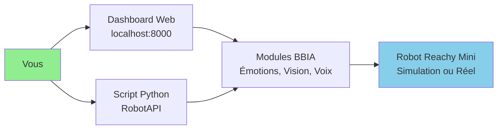

# 🎯 Guide Débutant - BBIA-SIM

## 📋 **Mon Premier Robot BBIA en 5 Minutes**

### Architecture simple



### **1️⃣ Installation**

```bash
# Cloner le projet
git clone https://github.com/arkalia-luna-system/bbia-sim.git
cd bbia-sim

# Installer les dépendances
pip install -r requirements.txt

# C'est tout ! ✅
```

### **2️⃣ Accéder au Dashboard Web** (NOUVEAU ✨)

```bash
# Lancer le dashboard (FastAPI + WebSocket)
python src/bbia_sim/dashboard_advanced.py

# Ouvrir dans le navigateur
# http://localhost:8000
```

**💡 Le Dashboard vous permet de :**
- 💬 Chat interactif avec BBIA
- 🤖 Contrôler le robot visuellement
- 📊 Voir les métriques en temps réel
- 🎛️ Ajuster les émotions et comportements

### **3️⃣ Premier Programme Python**

```python
from bbia_sim.robot_api import RobotFactory

# Créer le robot (simulation)
robot = RobotFactory.create_backend('mujoco')
robot.connect()

# Faire quelque chose !
robot.set_emotion('happy', 0.8)

# Exécuter un comportement
robot.run_behavior('wake_up', duration=3.0)

# Déconnecter
robot.disconnect()
```

### **4️⃣ Tester en Simulation 3D**

```bash
# Voir le robot bouger dans MuJoCo
mjpython examples/demo_mujoco_continue.py

# Avec des émotions
mjpython examples/demo_emotion_ok.py --emotion happy --duration 10

# Chat BBIA en 3D (NOUVEAU ✨)
mjpython examples/demo_chat_bbia_3d.py
```

**💡 Astuce :** Si vous êtes sur macOS, utilisez `mjpython` au lieu de `python` pour les démos 3D.

---

## 🚀 Quick Start API Publique

```bash
# Démarrer l’API publique (mode dev)
python deploy/public_api.py --dev

# Vérifier la santé
curl http://localhost:8000/health

# (Optionnel) Vérifier config rapide
python deploy/public_api.py --check
```

### ⚙️ Variables d’environnement utiles

```bash
# Exécutions headless/CI (désactive audio matériel)
export BBIA_DISABLE_AUDIO=1

# Sélecteurs IA (optionnels, imports paresseux)
export BBIA_TTS_BACKEND=pyttsx3      # ou kitten/kokoro/neutts si installés
export BBIA_STT_BACKEND=whisper      # ou parakeet
export BBIA_LLM_BACKEND=llama.cpp    # ou qwen
```

---

## 🤔 **Questions Fréquentes**

### **Q : J'ai pas de robot Reachy Mini, ça marche ?**
**R : OUI !** Mode simulation inclus. Vous développez maintenant, testez sur robot plus tard.

### **Q : C'est compatible Mac/Linux/Windows ?**
**R :** Mac/Linux : OUI ✅  
Windows : À tester ⚠️

### **Q : Puis-je créer mes propres émotions ?**
**R : OUI !** Le système est extensible. Voir `examples/demo_emotion_ok.py`

---

## 📚 **Prochaines Étapes**

1. ✅ **Découvrir** : [Architecture (vue d’ensemble)](../architecture/ARCHITECTURE_OVERVIEW.md)
2. ✅ **Créer** : Vos propres comportements avec `examples/demo_*`
3. ✅ **Comprendre** : [Architecture détaillée](../architecture/ARCHITECTURE_DETAILED.md)
4. ✅ **Avancer** : [Guide Avancé](GUIDE_AVANCE.md)

## 💬 **Chat Intelligent**

**Nouvelle fonctionnalité !** Discutez avec BBIA via le Dashboard ou directement :

```bash
# Chat simple via terminal
python examples/demo_chat_simple.py

# Chat complet avec Hugging Face
python examples/demo_chat_bbia.py
```

## 🤖 **Émotions Disponibles**

BBIA supporte 12 émotions robotiques :
- 😊 `happy` - Joie
- 😍 `excited` - Excitation
- 🤔 `curious` - Curiosité
- 😌 `calm` - Calme
- 😢 `sad` - Tristesse
- 😴 `tired` - Fatigue
- 😰 `scared` - Peur
- 😠 `angry` - Colère
- 😮 `surprised` - Surprise
- 😐 `neutral` - Neutre
- 😊 `playful` - Espiègle
- 🧐 `focused` - Concentré

---

**Besoin d'aide ?** Ouvrez une issue sur GitHub ou rejoignez le Discord Reachy ! 🤖

