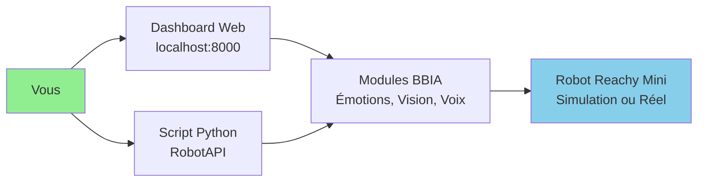
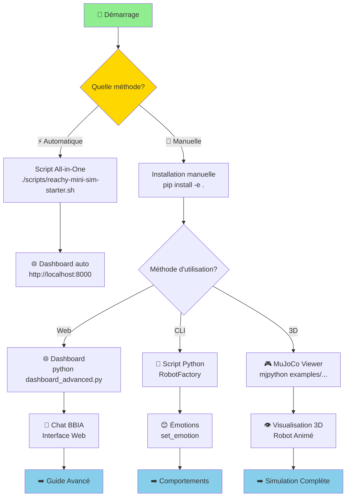

# Guide débutant - BBIA-SIM

**Date** : Oct / Nov. 2025

> Liens utiles: `docs/reference/INDEX_THEMATIQUE.md` · `docs/reference/project-status.md`

> Compatibilité Python et CI
>
> - Python: 3.11+
> - CI: `.github/workflows/ci.yml`
> - Setup rapide:
> ```bash
> pyenv install 3.11.9 && pyenv local 3.11.9
> python -m pip install --upgrade pip
> pip install -e .
> ```

## Votre premier robot BBIA en 5 minutes

### Architecture simple



### Parcours Démarrage Complet



### 1. 📦 Installation

#### Option A : Script All-in-One (Recommandé) ⚡

> **🚀 Installation automatique complète en une commande**

```bash
# Cloner le projet
git clone https://github.com/arkalia-luna-system/bbia-sim.git
cd bbia-sim

# Lancer le script all-in-one (fait tout automatiquement)
./scripts/reachy-mini-sim-starter.sh

# Le script :
# ✅ Vérifie Python 3, pip, mjpython (macOS)
# ✅ Crée/active l'environnement virtuel
# ✅ Installe BBIA-SIM + dépendances
# ✅ Vérifie l'installation (bbia_doctor)
# ✅ Lance le dashboard sur http://localhost:8000
```

**Options disponibles** :
- `--skip-install` : Vérification uniquement (sans installation)
- `--skip-dashboard` : Installation sans lancer le dashboard
- `--help` : Aide complète

#### Option B : Installation Manuelle

> **⚡ Installation manuelle en 2 minutes**

```bash
# Cloner le projet
git clone https://github.com/arkalia-luna-system/bbia-sim.git
cd bbia-sim

# Installer les dépendances (mode développement recommandé)
pip install -e .[dev]

```

<div align="center">

> 💡 **Astuce** : Le mode développement (`pip install -e .[dev]`) installe automatiquement toutes les dépendances nécessaires.
> Pour une installation minimale, utilisez `pip install -e .`.

</div>

### 2. 🌐 Accéder au dashboard web

> **🚀 Interface web complète en un clic**

```bash
# Lancer le dashboard (FastAPI + WebSocket)
python src/bbia_sim/dashboard_advanced.py

# Ouvrir dans le navigateur
# http://localhost:8000

# 📸 Captures d'écran disponibles : Voir `assets/images/` pour 4 captures du dashboard (Nov 2025)

```

<div align="center">

| Fonctionnalité | Description |
|:--------------:|-------------|
| 💬 **Chat interactif** | Conversation avec BBIA en temps réel |
| 🤖 **Contrôle robot** | Commande visuelle des mouvements |
| 📊 **Métriques live** | Monitoring en temps réel |
| 😊 **Émotions** | Ajustement des émotions et comportements |

</div>

### 3. Premier programme Python

```python
from bbia_sim.robot_factory import RobotFactory

# Créer le robot (simulation)
robot = RobotFactory.create_backend('mujoco')
robot.connect()

# Faire quelque chose !
robot.set_emotion('happy', 0.8)

# Exécuter un comportement
robot.run_behavior('wake_up', duration=3.0)

# Déconnecter
robot.disconnect()

```

### 4. Tester en simulation 3D

```bash
# Voir le robot bouger dans MuJoCo
mjpython examples/demo_mujoco_continue.py

# Avec des émotions
mjpython examples/demo_emotion_ok.py --emotion happy --duration 10

# Chat BBIA en 3D
mjpython examples/demo_chat_bbia_3d.py

```

> 💡 **Astuce macOS** : Utilisez `mjpython` au lieu de `python` pour les démos 3D.
> `mjpython` est installé automatiquement avec MuJoCo et permet d'afficher la fenêtre 3D.
> Si `mjpython` n'est pas disponible, utilisez `python` (le viewer peut ne pas s'ouvrir en mode headless).

### 5. 💬 Chat intelligent avec BBIA

Une fois le dashboard lancé ou les modules installés, vous pouvez discuter avec BBIA de plusieurs façons :

```bash
# Chat simple via terminal
python examples/demo_chat_simple.py

# Chat complet avec Hugging Face
python examples/demo_chat_bbia.py

```

> 💡 **Astuce** : Le chat utilise l'intelligence artificielle pour comprendre vos messages et répondre naturellement. Voir le [Guide Chat BBIA](GUIDE_CHAT_BBIA.md) pour plus de détails.

---

## 📚 Fonctionnalités principales

### Émotions disponibles

BBIA supporte 12 émotions robotiques :

- 😊 `happy` - Joie
- 😍 `excited` - Excitation
- 🤔 `curious` - Curiosité
- 😌 `calm` - Calme
- 😢 `sad` - Tristesse
- 😴 `tired` - Fatigue
- 😰 `scared` - Peur
- 😠 `angry` - Colère
- 😮 `surprised` - Surprise
- 😐 `neutral` - Neutre
- 😊 `playful` - Espiègle
- 🧐 `focused` - Concentré

### Variables d'environnement utiles

```bash
# Exécutions headless/CI (désactive audio matériel)
export BBIA_DISABLE_AUDIO=1

# Sélecteurs IA (optionnels, imports paresseux)
export BBIA_TTS_BACKEND=pyttsx3      # ou kitten/kokoro/neutts si installés
export BBIA_STT_BACKEND=whisper      # ou parakeet
export BBIA_LLM_BACKEND=llama.cpp    # ou qwen

```

---

## ❓ Questions fréquentes

### Q : Je n'ai pas de robot Reachy Mini, ça marche ?

R : Oui, le mode simulation est inclus. Vous pouvez développer maintenant et tester sur robot plus tard.

### Q : C'est compatible Mac/Linux/Windows ?

R : Mac/Linux : oui  
Windows : à tester

### Q : Puis-je créer mes propres émotions ?

R : Oui, le système est extensible. Voir `examples/demo_emotion_ok.py`

---

## 🚀 Prochaines étapes

1. **Découvrir** : [Architecture (vue d'ensemble)](../development/architecture/ARCHITECTURE_OVERVIEW.md)
2. **Créer** : vos propres comportements avec `examples/demo_*`
3. **Comprendre** : [Architecture détaillée](../development/architecture/ARCHITECTURE_DETAILED.md)
4. **Avancer** : [Guide Avancé](GUIDE_AVANCE.md)
5. **Index thématique** : [Index Thématique](../reference/INDEX_THEMATIQUE.md)

---

Besoin d'aide ? Ouvrez une issue sur GitHub ou rejoignez le Discord Reachy.
