# Guide débutant - BBIA-SIM

> Liens utiles: `docs/references/INDEX_THEMATIQUE.md` · `docs/status.md`

> Compatibilité Python et CI
>
> - Python: 3.11+
> - CI: `.github/workflows/ci.yml`
> - Setup rapide:
>   ```bash
>   pyenv install 3.11.9 && pyenv local 3.11.9
>   python -m pip install --upgrade pip
>   pip install -e .
>   ```

## Votre premier robot BBIA en 5 minutes

### Architecture simple

```mermaid
graph LR
    USER[Vous] --> DASH[Dashboard Web<br/>localhost:8000]
    USER --> PYTHON[Script Python<br/>RobotAPI]
    DASH --> BBIA[Modules BBIA<br/>Émotions, Vision, Voix]
    PYTHON --> BBIA
    BBIA --> ROBOT[Robot Reachy Mini<br/>Simulation ou Réel]

    style USER fill:#90EE90
    style ROBOT fill:#87CEEB
```



### Parcours Démarrage Complet

```mermaid
flowchart TD
    START[🚀 Installation] --> INSTALL{pip install -e .}
    
    INSTALL --> CHOICE{Méthode d'utilisation?}
    
    CHOICE -->|Web| DASH[🌐 Dashboard<br/>python dashboard_advanced.py]
    CHOICE -->|CLI| SCRIPT[📝 Script Python<br/>RobotFactory]
    CHOICE -->|3D| MUJOCO[🎮 MuJoCo Viewer<br/>mjpython examples/...]
    
    DASH --> CHAT[💬 Chat BBIA<br/>Interface Web]
    SCRIPT --> EMOTION[😊 Émotions<br/>set_emotion]
    MUJOCO --> VISUAL[👁️ Visualisation 3D<br/>Robot Animé]
    
    CHAT --> NEXT1[➡️ Guide Avancé]
    EMOTION --> NEXT2[➡️ Comportements]
    VISUAL --> NEXT3[➡️ Simulation Complète]
    
    style START fill:#90EE90
    style CHOICE fill:#FFD700
    style NEXT1 fill:#87CEEB
    style NEXT2 fill:#87CEEB
    style NEXT3 fill:#87CEEB
```



### 1. Installation

```bash
# Cloner le projet
git clone https://github.com/arkalia-luna-system/bbia-sim.git
cd bbia-sim

# Installer les dépendances (mode développement recommandé)
pip install -e .[dev]
```

> 💡 **Note** : Le mode développement (`pip install -e .[dev]`) installe automatiquement toutes les dépendances nécessaires. Pour une installation minimale, utilisez `pip install -e .`.

### 2. Accéder au dashboard web

```bash
# Lancer le dashboard (FastAPI + WebSocket)
python src/bbia_sim/dashboard_advanced.py

# Ouvrir dans le navigateur
# http://localhost:8000
```

Le dashboard permet de :
- chat interactif avec BBIA
- contrôler le robot visuellement
- voir les métriques en temps réel
- ajuster les émotions et comportements

### 3. Premier programme Python

```python
from bbia_sim.robot_factory import RobotFactory

# Créer le robot (simulation)
robot = RobotFactory.create_backend('mujoco')
robot.connect()

# Faire quelque chose !
robot.set_emotion('happy', 0.8)

# Exécuter un comportement
robot.run_behavior('wake_up', duration=3.0)

# Déconnecter
robot.disconnect()
```

### 4. Tester en simulation 3D

```bash
# Voir le robot bouger dans MuJoCo
mjpython examples/demo_mujoco_continue.py

# Avec des émotions
mjpython examples/demo_emotion_ok.py --emotion happy --duration 10

# Chat BBIA en 3D
mjpython examples/demo_chat_bbia_3d.py
```

> 💡 **Astuce macOS** : Utilisez `mjpython` au lieu de `python` pour les démos 3D.  
> `mjpython` est installé automatiquement avec MuJoCo et permet d'afficher la fenêtre 3D.  
> Si `mjpython` n'est pas disponible, utilisez `python` (le viewer peut ne pas s'ouvrir en mode headless).

---

## Quick start - API publique

```bash
# Démarrer l’API publique (mode dev)
python deploy/public_api.py --dev

# Vérifier la santé
curl http://localhost:8000/health

# (Optionnel) Vérifier config rapide
python deploy/public_api.py --check
```

### Variables d'environnement utiles

```bash
# Exécutions headless/CI (désactive audio matériel)
export BBIA_DISABLE_AUDIO=1

# Sélecteurs IA (optionnels, imports paresseux)
export BBIA_TTS_BACKEND=pyttsx3      # ou kitten/kokoro/neutts si installés
export BBIA_STT_BACKEND=whisper      # ou parakeet
export BBIA_LLM_BACKEND=llama.cpp    # ou qwen
```

---

## Questions fréquentes

### Q : Je n'ai pas de robot Reachy Mini, ça marche ?

R : Oui, le mode simulation est inclus. Vous pouvez développer maintenant et tester sur robot plus tard.

### Q : C'est compatible Mac/Linux/Windows ?

R : Mac/Linux : oui
Windows : à tester

### Q : Puis-je créer mes propres émotions ?

R : Oui, le système est extensible. Voir `examples/demo_emotion_ok.py`

---

## Prochaines étapes

1. Découvrir : [Architecture (vue d'ensemble)](../architecture/ARCHITECTURE_OVERVIEW.md)
2. Créer : vos propres comportements avec `examples/demo_*`
3. Comprendre : [Architecture détaillée](../architecture/ARCHITECTURE_DETAILED.md)
4. Avancer : [Guide Avancé](GUIDE_AVANCE.md)
5. Index thématique : `docs/references/INDEX_THEMATIQUE.md`

## 💬 Chat intelligent avec BBIA

Une fois le dashboard lancé ou les modules installés, vous pouvez discuter avec BBIA de plusieurs façons :

```bash
# Chat simple via terminal
python examples/demo_chat_simple.py

# Chat complet avec Hugging Face
python examples/demo_chat_bbia.py
```

## Émotions disponibles

BBIA supporte 12 émotions robotiques :
- 😊 `happy` - Joie
- 😍 `excited` - Excitation
- 🤔 `curious` - Curiosité
- 😌 `calm` - Calme
- 😢 `sad` - Tristesse
- 😴 `tired` - Fatigue
- 😰 `scared` - Peur
- 😠 `angry` - Colère
- 😮 `surprised` - Surprise
- 😐 `neutral` - Neutre
- 😊 `playful` - Espiègle
- 🧐 `focused` - Concentré

---

Besoin d'aide ? Ouvrez une issue sur GitHub ou rejoignez le Discord Reachy.

