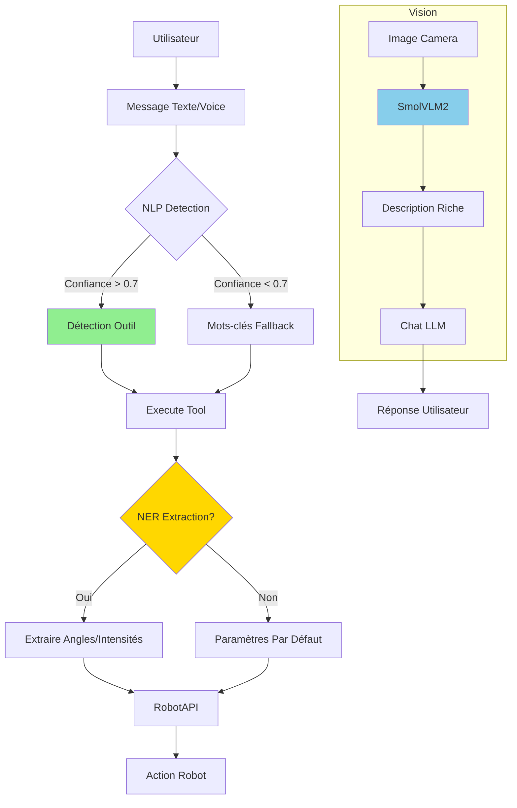
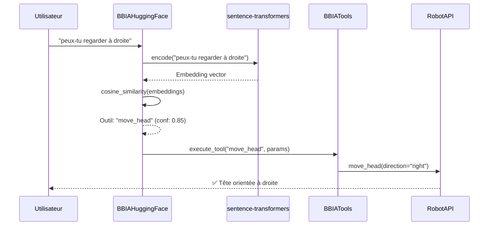
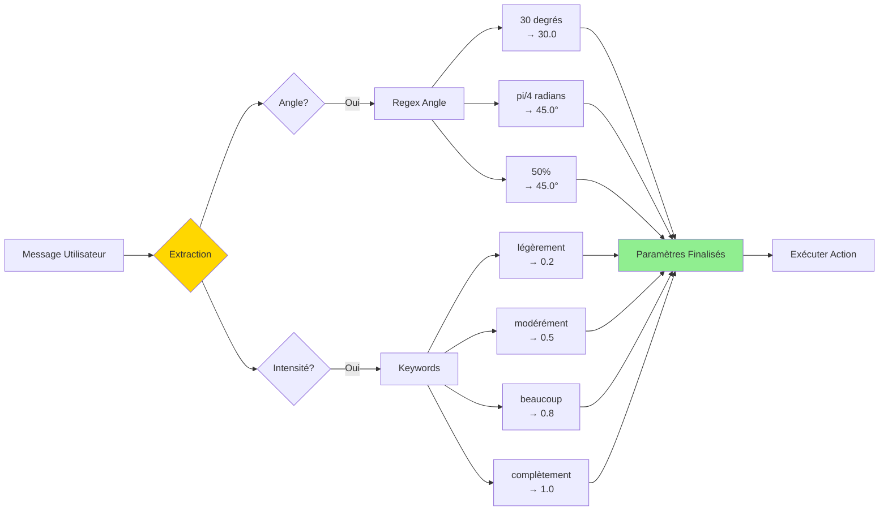

# 🧠 Guide NLP et SmolVLM2 - BBIA

**Date** : 8 Décembre 2025
**Version** : 1.4.0  
**📚 [FAQ](../getting-started/troubleshooting.md)** | **📊 [État actuel](../quality/audits/RESUME_ETAT_ACTUEL_BBIA.md)** | **🔍 [Comparaison](../quality/audits/COMPARAISON_APP_CONVERSATION_OFFICIELLE.md)**

---

## 📋 Table des Matières

1. [Détection NLP avec sentence-transformers](#détection-outils-avec-nlp)
2. [Extraction paramètres NER](#extraction-paramètres-ner)
3. [Vision SmolVLM2](#smolvlm2-vision-enrichie)
4. [VAD (Voice Activity Detection)](#vad-voice-activity-detection)
5. [Whisper Streaming](#whisper-streaming)
6. [Exemples d'utilisation](#exemples-dutilisation)

## 🔄 Architecture NLP/Vision BBIA



---

## 🎯 Détection Outils avec NLP

### Description

BBIA utilise `sentence-transformers` pour une détection robuste des intentions utilisateur par similarité sémantique, au lieu de simples mots-clés.



**Avantages** :

- ✅ Détection robuste même avec variantes de phrases
- ✅ Support synonymes et expressions naturelles
- ✅ Score de confiance pour chaque détection
- ✅ Fallback automatique vers mots-clés si NLP indisponible

### Configuration

Le NLP est activé automatiquement si `sentence-transformers` est installé :

```bash
pip install sentence-transformers

```

**Modèle utilisé** : `sentence-transformers/all-MiniLM-L6-v2` (gratuit, Hugging Face)

### Utilisation

La détection NLP est intégrée automatiquement dans `BBIAHuggingFace.chat()` :

```python
from src.bbia_sim.bbia_huggingface import BBIAHuggingFace
from src.bbia_sim.bbia_tools import BBIATools

# Initialiser avec outils
tools = BBIATools(robot_api=robot_api)
hf = BBIAHuggingFace(tools=tools)

# Chat avec détection NLP automatique
response = hf.chat("peux-tu orienter ta tête vers la droite", enable_tools=True)
# → Détecte automatiquement "move_head" via NLP

```

### Méthode manuelle

Pour détecter manuellement un outil :

```python
result = hf._detect_tool_with_nlp("tourne la tête à gauche")
if result:
    tool_name, confidence = result
    logging.info(f"Outil: {tool_name}, Confiance: {confidence:.2f}")

```

### Seuil de confiance

Le seuil par défaut est **0.6** (ajustable dans `_detect_tool_with_nlp()`).

---

## 📐 Extraction Paramètres NER

### Description

BBIA extrait automatiquement des paramètres numériques depuis les phrases naturelles :

- **Angles** : "30 degrés", "pi/4 radians", "50%"
- **Intensités** : "légèrement", "beaucoup", "à 75%"

### Flux d'Extraction



### Exemples

#### Extraction angles

```python
# Automatique dans _execute_detected_tool()
hf.chat("tourne la tête de 45 degrés vers la droite", enable_tools=True)
# → Extraie: angle=45°, direction="right"

hf.chat("à pi/2 radians vers le haut", enable_tools=True)
# → Extraie: angle=90° (converti depuis radians)

hf.chat("à 75% vers la gauche", enable_tools=True)
# → Extraie: angle=67.5° (75% de 90°)

```

#### Extraction intensités

```python
hf.chat("légèrement vers la droite", enable_tools=True)
# → Intensité: 0.2

hf.chat("beaucoup plus haut", enable_tools=True)
# → Intensité: 0.8

hf.chat("à 50% vers le bas", enable_tools=True)
# → Intensité: 0.5

```

### Mots-clés intensité

| Mots-clés | Intensité |
|-----------|-----------|
| "légèrement", "un peu" | 0.2 |
| "modérément", "normalement" | 0.5 |
| "beaucoup", "fortement" | 0.8 |
| "complètement", "totalement" | 1.0 |

---

## 🖼️ Vision SmolVLM2

### Description

**SmolVLM2** et **Moondream2** sont des modèles de vision gratuits et légers (alternatives à gpt-realtime) pour descriptions d'images plus riches.

### Configuration

Ajout dans `model_configs` :

```python
model_configs["multimodal"] = {
    # ... autres modèles
    "smolvlm": {
        "repo_id": "HuggingFaceTB/SmolVLM",
        "model_name": "smolvlm-2b",
    },
    "moondream2": {
        "repo_id": "vikhyatk/moondream2",
        "revision": "2025-08-26",
    },
}

```

### Utilisation

Activer SmolVLM2 pour description d'image :

```python
from src.bbia_sim.bbia_huggingface import BBIAHuggingFace

hf = BBIAHuggingFace()

# Charger modèle SmolVLM2
hf.enable_multimodal_model("smolvlm")

# Décrire image
description = hf.describe_image(image_path, model_name="smolvlm")
logging.info(description)

```

### Modèles disponibles

| Modèle | Repo | Taille | Description |
|--------|------|--------|-------------|
| **SmolVLM** | `HuggingFaceTB/SmolVLM` | ~2B | Vision + langage |
| **Moondream2** | `vikhyatk/moondream2` | ~1.6B | Vision descriptif |

---

## 🎤 VAD (Voice Activity Detection)

### Description

**VAD** détecte automatiquement quand l'utilisateur parle, permettant l'activation automatique de la conversation (sans bouton).

**Modèle utilisé** : `silero/vad` (gratuit, Hugging Face)

### Utilisation

#### Activation VAD

```python
from src.bbia_sim.voice_whisper import WhisperSTT

# Initialiser avec VAD activé (par défaut)
whisper = WhisperSTT(enable_vad=True)

# Détecter parole depuis chunk audio
import numpy as np
audio_chunk = np.random.rand(16000).astype(np.float32)
is_speech = whisper.detect_speech_activity(audio_chunk)

```

#### Transcription avec VAD automatique

```python
# Enregistrer avec détection automatique de fin (silence)
text = whisper.transcribe_microphone_with_vad(
    duration=10.0,  # Durée max
    silence_threshold=0.3  # Arrêt après 0.3s de silence
)

```

### Désactivation VAD

```python
whisper = WhisperSTT(enable_vad=False)
# → Toujours considère comme parole (pas de détection)

```

---

## 🔄 Whisper Streaming

### Description

**Whisper streaming** permet une transcription en continu avec latence réduite (500ms vs 1-2s).

### Utilisation

#### Streaming basique

```python
from src.bbia_sim.voice_whisper import WhisperSTT

whisper = WhisperSTT()
text = whisper.transcribe_streaming(
    chunk_duration=0.5,  # Chunks de 500ms
    max_duration=30.0  # Durée max
)

```

#### Streaming avec callback

```python
def on_chunk_transcribed(text: str, duration: float):
    logging.info(f"[{duration:.1f}s] {text}")

text = whisper.transcribe_streaming(
    callback=on_chunk_transcribed,
    chunk_duration=0.5
)

```

### Optimisations

- **Buffer contexte** : Garde 3 chunks pour meilleure précision
- **Latence réduite** : Chunks de 500ms au lieu de 3s
- **VAD intégré** : Détection silence optionnelle

---

## 📝 Exemples d'Utilisation

### Exemple 1 : Conversation avec NLP automatique

```python
from src.bbia_sim.bbia_huggingface import BBIAHuggingFace
from src.bbia_sim.bbia_tools import BBIATools

tools = BBIATools(robot_api=robot_api)
hf = BBIAHuggingFace(tools=tools)

# Phrases variées - toutes détectées via NLP
messages = [
    "peux-tu orienter ta tête vers la droite",
    "tourne-toi vers la gauche",
    "fais une danse",
    "capture une image de l'environnement",
]

for msg in messages:
    response = hf.chat(msg, enable_tools=True)
    logging.info(f"Utilisateur: {msg}")
    logging.info(f"BBIA: {response}\n")

```

### Exemple 2 : Extraction paramètres avancée

```python
# Extraction angle + direction
hf.chat("tourne la tête de 30 degrés vers la droite", enable_tools=True)
# → Paramètres extraits: angle=30°, direction="right", intensity=0.33

# Extraction intensité
hf.chat("légèrement vers la gauche", enable_tools=True)
# → Paramètres: direction="left", intensity=0.2

```

### Exemple 3 : VAD + Streaming

```python
from src.bbia_sim.voice_whisper import WhisperSTT

whisper = WhisperSTT(enable_vad=True)

# Streaming avec VAD automatique
def on_transcription(text: str, duration: float):
    if text:
        logging.info(f"Transcription: {text}")

text = whisper.transcribe_streaming(
    callback=on_transcription,
    chunk_duration=0.5,
    max_duration=10.0
)

```

### Exemple 4 : SmolVLM2 pour description images

```python
from src.bbia_sim.bbia_huggingface import BBIAHuggingFace

hf = BBIAHuggingFace()

# Activer SmolVLM2
hf.enable_multimodal_model("smolvlm")

# Décrire image
description = hf.describe_image("image.jpg", model_name="smolvlm")
logging.info(f"Description: {description}")

```

---

## ⚙️ Configuration

### Variables d'environnement

```bash
# Désactiver audio (CI/headless)
export BBIA_DISABLE_AUDIO=1

# Modèle Whisper
export WHISPER_MODEL_SIZE=tiny  # tiny, base, small, medium, large

```

### Dependencies

```toml
# pyproject.toml
dependencies = [
    "sentence-transformers>=2.2.0",  # NLP
    "transformers>=4.30.0",  # VAD, SmolVLM2
    "openai-whisper>=20231117",  # Streaming
]

```

---

## 🐛 Dépannage

### NLP non disponible

**Symptôme** : Fallback vers mots-clés seulement

**Solution** :

```bash
pip install sentence-transformers scikit-learn

```

### VAD erreur chargement

**Symptôme** : `⚠️ Impossible de charger VAD`

**Solution** :

```bash
pip install transformers torch

```

### SmolVLM2 lent

**Symptôme** : Chargement très lent

**Solution** : Utiliser `moondream2` (plus léger) ou désactiver si non nécessaire

---

## 📚 Références

- **sentence-transformers** : https://www.sbert.net/
- **SmolVLM** : https://huggingface.co/HuggingFaceTB/SmolVLM
- **Moondream2** : https://huggingface.co/vikhyatk/moondream2
- **Silero VAD** : https://huggingface.co/silero/vad

---

**Dernière mise à jour** : 8 Décembre 2025

---

## 🎯 Navigation

**Retour à** : [README Documentation](../README.md)  
**Voir aussi** : [Guide Chat BBIA](GUIDE_CHAT_BBIA.md) • [Guide de Démarrage](GUIDE_DEMARRAGE.md) • [Index Thématique](../reference/INDEX_THEMATIQUE.md)
