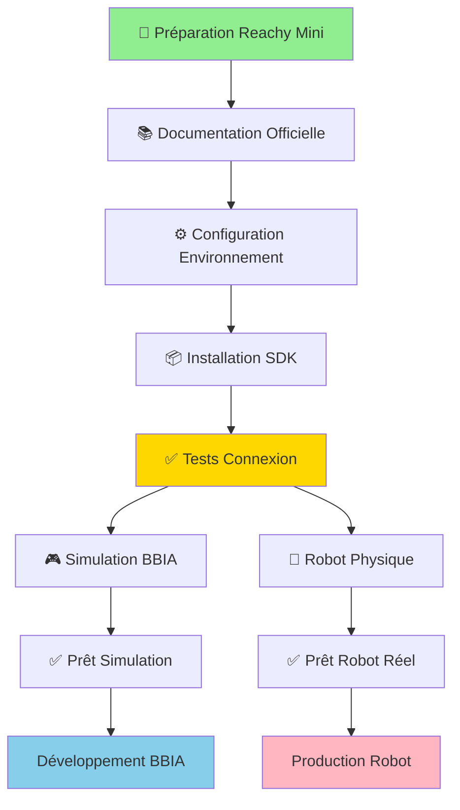
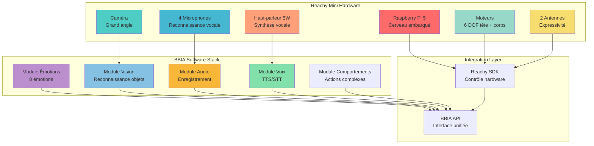
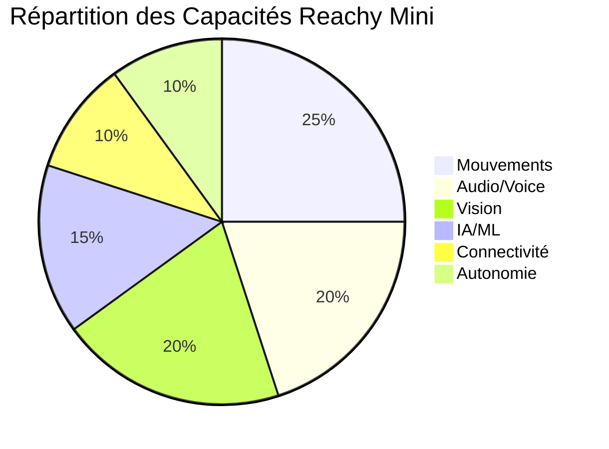
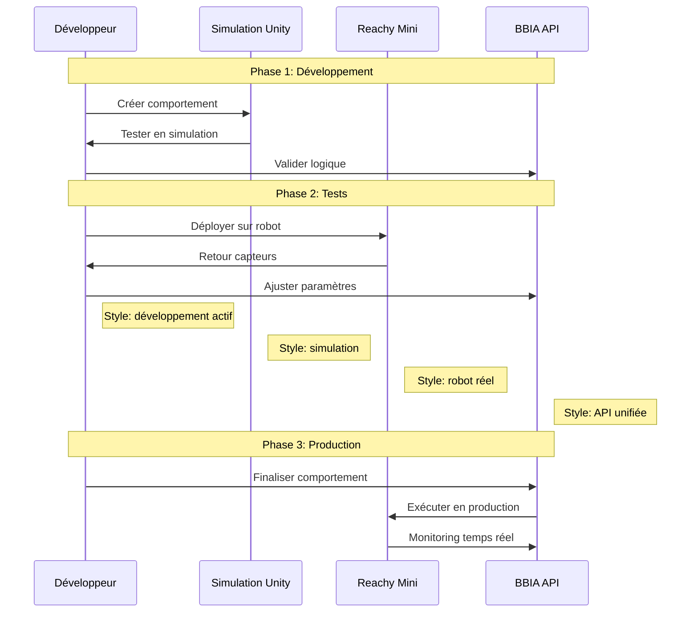

# 🤖 Guide Reachy Mini Wireless - BBIA

**Dernière mise à jour** : 26 Janvier 2026  
**Statut Robot** : ✅ Reçu le 18 déc 2025, monté le 20 déc 2025, tests en cours  
**IP Robot** : [IP_ROBOT]

> **Compatibilité Python** : Python 3.11+ requis. Voir [`docs/getting-started/INSTALLATION.md`](../getting-started/INSTALLATION.md) pour les détails d'installation.

---

## 📋 Table des Matières

1. [Vue d'ensemble](#-vue-densemble)
2. [Spécifications Techniques](#-spécifications-techniques)
3. [Préparation Immédiate](#-préparation-immédiate-maintenant)
4. [Architecture BBIA](#-architecture-bbia-pour-reachy-mini)
5. [Plan de Développement](#-plan-de-développement-bbia)
6. [Outils et Dépendances](#-outils-et-dépendances-requises)
7. [Dépôts GitHub](#-dépôts-github-utiles)
8. [Comparaison des Capacités](#-comparaison-des-capacités)
9. [Workflow de Développement](#-workflow-de-développement)

---

## 🎯 Vue d'ensemble

**Reachy Mini Wireless** - Robot compagnon IA pour BBIA

---

## 📋 Spécifications Techniques Complètes

### 📏 Dimensions et Poids

- **Hauteur** : 28 cm (mode actif) / 23 cm (mode veille)
- **Largeur** : 16 cm
- **Poids** : 1,5 kg (3,3 lb)
- **Forme** : Compacte et portable

### 💻 Cerveau Embarqué

- **Processeur** : Raspberry Pi 5 intégré
- **Capacités** : IA locale, traitement en temps réel
- **Connectivité** : Wi-Fi intégré
- **Stockage** : Carte SD extensible

### 🌐 Connectivité & Alimentation

- **Wi-Fi** : Intégré (connexion sans fil)
- **Batterie** : Intégrée + alimentation USB-C
- **Autonomie** : Mobilité complète sans câble
- **Recharge** : Via USB-C

### 🗣️ Audio & Micros

- **Microphones** : 4 microphones pour reconnaissance vocale
- **Haut-parleur** : 5W pour voix claire
- **Qualité** : Optimisé pour interactions vocales

### 📷 Caméra & Capteurs

- **Caméra** : Grand angle pour vision et reconnaissance
- **Accéléromètre** : Mesure mouvements et tremblements
- **Capteurs** : Pour interaction et sécurité

### 🤖 Mouvements & Expressivité

- **Tête** : 6 degrés de liberté (rotations précises)
- **Corps** : Rotation complète
- **Antennes** : 2 antennes animables avec limites de sécurité (-0.3 à 0.3 rad), utiliser yaw_body pour animations principales
- **Fluidité** : Mouvements naturels et expressifs

### 🛠️ Logiciel & Écosystème

- **SDK Principal** : Python (reachy-sdk)
- **SDK Futurs** : JavaScript et Scratch (bientôt)
- **Simulation** : Disponible pour développement préalable
- **Comportements** : 15+ préinstallés (suivi main, danse, etc.)

### 🌱 Open-Source & Communauté

- **Licence** : Open-source (matériel + logiciel)
- **Hugging Face** : Intégration native (1,7M+ modèles IA)
- **Communauté** : Discord, Spaces, GitHub actifs

---

## 🚀 Préparation Immédiate (Maintenant)

### Parcours Préparation



### 1. 📚 Documentation Officielle

**Liens essentiels :**

- **Site officiel** : https://www.pollen-robotics.com/reachy-mini-wireless/
- **Documentation** : https://docs.pollen-robotics.com/
- **GitHub** : https://github.com/pollen-robotics/
- **Discord** : https://discord.gg/pollen-robotics
- **Hugging Face** : https://huggingface.co/pollen-robotics

### 2. 🛠️ Outils de Développement à Installer

#### Environnement Python

```bash
# Créer un environnement dédié
python3 -m venv reachy_env
source reachy_env/bin/activate

# SDK Reachy (version actuelle)
pip install reachy-sdk

# Outils de développement
pip install jupyter notebook
pip install numpy matplotlib
pip install opencv-python
pip install speechrecognition
pip install pyaudio
pip install transformers torch

```

#### Outils de Simulation

```bash
# Unity pour simulation 3D (déjà configuré)
# Gazebo pour simulation physique
sudo apt-get install gazebo11

# RViz pour visualisation ROS
sudo apt-get install ros-noetic-rviz

```

### 3. 📁 Structure de Projet Recommandée

```text
reachy-bbia-project/
├── Documentation/
│   ├── specs.md
│   ├── setup-guide.md
│   └── api-reference.md
├── BBIA Core/
│   ├── emotions/
│   ├── behaviors/
│   ├── voice/
│   └── vision/
├── Robot Control/
│   ├── movements/
│   ├── sensors/
│   └── communication/
├── Simulation/
│   ├── unity/
│   ├── gazebo/
│   └── tests/
├── Data/
│   ├── training/
│   ├── log/
│   └── models/
└── Deployment/
    ├── scripts/
    ├── configs/
    └── monitoring/

```

---

## 🏗️ Architecture BBIA pour Reachy Mini



## 🎯 Plan de Développement BBIA

```mermaid
gantt
    title Plan de Développement BBIA
    dateFormat  YYYY-MM-DD
    section Phase 1: Préparation
    Documentation complète    :done, doc, 26 Janvier 2026
    Environnement dev        :active, env, 26 Janvier 2026
    Simulation Unity         :sim, 26 Janvier 2026

    section Phase 2: Core
    Configuration robot      :robot, 26 Janvier 2026
    Tests mouvements         :move, 26 Janvier 2026
    Reconnaissance vocale    :voice, 26 Janvier 2026
    Système émotions         :emotions, 26 Janvier 2026

    section Phase 3: Intelligence
    Hugging Face             :hf, 26 Janvier 2026
    Modèles IA               :ai, 26 Janvier 2026
    Comportements complexes  :behavior, 26 Janvier 2026

    section Phase 4: Optimisation
    Performance              :perf, 26 Janvier 2026
    Nouvelles fonctionnalités :feat, 26 Janvier 2026
    Déploiement production   :deploy, 26 Janvier 2026

```

---

## 🔧 Outils et Dépendances Requises

### 1. 📦 Dépendances Python Essentielles

```bash
# Core BBIA
pip install numpy pandas scipy
pip install scikit-learn tensorflow torch
pip install transformers datasets
pip install opencv-python pillow

# Audio & Voice
pip install speechrecognition pyaudio
pip install pyttsx3 gTTS
pip install librosa soundfile

# Robot Control
pip install reachy-sdk
pip install pyserial
pip install websockets

# Web & API
pip install fastapi uvicorn
pip install requests aiohttp

# Monitoring & Logs
pip install prometheus_client
pip install grafana-api

```

### 2. 🎮 Outils de Simulation

```bash
# Unity (déjà configuré)
# Gazebo
sudo apt-get install gazebo11 libgazebo11-dev

# RViz
sudo apt-get install ros-noetic-rviz

# CoppeliaSim (alternative)
# Télécharger depuis https://www.coppeliarobotics.com/

```

### 3. 🛠️ Outils de Développement

```bash
# IDE & Éditeurs
code .  # VS Code
# PyCharm Professional (recommandé pour IA)

# Version Control
git init
git remote add origin https://github.com/votre-username/reachy-bbia

# Monitoring
sudo apt-get install htop
sudo apt-get install nvtop  # Pour GPU monitoring

```

---

## 📚 Dépôts GitHub Utiles

### 1. 🏢 Officiels Pollen Robotics

**Dépôts principaux :**

```bash
# SDK Principal
git clone https://github.com/pollen-robotics/reachy-sdk.git

# Documentation
git clone https://github.com/pollen-robotics/reachy-sdk-api.git

# Simulateur Unity
git clone https://github.com/pollen-robotics/reachy2021-unity-package.git

# Exemples et Tutoriels
git clone https://github.com/pollen-robotics/reachy-examples.git

```

### 2. 🤖 Communauté et Extensions

**Extensions utiles :**

```bash
# Hugging Face Integration
git clone https://github.com/pollen-robotics/reachy-huggingface.git

# Voice Recognition
git clone https://github.com/pollen-robotics/reachy-voice.git

# Computer Vision
git clone https://github.com/pollen-robotics/reachy-vision.git

```

### 3. 🧠 IA et Machine Learning

**Outils IA :**

```bash
# Transformers pour Reachy
git clone https://github.com/huggingface/transformers.git

# Computer Vision
git clone https://github.com/ultralytics/yolov5.git

# Speech Recognition
git clone https://github.com/speechbrain/speechbrain.git

```

---

## 📊 Comparaison des Capacités



## 🔄 Workflow de Développement



---

## 🔍 Ce qui vous manque actuellement

### 1. Matériel

- [ ] **Reachy Mini Wireless** (en commande)
- [ ] **Carte SD haute performance** (64GB+)
- [ ] **Chargeur USB-C** (si pas inclus)
- [ ] **Support/stand** (optionnel)

### 2. Logiciel

- [ ] **SDK Reachy** (à installer)
- [ ] **ROS Noetic** (optionnel)
- [ ] **Gazebo** (pour simulation physique)
- [ ] **Hugging Face** (modèles IA)

### 3. Ressources

- [ ] **Documentation officielle** (à étudier)
- [ ] **Tutoriels vidéo** (YouTube)
- [ ] **Communauté Discord** (à rejoindre)
- [ ] **Cours IA/ML** (recommandé)

---

## 🚀 Actions Immédiates Recommandées

### 1. 📚 Étude et Formation

**Rejoindre la communauté :**

- **Discord** : Pollen Robotics
- **GitHub** : Pollen Robotics
- **Hugging Face** : Spaces

**Cours recommandés :**

- Python pour IA/ML
- Computer Vision
- Speech Recognition
- Robot Operating System (ROS)

### 2. 🛠️ Configuration Environnement

```bash
# Créer l'environnement de développement
mkdir reachy-bbia-project
cd reachy-bbia-project
python3 -m venv venv
source venv/bin/activate

# Installer les dépendances de base
pip install reachy-sdk numpy opencv-python

```

### 3. 🎮 Simulation

```bash
# Utiliser le simulateur Unity existant
./launch_unity_simulator.sh

# Tester les fonctionnalités BBIA
python3 test_unity_simulator.py

```

---

## 💡 Conseils et Bonnes Pratiques

### 1. 🔒 Sécurité

- Toujours tester en simulation d'abord
- Respecter les limites de mouvement du robot
- Sauvegarder régulièrement votre code
- Utiliser des timeouts pour éviter les blocages

### 2. 🧪 Tests

- Tests unitaires pour chaque fonction
- Tests d'intégration pour BBIA
- Tests de performance
- Tests de sécurité

### 3. 📊 Monitoring

- Logs détaillés de toutes les actions
- Monitoring des performances
- Surveillance de la batterie
- Alertes en cas d'erreur

---

## Conclusion

Le **Reachy Mini Wireless** fournit une base solide pour BBIA :

- Autonomie complète (batterie + Wi‑Fi)
- Puissance de calcul (Raspberry Pi 5)
- Expressivité (6 DOF tête + antennes)
- Capacités audio (4 microphones + haut‑parleur)
- Vision (caméra grand angle)
- Écosystème open‑source

**Prochaines étapes :**

1. Étudier la documentation officielle
2. Configurer l'environnement de développement
3. Tester en simulation
4. Préparer l'architecture BBIA
5. Attendre la livraison

---

## 🎯 Navigation

**Retour à** : [README Documentation](../README.md)
**Voir aussi** : [Guide de Démarrage](GUIDE_DEMARRAGE.md) • [Guide Technique](GUIDE_AVANCE.md) • [Index Thématique](../reference/INDEX_THEMATIQUE.md)

---

**Version** : 1.0
**Dernière mise à jour** : 26 Janvier 2026
**Statut** : Guide Reachy Mini Wireless
