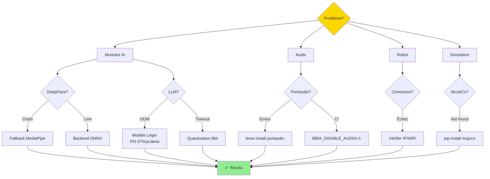

# FAQ Troubleshooting - Guide Complet

> Compatibilité Python: 3.11+
>
> Voir aussi: `docs/references/INDEX_THEMATIQUE.md` et `docs/status.md` (État par axe)

**📚 [FAQ principale](../FAQ.md)** | **🔧 [Guide avancé](../guides/GUIDE_AVANCE.md)** | **🧪 [Guide tests](TESTING_GUIDE.md)**

---

## 🎯 Guide de Dépannage Rapide



---

## 🔴 Modules IA - Problèmes Critiques

### DeepFace crash ou erreur

**Symptômes** :
- `DeepFace non disponible` ou `ImportError`
- `No face detected` même avec visage visible
- Performance très lente (>5s par analyse)

**Solutions** :

1. **Installation manquante** :
```bash
source venv-vision-py310/bin/activate
pip install deepface onnxruntime
```

2. **Aucun visage détecté** :
- Vérifier éclairage (assez lumineux)
- Visage face caméra (pas de profil)
- Résolution image suffisante (min 320x240)
- Utiliser `enforce_detection=False` (par défaut)
```python
# Dans face_recognition.py
recognize_person(image, enforce_detection=False)
```

3. **Performance lente sur RPi 5** :
- Utiliser backend ONNX au lieu de TensorFlow
- Modèle VGG-Face (plus léger que Facenet)
- Backend détecteur OpenCV (plus rapide que RetinaFace)
```python
# Configuration optimale RPi 5
os.environ["BBIA_DEEPFACE_MODEL"] = "VGG-Face"
os.environ["BBIA_DEEPFACE_BACKEND"] = "opencv"
```

4. **Fallback automatique** :
- Si DeepFace crash, BBIA utilise MediaPipe Face Detection
- Vérifier logs : `⚠️ DeepFace non disponible: {e}`

---

### LLM (HuggingFace) timeout ou mémoire insuffisante

**Symptômes** :
- Latence > 30s pour réponse
- `OutOfMemoryError` ou crash
- Modèle ne charge pas

**Solutions** :

1. **Raspberry Pi 5 (8GB max)** :
- ❌ Mistral 7B (14GB) → Trop lourd
- ❌ Llama 3 8B (16GB) → Trop lourd
- ✅ **Utiliser Phi-2 (2.7B, ~5GB)** ou **TinyLlama (1.1B, ~2GB)**
```python
# Dans bbia_huggingface.py
model_configs["chat"] = {
    "phi2": {
        "model_name": "microsoft/phi-2",
        "quantization": "8bit",  # Réduire mémoire
    },
    "tinyllama": {
        "model_name": "TinyLlama/TinyLlama-1.1B",
        "quantization": "8bit",
    }
}
```

2. **API externe (alternative)** :
- Utiliser Hugging Face Inference API (gratuite)
- Pas de chargement modèle local
```python
# Configuration API externe
os.environ["BBIA_HF_API_KEY"] = "your_api_key"
hf.chat("message", use_api=True)
```

3. **Timeout trop court** :
- Augmenter timeout (défaut: 30s)
```python
# Dans test_huggingface_latency.py
assert p95 < 30000.0  # 30s max (CI tolérant)
```

---

### Whisper STT ne détecte rien ou lent

**Symptômes** :
- `Whisper non disponible`
- Transcription vide
- Latence > 10s

**Solutions** :

1. **Installation** :
```bash
source venv-voice/bin/activate  # ou venv principal
pip install openai-whisper
```

2. **Modèle trop lourd** :
- Utiliser `whisper-tiny` ou `whisper-base` sur RPi 5
- Éviter `whisper-medium/large` (> 5GB)
```python
# Dans voice_whisper.py
model_size = os.environ.get("BBIA_WHISPER_MODEL", "tiny")
```

3. **Microphone non détecté** :
- Vérifier permissions macOS (Réglages > Confidentialité > Micro)
- Tester avec `python scripts/test_audio_simple.py`
- Fallback automatique vers `speech_recognition` si Whisper indisponible

---

### MediaPipe Pose ne détecte rien

**Symptômes** :
- Aucun point clé détecté
- Résultat vide

**Solutions** :
- Personne doit être visible en entier (pas coupée)
- Éclairage suffisant
- Complexité modèle : `0=rapide, 1=équilibré, 2=précis` (défaut: 1)
```python
os.environ["BBIA_POSE_COMPLEXITY"] = "1"  # ou "0" pour plus rapide
```

---

## 🟡 Tests CI - Seuils RAM/CPU

### Tests budget RAM/CPU échouent en CI

**Symptômes** :
- `test_backend_budget_cpu_ram` échoue
- `test_huggingface_latency` timeout
- Mémoire augmente > seuil attendu

**Explication des seuils** :

1. **Seuils flexibles pour CI** :
   - Environnements CI varient (GitHub Actions, etc.)
   - Modèles peuvent être en cache
   - Machine CI peut avoir moins de RAM

2. **Seuils actuels (tolérants CI)** :
   - Backend main loop : < 120MB RAM (au lieu de 50MB strict)
   - Interface abstraite : < 90MB RAM
   - HuggingFace latence : < 30s p95 (au lieu de 5s idéal)

3. **Vérification locale vs CI** :
```bash
# Local : devrait être < 50MB
# CI : tolère jusqu'à 120MB (variations machine)
pytest tests/test_backend_budget_cpu_ram.py -v
```

4. **Si test échoue vraiment** :
- Vérifier fuites mémoire avec `tracemalloc`
- Profiler avec `memory_profiler`
- Optimiser chargement modèles (lazy loading)

---

## 🟢 MuJoCo & Simulation

- Fenêtre ne s'ouvre pas: utiliser `mjpython` (macOS) ou mode headless `MUJOCO_GL=disable`
- EGL headless: vérifier libGL/GLFW (`sudo apt-get install libglfw3-dev libgl1-mesa-dev`)

---

## 🔵 PortAudio / Audio

- Erreur device: désactiver en CI `BBIA_DISABLE_AUDIO=1`
- Sample rate: viser 16kHz; ajuster drivers si mismatch

---

## 🟣 WebSockets & Réseau

- Déconnexions: vérifier proxy/timeouts; réduire fréquence, logs côté serveur
- Latence réseau robot réel : configurer timeout Zenoh
```python
# Dans reachy_mini_backend.py
ROBOT_TIMEOUT = 5.0  # Secondes
```

---

## 🟠 CORS & Sécurité

- Développement: autoriser `http://localhost:*`
- Production: whitelist stricte; éviter `*` en credentials

---

## 📚 Références

- État par axe: `docs/status.md` → Docs / Onboarding
- Guide DeepFace: `docs/guides_techniques/DEEPFACE_SETUP.md`
- Guide Webcam: `docs/guides_techniques/GUIDE_WEBCAM_MX_BRIO.md`
