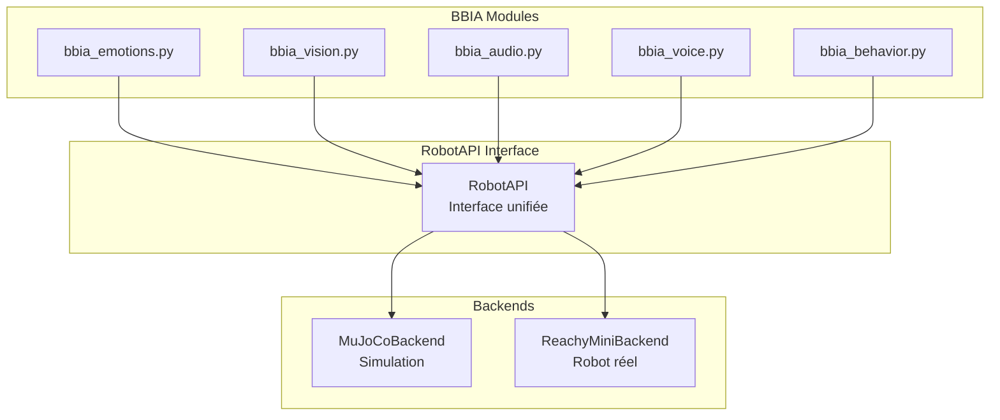
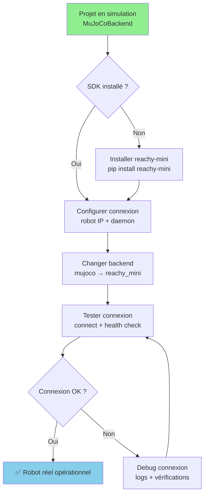

# Guide de migration BBIA-SIM : simulation → robot Reachy Mini réel

## Vue d'ensemble

Ce guide vous accompagne dans la migration de votre projet BBIA-SIM depuis la simulation MuJoCo vers le robot Reachy Mini physique. BBIA-SIM utilise une architecture unifiée (RobotAPI) pour faciliter cette transition.

---

## Architecture de migration

### RobotAPI unifié — avantage clé



Avantage : aucune modification des modules BBIA nécessaire.

---

## Étapes de migration

### Flux de migration



### 1. Installation du SDK officiel

```bash
# Installer le SDK officiel Reachy Mini
pip install reachy-mini

# Installer les dépendances système
pip install eclipse-zenoh
pip install reachy-mini-motor-controller
pip install reachy-mini-rust-kinematics
```

### 2. Configuration du daemon

#### Option A : Daemon Zenoh (recommandé)
```bash
# Démarrer le daemon Zenoh
reachy-mini-daemon --backend zenoh

# Vérifier la connexion
curl http://localhost:8000/api/state/full
```

#### Option B : Bridge FastAPI → Zenoh
```python
# Utiliser le bridge intégré BBIA-SIM
from bbia_sim.daemon.bridge import ZenohBridge

bridge = ZenohBridge()
bridge.start()
```

### 3. Modification de configuration

#### Fichier de configuration
```python
# config/robot_config.py
ROBOT_CONFIG = {
    "backend": "reachy_mini",  # Changer de "mujoco" à "reachy_mini"
    "daemon_url": "http://localhost:8000",
    "zenoh_config": {
        "mode": "client",
        "connect": ["tcp://localhost:7447"]
    }
}
```

#### Variables d'environnement
```bash
export BBIA_ROBOT_BACKEND=reachy_mini
export BBIA_DAEMON_URL=http://localhost:8000
export BBIA_ZENOH_MODE=client
```

### 4. Test de migration

```python
# test_migration.py
from bbia_sim.robot_factory import RobotFactory

# Créer le robot avec le backend réel
robot = RobotFactory.create_robot(backend="reachy_mini")

# Test des fonctionnalités de base
robot.wake_up()
robot.set_emotion("happy", 0.8)
robot.look_at(0.5, 0.0, 0.0)

# Test des modules BBIA
from bbia_sim.bbia_emotions import BBIAEmotions
emotions = BBIAEmotions()
emotions.set_emotion("excited", 0.9)
```

---

## Limitations et considérations

### Limitations matérielles

#### Fréquence de contrôle
- **Simulation** : 100Hz (10ms)
- **Robot réel** : 50Hz (20ms) - limitation matérielle

#### Sécurité
```python
# Ajouter des limites de sécurité
SAFETY_LIMITS = {
    "max_joint_velocity": 2.0,  # rad/s
    "max_joint_acceleration": 5.0,  # rad/s²
    "emergency_stop": True,
    "collision_detection": True
}
```

#### Test "Dry Run"
```python
# Mode test sans mouvement réel
robot.set_dry_run_mode(True)
robot.goto_target(head=pose)  # Simulation seulement
robot.set_dry_run_mode(False)  # Retour au mode normal
```

### Communication réseau

#### Latence
- **Simulation locale** : <1ms
- **Robot Wi-Fi** : 5-20ms
- **Robot USB** : 1-5ms

#### Stabilité
```python
# Gestion des déconnexions
def handle_disconnection():
    robot.set_emergency_stop()
    robot.save_current_state()
    # Tentative de reconnexion automatique
```

---

## Tests de validation

### 1. Tests de conformité SDK

```python
# tests/test_robot_migration.py
def test_sdk_conformity():
    """Test conformité avec le SDK officiel."""
    robot = RobotFactory.create_robot(backend="reachy_mini")

    # Test des méthodes critiques
    assert hasattr(robot, 'goto_target')
    assert hasattr(robot, 'set_target')
    assert hasattr(robot, 'create_head_pose')
    assert hasattr(robot, 'play_audio')

    # Test des types de retour
    pose = robot.create_head_pose()
    assert isinstance(pose, np.ndarray)

    result = robot.goto_target(head=pose, duration=1.0)
    assert result is None  # Conformité SDK
```

### 2. Tests de performance

```python
def test_performance_migration():
    """Test performance robot réel vs simulation."""
    # Simulation
    robot_sim = RobotFactory.create_robot(backend="mujoco")
    start_time = time.time()
    robot_sim.goto_target(head=pose)
    sim_latency = time.time() - start_time

    # Robot réel
    robot_real = RobotFactory.create_robot(backend="reachy_mini")
    start_time = time.time()
    robot_real.goto_target(head=pose)
    real_latency = time.time() - start_time

    # Vérifier que la latence reste acceptable
    assert real_latency < sim_latency * 10  # Max 10x plus lent
```

### 3. Tests d'intégration BBIA

```python
def test_bbia_modules_migration():
    """Test que tous les modules BBIA fonctionnent avec le robot réel."""
    robot = RobotFactory.create_robot(backend="reachy_mini")

    # Test émotions
    from bbia_sim.bbia_emotions import BBIAEmotions
    emotions = BBIAEmotions()
    emotions.set_emotion("happy", 0.8)

    # Test vision
    from bbia_sim.bbia_vision import BBIAVision
    vision = BBIAVision()
    objects = vision.detect_objects()

    # Test comportements
    from bbia_sim.bbia_behavior import BBIABehaviorManager
    behavior = BBIABehaviorManager()
    behavior.run_behavior("greeting", 3.0)
```

---

## Optimisations spécifiques robot réel

### 1. Gestion des ressources

```python
# Optimisation CPU pour Raspberry Pi
OPTIMIZATION_CONFIG = {
    "cpu_affinity": [0, 1],  # Utiliser seulement 2 cœurs
    "memory_limit": "512MB",
    "gpu_acceleration": False,  # Pas de GPU sur Pi
    "audio_buffer_size": 1024,  # Buffer plus petit
}
```

### 2. Gestion audio

```python
# Configuration audio optimisée
AUDIO_CONFIG = {
    "sample_rate": 16000,  # Réduire la qualité
    "channels": 1,  # Mono seulement
    "buffer_size": 512,
    "latency": "low",
}
```

### 3. Gestion vidéo

```python
# Configuration vidéo optimisée
VIDEO_CONFIG = {
    "resolution": (640, 480),  # Résolution réduite
    "fps": 15,  # FPS réduit
    "compression": "h264",
    "bitrate": 500000,  # Bitrate réduit
}
```

---

## Monitoring et debugging

### 1. Métriques de performance

```python
# Monitoring en temps réel
def monitor_robot_performance():
    metrics = {
        "latency": robot.get_latency(),
        "cpu_usage": psutil.cpu_percent(),
        "memory_usage": psutil.virtual_memory().percent,
        "network_latency": robot.get_network_latency(),
        "joint_errors": robot.get_joint_errors(),
    }
    return metrics
```

### 2. Logs de debug

```python
# Configuration des logs
LOGGING_CONFIG = {
    "level": "INFO",
    "file": "log/robot_migration.log",
    "format": "%(asctime)s - %(name)s - %(levelname)s - %(message)s",
    "rotation": "1 day",
    "retention": "7 days",
}
```

---

## Checklist de migration

### Pré-migration
- [ ] SDK officiel installé
- [ ] Daemon Zenoh configuré
- [ ] Tests de connexion réussis
- [ ] Configuration BBIA mise à jour

### Migration
- [ ] Backend changé vers `reachy_mini`
- [ ] Tests de conformité SDK passés
- [ ] Tests de performance validés
- [ ] Modules BBIA testés

### Post-migration
- [ ] Monitoring configuré
- [ ] Logs de debug activés
- [ ] Optimisations appliquées
- [ ] Documentation mise à jour

---

## Dépannage

### Problèmes courants

#### 1. Connexion daemon
```bash
# Vérifier le statut du daemon
curl http://localhost:8000/api/state/full

# Redémarrer le daemon
sudo systemctl restart reachy-mini-daemon
```

#### 2. Latence élevée
```python
# Optimiser la configuration réseau
ZENOH_CONFIG = {
    "mode": "client",
    "connect": ["tcp://192.168.1.100:7447"],  # IP directe
    "timeout": 1000,  # Timeout réduit
}
```

#### 3. Erreurs de joint
```python
# Vérifier les limites des joints
joint_limits = robot.get_joint_limits()
for joint, limits in joint_limits.items():
    print(f"{joint}: {limits}")
```

---

## Conclusion

La migration de BBIA-SIM vers le robot Reachy Mini réel est facilitée par l'architecture RobotAPI unifiée.

Points clés :
- aucune modification des modules BBIA nécessaire
- conformité SDK garantie
- tests automatisés pour validation
- monitoring intégré pour debugging

Le projet BBIA-SIM est prêt pour le robot réel.
