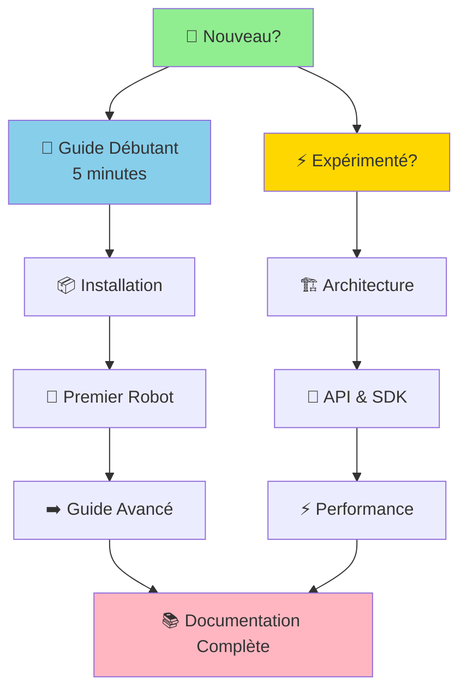

# 📚 Documentation BBIA-SIM — Index Complet

> **Moteur cognitif Python pour robot Reachy Mini**
> *Simulation fidèle • IA avancée • SDK 100% conforme*

---

## 🎯 Parcours Recommandé



---

## ⚡ Démarrage Rapide

> **🚀 Prêt à commencer ?**

| Action | Commande | Temps |
|--------|----------|-------|
| **Installation** | `pip install -e .[dev]` | ~2 min |
| **Dashboard** | `python src/bbia_sim/dashboard_advanced.py` | Instant |
| **Premier robot** | Voir [Guide Débutant](guides/GUIDE_DEBUTANT.md) | 5 min |

### Configuration Requise

```bash
# Python 3.11+ requis
pyenv install 3.11.9 && pyenv local 3.11.9
python -m pip install --upgrade pip
pip install -e .
```

> **📊 CI/CD** : `.github/workflows/ci.yml` • **Version** : v1.3.2 • **Date** : Oct / Nov. 2025

---

## 🎯 Points d'Entrée Principaux

| Document | Description | ⏱️ Temps |
|:--------:|-------------|:--------:|
| **[README.md](README.md)** | Vue d'ensemble complète | 2 min |
| **[Guide Débutant](guides/GUIDE_DEBUTANT.md)** | Premiers pas en 5 minutes | 5 min |
| **[Reachy Mini Guide](guides/REACHY_MINI_WIRELESS_COMPLETE_GUIDE.md)** | Guide robot physique | 10 min |
| **[Guide Navigation](GUIDE_NAVIGATION.md)** | Navigation rapide par profil | 2 min |

---

## 📊 Statut et Suivi

> **📈 Vue d'ensemble du projet**
> État par axe : Observabilité, Performance, Sécurité, CI/CD, Packaging, API/SDK, Robot, UX, IA, Docs, Qualité, Communauté

👉 **[project-status.md](reference/project-status.md)** — Tableau de bord complet du projet

---

## 📖 DOCUMENTATION PAR CATÉGORIE

### 🚀 Getting Started
- **[Troubleshooting](getting-started/troubleshooting.md)** — FAQ et solutions
- **[Contributing](getting-started/contributing.md)** — Guide contribution

### 📖 Guides Utilisateurs
- **[Guide Débutant](guides/GUIDE_DEBUTANT.md)** — Installation et premiers pas
- **[Guide Avancé](guides/GUIDE_AVANCE.md)** — Fonctionnalités avancées
- **[Guide Chat BBIA](guides/GUIDE_CHAT_BBIA.md)** — Système de chat intelligent
- **[Guide Reachy Mini Wireless](guides/REACHY_MINI_WIRELESS_COMPLETE_GUIDE.md)** — Guide complet du robot
- **[Guide NLP & SmolVLM2](guides/GUIDE_NLP_SMOLVLM.md)** — Intelligence artificielle

### 🏗️ Architecture et Design
- **[Architecture Vue d'Ensemble](development/architecture/ARCHITECTURE_OVERVIEW.md)** — Vue d'ensemble (v1.3.2)
- **[Architecture Détaillée](development/architecture/ARCHITECTURE_DETAILED.md)** — Détails techniques
- **[Guide Architecture](development/architecture/ARCHITECTURE.md)** — Guide complet
- **[Index thématique (par profils)](reference/INDEX_THEMATIQUE.md)** — Navigation par rôle

### 💻 Développement
- **[Integration Guide](development/INTEGRATION_GUIDE.md)** — Guide d'intégration
- **[Testing Guide](development/TESTING_GUIDE.md)** — Guide de tests
- **[Migration Guide](development/MIGRATION_GUIDE.md)** — Guide de migration
- **[API Contracts](development/api/CONTRATS_REST_WS.md)** — Contrats REST/WebSocket
- **[Assistant IA Guide](development/assistant-ia-guide.md)** — Guide assistants IA

### 🤖 Hardware & Robotique
- **[Reachy Mini Reference](hardware/reachy-mini/REACHY_MINI_REFERENCE.md)** — Référence complète
- **[Mouvements Reachy Mini](hardware/MOUVEMENTS_REACHY_MINI.md)** — Guide des mouvements
- **[Sécurité Robot](hardware/SECURITE_ROBOT.md)** — DO/DON'T sécurité

### 🧠 Intelligence Artificielle
- **[Audit IA Modules Pré-entraînés](ai/AUDIT_IA_MODULES_PRETRAINES.md)** — Modèles IA utilisés
- **[Datasets & Golden Images](ai/DATASETS_GOLDEN_IMAGES.md)** — Vision & datasets
- **[Intelligence Conversationnelle LLM](intelligence/INTELLIGENCE_CONVERSATIONNELLE_LLM.md)** — LLM & conversation
- **[Analyse Voix et Intelligence](intelligence/ANALYSE_VOIX_ET_INTELLIGENCE_BBIA.md)** — Analyse voix

### ✅ Qualité & Conformité
- **[Conformité Reachy-Mini Complète](quality/compliance/CONFORMITE_REACHY_MINI_COMPLETE.md)** — 46 tests conformité SDK
- **[Validation Qualité](quality/validation/VALIDATION_FINALE_QUALITE_2025.md)** — Rapports validation
- **[Index Audits](quality/audits/INDEX_AUDITS_CONSOLIDES.md)** — Tous les audits
- **[Audit Coverage Imports](quality/audits/AUDIT_COVERAGE_IMPORTS.md)** — Audit coverage

### ⚡ Performance
- **[Optimisations Expert Reachy Mini](performance/OPTIMISATIONS_EXPERT_REACHY_MINI.md)** — Optimisations spécifiques
- **[Optimisations Expert Robotique](performance/OPTIMISATIONS_EXPERT_ROBOTIQUE_2025.md)** — Optimisations générales
- **[Résumé Performance](performance/RESUME_PERFORMANCE_CORRECTIONS_2025.md)** — Résumé optimisations

### 🚀 Déploiement
- **[Pipeline CI/CD](deployment/PIPELINE_CI.md)** — Configuration CI/CD
- **[Déploiement Render](deployment/RENDER_HOWTO.md)** — Guide déploiement

### 🎯 Simulation
- **[Simulation BBIA Complète](simulations/SIMULATION_BBIA_COMPLETE.md)** — Guide simulation
- **[Guide Simulation MuJoCo](simulations/MUJOCO_SIMULATION_GUIDE.md)** — MuJoCo
- **[Observabilité](observabilite/OBSERVABILITE.md)** — Logs, métriques, santé

### 📚 Références
- **[Statut Projet](reference/project-status.md)** — Tableau de bord
- **[Historique Projet](reference/PROJECT_HISTORY.md)** — Historique complet
- **[Release Notes](reference/RELEASE_NOTES.md)** — Notes de version
- **[Style Guide](reference/style-guide.md)** — Guide de style

---

## 🗺️ Navigation par Rôle

### 🟢 Débutant
- [Guide Débutant](guides/GUIDE_DEBUTANT.md)
- [Troubleshooting](getting-started/troubleshooting.md)
- [Installation Audio](installation/AUDIO_SETUP.md)

### 💻 Développeur
- [Guide Avancé](guides/GUIDE_AVANCE.md)
- [Architecture](development/architecture/ARCHITECTURE_OVERVIEW.md)
- [Testing Guide](development/TESTING_GUIDE.md)
- [Integration Guide](development/INTEGRATION_GUIDE.md)

### 🤖 Utilisateur Robotique
- [Guide Reachy Mini](guides/REACHY_MINI_WIRELESS_COMPLETE_GUIDE.md)
- [Mouvements](hardware/MOUVEMENTS_REACHY_MINI.md)
- [Conformité](quality/compliance/CONFORMITE_REACHY_MINI_COMPLETE.md)
- [Simulation MuJoCo](simulations/MUJOCO_SIMULATION_GUIDE.md)

### ✅ QA / Tests
- [Testing Guide](development/TESTING_GUIDE.md)
- [Audits](quality/audits/README.md)
- [Validation Qualité](quality/validation/VALIDATION_FINALE_QUALITE_2025.md)

---

## 📁 Structure de la Documentation

```
docs/
├── getting-started/     # 🚀 Démarrage rapide
├── guides/              # 📖 Guides utilisateurs
├── development/         # 💻 Développement
│   ├── architecture/
│   └── api/
├── deployment/          # 🚀 Déploiement
├── hardware/           # 🤖 Hardware & robotique
│   └── reachy-mini/
├── intelligence/        # 🧠 Intelligence artificielle
├── quality/            # ✅ Qualité & conformité
│   ├── compliance/
│   ├── audits/
│   └── validation/
├── performance/         # ⚡ Performance
├── reference/          # 📚 Références
└── archive/           # 📦 Archives
```

---

## 🆘 Besoin d'Aide ?

1. **Problème technique ?** → [Troubleshooting](getting-started/troubleshooting.md)
2. **Nouveau sur le projet ?** → [Guide Débutant](guides/GUIDE_DEBUTANT.md)
3. **Question sur l'architecture ?** → [Architecture Overview](development/architecture/ARCHITECTURE_OVERVIEW.md)
4. **Question sur le robot ?** → [Guide Reachy Mini](guides/REACHY_MINI_WIRELESS_COMPLETE_GUIDE.md)

---

**Retour au [README principal](README.md)**

