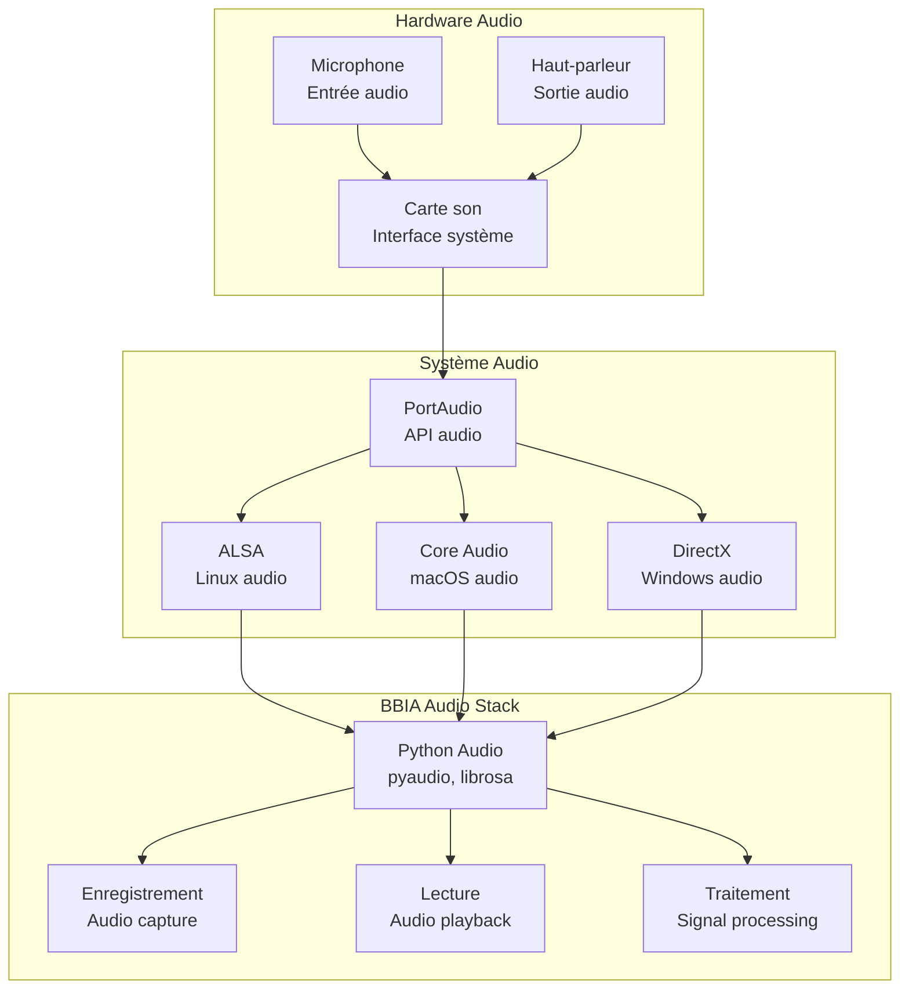
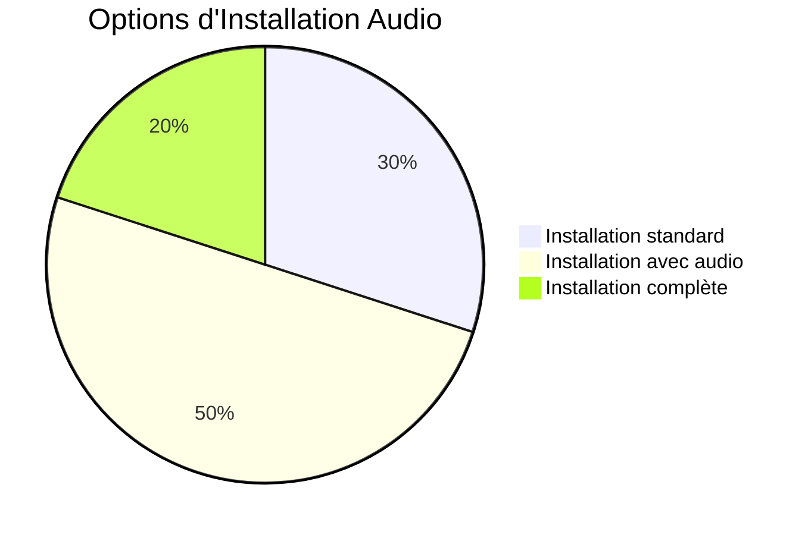

# 🎵 Installation Audio pour BBIA-SIM

**Date** : Oct / Nov. 2025

## 🏗️ Architecture Audio BBIA



## 🔧 Workflow d'Installation Audio

> Compatibilité Python et CI
>
> - Version requise: Python 3.11+
> - CI: GitHub Actions (`.github/workflows/ci.yml`)
> - Setup rapide:
> ```bash
> pyenv install 3.11.9 && pyenv local 3.11.9
> python -m pip install --upgrade pip
> pip install -e .[audio]
> ```

```mermaid 📊
flowchart TD
    START[Début installation] --> OS{Système d'exploitation ?}

    OS -->|Linux| LINUX[Ubuntu/Debian<br/>sudo apt-get install portaudio19-dev]
    OS -->|macOS| MACOS[macOS<br/>brew install portaudio]
    OS -->|Windows| WINDOWS[Windows<br/>Télécharger PortAudio]

    LINUX --> PYTHON[Installation Python<br/>pip install pyaudio]
    MACOS --> PYTHON
    WINDOWS --> PYTHON

    PYTHON --> TEST[Test audio<br/>python -c "import pyaudio"]
    TEST --> WORK{Fonctionne ?}
    WORK -->|Oui| SUCCESS[Audio configuré]
    WORK -->|Non| DEBUG[Débogage audio]

    DEBUG --> FIX[Corriger problèmes]
    FIX --> TEST

```

## 📊 Comparaison des Options d'Installation



```bash
# Option 1 : Extras audio
pip install -e .[audio]

# Option 2 : Via le fichier requirements-audio.txt
pip install -r requirements/requirements-audio.txt

# Option 3 : Installation manuelle
pip install pyaudio

```

## Fonctionnalités affectées

- Avec pyaudio : reconnaissance vocale complète via microphone
- Sans pyaudio :
  - Synthèse vocale (TTS) fonctionne
  - Enregistrement/lecture audio via sounddevice fonctionne
  - Reconnaissance vocale via microphone non disponible
  - Messages d'avertissement dans les logs

---

## 🎯 Navigation

**Retour à** : [README Documentation](../README.md)  
**Voir aussi** :

- [Guide ReSpeaker](RESPEAKER_SETUP.md) - Configuration ReSpeaker 4 microphones
- [Guide Débutant](../guides/GUIDE_DEBUTANT.md)
- [Index Thématique](../reference/INDEX_THEMATIQUE.md)

---

## Tests

Les tests continuent de fonctionner même sans pyaudio. Les tests de reconnaissance vocale retournent `None` au lieu de lever une exception.
