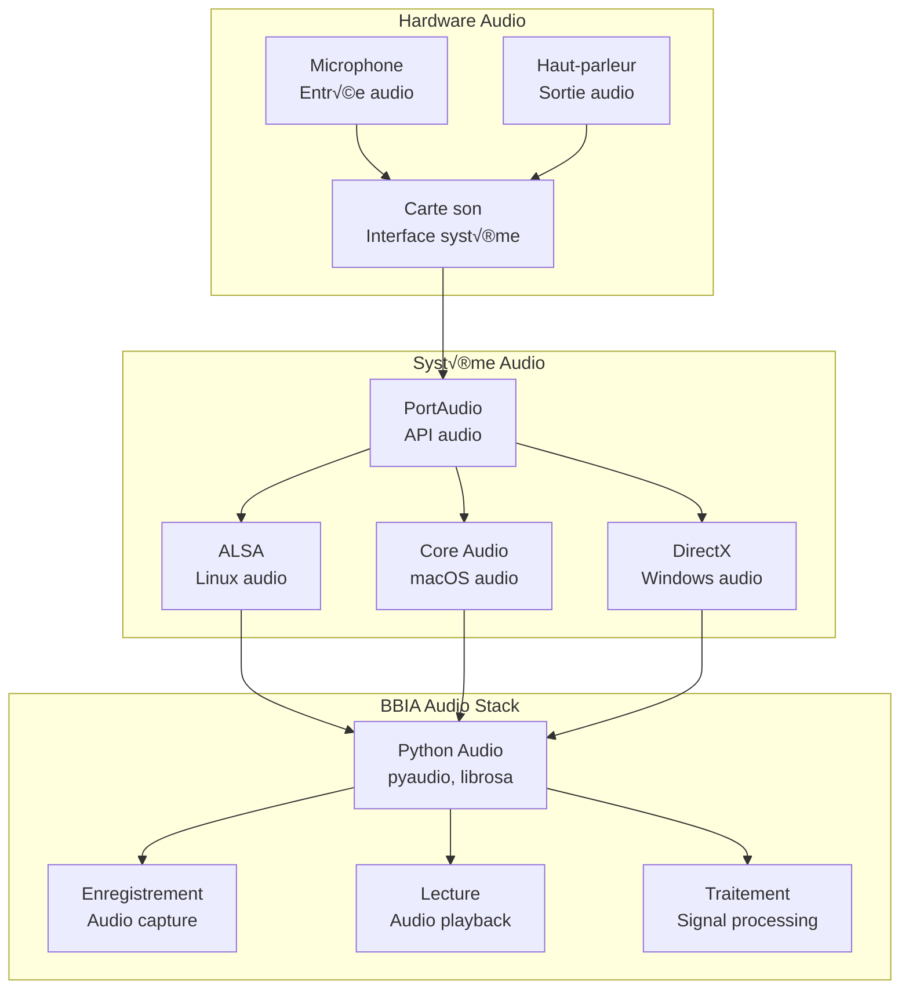
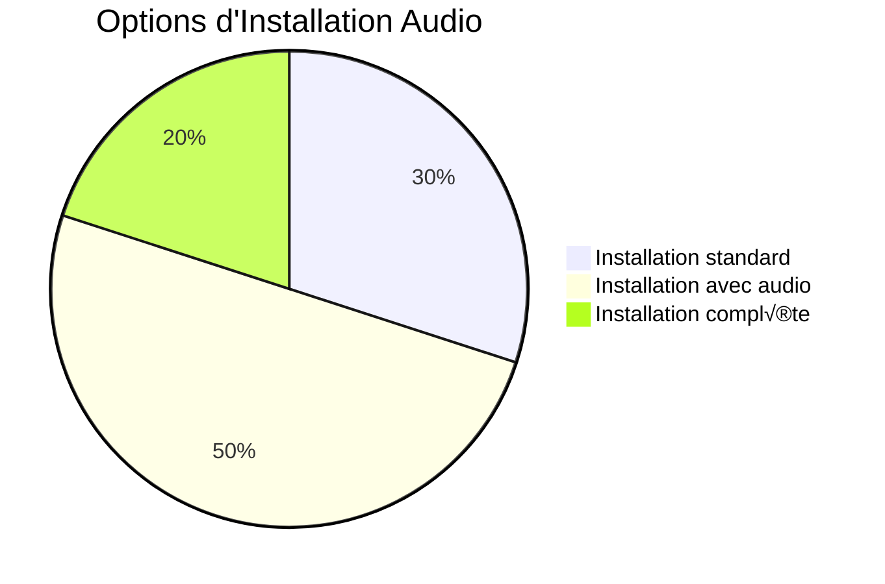

# üéµ Installation Audio pour BBIA-SIM

## 🏗️ Architecture Audio BBIA


```mermaid
graph TB
    subgraph "Hardware Audio"
        MICROPHONE[Microphone<br/>Entrée audio]
        SPEAKER[Haut-parleur<br/>Sortie audio]
        SOUNDCARD[Carte son<br/>Interface système]
    end

    subgraph "Système Audio"
        PORTAUDIO[PortAudio<br/>API audio]
        ALSA[ALSA<br/>Linux audio]
        CORE[Core Audio<br/>macOS audio]
        DIRECTX[DirectX<br/>Windows audio]
    end

    subgraph "BBIA Audio Stack"
        PYTHON[Python Audio<br/>pyaudio, librosa]
        RECORD[Enregistrement<br/>Audio capture]
        PLAY[Lecture<br/>Audio playback]
        PROCESS[Traitement<br/>Signal processing]
    end

    MICROPHONE --> SOUNDCARD
    SPEAKER --> SOUNDCARD
    SOUNDCARD --> PORTAUDIO

    PORTAUDIO --> ALSA
    PORTAUDIO --> CORE
    PORTAUDIO --> DIRECTX

    ALSA --> PYTHON
    CORE --> PYTHON
    DIRECTX --> PYTHON

    PYTHON --> RECORD
    PYTHON --> PLAY
    PYTHON --> PROCESS
```

## üîß Workflow d'Installation Audio

```mermaid
flowchart TD
    START[Début installation] --> OS{Système d'exploitation ?}

    OS -->|Linux| LINUX[Ubuntu/Debian<br/>sudo apt-get install portaudio19-dev]
    OS -->|macOS| MACOS[macOS<br/>brew install portaudio]
    OS -->|Windows| WINDOWS[Windows<br/>Télécharger PortAudio]

    LINUX --> PYTHON[Installation Python<br/>pip install pyaudio]
    MACOS --> PYTHON
    WINDOWS --> PYTHON

    PYTHON --> TEST[Test audio<br/>python -c "import pyaudio"]
    TEST --> WORK{Fonctionne ?}
    WORK -->|Oui| SUCCESS[✅ Audio configuré]
    WORK -->|Non| DEBUG[Débogage audio]

    DEBUG --> FIX[Corriger problèmes]
    FIX --> TEST
```

## üìä Comparaison des Options d'Installation


```mermaid
pie title Options d'Installation Audio
    "Installation standard" : 30
    "Installation avec audio" : 50
    "Installation complète" : 20
```
pip install -e .[audio]

# Option 2 : Via le fichier requirements-audio.txt
pip install -r requirements-audio.txt

# Option 3 : Installation manuelle
pip install pyaudio
```

## Fonctionnalités affectées

- **Avec pyaudio** : Reconnaissance vocale complète via microphone
- **Sans pyaudio** :
  - ✅ Synthèse vocale (TTS) fonctionne
  - ‚úÖ Enregistrement/lecture audio via sounddevice fonctionne
  - ‚ùå Reconnaissance vocale via microphone non disponible
  - ⚠️ Messages d'avertissement dans les logs

## Tests

Les tests continuent de fonctionner même sans pyaudio. Les tests de reconnaissance vocale retournent `None` au lieu de lever une exception.
